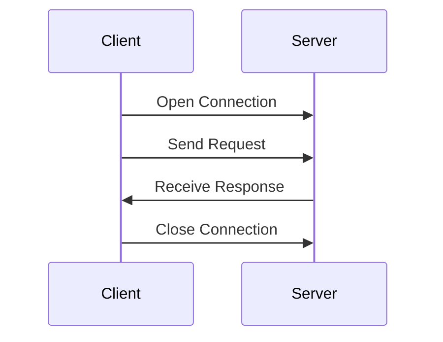

# [Java Networking](http://tutorials.jenkov.com/java-networking/index.html)

- [Java Networking](#java-networking)
  - [Java TCP Networking Basics](#java-tcp-networking-basics)
  - [Java Socket's and ServerSocket's](#java-sockets-and-serversockets)
  - [Java UDP Networking Basics](#java-udp-networking-basics)

Java has a reasonably easy-to-use builtin networking API which makes it easy to communicate via TCP/IP sockets or UDP sockets over the internet. TCP is typically used more often than UDP, but both options are explained in this tutorial.

There are three other tutorials here at [tutorials.jenkov.com](http://tutorials.jenkov.com/) that are relevant to this Java networking tutorial. These are:

1. [Java IO Tutorial](http://tutorials.jenkov.com/java-io/index.html)
2. [Java NIO Tutorial](http://tutorials.jenkov.com/java-nio/index.html)
3. [Java Multithreaded Servers Tutorial](http://tutorials.jenkov.com/java-multithreaded-servers/index.html)

Even though the **Java Networking APIs** enable you to open and close network connections via sockets, all communication happens via the **Java IO** classes [InputStream](http://tutorials.jenkov.com/java-io/inputstream.html) and [OutputStream](http://tutorials.jenkov.com/java-io/outputstream.html).

Alternatively you can use the networking classes in the **Java NIO API**. These classes are similar to the classes found in the Java Networking API, except the Java NIO API can work in **non-blocking mode**. Non-blocking mode may give a performance boost in some situations.

## Java TCP Networking Basics

Typically a client opens a TCP/IP connection to a server. The client then starts to communicate with the server. When the client is finished it closes the connection again. Here is an illustration of that:

A client may send **more than one request** through an open connection. In fact, a client can send as much data as the server is ready to receive. The server can also close the connection if it wants to.

## Java Socket's and ServerSocket's

When a client wants to open a TCP/IP connection to a server, it does so using a [Java Socket](http://tutorials.jenkov.com/java-networking/sockets.html). The socket is told what IP address and TCP port to connect to and the rest is done by Java.

If you want to start a server that listens for incoming connections from clients on some TCP port, you have to use a [Java ServerSocket](http://tutorials.jenkov.com/java-networking/server-sockets.html). When a client connects via a client socket to a server's ServerSocket, a Socket is assigned on the server to that connection. The client and server now communicates Socket-to-Socket.

Socket's and ServerSocket's are covered in more detail in later texts.

## Java UDP Networking Basics

UDP works a bit differently from TCP. Using UDP there is no connection between the client and server. A client may send data to the server, and the server may (or may not) receive this data. The client will never know if the data was received at the other end. The same is true for the data sent the other way from the server to the client.

Because there is no guarantee of data delivery, the UDP protocol has less protocol overhead.

There are several situations in which the connectionless UDP model is preferable over TCP. These are covered in more detail in the text on Java's UDP [`DatagramSocket`'s](http://tutorials.jenkov.com/java-networking/udp-datagram-sockets.html).
