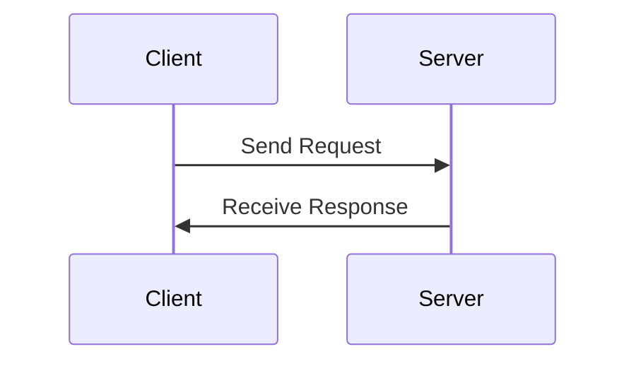

# [Java Networking: Protocol Design](http://tutorials.jenkov.com/java-networking/protocol-design.html)

- [Java Networking: Protocol Design](#java-networking-protocol-design)
  - [Client - Server Roundtrips](#client---server-roundtrips)
  - [Demarcating the End of Requests and Responses](#demarcating-the-end-of-requests-and-responses)
  - [Penetrating Firewalls](#penetrating-firewalls)

If you are designing a client-server system you may also have to design a communication protocol between the client and the server. Of course, sometimes this protocol is already have been decided for you, e.g. HTTP, XML-RPC (XML over HTTP), or SOAP (also XML over HTTP). But once in a while the protocol decision is open, so let's look at a few issued you may want to think about when designing your client - server protocol:

1. Client - Server Roundtrips
2. Demarcating the end of requests and responses
3. Penetrating Firewalls

## Client - Server Roundtrips

When a client and server communicates to perform some operation they exchange information. For instance, the client will ask for a service to be performed, and the server will attempt to perform it, and send back a response telling the client of the result. Such an exchange of information between the client and server is called a **roundtrip**.

When a computer (client or server) sends data to another computer over the internet it takes some time from the time the data is sent, to the data is received at the other end. This is the time it takes the data to travel over the internet. This time is called **latency**.

The more roundtrips you have in your protocol, the slower the protocol becomes, especially if latency is high. The **HTTP protocol** consists of only a **single request** and a **single response** to perform its service. **A single roundtrip** in other words. The SMTP protocol on the other hand, consists of several roundtrips between the client and the server before an email is sent.

The only reason to break your protocol up into multiple roundtrips is, if you have a **large amount of data** to send from the client to the server. You have two options in this case:

1. Send the header information in a separate roundtrip.
2. Break the message body up into smaller chunks.

Sending the header in a separate roundtrip (the first) can be smart if the server can do some **initial pre-validation** of e.g. header information. If that header information is invalid, sending the large body of data would have been a waste anyways.

If the network connection fails while you are transfering a large amount of data, you may have to resend all that data from scratch. By breaking the data up into smaller chunks you only have to resend the chunks from the chunk where the network connection failed and onwards. The successfully transfered chunks do not have be resent.

## Demarcating the End of Requests and Responses

If your protocol allows multiple requests to be send over the same connection, you need some way for the server to know **when one request ends**, and a **new begins**. The client also needs to know **when one response ends**, and **another begins**.

You have two options for demarcating the end of a request:

1. Send the length in bytes of the request in the beginning of the request.
2. Send an end-of-request marker after the request data.

**HTTP uses the first mechanism**. In one of the request headers the "**Content-Length**" is sent. This header tells **how many bytes after the headers** that belongs to the request.

The advantage of this model is that you don't have the overhead of the end-of-request marker. Nor do you have to encode the body of the data to avoid the data looking like the end-of-request marker.

The disadvantage of the first method is that the **sender must know how many bytes are transfered before the data is transfered**. If the data is generated dynamically you will first **have to buffer all the data** before sending it, to count the number of bytes.

By using an end-of-request marker you don't have to know how many bytes you are sending. You just need to send an end-of-request marker at the end of the data. You do, however, have to **make sure that the data sent does not contain any data that can be mistaken for the end-of-request marker**. Here one way to do that:

Lets say the end-of-request marker is the byte value 255. Of course the data can contain the value 255 too. So, for each byte in the data that contains the value 255 you add an extra byte, also with the value 255. The end-of-request marker is changed from the byte value 255 to 255 followed by the value 0. Here are the encodings summarized:

    255 in data    --> 255, 255
    end-of-request --> 255, 0

The sequence 255, 0 can never occur in the data, since you are changing all 255's to 255,255. And, a 255,255,0 will not be mistaken for a 255,0. The first 255's will be interpreted together, and the last 0 by itself.

## Penetrating Firewalls

Most firewalls block all other traffic than the HTTP protocol. Therefore it can be a good idea to **layer your protocol ontop of HTTP**, like XML-RPC, SOAP and REST does.

To layer your protocol ontop of HTTP you send your data forth and back between client and server inside HTTP requests and responses. Remember, an HTTP request and response can contain more than just text or HTML. You can send **binary data** inthere too.

The only thing that can be a little weird by layering your request ontop of the HTTP protocol is that an HTTP request must contain a "**Host**" header field. If you are designing a P2P protocol ontop of HTTP, your peers most likely won't be running multiple "Hosts". This required header field is in that situation an unnecessary overhead (but a small one).
