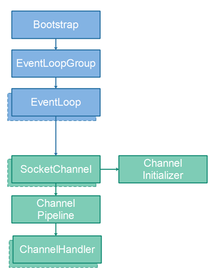

# [Netty Overview](http://tutorials.jenkov.com/netty/overview.html)

- [Netty Overview](#netty-overview)
  - [Bootstrap](#bootstrap)
  - [EventLoopGroup](#eventloopgroup)
  - [EventLoop](#eventloop)
  - [SocketChannel](#socketchannel)
  - [ChannelInitializer](#channelinitializer)
  - [ChannelPipeline](#channelpipeline)
  - [ChannelHandler](#channelhandler)

In order to understand how Netty works it is useful to get an overview of Netty's internal design. There are several central concepts you need to know about. These are:

- Bootstrap
- EventLoopGroup
- EventLoop
- SocketChannel
- ChannelInitializer
- ChannelPipeline
- ChannelHandler

How these concepts are related to each other is illustrated here:

Each of these parts of Netty's design will be described in more detail in the following sections.

## Bootstrap

The Bootstrap classes in Netty take care of **bootstrapping Netty**. The bootstrapping process includes **starting threads**, **opening sockets** etc. Bootstrapping will be explained in more detail in its own tutorial.

## EventLoopGroup

A Netty `EventLoopGroup` is a group of `EventLoop`'s . Multiple `EventLoop`'s can be grouped together. This way the `EventLoop` shares some resources like threads etc.

## EventLoop

A Netty `EventLoop` is a loop that **keeps looking for new events**, e.g. incoming data from network sockets (from `SocketChannel`) instances). When an event occurs, the event is passed on to the appropriate **event handler**, for instance a `ChannelHandler`.

## SocketChannel

A Netty `SocketChannel` represents a TCP connection to another computer over a network. Whether you are using Netty as client or server, all data exchanged with other computers on the network are passed through a `SocketChannel` instance representing the TCP connection between the computers.

A `SocektChannel` is managed by an `EventLoop`, and always only by that same `EventLoop`. Since an **`EventLoop` is always executed by the same thread**, a `SocketChannel` instance is also only accessed by the same thread. Therefore you don't have to worry about synchronization when reading from a `SocketChannel`.

## ChannelInitializer

A Netty `ChannelInitializer` is a special `ChannelHandler` which is attached to the `ChannelPipeline` of a `SocketChannel` when the `SocketChannel` is created. The `ChannelInitializer` is then called so it can **initialize the `SocketChannel`**.

After initializing the `SocketChannel` the **`ChannelInitializer` removes itself from the `ChannelPipeline`**.

## ChannelPipeline

Each Netty `SocketChannel` has a `ChannelPipeline`. The **`ChannelPipeline` contains a list of `ChannelHandler` instances**. When the `EventLoop` reads data from a `SocketChannel` the data is passed to the first `ChannelHandler` in the `ChannelPipeline`. The first `ChannelHandler` processes the data and can choose to forward it to the next `ChannelHandler` in the `ChannelPipeline`, which then also processes the data and can choose to forward it to the next `ChannelHandler` in the `ChannelPipeline` etc.

When writing data out to a `SocketChannel` the written data is also passed through the `ChannelPipeline` before finally being written to the `SocketChannel`. Exactly how this works will be described in a separate tutorial.

## ChannelHandler

A Netty `ChannelHandler` **handles the data that is received from a Netty `SocketChannel`**. A `ChannelHandler` can also **handle data that is being written out to a `SocketChannel`**. Exactly how this works will be described in a separate tutorial.
