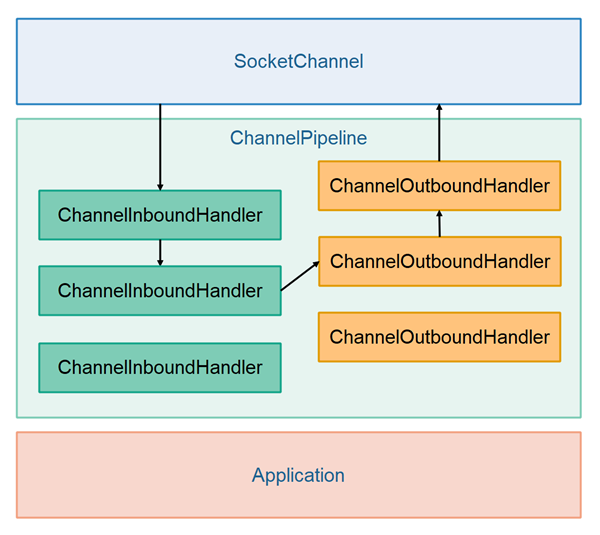

# [Netty ChannelPipeline](http://tutorials.jenkov.com/netty/netty-channelpipeline.html)

- [Netty ChannelPipeline](#netty-channelpipeline)
  - [Codecs](#codecs)

The Netty `ChannelPipeline` is a very central concept in Netty. Each Netty `SocketChannel` **contains a `ChannelPipeline`**. The `ChannelPipeline` contains a list of `ChannelHandler` instances. These `ChannelHandler` instances are **called when data is moving in and out** of the `SocketChannel`.

The `ChannelHandler` interface has two subinterfaces. These subinterfaces are:

- ChannelInboundHandler
- ChannelOutboundHandler

You can add both `ChannelInboundHandler` and `ChannelOutboundHandler` instances to the Netty `ChannelPipeline`. The following diagram illustrates a `ChannelPipeline` with `ChannelInboundHandler` and `ChannelOutboundHandler` instances added:

When data is received from the `SocketChannel` is is passed to the first `ChannelInboundHandler` in the `ChannelPipeline`. This `ChannelInboundHandler` processes the data, and then the data is passed on to the next `ChannelInboundHandler` in the `ChannelPipeline`.

Actually, a `ChannelInboundHandler` can **transform the data** it receives before it is passed on to the next handler in the pipeline. For instance, raw bytes can be transformed into an HTTP object, or some other object. The next handler in the pipeline then sees the HTTP object, not the raw data.

When writing data back to the `SocketChannel` it happens in the same fashion. The data is passed from `ChannelOutboundHandler` to `ChannelOutboundHandler` in the `ChannelPipeline` until it reaches the `SocketChannel`. The `ChannelOutboundHandler` instances can also transform the data in the process.

Even though the illustration shows the `ChannelInboundHandler` and `ChannelOutboundHandler` instances as **separate lists**, they are **actually located in the same list (pipeline)**. Thus, if a `ChannelInboundHandler` decides to write something back to the `SocketChannel`, the data passes through all `ChannelOutboundHandler` instances located earlier in the `ChannelPipeline` than the `ChannelInboundHandler` writing the data. This is illustrated here:

## Codecs

Netty has the concept of codecs (encoders + decoders). A Netty codec converts bytes to message objects (Java objects), or message objects to bytes. For instance, a codec might convert the raw bytes of an incoming HTTP request to an HTTP object, or convert an HTTP response object back to raw bytes.

A Netty codec object is really just one (or two) `ChannelHandler` implementations. A codec typically consists of a `ChannelInboundHandler` implementation which converts request bytes into objects, and a `ChannelOutboundHandler` which converts response objects into bytes.

Netty comes with codecs for several different protocols, like **HTTP**, **WebSockets**, **SSL/TLS** etc. In order to use those protocols with Netty, you have to add the corresponding protocol codec `ChannelInboundHandler` and `ChannelOutboundHandler` to the `ChannelPipeline` of the `SocketChannel` you want to use the protocol with. Netty codecs and protocols will be covered in more detail in their own tutorials.
