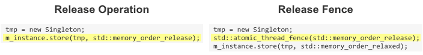

# [Acquire and Release Fences Don't Work the Way You'd Expect](https://preshing.com/20131125/acquire-and-release-fences-dont-work-the-way-youd-expect/)

- [Acquire and Release Fences Don't Work the Way You'd Expect](#acquire-and-release-fences-dont-work-the-way-youd-expect)
  - [In C++11, a Release Fence Is Not Considered a "Release Operation"](#in-c11-a-release-fence-is-not-considered-a-release-operation)
  - [Nor Can a Release Operation Take the Place of a Release Fence](#nor-can-a-release-operation-take-the-place-of-a-release-fence)
  - [Now That We’ve Cleared That Up…](#now-that-weve-cleared-that-up)

Raymond Chen [defined acquire and release semantics](http://blogs.msdn.com/b/oldnewthing/archive/2008/10/03/8969397.aspx) as follows, back in 2008:

> An operation with **acquire semantics** is one which does not permit subsequent memory operations to be advanced before it. Conversely, an operation with **release semantics** is one which does not permit preceding memory operations to be delayed past it.

Raymond's definition applies perfectly well to Win32 functions like `InterlockedIncrementRelease`, which he was writing about at the time. It also applies perfectly well to [atomic operations](http://preshing.com/20130618/atomic-vs-non-atomic-operations) in C++11, such as `store(1, std::memory_order_release)`.

It's perhaps surprising, then, that this definition does not apply to standalone [acquire and release fences](http://preshing.com/20130922/acquire-and-release-fences) in C++11! Those are a whole other ball of wax.

To see what I mean, consider the following two code listings. They're both taken from my post about the [double-checked locking pattern](http://preshing.com/20130930/double-checked-locking-is-fixed-in-cpp11) in C++11. The code on the left performs a release operation directly on `m_instance`, while the code on the right uses a release fence instead.

In both cases, the purpose is the same: to prevent other threads from observing the store to m_instance before any stores performed inside the `Singleton` constructor.

Now, what if **Raymond's definition of release semantics** did apply to the release fence on the right? That would only mean that preceding memory operations are prevented from being reordered past the fence. But that guarantee, alone, is not enough. There would still be nothing to prevent the relaxed atomic store to `m_instance`, on the very next line, from being reordered before the fence – and even before the stores performed by the `Singleton` constructor – defeating the whole purpose of the fence in the first place.

This **misconception** is very common. Herb Sutter himself makes this mistake at 1:10:35 in part 1 of his (otherwise superb) [`atomic<>` Weapons talk](http://channel9.msdn.com/Shows/Going+Deep/Cpp-and-Beyond-2012-Herb-Sutter-atomic-Weapons-1-of-2), even going so far as to say that release makes no sense on a standalone fence.

> "If this memory barrier were just one way – for instance, the memory barrier itself was a release… the write to global = temp can skip right over, and then all the code’s together again. Now the fox in the henhouse, and mayhem ensues."

Fortunately, that's not how C++11 release fences work. **A release fence actually prevents all preceding memory operations from being reordered past subsequent writes**. To his credit, Herb has acknowledged the error in a comment [here](http://preshing.com/20120913/acquire-and-release-semantics#IDComment721195803).

## In C++11, a Release Fence Is Not Considered a "Release Operation"

I think that the above misconception stems from some confusion about what is a "release operation" in C++11 and what isn't. You might reasonably expect a release fence to be considered a "release operation", but if you comb through the C++11 standard, you'll find that it's actually very careful not to call it that.

In the language of C++11, **only a store can be a release operation**, and **only a load can be an acquire operation**. (See §29.3.1 of [working draft N3337](http://www.open-std.org/jtc1/sc22/wg21/docs/papers/2012/n3337.pdf).) A **memory fence is neither a load nor a store**, so obviously, it **can't be an acquire or release operation**. Furthermore, if we accept that acquire and release semantics apply only to acquire and release operations, it's clear that Raymond Chen's definition does not apply to acquire and release fences. In my own post about acquire and release semantics, I was careful to specify the kind of operations on which they can apply.

## Nor Can a Release Operation Take the Place of a Release Fence

It goes the other way, too. The two code listings near the start of this post both do a fine job of implementing [DCLP](http://preshing.com/20130930/double-checked-locking-is-fixed-in-cpp11), but they are **not equivalent to each other**. While the code on the right achieves all the effects of the code on the left, the reverse is not true: Technically, the code on the left does not achieve all the effects of the code on the right. The difference is quite subtle.

The release operation on the left, `m_instance.store(tmp, std::memory_order_release)`, actually places fewer memory ordering constraints on neighboring operations than the release fence on the right. A release operation (such as the one on the left) only needs to prevent preceding memory operations from being reordered past **itself**, but a release fence (such as the one on the right) must prevent preceding memory operations from being reordered past all subsequent writes. Because of this difference, **a release operation can never take the place of a release fence**.

It's easy to see why not. Consider what happens when we take the code listing on the right, and replace the release fence with a release operation on a separate atomic variable, `g_dummy`:

    Singleton* tmp = new Singleton;
    g_dummy.store(0, std::memory_order_release);
    m_instance.store(tmp, std::memory_order_relaxed);

This time, we really do have the problem that Herb Sutter was worried about: The store to `m_instance` is now free to be reordered before the store to `g_dummy`, and possibly before any stores performed by the Singleton constructor. The fox is in the henhouse, and mayhem ensues!

(Interesting side note: An early draft of the C++11 standard, [N2588](http://www.open-std.org/jtc1/sc22/wg21/docs/papers/2008/n2588.pdf), dating back to 2008, actually tried to define memory fences in a manner similar to this example. There was no standalone `atomic_thread_fence` function in that draft; there was only a member function on atomic objects, `fence`. For convenience, the draft included a `global_fence_compatibility` object, similar to the `g_dummy` object used here. A paper by Peter Dimov [revealed some shortcomings](http://www.open-std.org/jtc1/sc22/wg21/docs/papers/2008/n2633.html) in this design. As a result, the C++11 standard committee ditched the approach in favor of the standalone fence function we have today.)

## Now That We’ve Cleared That Up…

Standalone memory fences are considered difficult to use, and I think part of the reason is because very few people even use the C++11 atomic library – let alone this part of it. As a result, misconceptions tend to go unnoticed more easily.

This particular misconception has bugged me for a while. Part of that is because earlier this year, I released an open source library called Mintomic. The only way to enforce memory ordering in [Mintomic] is by using standalone fences that are equivalent to those in C++11. I’d rather not have people think they don't work!
