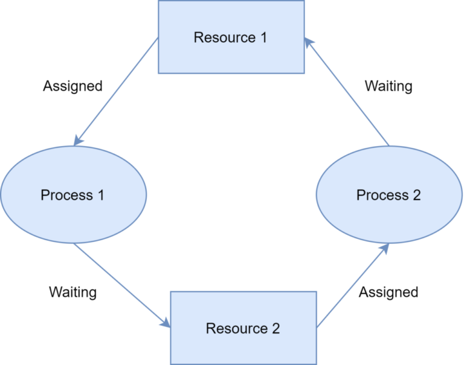
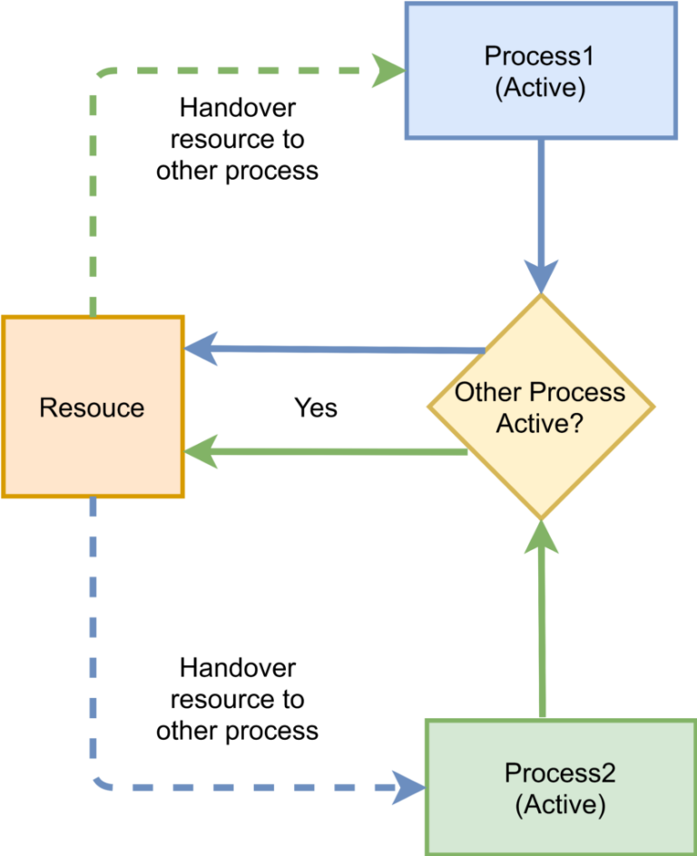

# [Deadlock, Livelock and Starvation](https://www.baeldung.com/cs/deadlock-livelock-starvation)

- [Deadlock, Livelock and Starvation](#deadlock-livelock-and-starvation)
  - [1. Introduction](#1-introduction)
  - [2. Deadlock](#2-deadlock)
    - [2.1. What Is a Deadlock?](#21-what-is-a-deadlock)
    - [2.2. Necessary Conditions for Deadlock](#22-necessary-conditions-for-deadlock)
    - [2.3. How to Prevent Deadlock](#23-how-to-prevent-deadlock)
  - [3. Livelock](#3-livelock)
    - [3.1. What Is Livelock?](#31-what-is-livelock)
    - [3.2. Difference Between Deadlock and Livelock?](#32-difference-between-deadlock-and-livelock)
  - [4. Starvation](#4-starvation)
    - [4.1. What Is Starvation?](#41-what-is-starvation)
    - [4.2. What Causes Starvation?](#42-what-causes-starvation)
    - [4.3. Avoiding Starvation](#43-avoiding-starvation)
  - [5. Conclusion](#5-conclusion)

## 1. Introduction

In a multiprogramming environment, more than one process may compete for a finite set of resources. If a process requests for a resource and the resource is not presently available, then the process waits for it. Sometimes this waiting process never succeeds to get access to the resource. This **waiting for resources leads to three scenarios** – [deadlock, livelock](https://www.baeldung.com/java-deadlock-livelock), and starvation.

In this tutorial, we'll discuss these three conditions.

## 2. Deadlock

### 2.1. What Is a Deadlock?

A deadlock is a situation in which processes block each other due to resource acquisition and none of the processes makes any progress as they wait for the resource held by the other process.

The above figure shows the deadlock scenario between process 1 and process 2. Both processes are holding one resource and waiting for the other resource held by the other process. This is a deadlock situation as neither process 1 or process 2 can make progress until one of the processes gives up its resource.

### 2.2. Necessary Conditions for Deadlock

To successfully characterize a scenario as deadlock, the following **four conditions must hold simultaneously**:

1. **Mutual Exclusion**: At least one resource needs to be held by a process in a non-sharable mode. Any other process requesting that resource needs to wait.

2. **Hold and Wait**: A process must hold one resource and requests additional resources that are currently held by other processes.

3. **No Preemption**: A resource can't be forcefully released from a process. A process can only release a resource voluntarily once it deems to release.

4. **Circular Wait**: A set of a process `{p0, p1, p2,.., pn}` exists in a manner that `p0` is waiting for a resource held by `p1`, `pn-1` waiting for a resource held by `p0`.

### 2.3. How to Prevent Deadlock

To prevent the occurrence of deadlock, **at least one of the necessary conditions discussed in the previous section should not hold true**. Let us examine the possibility of any of these conditions being false:

1. **Mutual Exclusion**: In some cases, this condition can be false. For example, in a read-only file system, one or more processes can be granted **sharable access**. However, this condition can't always be false. The reason being some resources are intrinsically non-sharable. For instance, a [mutex](https://www.baeldung.com/cs/what-is-mutex) lock is a non-sharable resource.

2. **Hold and Wait**: To ensure that the hold-and-wait condition never occurs, we need to guarantee that once **a process requests for a resource it is not holding any other resource at that time**. In general, a process should request all resources before it begins its execution.

3. **No Preemption**: To make this condition false, a process needs to make sure that it **automatically releases** all currently held resources if the newly requested resource is not available.

4. **Circular Wait**: This condition can be made false by **imposing a total ordering of all resource** types and ensure that each process requests resources in increasing order of enumeration. Thus, if there is a set of n resources `{r1,r2,..rn}`, a process requires resource `r1` and `r2` to complete a task, it needs to request `r1` first and then `r2`.

## 3. Livelock

In this section, we'll discuss live lock which is similar to deadlock with a subtle difference.

### 3.1. What Is Livelock?

In the case of a livelock, the states of the processes involved in a live lock scenario constantly change. On the other hand, **the processes still depend on each other and can never finish their tasks**.

The above figure shows an example of livelock. Both "process 1" and "process 2" need a common resource. Each process checks whether the other process is in an active state. If so, then it hands over the resource to the other process. However as both, the process is inactive status, both kept on handing over the resource to each other indefinitely.

A real-world example of livelock occurs when **two people make a telephone call to each other** and both find the line is busy. Both gentlemen decide to hang up and attempt to call after the same time interval. Thus, in the next retry too, they ended up in the same situation. This is an example of a live lock as this can go on forever.

### 3.2. Difference Between Deadlock and Livelock?

Although similar in nature, deadlock, and live locks are not the same. In a deadlock, processes involved in a deadlock are stuck indefinitely and do **not make any state change**. However, in a live lock scenario, processes block each other and wait indefinitely but they **change their resource state continuously**. The notable point is that the resource state change has no effect and does not help the processes make any progress in their task.

## 4. Starvation

In this section, we'll discuss starvation which generally occurs **as a result of a deadlock, livelock, or caused by a greedy process**.

### 4.1. What Is Starvation?

Starvation is an outcome of a process that is **unable to gain regular access to the shared resources it requires to complete a task and thus, unable to make any progress**.

The above figure shows an example of starvation of "process 2" and "process 3" for the CPU as "process 1" is occupying it for a long duration.

### 4.2. What Causes Starvation?

Starvation can occur due to deadlock, livelock, or caused by another process.

As we have seen in the event of a deadlock or a live lock a process competes with another process to acquire the desired resource to complete its task. However, due to the deadlock or livelock scenario, it failed to acquire the resource and generally **starved for the resource**.

Further, it may occur that a process repeatedly gains access to a shared resource or use it for a longer duration while other processes wait for the same resource. Thus, the waiting processes are **starved for the resource by the greedy process**.

### 4.3. Avoiding Starvation

One of the possible solutions to prevent starvation is to **use a resource scheduling algorithm with a priority queue that also uses the aging technique**. Aging is a technique that periodically **increases the priority of a waiting process**. With this approach, any process waiting for a resource for a longer duration eventually gains a higher priority. And as the resource sharing is driven through the priority of the process, no process starves for a resource indefinitely.

Another solution to prevent starvation is to **follow the round-robin pattern while allocating the resources to a process**. In this pattern, the resource is fairly allocated to each process providing a chance to use the resource before it is allocated to another process again.

## 5. Conclusion

In this article, we discussed concepts of deadlock, livelock, and starvation which occur in a multi-processing operating system.

A deadlock is a situation that occurs when processes block each other with resource acquisition and makes no further progress. Livelock is a deadlock-like situation in which processes block each other with a repeated state change yet make no progress. Starvation is the outcome of a deadlock, livelock, or as a result of continuous resource denial to a process.
