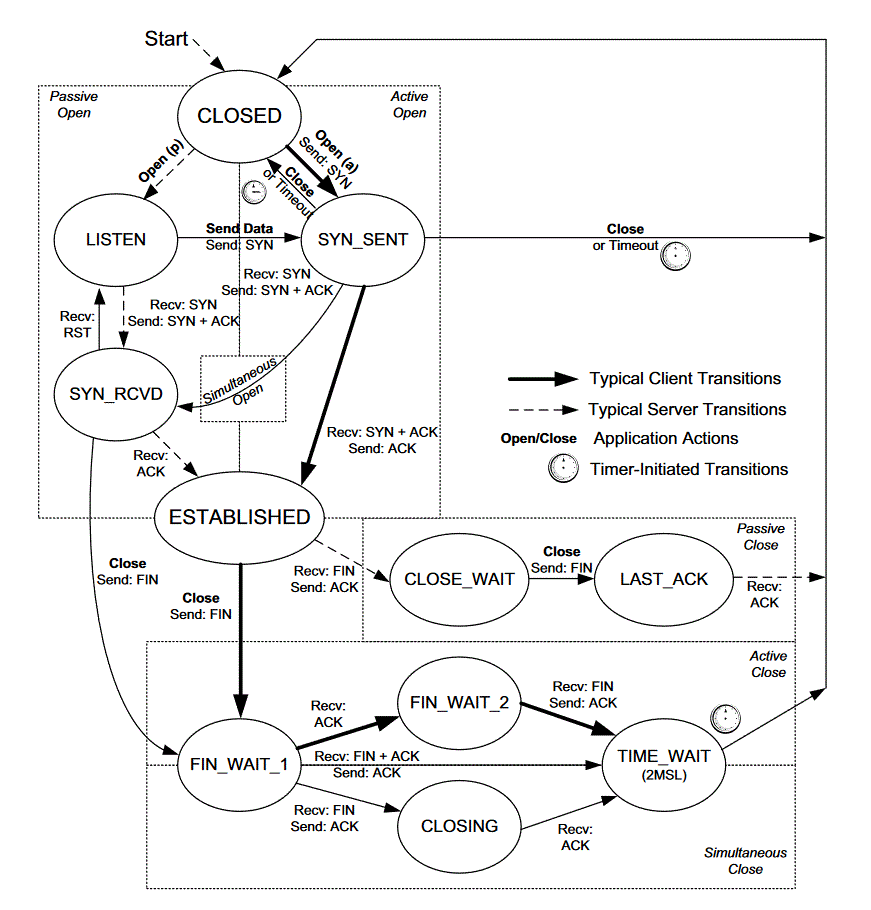

# TCP state transition diagram

- [TCP state transition diagram](#tcp-state-transition-diagram)
  - [RFC: 793](#rfc-793)
  - [TCP Operational Overview and the TCP Finite State Machine (FSM)](#tcp-operational-overview-and-the-tcp-finite-state-machine-fsm)
  - [TCP state transition diagram](#tcp-state-transition-diagram-1)
  - [UNIX Network Programming Volume 1, Third Edition 2.6 TCP Connection Establishment and Termination](#unix-network-programming-volume-1-third-edition-26-tcp-connection-establishment-and-termination)
  - [TCP/IP State Transition Diagram (RFC793) - Gordon McKinney (23 Feb 2002)](#tcpip-state-transition-diagram-rfc793---gordon-mckinney-23-feb-2002)
  - [TCP/IP Illustrated, Volume 1 Second Edition - 13.5.1 TCP State Transition Diagram](#tcpip-illustrated-volume-1-second-edition---1351-tcp-state-transition-diagram)

## [RFC: 793](https://tools.ietf.org/html/rfc793)

                                  +---------+ ---------\      active OPEN
                                  |  CLOSED |            \    -----------
                                  +---------+<---------\   \   create TCB
                                    |     ^              \   \  snd SYN
                       passive OPEN |     |   CLOSE        \   \
                       ------------ |     | ----------       \   \
                        create TCB  |     | delete TCB         \   \
                                    V     |                      \   \
                                  +---------+            CLOSE    |    \
                                  |  LISTEN |          ---------- |     |
                                  +---------+          delete TCB |     |
                       rcv SYN      |     |     SEND              |     |
                      -----------   |     |    -------            |     V
     +---------+      snd SYN,ACK  /       \   snd SYN          +---------+
     |         |<-----------------           ------------------>|         |
     |   SYN   |                    rcv SYN                     |   SYN   |
     |   RCVD  |<-----------------------------------------------|   SENT  |
     |         |                    snd ACK                     |         |
     |         |------------------           -------------------|         |
     +---------+   rcv ACK of SYN  \       /  rcv SYN,ACK       +---------+
       |           --------------   |     |   -----------
       |                  x         |     |     snd ACK
       |                            V     V
       |  CLOSE                   +---------+
       | -------                  |  ESTAB  |
       | snd FIN                  +---------+
       |                   CLOSE    |     |    rcv FIN
       V                  -------   |     |    -------
     +---------+          snd FIN  /       \   snd ACK          +---------+
     |  FIN    |<-----------------           ------------------>|  CLOSE  |
     | WAIT-1  |------------------                              |   WAIT  |
     +---------+          rcv FIN  \                            +---------+
       | rcv ACK of FIN   -------   |                            CLOSE  |
       | --------------   snd ACK   |                           ------- |
       V        x                   V                           snd FIN V
     +---------+                  +---------+                   +---------+
     |FINWAIT-2|                  | CLOSING |                   | LAST-ACK|
     +---------+                  +---------+                   +---------+
       |                rcv ACK of FIN |                 rcv ACK of FIN |
       |  rcv FIN       -------------- |    Timeout=2MSL -------------- |
       |  -------              x       V    ------------        x       V
        \ snd ACK                 +---------+delete TCB         +---------+
         ------------------------>|TIME WAIT|------------------>| CLOSED  |
                                  +---------+                   +---------+

## [TCP Operational Overview and the TCP Finite State Machine (FSM)](http://tcpipguide.com/free/t_TCPOperationalOverviewandtheTCPFiniteStateMachineF-2.htm)

## [TCP state transition diagram](https://www.ibm.com/support/knowledgecenter/en/SSLTBW_2.1.0/com.ibm.zos.v2r1.halu101/constatus.htm)

## UNIX Network Programming Volume 1, Third Edition 2.6 TCP Connection Establishment and Termination

## [TCP/IP State Transition Diagram (RFC793) - Gordon McKinney (23 Feb 2002)](https://users.cs.northwestern.edu/~agupta/cs340/project2/TCPIP_State_Transition_Diagram.pdf)

## TCP/IP Illustrated, Volume 1 Second Edition - 13.5.1 TCP State Transition Diagram

