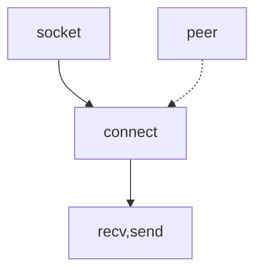
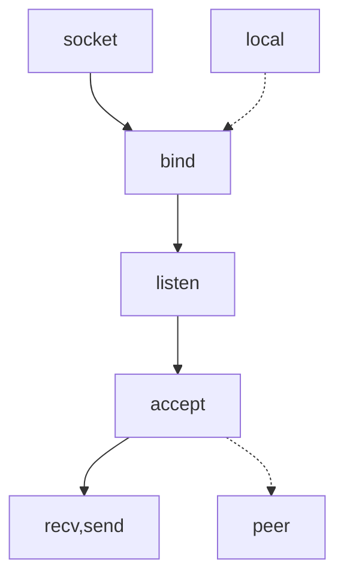

# [Effective Tcp/Ip Programming: 44 Tips to Improve Your Network Programs](https://isbn.nu/9780201615890)

- [Effective Tcp/Ip Programming: 44 Tips to Improve Your Network Programs](#effective-tcpip-programming-44-tips-to-improve-your-network-programs)
  - [1 Introduction](#1-introduction)
    - [Client-Ser ver Architecture](#client-ser-ver-architecture)
    - [Basic Sockets API Review](#basic-sockets-api-review)
      - [Figure 1.2 Basic socket calls for a client](#figure-12-basic-socket-calls-for-a-client)
      - [Figure 1.3 A simple TC>P client](#figure-13-a-simple-tcp-client)
      - [Figure 1.4 Basic socket calls in a server](#figure-14-basic-socket-calls-in-a-server)
      - [Figure 1.5 A simple TC>P server](#figure-15-a-simple-tcp-server)
  - [2 Basics](#2-basics)

## 1 Introduction

### Client-Ser ver Architecture

Although we speak of a client and a server, it is not always clear, in the general case, which role a particular program is playing. Often the programs are more like peers, exchanging information with neither clearly serving information to a client. With TCP/IP, though, the distinction is much clearer. The server listens for TCP connections or unsolicited UDP datagrams from a client or clients. Approaching this from the client's perspective, we can say that the client is the one who "speaks" first.

...

We shall have more to say about the difference between the LAN and WAN environments in Tip 12, but for now we merely note that they can behave very differently.

### Basic Sockets API Review

Generally, the first thing we must do is obtain a socket for the connection. We do
this with the socket system call.

    #include <sys/socket.h> /* UNIX */
    #include <winsock2.h> /* Windows */
    SOCKET socket( int domain, int type, int protocol );

    Returns: Socket descriptor on success, -1 (UNIX) or INVALID_SOCKET (Windows) on failure

#### Figure 1.2 Basic socket calls for a client

The sockets API is protocol independent and can support several different communications domains. The domain parameter is a constant that represents the desired communications domain.

The two most common domains are the AF_INET (or Internet) domain and the AF_LOCAL (or AF_UNIX) domain. In this text we are concerned only with the AF_INET domain. The AF_LOCAL domain is used for interprocess communication (IPC) on the same machine

The `type` parameter indicates the type of socket to be created. The most common values, and the ones we use in this text, are the following:

- SOCK_STREAM—These sockets provide a reliable, full duplex connection-oriented byte stream. In TCP/IP, this means TCP.
- SOCK_DGRAM—These sockets provide an unreliable, best-effort datagram service. In TCP/IP, this means UDP.
- SOCK_RAW—These sockets allow access to some datagrams at the IP layer. They are for special purposes such as listening for ICMP messages

The `protocol` field indicates which protocol should be used with the socket. With TCP/IP, this is normally specified implicitly by the socket type, and the parameter is set to zero. In some cases, such as raw sockets, there are several possible protocols, and the one desired must be specified. We see an example of this in Tip 40.

For the simplest TCP client, the only other sockets API call we need to set up a conversation with our peer is connect, which is used to establish the connection:

    #include <sys/socket.h> /* UNIX */
    #include <winsock2.h> /* Windows */
    int connect( SOCKET s, const struct sockaddr *peer, int peer_len );

    Returns: 0 on success, - 1 (UNIX) or nonzero (Windows) on failure

The `s` parameter is the socket descriptor returned by the socket call. The `peer` parameter points to an address structure that holds the address of the desired peer and some other information. For the `AF_INET` domain, this is a sockaddr_in structure. We look at a simple example in a moment. The peer_len parameter is the size of the structure pointed to by peer.

Once we've set up a connection, we are ready to transfer data. Under UNIX we can simply call read and write using the socket descriptor exactly as we would a file descriptor. Unfortunately, as we've already mentioned, Windows does not overload these system calls with socket semantics, so we have to use recv and send instead. These calls are just like read and write except that they have an additional parameter:

    #include <sys/socket.h> /* UNIX */
    #include <winsock2.h> /* Windows */
    int recv( SOCKET s, void *buf , size_t len, int flags );
    int send( SOCKET s, const void *buf , size_t len, int flags );

    Returns: number of bytes transferred on success, -1 on failure

The `s`, `buf`, and `len` parameters are the same as those for read and write. The values that the `flags` parameter can take are generally system dependent, but both UNIX and Windows support the following:

- MSG_OOB—When set, this flag causes urgent data to be sent or read.
- MSG_PEEK—This flag is used to peek at incoming data without removing it from the receive buffer. After the call, the data is still available for a subsequent read.
- MSG_DONTROUTE—This flag causes the kernel to bypass the normal routing function. It is generally used only by routing programs or for diagnostic purposes.

When dealing with TCP, these calls are generally all we need. For use with UDP, however, the `recvfrom` and `sendto` calls are useful. These calls are close cousins of `recv` and `send`, but they allow us to specify the destination address when sending a UDP datagram and to retrieve the source address when reading a UDP datagram:

    #include <sys/socket.h> /* UNIX */
    #include <winsock2.h> /* Windows */
    int recvfrom( SOCKET s, void *buf , size_t len, int flags,
        struct sockaddr *from, int * fromlen );
    int sendto( SOCKET s, const void *buf , size_t len, int flags,
        const struct sockaddr *to, int tolen );

    Returns: number of byt es transferred on success, -1 on failure

The first four parameters—`s`, `buf`, `len`, and `flags`—are the same as they were in the `recv` and `send` calls. The `from` parameter in the `recvfrom` call points to a socket address structure in which the kernel stores the source address of an incoming datagram. The length of this address is stored in the integer pointed to by `fromlen`. Notice that `fromlen` is a pointer to an integer.

Similarly, the `to` parameter in the `sendto` call points to a socket address structure that contains the address of the datagram's destination. The `tolen` parameter is the length of the address structure pointed to by `to`. Notice that `tolen` is a simple integer, not a pointer.

We're now in a position to look at a simple TCP client (Figure 1.3).

#### Figure 1.3 A simple TC>P client

    #include <sys/types.h>
    #include <sys/socket.h>
    #include <netinet/in.h>
    #include <arpa/inet.h>
    #include <stdio.h>
    int main( void )
    {
        struct sockaddr_in peer;
        int s;
        int rc;
        char buf[ 1 ];
        peer.sin_family = AF_INET;
        peer.sin_port = htons( 7500 );
        peer.sin_addr.s_addr = inet_addr( "127.0.0.1" );
        s = socket( AF_INET, SOCK_STREAM, 0 );
        if ( s < 0 )
        {
            perror( "socket call failed" );
            exit( 1 );
        }
        rc = connect( s, ( struct sockaddr * )&peer,sizeof( peer ) ) ;
        if ( rc )
        {
            perror( "connect call failed" );
            exit( 1 );
        }
        rc = send( s, "1", 1, 0 );
        if ( rc <= 0 )
        {
            perror( "send call failed" );
            exit( 1 );
        }
        rc = recv( s, buf, 1, 0 );
        if ( rc <=0 )
            perror( "recv call failed" );
        else
            printf( "%c\n", buf[ 0 ] );
        exit( 0 );
    }

- Set Up Our Peers Address

  We fill the sockaddr_in structure with the server’s port number (7500) and address. The 127.0.0.1 is the loopback address. It specifies that the server is on the same host as the client.

- Obtain a Socket and Connect to Our Peer

  We obtain a SOCK_STREAM socket. As we mentioned earlier, TCP uses this type of socket because it is a stream protocol.
  
  We establish the connection with our peer by calling connect. We use this call to specify our peer's address.

- Send and Receive a Single Byte

  We first send the single byte 1 to our peer, then immediately read a single byte from the socket. We write the byte to stdout and terminate.

Before we can exercise our client, we need a server. The socket calls for a server are a little different, as shown in Figure 1.4.

A server must listen for client connections on its well-known port. As we see in a
moment, it does this with the listen call, but first it must bind the address of the interface and well-known port to its listening socket. This is done with the bind call:

#### Figure 1.4 Basic socket calls in a server

    #include <sys/socket.h> /* UNIX */
    #include <winsock2.h> /* Windows */
    int bind( SOCKET s, const struct sockaddr *name, int namelen );

    Returns: 0 on success, - 1 (UNIX) or SOCKET_ERROR (Windows) on error

The `s` parameter is the descriptor of the listening socket. The `name` and `namelen` parameters are used to supply the port and interface on which to listen. Usually the address is set to `INADDR_ANY`, indicating that a connection will be accepted on any interface. If a multihomed host wants to accept connections on only one interface, it can specify the IP address of that interface. As usual, `namelen` is the length of the `sockaddr_in` structure.

Once the local address is bound to the socket, we must start the socket listening for connections. This is done with the `listen` system call. This call is often misunderstood. **Its only job is to mark the socket as listening**. When a connection request arrives at the host, the **kernel searches the list of listening sockets** looking for one that matches the destination and port number in the request:

    #include <sys/socket.h> /* UNIX */
    #include <winsock2.h> /* Windows */
    int listen( SOCKET s, int backlog );

    Returns: 0 on success, - 1 (UNIX) or SOCKET_ERROR (Windows) on error

The `s` parameter is the socket descriptor of the socket we wish to mark as listening. The `backlog` parameter is the maximum number of **pending connections** that can be **outstanding**. This is not the maximum number of connections that can be **established** at the given port at one time. It is the maximum number of **connections or partial connections** that can be **queued** waiting for the application to **accept** them (see the accept call described later).

> **NOTE** - [listen(2)](https://www.man7.org/linux/man-pages/man2/listen.2.html)
>
> The behavior of the backlog argument on TCP sockets changed with Linux 2.2.  Now it specifies the queue length for completely established sockets waiting to be accepted, instead of the number of incomplete connection requests.  The maximum length of the queue for incomplete sockets can be set using /proc/sys/net/ipv4/tcp_max_syn_backlog.  When syncookies are enabled there is no logical maximum length and this setting is ignored.  See tcp(7) for more information.
>
> If the backlog argument is greater than the value in /proc/sys/net/core/somaxconn, then it is silently truncated to that value.  Since Linux 5.4, the default in this file is 4096; in earlier kernels, the default value is 128.  In kernels before 2.4.25, this limit was a hard coded value, SOMAXCONN, with the value 128.

Traditionally the `backlog` parameter could not be set larger than five, but modern implementations with their need to support busy applications such as Web servers have made the maximum **much larger**. How large is system dependent, and we **must check the system documentation** to find the proper value for a given machine. If we specify a number larger than the maximum, the usual action is to **reduce it silently to the maximum**.

The final socket call is the accept system call. It is used to accept a connection from the **queue of completed connections**. Once accepted, the connection can be used for data transfer using, for example, the recv and send calls. On success, accept returns a descriptor for a new socket that can be used for data transfer. This socket has the same local port as the listening socket. The local address is the interface on which the connection came in. The foreign port and address are those of the client.

Notice that both sockets have the same local port. This is OK because a TCP connection is completely specified by the **4-tuple** consisting of the local address, local port, foreign address, and foreign port. Because (at least) the foreign address and port of the two sockets differ, the kernel is able to tell them apart:

    #include <sys/socket.h> /* UNIX */
    #include <winsock2.h> /* Windows */
    SOCKET accept( SOCKET s, struct sockaddr *addr, int *addrlen );

    Returns> A connected s ocket if OK, -1 (UNIX) or INVALID_SOCKET (Windows) on failure

The `s` parameter is the socket descriptor of the listening socket. As shown in Figure 1.4, accept returns the address of the new connection’s peer in the sockaddr_in structure pointed to by addr. The kernel places the length of this structure in the integer pointed to by addrlen. We often don’t care about our peer's address, and in this case we specify NULL for addr and addrlen.

We are now in a position to look at an elementary server (Figure 1.5). Again, this is a bare-boned program intended to show the server’s structure and the basic socket calls that every server must make. As with the client code and Figure 1.2, we notice that our server follows the flow outlined in Figure 1.4 very closely.

#### Figure 1.5 A simple TC>P server

    #include <sys/types.h>
    #include <sys/socket.h>
    #include <netinet/in.h>
    #include <stdio.h>
    int main( void )
    {
        struct sockaddr_in local;
        int s;
        int s1;
        int rc;
        char buf[ 1 ];
        local.sin_family = AF_INET;
        local.sin_port = htons( 7500 );
        local.sin_addr.s_addr = htonl( INADDR_ANY );
        s = socket( AF_INET, SOCK_STREAM, 0 );
        if ( s < 0 )
        {
            perror( "socket call failed" );
            exit( 1 );
        }
        rc = bind( s, ( struct sockaddr * )&local, sizeof( local ) );
        if ( rc < 0 )
        {
            perror( "bind call failure" );
            exit( 1 );
        }
        rc = listen( s, 5 );
        if ( rc )
        {
            perror( "listen call failed" );
            exit( 1 );
        }
        s1 = accept( s, NULL, NULL );
        if ( s1 <0 )
        {
            perror( "accept call failed" );
            exit( 1 );
        }
        rc = recv( s1, buf, 1, 0 );
        if ( rc <=0 )
        {
            perror( "recv call failed" );
            exit(1 );
        }
        printf( "%c\n", buf[ 0 ] );
        rc = send(s1, "2", 1, 0 );
        if ( rc <=0 )
            perror( "send call failed" );
        exit( 0 );
    }

- Fill In Address and Get a Socket

  We fill in the sockaddr_in structure, local, with our server's well-known address and port number. We use this for the bind call. As with the client, we obtain a SOCK_STREAM socket. This is our listening socket.

- Bind Our Well-Known Por t and Call listen

  We bind the well-known port and address specified in local to our listening socket. We then call listen to mark the socket as a listening socket.

- Accept a Connection

  We call accept to accept new connections. The accept call blocks until a new connection is ready and then returns a new socket for that connection.

- Transfer Data

  We first read and print 1 byte from our client. Next, we send the single byte 2 back to our client and exit.

## 2 Basics

TODO tcp/ip