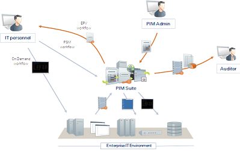

# [Privileged Access Security Solution Architecture](https://docs.cyberark.com/Product-Doc/OnlineHelp/PAS/Latest/en/Content/PASIMP/Privileged-Account-Security-Solution-Architecture.htm?tocpath=Get%20Started%7C_____2)

- [Privileged Access Security Solution Architecture](#privileged-access-security-solution-architecture)
  - [The Vault](#the-vault)
  - [The Password Vault Web Access Interface](#the-password-vault-web-access-interface)
  - [PrivateArk Administrative Interfaces](#privateark-administrative-interfaces)
    - [PrivateArk Client](#privateark-client)
  - [The Central Policy Manager](#the-central-policy-manager)
  - [Privileged Session Manager](#privileged-session-manager)
  - [Privileged Session Manager for SSH](#privileged-session-manager-for-ssh)
  - [Privileged Session Manager for Web](#privileged-session-manager-for-web)
    - [Highlights](#highlights)
  - [The On-Demand Privileges Manager](#the-on-demand-privileges-manager)
  - [Privileged Threat Analytics](#privileged-threat-analytics)
  - [The Password Upload Utility](#the-password-upload-utility)
  - [SDK Interfaces](#sdk-interfaces)
  - [Administrative APIs](#administrative-apis)

The Privileged Access Security solution provides a ‘Safe Haven’ within your enterprise where all your administrative passwords can be securely archived, transferred and shared by authorized users, such as IT staff, on-call administrators, and local administrators in remote locations.

The multiple security layers (including Firewall, VPN, Authentication, Access control, Encryption, and more) that are at the heart of the Privileged Access Security solution offer you the most secure solution available for storing and sharing passwords in an enterprise environment.

The Privileged Access Security solution is a plug-and-play solution which requires minimum effort to set up, and which can be fully operational in a very short period of time. It can be accessed and managed through a Windows Client, a Web interface, or a variety of APIs.

The following diagram shows the different components of the Privileged Access Security solution and how they interact.

Privileged Access Security Solution Architecture

The Privileged Access Security solution architecture consists of two major elements. One is the **Storage Engine** (also referred to as “the server” or simply “the Vault”), which holds the data and is responsible for securing the data at rest and ensuring authenticated and controlled access.

The second element is the **interface** (Windows interfaces, Web interfaces, and SDKs) that communicates with the Storage Engine on one hand and provides access to users and applications on the other. The Storage Engine and the interface communicate using CyberArk’s secure protocol – the Vault protocol.

## The Vault

The CyberArk Digital Vault is the most secure place in the network where sensitive data can be stored. The Vault is designed to be installed on a dedicated computer, for complete data isolation. It is packed with state‑of‑the‑art security technology, and is already configured and ready‑to‑use upon installation. This means that the security system does not require any security expertise or complicated configuration to operate at peak capacity.

Constant access to your passwords is extremely important. If there is a Server failure, access to your passwords may be temporarily prevented. The Vault can be installed as a high availability cluster of servers which provide constant access to the accounts in the Vault. In this implementation, there is always one Server that is on standby in case the other Server in the cluster fails.

For Windows 2008 users, Vault high availability implementation is achieved using MS Cluster. For Windows 2012 and Windows 2016 users, the CyberArk Digital Cluster Vault Server provides high availability implementation.

The Vault is a full LDAP (Lightweight Directory Access Protocol) client, and can communicate transparently with LDAP-compliant directory servers to obtain User identification and security information. This enables automatic provisioning and creation of unique and individual users based upon the external group membership and attributes.

The Privileged Access Security Disaster Recovery Site ensures that your Vault is replicated to a Disaster Recovery Vault regularly, and can take over immediately when the Production Vault stops processes requests suddenly.

The Vault is installed with an interface that enables the Administrator to start and stop the Vault, and to monitor its operation.

## The Password Vault Web Access Interface

The Password Vault Web Access (PVWA) is a fully featured web interface that provides a single console for requesting, accessing and managing privileged passwords throughout the enterprise by both end users and administrators with almost no training.

Automatically produced lists of frequently used passwords and recently used passwords for each user facilitate speedy access and usage. In addition, the Mobile PVWA enables users to access privileged accounts from mobile devices, enabling seamless connectivity and optimum workflows.

The PVWA's simple, intuitive wizard enables users to define new privileged passwords, while a powerful search mechanism enables you to find privileged passwords and sensitive files with minimum effort.

CyberArk’s PVWA dashboard enables you to see an overview of activity in your Privileged Access Security solution, as well as statistics about all the activities that have taken place. The dashboard shows you a graphic representation of the passwords that have been managed, and links to specific information about users and passwords that require special attention.

## PrivateArk Administrative Interfaces

### PrivateArk Client

The PrivateArk Client is a regular Windows application that is used as the administrative client for the Privileged Access Security solution.  It can be installed on any number of remote computers, and can access the Vault by any combination of LAN, WAN or the Internet.

In order to access the Vault, the Vault’s Administrator User must define the User in the Vault. A Vault Network Area Administrator must then define the IP address or IP mask of the computer where the PrivateArk Client is installed in the Vault's Network Area.

In addition, the User must be authenticated by the Vault before being allowed access. The Privileged Access Security solution ensures a highly secured system of User authentication using a customizable combination of passwords, physical keys, and certificates.

After authentication, a User can work with the PrivateArk Client to set up a Vault hierarchy and create Safes and Users. Safe properties determine how each Safe will be accessed, and specific User properties determine the passwords that each User can access and the level of control that they have over these passwords. Users are also able to monitor and track their password activities, including who has accessed their information, when and from where.

Each command, request, file transfer and User configuration is encrypted before being transmitted between the Vault and the PrivateArk Client to ensure maximum protection for data at all times.

## The Central Policy Manager

The Privileged Access Security solution provides a revolutionary breakthrough in password management with the CyberArk Central Policy Manager (CPM), which automatically enforces enterprise policy. This password management component can change passwords automatically on remote machines and store the new passwords in the EPV, with no human intervention, according to the organizational policy. It also enables organizations to verify passwords on remote machines, and reconcile them when necessary.

The CPM generates new random passwords and replaces existing passwords on remote machines. The new passwords are then stored in the EPV where they benefit from all accessibility and security features of the EPV.

Due to the Privileged Access Security solution distributed architecture, additional CPMs can be installed on different networks to manage passwords that are all stored in a single Vault. The Vault also supports shared configuration files for additional CPMs in high availability implementations, and password management per Safe in load-balancing implementations. This flexibility enables the Privileged Access Security solution to support complex distributed environments, for example where several data centers are managed by one Vault.

## Privileged Session Manager

Privileged Session Manager (PSM) enables organizations to secure, control and monitor privileged access to network devices. Using Vaulting technology, it manages access to privileged accounts at a centralized point and facilitates a control point to initiate privileged sessions. PSM enforces policies that specify which users are entitled to access privileged accounts, when, and for what purpose. In addition, PSM controls which connection protocols a user can access, enabling organizations to filter restricted protocols. PSM can record all activities that occur in the privileged session in a compact format and provide detailed session audits and DVR-like playback. Recordings are stored and protected in the Vault server and are accessible to authorized auditors.

PSM can be leveraged by enterprises to provide secure remote access to their sensitive network resources by third party vendors, without disclosing sensitive passwords or keys, and while recording the entire session. All of this can be done either through HTTPS protocol, without the need to open the enterprise firewall to native protocols such as SSH and RDP, or by using standard RDP clients which allows the user to connect directly from their desktop to the target machine.

PSM can also restrict unauthorized commands if they are executed by a privileged user on a network device or any SSH-based target system.

PSM separates end users from target machines, and initiates privileged sessions without divulging passwords or keys, maintaining the highest level of security that is typical to all CyberArk components.

In addition, PSM can display a broad overview of all activity performed on every privileged account, without exception. All activities are fully monitored and meet strict auditing standards.

PSM integrates with CyberArk Privileged Threat Analytics (PTA) to enable organizations to identify high risk privileged sessions in real time. This ability to detect irregularities or potentially malicious activities significantly increases the organization's security by enabling auditors to focus their review and respond immediately.

PSMintegrates transparently and seamlessly into existing enterprise infrastructures and does not require changes in users’ workflow or password or key access procedures.

## Privileged Session Manager for SSH

Privileged Session Manager for SSH (PSM for SSH) enables organizations to secure, control and monitor privileged access to network devices. Using Vaulting technology, it manages access to privileged accounts at a centralized point and facilitates a control point to initiate privileged sessions. PSM for SSH pinpoints users who are entitled to use privileged accounts and initiate a privileged session, when, and for what purpose. PSM for SSH can record all activities that occur in the privileged session in a compact format. Text recordings are stored and protected in the Vault server and are accessible to authorized auditors. PSM for SSH also provides privileged Single Sign-On capabilities and allows users to connect to target devices without being exposed to the privileged connection password or key.

PSM for SSH  can integrate with Microsoft’s Active Directory (AD) to provision users transparently on UNIX systems, streamlining user management and reducing administrative overhead. In addition to automatic user provisioning, this CyberArk solution benefits from all standard CyberArk security and management features, including access control and auditing. Users have immediate access to UNIX machines, based on their AD permissions and groups, facilitating an uninterrupted workflow and maintaining productivity.

PSM for SSH is also able to restrict unauthorized commands if they are executed by a privileged user on a network device or any SSH-based target system.

PSM for SSH  separates end users from target machines, and initiates privileged sessions without divulging passwords or keys, maintaining the highest level of security that is typical to all CyberArk components. In addition, PSM for SSHP can display a broad overview of all activity performed on every privileged account, without exception. All activities are fully monitored and meet strict auditing standards.

PSM for SSH integrates with CyberArk Privileged Threat Analytics (PTA) to enable organizations to identify high risk privileged sessions in real time.

## Privileged Session Manager for Web

Software-as-a-Service (SaaS), Infrastructure-as-a-Service (IaaS), Platform-as-a-Service (PaaS) administrators, and Privileged business users often have broad and unlimited access to a range of social media, web-based applications and cloud management consoles. These highly privileged users are frequent targets of cyber attacks in hybrid and cloud-native environments.

Privileged Session Manager for Web (PSM for Web) as part of the CyberArk Privileged Access Security solution, provides modern enterprise organizations with a native, unified approach to securing access to multiple cloud platforms, applications and services which preserves the benefits of Privileged Session Manager such as isolation, control, and monitoring.

### Highlights

- Proxy-based session isolation for secure access for SaaS/IaaS/PaaS administrators and privileged business users
- Native access to cloud applications and transparent user experience
- Risk-based approach to monitoring user activities within cloud applications
- Modern, simplified deployment and ease of use

PSM for Web enables organizations to secure, control and monitor privileged access to cloud applications.PSM for Web provides privileged Single Sign-On capabilities and enables users to connect to cloud application without exposing privileged credentials.

Using Vaulting technology, it manages access to privileged accounts at a centralized point enforces policies that specify which users are entitled to access privileged accounts, when, and for what purpose.

PSM for Webd captures a detailed transcript of cloud application user activity to enable a security manager or auditor the ability to monitor sessions for suspicious or restricted operations. In addition, PSM for Web can monitor the content of actions, such as the content of a post on social media. All cloud application session audits are stored in the Vault in combination with all other session audits providing a holistic view of privileged users' activity in your environment.

PSM for Web  integrates with CyberArk Privileged Threat Analytics (PTA) to enable organizations to identify high risk privileged sessions in real time. This ability to detect irregularities or potentially malicious activities significantly increases the organization's security by enabling auditors to focus their review and respond immediately.

PSM for Web integrates transparently and seamlessly into existing enterprise infrastructures and does not require changes in users’ workflow or password or key access procedures.

## The On-Demand Privileges Manager

CyberArk’s On-Demand Privileges Manager (OPM) enables organizations to secure, control and monitor privileged access to UNIX commands by using Vaulting technology to allow end users to perform super-user tasks with their own personal account, whilst maintaining the least-privilege concept. It provides a comprehensive solution that empowers IT and enables complete visibility and control of super users and privileged accounts across the enterprise. Using the OPM, the complete Privileged Access Security solution enables centralized management and auditing from a unified product to all aspects of privileged account management.

## Privileged Threat Analytics

Since privileged accounts are most often compromised as part of an attack, CyberArk Privileged Threat Analytics (PTA) continuously monitors the use of privileged accounts that are managed in the CyberArk Privileged Access Security (PAS) platform, as well as accounts that are not yet managed by CyberArk, and looks for indications of abuse or misuse of the CyberArk platform. PTA also looks for attackers who compromise privileged accounts by running sophisticated attacks, such as Golden Ticket.

PTA is part of the CyberArk Privileged Access Security solution and provides an additional security layer, which detects malicious activity caused by privileged accounts and proactively contains in-progress attacks. PTA supports detection of malicious activities in privileged accounts when authenticated either by passwords, or by SSH Keys.

Using proprietary profiling algorithms, PTA distinguishes in real time between normal and abnormal behavior, and raises an alert when abnormal activity is detected. In this way, it leverages the capabilities of the CISO to reduce the risk of inside-threats, malwares, targeted attacks and APTs that utilize privileged users to carry out attacks. This significantly reduces the ability of these threat factors to infiltrate the system and eliminates one of the biggest risks to your organization.

Using DPI technology and tapping the organization network, PTA can deterministically detect and raise alerts on Kerberos attacks in real time.

PTA also proactively monitors critical privileged account related risks in the IT environment that can be abused by an attacker. PTA sends alerts to the security team to handle these risks before attackers abuse them.

PTA processes the network traffic and receives raw events from your organization’s Vault, UNIX machines, and Windows machines, and receives additional inputs by querying Active Directory, then detects security events in real time and sends them as alerts by email, to the PTA’s proprietary dashboard, or to the SIEM dashboard.

In general, PTA does the following:

- Detects privileged accounts related anomalies: Detect anomalies in the usage of privileged accounts, such as usage that does not occur during the regular hours of use.
- Detectsprivileged accounts related security incidents: Detects security incidents by running deep packet inspection and finding deterministic characteristics of Kerberos attacks, and additional known attacks such as Golden Ticket and Malicious Retrieval of Domain Accounts (DC Sync).
- Detects privileged accounts related risks: Detects risks by monitoring and alerting on critical risks in privileged accounts.
- Contains security incidents: Generates actionable insights to support rapid and automatically reactive incident containment.

In order to pinpoint abnormal activities of privileged users, PTA employs various statistical algorithms. These algorithms generate profiles of system activities, and subsequent activities are searched for deviations from these profiles. Deviations that are suspicious and pose a potential risk are classified as security incidents.

For Example: A user who connects to a remote machine during hours which are deemed irregular (when compared to the specific user’s connectivity profile as learned by PTA), or from an unfamiliar IP.

In addition, PTA can detect Kerberos attacks in real-time. These Kerberos attacks can be used by an attacker for privilege escalation, and to achieve persistency within the network.

## The Password Upload Utility

The Password Upload utility uploads multiple password objects to the Privileged Access Security solution, making the Vault implementation process quicker and more automatic. This utility works by uploading passwords and their properties by bulk into the Vault from a pre-prepared file, creating the required environment, when necessary. It is run from a command line whenever a password upload is required.

## SDK Interfaces

The Application Password SDK eliminates the need to store application passwords embedded in applications, scripts or configuration files, and allows these highly-sensitive passwords to be centrally stored, logged and managed within the Privileged Access Security solution. With this unique approach, organizations are able to comply with internal and regulatory compliance requirements of **periodic password replacement**, and **monitor privileged access** across all systems, databases and applications. The Application Password SDK provides a variety of APIs, including Java, .Net, COM, CLI and C/C++.

The Application Password Provider is a ‘local server’ that securely caches passwords after they have been retrieved from the Vault and provides immediate access to passwords, independent of network performance.

The Application Server Credential Provider securely and automatically manages application server credentials that are stored inside data source XML files. This prevents the need to perform any code changes to applications and can perform password replacement with no need to restart the Application Server, thus eliminating downtime and allowing business continuity.

## Administrative APIs

CyberArk Vault’s Command Line Interface (PACLI), enables users to access the Privileged Access Security solution from any location using automatic scripts, in an extremely intuitive command line environment.

Limitations:

- PACLI v8.0 does not include commands that manage Master Policy rules, Exceptions, or Platforms.
- Commands for features that were moved from Safe level to Master Policy level (dual control, reason, exclusive passwords, auditing) have not yet been modified, but they will have no effect and will not raise an error.
