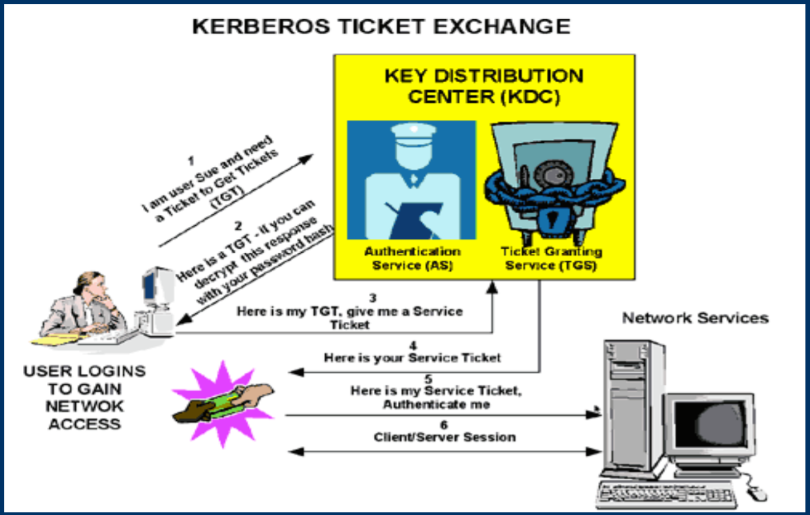

# [Kerberos The Network Authentication Protocol](https://www.logicprobe.org/~octo/pres/pres_kerberos.pdf)

- [Kerberos The Network Authentication Protocol](#kerberos-the-network-authentication-protocol)
  - [What is Kerberos](#what-is-kerberos)
  - [What's with the 3 heads](#whats-with-the-3-heads)
  - [Different types of cryptography](#different-types-of-cryptography)
  - [Benefits of Kerberos](#benefits-of-kerberos)
  - [Limitations of Kerberos](#limitations-of-kerberos)
  - [Implementations of Kerberos](#implementations-of-kerberos)
  - [How to authenticate services](#how-to-authenticate-services)
  - [How is Kerberos organized?](#how-is-kerberos-organized)
  - [Key Distribution Center](#key-distribution-center)
  - [Authentication process](#authentication-process)
  - [Kerberos principals](#kerberos-principals)
  - [User command examples](#user-command-examples)
  - [Preparing for Kerberos](#preparing-for-kerberos)
  - [Kerberos-specific DNS records](#kerberos-specific-dns-records)
  - [Configuring the KDC](#configuring-the-kdc)
  - [Configuration files](#configuration-files)
  - [Prepare the Kerberos database](#prepare-the-kerberos-database)
  - [Create user principals](#create-user-principals)
  - [Configuring Kerberos clients](#configuring-kerberos-clients)
  - [Create service principals](#create-service-principals)
  - [PAM Configuration](#pam-configuration)
  - [Common user commands](#common-user-commands)

## What is Kerberos

- Kerberos is a three-headed dog

- Kerberos stands at the gates of the House of Hades and fawns on the dead as they enter but will savagely eat anyone trying to pass back through the gates and return to the land of the living

- Kerberos is also known as Cerberus, when using the Latin spelling

- A network authentication protocol developed at MIT as part of Project Athena

- Uses private-key cryptography for providing authentication across open networks

- Mediates authentication through a trusted 3rd party

- Developed before the popularity of public-key cryptography and systems like SSL

## What's with the 3 heads

- Authentication

  The confirmation that a user who is requesting services is a valid user of the network services requested

- Authorization
  
  The granting of specific types of service to a user, based on their authentication, what services they are requesting, and the current system state

- Accounting

  The tracking of the consumption of network resources by users

## Different types of cryptography

- Symmetric Key

  The same key is used for both encryption and decryption
  
  Examples: DES, 3DES, AES

- Public Key

  Two keys are used for encryption and decryption

  - “Private key” is used for encryption

  - “Public key” is used for decryption

  Examples: RSA

- While many systems today use public key cryptography for authentication, Kerberos manages to do it with symmetric key cryptography

## Benefits of Kerberos

- Standards-based strong authentication

- Broad operating-system support

- Provides for single sign-on (SSO) capability

- Passwords never traverse the network

- Password guessing more difficult

- Stolen authentication tickets are hard to reuse

## Limitations of Kerberos

- Of the three A's, Kerberos only provides authentication

  Other protocols (such as NIS or LDAP) are still needed for
authorization

- Applications must be “Kerberized” to take advantage

  Kerberos provides standard APIs to help with this

  There are also PAM modules for Kerberos authentication

- Cannot migrate existing password hashes into the Kerberos database

- Authentication is only as good as the user's password

- Assumes relatively secure hosts on an insecure network

## Implementations of Kerberos

- Kerberos 5 protocol is described in RFC 1510

  <http://www.ietf.org/rfc/rfc1510.txt>

- Major implementations

  - MIT Kerberos
  
    <http://web.mit.edu/kerberos/www/>

  - Heimdal Kerberos

    <http://www.pdc.kth.se/heimdal/>

  - Sun's SEAM Kerberos

- All implementations have similar commands and interfaces

  They are compatible for authentication

  Administrative interfaces are not always compatible

## How to authenticate services

- Directly

  Program is linked against Kerberos libraries

  This interface is not standard across Kerberos implementations

- GSSAPI

  Generic Security Services Application Programming Interface

  Standard API for client/server authentication

  Supported by most major KerberosV implementations

  Described by RFC 2473, RFC 1509, RFC1964

- SASL

  Simple Authentication and Security Layer

  A framework for adding authentication support to connection-based protocols

  Decouples authentication mechanisms from application protocols

  Described by RFC 2222

- PAM

  Pluggable Authentication Modules

  Many systems already include a “pam_krb5.so” module

## How is Kerberos organized?

- The Kerberos administrative domain is a “realm”

  Realm names are typically the domain's DNS name in all caps (i.e. “foo.com” becomes “FOO.COM”)

- Authentication mediated through a central server called the “Key Distribution Center” (KDC)

  Each user and service shares a secret key with the KDC

  The KDC generates and distributes session keys

  Communicating parties prove to each other that they know the session key

## Key Distribution Center

- The Kerberos KDC consists of two parts:

  - Authentication Server (AS)

    Issues “Ticket-Granting Tickets” (TGT)

  - Ticket Granting Server (TGS)
  
    Issues service tickets

- The Kerberos KDC must be secure and reliable

  Replication can be used to improve availability

  Security is required to avoid a compromise of the network

## Authentication process

- The client sends a user name and server name to the KDC

- The KDC replies with a ticket and session key, encrypted with the user's password

  - This ticket is known as the “Ticket Granting Ticket”
(TGT)

    Yes, it is a ticket used to grant other tickets ;-)

  - The client decrypts the TGT with the user's password

- The TGT is then used to talk to the KDC to obtain service tickets.

## Kerberos principals

- Clients (users or services) are identified by
“principals”

- Principals look like: primary/instance@realm

  - Primary: user or service name

  - Instance: optional for user principals, but required for service principals

  - Realm: the Kerberos realm

- Examples:

  User: joe@FOO.COM

  Service: imap/bar.foo.com@FOO.COM

## User command examples

    joe@bar:~$ kinit            <-- Authenticate with KDC (can also happen automatically on login)
    Password for joe@FOO.COM:
    joe@bar:~$ ssh things
    Welcome to Things!          <-- SSH to another machine (no password prompt)
    ...do stuff...
    joe@things:~$ exit
    joe@bar:~$ pine             <-- Check E-Mail off an IMAP server (no password prompt)
    ...read e-mail...

    joe@bar:~$ klist
    Ticket cache: FILE:/tmp/krb5cc_201
    Default principal: joe@FOO.COM
    Valid starting Expires Service principal
    12/13/05 23:07:25 12/14/05 07:07:25 krbtgt/FOO.COM@FOO.COM         <-- Ticket Granting Ticket
    renew until 12/14/05 23:07:24
    12/13/05 23:11:57 12/14/05 07:07:25 host/things.foo.com@FOO.COM    <-- Host service ticket
    renew until 12/14/05 23:07:24
    12/13/05 23:33:05 12/14/05 07:33:03 imap/mail.foo.com@FOO.COM      <-- IMAP service ticket
    renew until 12/14/05 17:33:03

## Preparing for Kerberos

- Prerequisites

  - Configure NTP (time synchronization) across all
machines

    Kerberos depends on accurate and usable timestamps

  - Configure DNS

    Kerberos requires fully qualified domain names (FQDN) that are resolvable in both forward and reverse directions for all servers

    Special DNS zone configurations can simplify Kerberos client configurations

## Kerberos-specific DNS records

Inside the forward zone file for foo.com:

    ...
    kdc A 192.168.1.10
    ...
    _kerberos IN TXT “FOO.COM”
    _kerberos._udp IN SRV 0 0 88 kdc
    _kerberos._tcp IN SRV 0 0 88 kdc
    _kpasswd._udp IN SRV 0 0 464 kdc
    _kerberos-adm._tcp IN SRV 0 0 749 kdc

Inside the reverse zone file for 192.168.1.0:

    ...
    10 PTR kdc.foo.com.
    ...

## Configuring the KDC

- Configuration files

  - /etc/krb5.conf

  - /etc/kadm5.acl

- Prepare the Kerberos database

  - Initialize the Kerberos database

  - Add administrator's principal

  - Start the KDC and KDC administration processes

- Create user principals

  Note: service principals are created when configuring your other services to support Kerberos authentication

## Configuration files

    # /etc/krb5.conf
    [libdefaults]
        default_realm = FOO.COM
    [realms]
        FOO.COM = {
            kdc = kdc.foo.com
            admin_server = kdc.foo.com
        }
    [domain_realm]
        .foo.com = FOO.COM
        foo.com = FOO.COM
    [logging]
        default = FILE:/var/log/kdc.log

    # /etc/kadm5.acl
    */admin@FOO.COM *

## Prepare the Kerberos database

- Initialize the Kerberos database:

      kdc# kdb5_util create -s
      ...choose the master password...

- Add the administrator's principal:

      kdc# kadmin.local -q “addprinc root/admin”
      ...choose the administrator password...

  This creates a principal called: root/admin@FOO.COM

- Start the KDC and KDC admin processes:

      kdc# /etc/init.d/krb5kdc start
      kdc# /etc/init.d/kadmin start

## Create user principals

    kdc# kadmin -p root/admin
    ...enter root/admin's password...
    kadmin: addprinc john
    ...enter password for john@FOO.COM...
    kadmin: addprinc jane
    ...enter password for jane@FOO.COM...
    kadmin: exit

## Configuring Kerberos clients

- Configuration file

  /etc/krb5.conf

  You can just copy this from the KDC

- Service principals

  Needed if this client will be providing services that use Kerberos authentication (i.e. remote access, e-mail)

  Involves creating the principals, then adding them to the client's “keytab” file

- PAM (Pluggable Authentication Modules)

  Needed if you want to be able to authenticate users logging into this machine via Kerberos

## Create service principals

You do this part on the client machine:

    bar# kadmin -p root/admin
    ...enter root/admin's password...
    kadmin: addprinc -randkey host/bar.foo.com
    kadmin: addprinc -randkey imap/bar.foo.com
    kadmin: ktadd host/bar.foo.com
    kadmin: ktadd imap/bar.foo.com
    kadmin: exit

This process populates “/etc/krb5.keytab”, which is not human
readable. You can use the “ktutil” program to read and modify it,
however.

## PAM Configuration

The specific details of this vary enough to be beyond the scope of this presentation. However, you generally edit your pam configuration (“pam.conf” or files in “pam.d/”) to include lines resembling the following at the appropriate places:

    ...
    auth sufficient pam_krb5.so try_first_pass
    ...
    account sufficient pam_krb5.so try_first_pass
    ...
    password sufficient pam_krb5.so try_first_pass
    ...

## Common user commands

- kinit

  Obtain and cache Kerberos ticket-granting ticket

  Used to authenticate with the KDC

- klist

  List cached Kerberos tickets

- kdestroy

  Destroy Kerberos tickets

  Used to clear out the ticket cache

- kadmin

  Kerberos database administration program

- ktutil

  Kerberos keytab file maintenance utility
