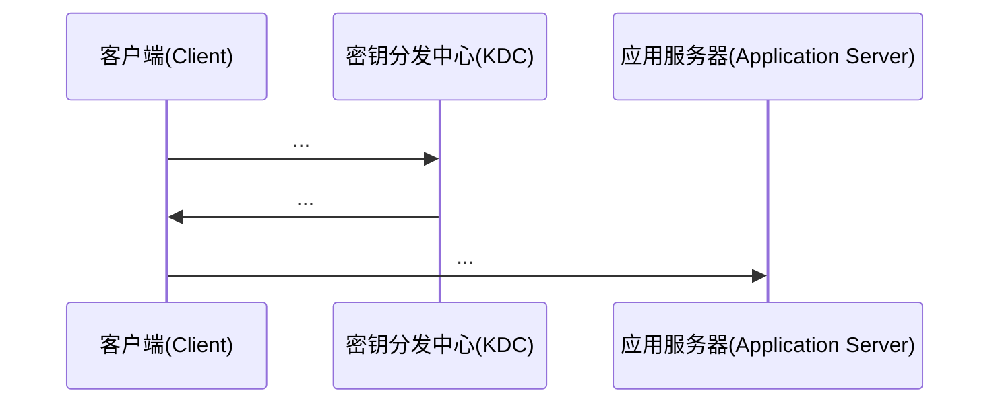
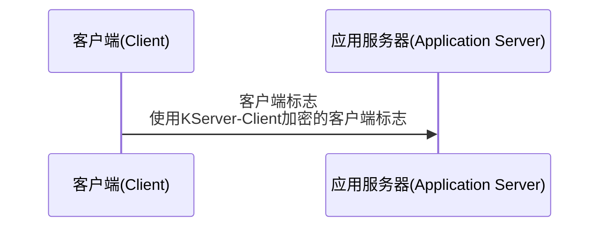
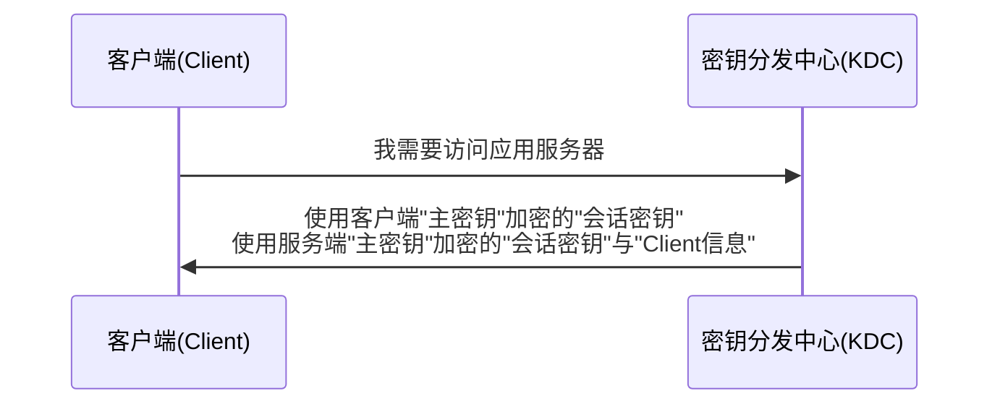
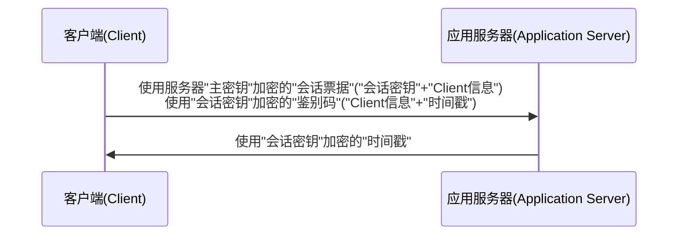
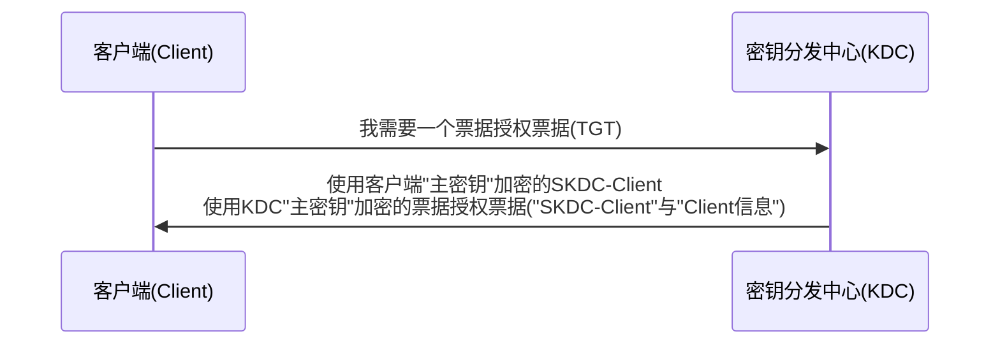
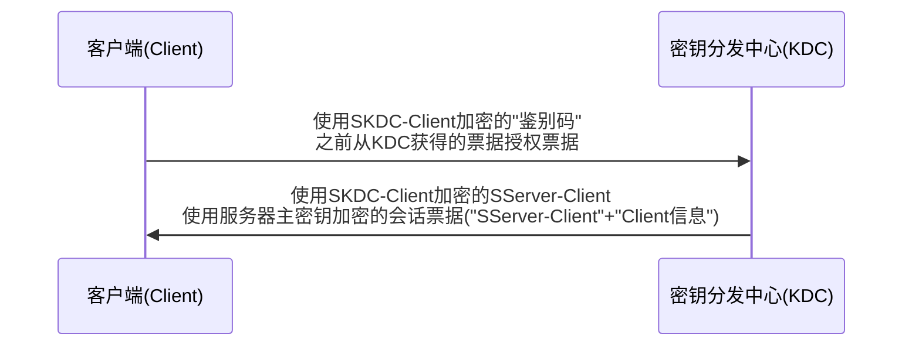

# [kerberos机制](https://blog.csdn.net/maligebazi/article/details/104009567)

- [kerberos机制](#kerberos机制)
  - [1 引言](#1-引言)
  - [2 Kerberos认证应用环境假定](#2-kerberos认证应用环境假定)
    - [图1 Kerberos的基本应用](#图1-kerberos的基本应用)
  - [3 Kerberos认证的工作过程](#3-kerberos认证的工作过程)
    - [3.1 Kerberos认证的基本原理](#31-kerberos认证的基本原理)
      - [图2 客户端认证的简单过程](#图2-客户端认证的简单过程)
    - [3.2 密钥分发中心——SServer-Client的分发](#32-密钥分发中心sserver-client的分发)
    - [图3 KDC分发会话密钥的简单过程](#图3-kdc分发会话密钥的简单过程)
    - [3.3 鉴别码是有效证明自己的证据](#33-鉴别码是有效证明自己的证据)
      - [图4 Kerberos双向验证过程](#图4-kerberos双向验证过程)
    - [3.4 票据授权服务——TGS](#34-票据授权服务tgs)
      - [图5 TGT申请过程](#图5-tgt申请过程)
      - [图6 会话票据分发过程](#图6-会话票据分发过程)
  - [4 Kerberos的子协议](#4-kerberos的子协议)
  - [图7 Kerberos三步认证过程](#图7-kerberos三步认证过程)
    - [4.1 Authentication Service Exchange](#41-authentication-service-exchange)
    - [4.2 Ticket GrantingService Exchange](#42-ticket-grantingservice-exchange)
    - [4.3 Client/Server Exchange](#43-clientserver-exchange)
      - [图8 Kerberos四步认证过程](#图8-kerberos四步认证过程)
  - [5 小结](#5-小结)

[Kerberos认证浅析](http://www.h3c.com/cn/d_201309/922101_30005_0.htm)

## 1 引言

在希腊神话中Kerberos是守护地狱之门的一条凶猛的三头神犬，而我们在本文中所要介绍的Kerberos认证协议是由美国麻省理工学院(MIT)首先提出并实现的，是该校雅典娜计划的一部分。这个定名是贴切的，因为Kerberos认证是一个三路处理过程，依赖称为**密钥分发中心**（**KDC**）的第三方服务来验证计算机相互的身份，并建立密钥以保证计算机间安全连接。本质上每台计算机分享KDC一个秘钥，而KDC有两个部件：一个**Kerberos认证服务器**和一个**票据授权服务器**。如果KDC不知道被请求目标服务器，则会求助于另一个KDC来完成认证。它允许在网络上通讯的实体互相证明彼此的身份，并且能够阻止**窃听**和**重放**等攻击手段。不仅如此，它还能够提供对通讯数据保密性和完整性的保护。

Kerberos从提出到今天，共经历了五个版本的发展。其中第一版到第三版主要由该校内部使用。当发展到第四版的时候，已经取得了在MIT校外的广泛认同和应用。由于第四版的传播，人们逐渐发现了它的一些局限性和缺点，例如适用网络环境有限、加密过程存在冗余等等。MIT充分吸取了这些意见，对第四版进行了修改和扩充，形成了今天非常完善的第五版。第五版由John Kohl和Clifford Neuman设计，在1993年作为**RFC 1510**颁布，在2005年由**RFC 4120**取代，目的在于克服第四版的局限性和安全问题，用更细化和明确的解释说明了协议的一些细节和使用方法。

## 2 Kerberos认证应用环境假定

Kerberos协议的基本应用是在一个分布式的Client/Server 体系结构中，采用一个或多个Kerberos 服务器提供鉴别服务。当客户端想请求应用服务器上的资源时，首先由客户端向**密钥分发中心**请求一张**身份证明**，然后将身份证明交给应用服务器进行验证，在通过服务器的验证后，服务器就会为客户端分配所请求的资源。

### 图1 Kerberos的基本应用

Kerberos协议本身并不能完全解决网络安全性问题，它是建立在一些**假定**之上的，只有在满足这些假定的环境中它才能正常运行。

1. 不能对**拒绝服务**(Denial of Service)攻击进行防护。Kerberos不能解决拒绝服务攻击，在该协议的很多环节中，攻击者都可以阻断正常的认证步骤。这类攻击只能由管理员和用户来检测和解决。

2. 主体必须保证他们的**私钥**的安全。如果一个入侵者通过某种方法窃取了主体的私钥，他就能冒充身份。

3. Kerberos无法应付**口令猜测**攻击。如果一个用户选择了弱口令，那么攻击者就有可能成功地用口令字典破解掉，继而获得那些由源自于用户口令加密的所有消息。

4. 网络上每个主机的**时钟**必须是松散同步的。这种同步可以减少应用服务器进行**重放攻击**检测时所记录的数据。松散程度可以以一个服务器为准进行配置。时钟同步协议必须保证自身的安全，才能保证时钟在网上同步。

5. **主体的标识**不能频繁地循环使用。由于访问控制的典型模式是使用访问控制列表(ACLs)来对主体进行授权。如果一个旧的ACL还保存着已被删除主体的入口，那么攻击者可以重新使用这些被删除的用户标识，就会获得旧ACL中所说明的访问权限。

## 3 Kerberos认证的工作过程

### 3.1 Kerberos认证的基本原理

在网络中，认证主要用来解决各个**通讯实体**之间相互证明彼此身份的问题。对于如何进行认证，我们通常会采用这样的方法：如果一个秘密仅仅有认证方和被认证方知道，认证方可以通过让被认证方提供这个秘密来证明对方的身份。这个过程实际上涉及到认证的三个重要方面：**秘密如何表示**、被认证方如何向认证方**提供秘密**、认证方如**何识别秘密**。

基于这三个方面，Kerberos认证可以进行最大限度的简化成**Client**和**Server**两个**通讯实体**，他们之间共同的秘密用**KServer-Client**来表示。Client在认证过程中向Server提供以明文形式表示的**Client标识**和使用**KServer-Client加密**的Client标识以便于让Server进行有效的认证：

由于这个秘密仅仅被Client和Server知晓，所以被 Client加密过的Client标识只能被Client和Server解密。Server接收到Client传送的这两组信息，先**通过KServer-Client对后者进行解密**，随后将解密的数据同前者进行**比较**，如果完全一样，则可以证明Client能够提供正确的KServer-Client，而这个世界上，只有真正的Client和自己知道KServer-Client，这样就可以证明对方的真实性。

#### 图2 客户端认证的简单过程

整个过程看起来非常简单，但是实际上Kerberos认证远比这个过程复杂的多，在了解Kerberos真实的认证过程之前我们先给出两个重要的概念：

- **长期密钥**：在安全领域中，有的密钥可能长期内保持不变，比如**密码**，可能几年都不曾改变。这样的密钥以及由此**派生**的其他密钥被称为长期密钥。长期密钥有这样的原则：**被长期密钥加密的数据不应该在网络上传输**。因为任何加密算法都不可能做到绝对保密，一旦这些被长期密钥加密的数据包被黑客截获，在理论上，只要有充足的时间，都是可以通过计算获得用户用于加密的密钥的。

  对于一个账户来说，**密码仅限于该账户的所有者知晓**，甚至对于管理员都应该是保密的。但是密码却又是证明身份的凭据，所以必须**通过基于密码的派生信息来证明用户的真实身份**，在这种情况下，一般将账户密码进行Hash运算得到一个Hash值，也可以称之为**主密钥**。由于Hash算法是不可逆的，同时可以保证密码和主密钥派生的确定性，这样既保证了密码的保密性，同时又保证主密钥和密码本身在证明用户身份时具有相同的效力。

  > 注:  
  > "主密钥"是由密码派生的，应属于"长期密钥"。而使用"主密钥"加密的"会话密钥"是否有背于"被长期密钥加密的数据不应该在网络上传输"?

- **短期密钥**：由于被长期密钥加密的数据包不能在网络上传送，所以需要使用另一种密钥来**加密需要进行网络传输的数据**。这种密钥只在一段时间内有效，即使加密过的数据包被黑客截获，等他把密钥计算出来的时候，这个密钥早就已经过期了。我们把这种密钥称为短期密钥。

### 3.2 密钥分发中心——SServer-Client的分发

通过让被认证方提供一个仅限于他和认证方知晓的密钥来鉴定对方的真实身份。而被这个密钥加密的数据包需要在Client和Server之间传送，所以这个密钥只可能是一个**短期密钥**，它仅仅在Client和Server的**一个Session中有效**，所以我们称这个密钥为Client和Server之间的**会话密钥**，暂时表示为**SServer-Client**。

在介绍Client和Server是如何得到会话密钥之前要引入一个重要的角色：**Key Distribution Center**（**KDC**），也就是**密钥分发中心**。KDC在整个Kerberos认证系统中作为Client和Server**共同信任的第三方**起着至关重要的作用。

### 图3 KDC分发会话密钥的简单过程

KDC分发SServer-Client的简单过程如上图所示：首先 Client向KDC发送一个**对SServer-Client的申请**，其中包括自己的信息以及希望访问的Server的信息。KDC在接收到这个请求的时候，生成一个**会话密钥**，为了保证这个密钥仅限于发送请求的Client和他希望访问的Server知晓，KDC会为这个密钥生成两个拷贝，分别被Client和Server使用。然后从数据库中提取Client和Server的**主密钥**分别对这两个拷贝进行对称加密。对于后者，和会话密钥一起被加密的还有一些Client的信息。

> 注:  
> "会话密钥"由KDC生成, 通过"主密钥"加密  
> KDC使用Client的"主密钥"加密"会话密钥"(SServer-Client)  
> KDC使用Server的"主密钥"加密"会话密钥"(SServer-Client)以及"Client信息"。称为"会话票据"

KDC有了两个分别被Client和Server的主密钥加密过的会话密钥，KDC会将这两个被加密的拷贝一并发给Client，属于Server的那一份将会**由Client发送给Server**。这样做可以轻松地解决两个问题：首先Server不用维护一张庞大的会话密钥列表来应付不同的Client的访问，降低了Server的负荷；其次避免出现因为网络延时，Client的认证请求比Server的会话密钥早到达Server端，进而导致认证失败的情况。

### 3.3 鉴别码是有效证明自己的证据

在上述的过程之后Client实际上获得了两组信息：一个是通过自己的主密钥加密的**会话密钥**，另一个则是被Server的主密钥加密的数据包，其中包含**会话密钥和关于自己的一些确认信息**。虽然通过一个双方知晓的密钥就可以对对方进行有效的认证，但是在一个不安全的网络环境中，这种简单的做法是存在安全漏洞的，假设Client向Server发送的数据包被黑客截获，该黑客随后将数据包作为自己的凭证冒充该Client对Server进行访问，在这种情况下，依然可以很顺利地获得Server的成功认证。为此，Client需要提供更多的证明信息，称为**鉴别码**。在Kerberos中这个鉴别码实际上就是**关于Client的一些信息和当前时间的一个时间戳**。

Client使用自己的主密钥对KDC加密的会话密钥进行解密从而获得SServer-Client，随后创建**鉴别码**并用SServer-Client对其加密。最后连同从KDC获得的、被Server的主密钥加密过的数据包一并发送到Server端。我们把通过Server的主密钥加密过的数据包称为**会话票据**。

> 注:  
> "鉴别码"由Client创建, 包括"Client信息"与当前"时间戳"  
> "鉴别码"通过"会话密钥"加密  
> "鉴别码"与"会话票据"由Client发送至Server

当Server接收到这两组数据后，先使用他自己的主密钥对**会话票据**进行解密，从而获得SServer-Client。随后使用SServer-Client解密鉴别码获取时间戳，同当前的时间进行比较，如果偏差超出一个可以接受范围，Server会直接拒绝该Client的请求。Server会维护一个列表，记录在可接受的时间范围内所有进行认证的Client和认证时间。对于时间偏差在可接受的范围中的Client，Server会从列表中获得该Client最近一次认证时间，只有当Client提供的时间戳晚于这个时间，Server才会比较鉴别码中的客户端信息和会话票据中的客户端信息从而实现对Client的认证。这也就是为什么我们从一开始就需要假定网络中每台主机的时钟必须是松散同步的了。

> 注:  
> Server使用"主密钥"解密"会话票据"获得"会话密钥"与"Client信息"  
> Server使用"会话密钥"解密"鉴别码"获取"时间戳"与"Client信息"  
> Server校验"时间戳"与当前时间偏差在可接受时间范围内  
> Server校验"时间戳"晚于上一次成功认证时间  
> Server校验"会话票据"与"鉴别码"中的"Client信息"

#### 图4 Kerberos双向验证过程

Kerberos一个重要的优势在于它能够提供双向认证：不但Server可以对Client进行认证，Client也能对Server进行认证。如果Client需要对他访问的Server进行认证，会在他向Server发送的认证请求中设置一个**是否需要双向认证**的标志位。Server在对Client认证成功之后，会把鉴别码中的**时间戳**提取出来，通过SServer-Client进行加密，当Client使用SServer-Client对Server回应的报文进行解密之后，如果确认时间戳和原来的完全一致，那么他可以认定这台Server正是他希望访问的Server。

> 注:  
> 双向认证通过Client校验"时间戳"完成  

### 3.4 票据授权服务——TGS

Kerberos实际上是一个基于票据的认证方式。 Client想要获取Server端的资源，先得通过Server的认证；而认证的先决条件是Client向Server提供从KDC获得的一个由 Server的主密钥加密过的会话票据。所以对Client来说，获得会话票据是整个认证过程中最为关键的部分。

在 Kerberos中票据的分发过程远没有上面所讲的那么简单，Client在从KDC处获得会话票据之前，需要先获得一个授权，被称为**Ticket Granting Ticket**（**票据授权票据**，简称**TGT**），TGT的分发仍然是KDC来完成的。

首先Client向KDC发起对TGT的申请，KDC在收到该申请后，生成一个用于该Client与KDC进行安全通信的**会话密钥**，暂时用**SKDC-Client**来表示。为了保证该会话密钥仅供该Client和自己使用，KDC使用Client的主密钥和自己的主密钥对生成的会话密钥进行加密，从而获得两个加密的SKDC-Client的拷贝。对于后者，随会话密钥一起被加密的还包含以后用于鉴定Client身份的关于Client的一些信息，这就是前面所说的TGT。最后KDC将这两份拷贝一并发送给Client。

#### 图5 TGT申请过程

当Client收到KDC的两个加密数据包之后，先使用自己的主密钥对第一个拷贝进行解密，从而获得SKDC-Client，并把它和TGT进行缓存。有了SKDC-Client和TGT，Client自己的主密钥将不再需要，因为此后Client可以使用SKDC-Client向KDC申请用以访问各个Server的票据，SKDC-Client是一个短期密钥，安全得到更好的保障，也正是因为如此，SKDC-Client具有自己的生命周期，同时TGT和SKDC-Client相互关联，当SKDC-Client过期，TGT也就宣告失效，此后Client不得不重新向KDC申请新的TGT，KDC将会生成一个不同会话密钥和与之关联的TGT，另外Client的注销操作也会导致SKDC-Client失效。

Client在获得SKDC-Client之后，生成自己的鉴别码以及所要访问的Server名称，并使用SKDC-Client进行加密。 随后连同TGT一并发送给KDC。KDC使用自己的主密钥对TGT进行解密，提取客户端信息和SKDC-Client，然后使用SKDC-Client解密鉴别码，获得鉴别码中的客户端信息，对两个信息进行比较进而验证对方的真实身份。验证成功，生成一份基于Client所要访问的Server的票据给Client，之后的过程就像上面所讲述的一样进行了。

#### 图6 会话票据分发过程

通过以上的介绍，Kerberos认证的过程已经基本介绍清楚了，首先Client向KDC申请TGT，之后Client通过获得TGT向KDC申请用于访问Server的票据，最后Client向Server提交票据用于认证。

## 4 Kerberos的子协议

上一节所讲述的Kerberos认证过程的三步是通过三个子协议来完成，它们分别是：Authentication Service Exchange、Ticket GrantingService Exchange和Client/Server Exchange。这三个子协议分别完成了Client向KDC申请TGT、Client通过获得的TGT向KDC申请用于访问Server的票据和Client向Server提交票据进行认证的三个过程。

## 图7 Kerberos三步认证过程

### 4.1 Authentication Service Exchange

首先Client向KDC的认证服务发送Authentication Service Request（KRB_AS_REQ），大体内容包含：客户端名称、票据授权服务器名称以及一个被Client的主密钥加密的时间戳，我们可以把它看作是票据的有效期。

认证服务从数据库中提取KRB_AS_REQ中携带的客户端名称所对应的主密钥对被加密的时间戳进行解密，如果这个时间戳合法，则可以证明发送方提供的是正确的密码， 认证服务将一份包含使用Client的主密钥加密的会话密钥和被自己的主密钥加密的TGT的回应（KRB_AS_REP）发送给Client。这个TGT中包含了SKDC-Client、客户端名称和TGT到期的时间。

Client对第一部分解密获得SKDC-Client之后，携带着TGT便可以进入下一步——TGS（Ticket Granting Service）Exchange。

### 4.2 Ticket GrantingService Exchange

Client向KDC的票据授权服务发送Ticket Granting Service Request（KRB_TGS_REQ），内容包括Client通过AS Exchange获得的TGT、使用SKDC-Client加密的客户端信息以及所需要访问的服务器名称。

票据授权服务收到请求后，先得确认Client提供的那个TGT是否是AS颁发给它的。方法很简单，KDC先使用自己的主密钥对Client提供的TGT进行解密，获得SKDC-Client，再使用SKDC-Client解密鉴别码进行验证。验证通过向对方发送Ticket Granting Service Response（KRB_TGS_REP）。回应报文也由两部分组成：使用SKDC-Client加密的Client和Server的会话密钥（SServer-Client）和使用Server的主密钥加密的票据，包含SServer-Client，客户端名称和票据的到期时间。

Client收到回应报文后，使用SKDC-Client解密第一部分，获得SServer-Client。有了SServer-Client和票据，Client就可以直接和Server进行交互，而无需再通过KDC了。

### 4.3 Client/Server Exchange

最后Client使用票据和Server进行交互就由CS（Client/Server）Exchange来完成。Client通过TGS Exchange获得SServer-Client，随后创建用于证明自己就是票据真正所有者的鉴别码，并使用SServer-Client进行加密。最后将这个被加密过的鉴别码和票据作为应用服务请求（KRB_AP_REQ）发送给Server，另外在请求中还包含一个标志位用于表示Client是否需要进行双向验证。

Server接收到请求之后，通过自己的主密钥解密票据，从而获得SServer-Client。接着使用SServer-Client解密鉴别码，进而验证Client的身份。如果验证通过，则让Client访问需要访问的资源，否则直接拒绝对方的请求。

如果Client需要进行双向验证，Server从鉴别码中提取时间戳，使用SServer-Client进行加密，并将其发送给Client用于Client验证Server的身份。

通过对上述三个子协议的介绍，我们已经了解了整个Kerberos的认证过程。但是细心的读者也许会发现，基于这三个子协议的Kerberos系统是存在一定的安全隐患的。在CS Exchange阶段，Client携带的票据是被Server的主密钥加密的，这显现不符合前面提出长期密钥的使用原则，降低了Server的安全系数。

最直接的解决方式就是采用一个会话密钥，而不是Server的主密钥对票据进行加密。这就是Kerberos的第四个子协议：User-to-User Authentication Exchanges。票据是由KDC生成之后通过Client发送给Server的，所以用于加密票据的自然是KDC和Server之间的会话密钥（SKDC-Server）。但是KDC是不会维护任何会话密钥的，所以SKDC-Server只能靠申请票据的Client提供。

#### 图8 Kerberos四步认证过程

上图描述了包含User-to-User Authentication Exchanges的认证过程，这个过程由四步组成。较之前基于传统的认证过程多了第二步。

首先通过AS Exchange，Client获得了属于自己的TGT，便可凭此向KDC申请用于访问某个Server的票据。

第二步的主要任务是获得封装了SKDC-Server的属于Server的TGT。如果该TGT存在于Server的缓存中，则Server会直接将其返回给Client。否则Server将通过AS Exchange从KDC获取。

接着Client通过向KDC提供自己的TGT，Server的TGT以及鉴别码来申请用于访问Server的票据。KDC先用自己的主密钥解密Client的TGT获得SKDC-Client，通过SKDC-Client解密鉴别码验证发送者的身份，验证通过后再用自己的主密钥解密Server的TGT获得SKDC-Server，并用SKDC-Server加密票据返回给Client。

最后，Client将使用SKDC-Server加密的票据和SServer-Client加密的鉴别码访问Server，Server通过SKDC-Server解密票据获得SServer-Client，通过SServer-Client解密鉴别码实现对Client的验证。

## 5 小结

在分析了整个Kerberos认证过程之后，Kerberos的优点也体现出来了。首先它具有较高的性能，一旦Client获得用于访问某个Server的票据，则该Server就能根据票据实现对Client的验证，不再需要KDC的参与；其次Kerberos可以进行双向验证，Client在访问Server的资源之前可以要求对Server的身份进行验证；第三就是互操作性，Kerberos最初由MIT提出并实现的，现在已经成为计算机领域一个被广泛接受的标准，所以使用Kerberos可以轻松实现不同平台之间的互操作。

但是Kerberos的缺点同样存在，比如Kerberos身份认证采用的是对称加密机制，加密和解密使用相同的密钥，安全性有所降低；Kerberos中身份认证服务和票据授权服务时集中式管理的，容易形成瓶颈，系统的性能和安全性也过分依赖于这两个服务的性能和安全。
