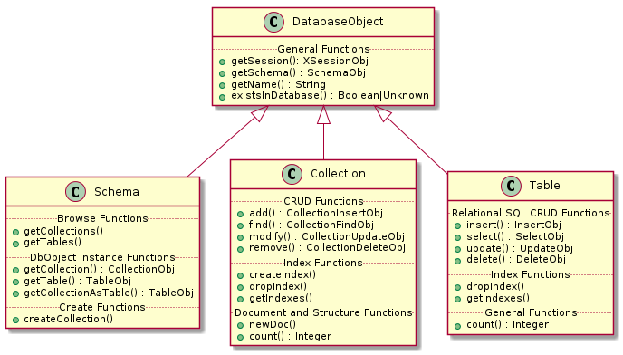

# [X DevAPI User Guide](https://dev.mysql.com/doc/x-devapi-userguide/en/)

- [X DevAPI User Guide](#x-devapi-user-guide)
  - [Chapter 1 Overview](#chapter-1-overview)
  - [Chapter 2 Connection and Session Concepts](#chapter-2-connection-and-session-concepts)
    - [2.1 Database Connection Example](#21-database-connection-example)
      - [MySQL Shell JavaScript Code](#mysql-shell-javascript-code)
      - [MySQL Shell Python Code](#mysql-shell-python-code)
      - [Node.js JavaScript Code](#nodejs-javascript-code)
      - [C# Code](#c-code)
      - [Python Code](#python-code)
      - [Java Code](#java-code)
      - [C++ Code](#c-code-1)
    - [2.2 Connecting to a Session](#22-connecting-to-a-session)
      - [2.2.1 Connecting to a Single MySQL Server](#221-connecting-to-a-single-mysql-server)
        - [C++ Code](#c-code-2)
      - [2.2.2 Connecting to One of Multiple Hosts and Connection Failover](#222-connecting-to-one-of-multiple-hosts-and-connection-failover)
      - [2.2.3 Connecting to a Single MySQL Server Using Connection Pooling](#223-connecting-to-a-single-mysql-server-using-connection-pooling)
        - [C++ Code](#c-code-3)
        - [Connector/C++ Code using X DevAPI for C](#connectorc-code-using-x-devapi-for-c)
      - [2.2.4 Connections Using DNS SRV Records](#224-connections-using-dns-srv-records)
        - [Connector/C++ Code using X DevAPI for C](#connectorc-code-using-x-devapi-for-c-1)
      - [2.2.5 Connection Option Summary](#225-connection-option-summary)
    - [2.3 Working with a Session Object](#23-working-with-a-session-object)
      - [C++ Code](#c-code-4)
    - [2.4 Using SQL with Session](#24-using-sql-with-session)
      - [C++ Code](#c-code-5)
    - [2.5 Setting the Current Schema](#25-setting-the-current-schema)
      - [C++ Code](#c-code-6)
    - [2.6 Dynamic SQL](#26-dynamic-sql)
      - [Python Code](#python-code-1)
      - [Java Code](#java-code-1)
      - [C++ Code](#c-code-7)
  - [Chapter 3 CRUD Operations](#chapter-3-crud-operations)
    - [3.1 CRUD Operations Overview](#31-crud-operations-overview)
      - [Database Object Classes](#database-object-classes)
    - [3.2 Method Chaining](#32-method-chaining)
      - [C++ Code](#c-code-8)
    - [3.3 Synchronous versus Asynchronous Execution](#33-synchronous-versus-asynchronous-execution)
      - [Asynchronous Operations](#asynchronous-operations)
        - [C# Code](#c-code-9)
        - [Java Code](#java-code-2)
        - [C++ Code](#c-code-10)
      - [Asynchronous Operations using Awaits](#asynchronous-operations-using-awaits)
        - [C# Code](#c-code-11)
        - [Java Code](#java-code-3)
      - [Syntax Differences](#syntax-differences)
    - [3.4 Parameter Binding](#34-parameter-binding)
      - [C++ Code](#c-code-12)
      - [C++ Code](#c-code-13)
      - [Preparing CRUD Statements](#preparing-crud-statements)
        - [C++ Code](#c-code-14)
    - [3.5 MySQL Shell Automatic Code Execution](#35-mysql-shell-automatic-code-execution)
  - [Chapter 4 Working with Collections](#chapter-4-working-with-collections)
  - [Chapter 5 Working with Documents](#chapter-5-working-with-documents)
  - [Chapter 6 Working with Relational Tables](#chapter-6-working-with-relational-tables)
    - [6.1 SQL CRUD Functions](#61-sql-crud-functions)
      - [`Table.insert()`](#tableinsert)
        - [C++ Code](#c-code-15)
        - [C++ Code](#c-code-16)
      - [`Table.select()`](#tableselect)
      - [`Table.update()`](#tableupdate)
      - [`Table.delete()`](#tabledelete)
  - [Chapter 7 Working with Relational Tables and Documents](#chapter-7-working-with-relational-tables-and-documents)
  - [Chapter 8 Statement Execution](#chapter-8-statement-execution)
    - [8.1 Transaction Handling](#81-transaction-handling)
      - [C++ Code](#c-code-17)
      - [8.1.1 Processing Warnings](#811-processing-warnings)
        - [Java Code](#java-code-4)
        - [C++ Code](#c-code-18)
        - [Java Code](#java-code-5)
      - [8.1.2 Error Handling](#812-error-handling)
        - [C++ Code](#c-code-19)
    - [8.2 Working with Savepoints](#82-working-with-savepoints)
      - [Setting a Savepoint](#setting-a-savepoint)
      - [Rolling Back to a Savepoint](#rolling-back-to-a-savepoint)
      - [Releasing a Savepoint](#releasing-a-savepoint)
      - [Savepoints and Implicit Transaction Behavior](#savepoints-and-implicit-transaction-behavior)
    - [8.3 Working with Locking](#83-working-with-locking)
    - [8.4 Working with Prepared Statements](#84-working-with-prepared-statements)
  - [Chapter 9 Working with Result Sets](#chapter-9-working-with-result-sets)
    - [9.1 Result Set Classes](#91-result-set-classes)
    - [9.2 Working with AUTO-INCREMENT Values](#92-working-with-auto-increment-values)
    - [9.3 Working with Data Sets](#93-working-with-data-sets)
    - [9.4 Fetching All Data Items at Once](#94-fetching-all-data-items-at-once)
    - [9.5 Working with SQL Result Sets](#95-working-with-sql-result-sets)
    - [9.6 Working with Metadata](#96-working-with-metadata)
    - [9.7 Support for Language Native Iterators](#97-support-for-language-native-iterators)
  - [Chapter 10 Building Expressions](#chapter-10-building-expressions)
    - [10.1 Expression Strings](#101-expression-strings)
      - [10.1.1 Boolean Expression Strings](#1011-boolean-expression-strings)
      - [10.1.2 Value Expression Strings](#1012-value-expression-strings)
  - [Chapter 11 CRUD EBNF Definitions](#chapter-11-crud-ebnf-definitions)
  - [Chapter 13 Implementation Notes](#chapter-13-implementation-notes)

User documentation for developers using X DevAPI.

## [Chapter 1 Overview](https://dev.mysql.com/doc/x-devapi-userguide/en/devapi-users-introduction.html)

## [Chapter 2 Connection and Session Concepts](https://dev.mysql.com/doc/x-devapi-userguide/en/devapi-connection-concepts.html)

This section explains the concepts of connections and sessions as used by the X DevAPI.

An X DevAPI session is a high-level database session concept that is different from working with traditional low-level MySQL connections. Sessions can encapsulate one or more actual MySQL connections when using the X Protocol. Use of this higher abstraction level decouples the physical MySQL setup from the application code. Sessions provide full support of X DevAPI and limited support of SQL.

### [2.1 Database Connection Example](https://dev.mysql.com/doc/x-devapi-userguide/en/database-connection-example.html)

The code that is needed to connect to a MySQL document store looks a lot like the traditional MySQL connection code, but now applications can establish **logical sessions** to MySQL server instances running the X Plugin. Sessions are produced by the `mysqlx` factory, and the returned sessions can encapsulate access to one or more MySQL server instances running X Plugin. Applications that use Session objects by default can be deployed on both single server setups and database clusters with no code changes.

**Create an X DevAPI session** using the `mysqlx.getSession(connection)` method. You pass in the connection parameters to connect to the MySQL server, such as the hostname and user, very much like the code in one of the classic APIs. The connection parameters can be specified as either a URI type string, for example `user:@localhost:33060`, or as a data dictionary, for example `{user: myuser, password: mypassword, host: example.com, port: 33060}`. See [Connecting to the Server Using URI-Like Strings or Key-Value Pairs](https://dev.mysql.com/doc/refman/8.0/en/connecting-using-uri-or-key-value-pairs.html) for more information.

The MySQL user account used for the connection should use either the `mysql_native_password` or `caching_sha2_password` authentication plugin, see [Pluggable Authentication](https://dev.mysql.com/doc/refman/8.0/en/pluggable-authentication.html). The server you are connecting to should have **encrypted connections** enabled, the default in MySQL 8.0. This ensures that the client uses the X Protocol `PLAIN` password mechanism which works with user accounts that use either of the authentication plugins. If you try to connect to a server instance which does not have encrypted connections enabled, for user accounts that use the `mysql_native_password` plugin authentication is attempted using `MYSQL41` first, and for user accounts that use `caching_sha2_password` authentication falls back to `SHA256_MEMORY`.

The following example code shows how to connect to a MySQL server and get a document from the `my_collection` collection that has the field `name` starting with `L`. The example assumes that a schema called `test` exists, and the `my_collection` collection exists. To make the example work, replace `user` with your username, and `password` with your password. If you are connecting to a different host or through a different port, change the host from `localhost` and the port from `33060`.

#### MySQL Shell JavaScript Code

#### MySQL Shell Python Code

#### Node.js JavaScript Code

#### C# Code

#### Python Code

#### Java Code

#### C++ Code

    #include <mysqlx/xdevapi.h>
    
    // Scope controls life-time of objects such as session or schema
    
    {
      Session sess("localhost", 33060, "user", "password");
      Schema db= sess.getSchema("test");
      // or Schema db(sess, "test");
    
      Collection myColl = db.getCollection("my_collection");
      // or Collection myColl(db, "my_collection");
    
      DocResult myDocs = myColl.find("name like :param")
                               .limit(1)
                               .bind("param","L%").execute();
    
      cout << myDocs.fetchOne();
    }

### [2.2 Connecting to a Session](https://dev.mysql.com/doc/x-devapi-userguide/en/connecting-to-a-session.html)

#### [2.2.1 Connecting to a Single MySQL Server](https://dev.mysql.com/doc/x-devapi-userguide/en/connecting-to-a-single-mysqld-node-setup.html)

In this example a connection to a local MySQL Server instance running **X Plugin on the default TCP/IP port 33060** is established using the MySQL user account `user` with its password. As no other parameters are set, default values are used.

##### C++ Code

    // This code sample assumes that we have function prompt() defined somewhere.
    
    string usr = prompt("Username:");
    string pwd = prompt("Password:");
    
    // Connect to MySQL Server on a network machine
    Session mySession(SessionOption::HOST, "localhost",
                      SessionOption::PORT, 33060,
                      SessionOption::USER, usr,
                      SessionOption::PWD, pwd);
    
    // An alternative way of defining session settings.
    
    SessionSettings settings(SessionOption::HOST,"localhost",
                             SessionOption::PORT, 33060);
    
    settings.set(SessionOption::USER, usr);
    settings.set(SessionOption::PWD, pwd);
    
    Session mySession(settings);
    
    Schema myDb= mySession.getSchema("test");

#### [2.2.2 Connecting to One of Multiple Hosts and Connection Failover](https://dev.mysql.com/doc/x-devapi-userguide/en/connecting-to-one-of-multiple-hosts.html)

You can provide multiple MySQL Router or server endpoints (as host and an optional port, or Unix sockets) when creating a session. You specify a URI-like string which contains **multiple hosts, ports**, and optional **priority**. This enables the connector to perform **automatic connection failover selection** when any of the endpoints are not available. When multiple endpoints are available, the choice of which server is used for the session depends on whether you specify priority. If a priority is specified for each endpoint, the available endpoint with the highest priority is used. If you do not specify priority, a random available endpoint is used. This section describes how to configure multiple endpoints in a URI-like string. For more information on URI-like connection strings, see [Connecting Using URI-Like Connection Strings](https://dev.mysql.com/doc/refman/8.0/en/connecting-using-uri-or-key-value-pairs.html#connecting-using-uri).

|||
|-|-|
Note |The user and password you supply in the URI-like string apply to all of the possible endpoints and therefore the **same MySQL account** must exist on each of the endpoints.
|||

To specify multiple hosts without priority, the URI-like connection string is formatted as:

    user:password@[(address=[host]:[port]), (address=[host]:[port]) ..]

The collection of endpoints is listed as either host, port, or host and port. When setting up multiple endpoints without priority, any of the available endpoints is chosen for the connection.

To specify priorities for the endpoints, the URI-like connection string is formatted as:

    user:password@[(address=[host]:[port], priority=value), (address=[host]:[port], priority=value) ..]

This sets up endpoints with explicit priority, for example to failover the connection to a specific endpoint in the event of another endpoint not being available. Specified priorities can range from `0` (lowest priority) to `100` (highest priority). When two endpoints share the same priority, one of them is chosen randomly.

For example, suppose you connect using an URI-like string such as:

    mysqlx://user:password@[(address=example1.com:33060,priority=99),(address=example2.com:33060,priority=100)]

In this case, there are two possible endpoints, and `example2:33060` has a higher priority. When both endpoints are available, the connector connects to `example2.com:33060`. In the event that `example2.com:33060` is not available, the connector connects to `example1:33060`.

#### [2.2.3 Connecting to a Single MySQL Server Using Connection Pooling](https://dev.mysql.com/doc/x-devapi-userguide/en/connecting-connection-pool.html)

X DevAPI supports connection pooling, which can **reduce overhead** for applications that open many connections to a MySQL Server. Connections are managed as a pool by a Client object. When opening a new Session with a Client, before a new network connection is opened, an attempt is made to retrieve from the pool an existing and currently unused connection, which is then reset and reused.

A connection pool is configured using a single key-value pair (see [Connecting Using Key-Value Pairs](https://dev.mysql.com/doc/refman/8.0/en/connecting-using-uri-or-key-value-pairs.html#connecting-using-key-value-pairs)) that contains a **single key named `pooling`**. The value for the `pooling` key is another **set of key-value pairs** containing any combination of the keys described in the following table:

Table 2.1 Options for Configuring a Connection Pool

|Option|Meaning|Default|
|-|-|-|
enabled|Connection pooling enabled. When the option is set to `false`, a regular, non-pooled connection is returned, and the other connection pool options listed below are ignored.|true
maxSize|The maximum number of connections allowed in the pool|25
maxIdleTime|The maximum number of milliseconds a connection is allowed to idle in the queue before being closed. A zero value means infinite.|0
queueTimeout|The maximum number of milliseconds a request is allowed to wait for a connection to become available. A zero value means infinite|0
||||

Closing the Session **marks the underlying connection as unused** and returns it to the Client object's connection pool.

Closing the Client object closes all connections it manages, invalidates all Sessions the Client has created, and **destroys the managed pool**.

|||
|-|-|
Note|Connection pooling is not supported by MySQL Shell.
|||

##### C++ Code

    using namespace mysqlx;

    Client cli("user:password@host_name/db_name", ClientOption::POOL_MAX_SIZE, 7);
    Session sess = cli.getSession();

    // use Session sess as usual

    cli.close();  // close all Sessions

##### Connector/C++ Code using X DevAPI for C

    char error_buf[255];
    int  error_code;
    
    mysqlx_client_t *cli
     = mysqlx_get_client_from_url(
         "user:password@host_name/db_name", "{ \"maxSize\": 7 }", error_buf, &error_code
       );
    mysqlx_session_t *sess = mysqlx_get_session_from_client(cli);
    
    // use sess as before
    
    mysqlx_close_client(cli);  // close session sess

#### [2.2.4 Connections Using DNS SRV Records](https://dev.mysql.com/doc/x-devapi-userguide/en/connecting-dns-srv.html)

X DevAPI supports the use of DNS SRV records for connecting to MySQL servers. A client that receives a DNS SRV lookup result attempts to connect to the MySQL server on each of the listed hosts in order of preference, based on the priority and weighting assigned to each host by the DNS administrator. A failure to connect occurs only if the client cannot connect to any of the servers. This section focuses on use of DNS SRV within X DevAPI applications. For general information about DNS SRV support in MySQL, see [Connecting to the Server Using DNS SRV Records](https://dev.mysql.com/doc/refman/8.0/en/connecting-using-dns-srv.html).

MySQL Connectors that implement X DevAPI can request DNS SRV record lookup by specifying `mysqlx+srv` as the scheme element of the URI-like connection string, along with the DNS SRV name. For example:

    mysqlx+srv://_mysqlx._tcp.example.com/db?options

A DNS SRV name consists of a service, protocol, and domain, with the service and protocol each prefixed by an underscore. In the example, `mysqlx` indicates the X Protocol service and `tcp` indicates the TCP protocol.

The X DevAPI `mysqlx.getSession()` method, and the `mysqlx.getClient()` method for connection pooling, validate connection information with this protocol scheme extension, and handle the resulting DNS SRV record as a list of hosts for the purposes of failover behavior and connection pooling. The priority and weighting specified in the DNS SRV record is respected.

MySQL Connectors also have connector-specific options to request DNS SRV record lookup both for X Protocol connections and for classic MySQL protocol connections. For details, see the documentation for individual MySQL Connectors.

|||
|-|-|
Note|MySQL Shell does not currently support DNS SRV records.
|||

When DNS SRV record lookup is used, clients generally must apply these rules for connection requests (there may be connector-specific exceptions):

- The request must specify the full DNS SRV record name, with the service and protocol names prefixed by underscores. For example, this DNS SRV record relates to an X Protocol service implemented over TCP that can be provided by multiple servers in the installation:

      Name                      TTL   Class  Priority Weight Port  Target
      _mysqlx._tcp.example.com. 86400 IN SRV 0        5      33060 server1.example.com.
      _mysqlx._tcp.example.com. 86400 IN SRV 0        10     33060 server2.example.com.
      _mysqlx._tcp.example.com. 86400 IN SRV 10       5      33060 server3.example.com.
      _mysqlx._tcp.example.com. 86400 IN SRV 20       5      33060 server4.example.com.

  A client can specify that DNS SRV record using syntax like this:

      var client = mysqlx.getClient("mysqlx+srv://_mysqlx._tcp.example.com")

- The request must not specify multiple host names.

- The request must not specify a port number.

- Only TCP connections are supported. Unix socket files, Windows named pipes, and shared memory cannot be used.

##### Connector/C++ Code using X DevAPI for C

    mysqlx::Session sess(
        SessionOption::HOST, "_mysqlx._tcp.example.com",
        SessionOption::DNS_SRV, true,
        SessionOption::USER, "user",
        SessionOption::PWD, "password");

#### [2.2.5 Connection Option Summary](https://dev.mysql.com/doc/x-devapi-userguide/en/connection-option-summary.html)

### [2.3 Working with a Session Object](https://dev.mysql.com/doc/x-devapi-userguide/en/working-with-a-session-object.html)

#### C++ Code

    #include <mysqlx/xdevapi.h>
    
    // Connecting to MySQL and working with a Session
    
    // Connect to a dedicated MySQL server using a connection URI
    string url = "mysqlx://localhost:33060/test?user=user&password=password";
    {
      Session mySession(url);
    
      // Get a list of all available schemas
      std::list<Schema> schemaList = mySession.getSchemas();
    
      cout << "Available schemas in this session:" << endl;
    
      // Loop over all available schemas and print their name
      for (Schema schema : schemaList) {
        cout << schema.getName() << endl;
      }
    }

### [2.4 Using SQL with Session](https://dev.mysql.com/doc/x-devapi-userguide/en/using-sql.html)

In addition to the simplified X DevAPI syntax of the Session object, the Session object has a sql() function that takes any SQL statement as a string.

The following example uses a Session to call an SQL Stored Procedure on the specific node.

#### C++ Code

    #include <mysqlx/xdevapi.h>
    
    // Connect to server on localhost
    string url = "mysqlx://localhost:33060/test?user=user&password=password";
    Session mySession(url);
    
    // Switch to use schema 'test'
    mySession.sql("USE test").execute();
    
    // In a Session context the full SQL language can be used
    mySession.sql("CREATE PROCEDURE my_add_one_procedure "
                  " (INOUT incr_param INT) "
                  "BEGIN "
                  "  SET incr_param = incr_param + 1;"
                  "END;")
             .execute();
    mySession.sql("SET @my_var = ?;").bind(10).execute();
    mySession.sql("CALL my_add_one_procedure(@my_var);").execute();
    mySession.sql("DROP PROCEDURE my_add_one_procedure;").execute();
    
    // Use an SQL query to get the result
    auto myResult = mySession.sql("SELECT @my_var").execute();
    
    // Gets the row and prints the first column
    Row row = myResult.fetchOne();
    cout << row[0] << endl;

### [2.5 Setting the Current Schema](https://dev.mysql.com/doc/x-devapi-userguide/en/setting-the-current-schema.html)

A default schema for a session can be specified using the `schema` attribute in the [URI-like connection string or key-value pairs](https://dev.mysql.com/doc/refman/8.0/en/connecting-using-uri-or-key-value-pairs.html) when opening a connection session. The `Session` class `getDefaultSchema() method` returns the default schema for the `Session`.

If no default schema has been selected at connection, the `Session` class `setCurrentSchema()` function can be used to set a current schema.

#### C++ Code

    /*
      Connector/C++ does not support the setCurrentSchema() method.
      One can specify the default schema in the URI-like connection string.
    */

Notice that `setCurrentSchema()` does not change the session's default schema, which remains unchanged throughout the session, or remains `null` if not set at connection. The schema set by `setCurrentSchema()` can be returned by the `getCurrentSchema()` method.

An alternative way to set the current schema is to use the `Session` class [sql()](https://dev.mysql.com/doc/x-devapi-userguide/en/using-sql.html) method and the [USE](https://dev.mysql.com/doc/refman/8.0/en/use.html) `db_name` statement.

### [2.6 Dynamic SQL](https://dev.mysql.com/doc/x-devapi-userguide/en/dynamic-sql.html)

A quoting function exists to escape SQL names and identifiers. `Session.quoteName()` escapes the identifier given in accordance to the settings of the current connection.

|||
|-|-|
Note|The quoting function must not be used to escape values. Use the value binding syntax of `Session.sql()` instead; see [Section 2.4, "Using SQL with Session"](https://dev.mysql.com/doc/x-devapi-userguide/en/using-sql.html) for some examples.
|

#### Python Code

    # Connector/Python
    def createTestTable(session, name):
    
        # use escape function to quote names/identifier
        quoted_name = session.quote_name(name)
        session.sql("DROP TABLE IF EXISTS " + quoted_name).execute()
        create = "CREATE TABLE "
        create += quoted_name
        create += " (id INT NOT NULL PRIMARY KEY AUTO_INCREMENT)"
        session.sql(create).execute()
        return session.get_current_schema().get_table(name)
    
    from mysqlsh import mysqlx
    
    session = mysqlx.get_session('user:password@localhost:33060/test')
    
    default_schema = session.get_default_schema().name
    session.set_current_schema(default_schema)
    
    # Creates some tables
    table1 = createTestTable(session, 'test1')
    table2 = createTestTable(session, 'test2')

#### Java Code

Java does not currently support the `quoteName()` method.

#### C++ Code

    #include <mysqlx/xdevapi.h>
    
    // Note: The following features are not yet implemented by
    // Connector/C++:
    // - DataSoure configuration files,
    // - quoteName() method.
    
    Table createTestTable(Session &session, const string &name)
    {
      string quoted_name = string("`")
                         + session.getDefaultSchemaName()
                         + L"`.`" + name + L"`";
      session.sql(string("DROP TABLE IF EXISTS") + quoted_name).execute();
    
      string create = "CREATE TABLE ";
      create += quoted_name;
      create += L"(id INT NOT NULL PRIMARY KEY AUTO_INCREMENT)";
    
      session.sql(create).execute();
      return session.getDefaultSchema().getTable(name);
    }
    
    Session session(33060, "user", "password");
    
    Table table1 = createTestTable(session, "test1");
    Table table2 = createTestTable(session, "test2");

## [Chapter 3 CRUD Operations](https://dev.mysql.com/doc/x-devapi-userguide/en/devapi-users-crud-operations.html)

This section explains how to use the X DevAPI for Create Read, Update, and Delete (CRUD) operations.

MySQL's core domain has always been working with relational tables. X DevAPI extends this domain by adding support for CRUD operations that can be run against collections of documents. This section explains how to use these.

### [3.1 CRUD Operations Overview](https://dev.mysql.com/doc/x-devapi-userguide/en/crud-operations-overview.html)

CRUD operations are **available as methods**, which operate on **Schema objects**. The available Schema objects consist of **Collection objects** containing Documents, or **Table objects** consisting of rows and Collections containing Documents.

The following table shows the available CRUD operations for both Collection and Table objects.

|Operation|Document|Relational|
|-|-|-|
Create|[`Collection.add()`](https://dev.mysql.com/doc/x-devapi-userguide/en/collection-crud-function-overview.html#collection-add)|[`Table.insert()`](https://dev.mysql.com/doc/x-devapi-userguide/en/sql-crud-functions.html#table-insert)
Read|[`Collection.find()`](https://dev.mysql.com/doc/x-devapi-userguide/en/collection-crud-function-overview.html#collection-find)|[`Table.select()`](https://dev.mysql.com/doc/x-devapi-userguide/en/sql-crud-functions.html#table-select)
Update|[`Collection.modify()`](https://dev.mysql.com/doc/x-devapi-userguide/en/collection-crud-function-overview.html#collection-modify)|[`Table.update()`](https://dev.mysql.com/doc/x-devapi-userguide/en/sql-crud-functions.html#table-update)
Delete|[`Collection.remove()`](https://dev.mysql.com/doc/x-devapi-userguide/en/collection-crud-function-overview.html#collection-remove)|[`Table.delete()`](https://dev.mysql.com/doc/x-devapi-userguide/en/sql-crud-functions.html#table-delete)
|

#### Database Object Classes

Figure 3.1 Database Object - Class Diagram

### [3.2 Method Chaining](https://dev.mysql.com/doc/x-devapi-userguide/en/method-chaining.html)

X DevAPI supports a number of modern practices to make working with CRUD operations easier and to fit naturally into modern development environments. This section explains how to use method chaining instead of working with SQL strings of JSON structures.

The following example shows how **method chaining is used instead of an SQL string** when working with Session objects. The example assumes that the `test` schema exists and an `employee` table exists.

#### C++ Code

    // New method chaining used for executing an SQL SELECT statement
    // Recommended way for executing queries
    Table employees = db.getTable("employee");
    
    RowResult res = employees.select("name", "age")
      .where("name like :param")
      .orderBy("name")
      .bind("param", "m%").execute();
    
    // Traditional SQL execution by passing an SQL string
    // It should only be used when absolutely necessary
    RowResult result = session.sql("SELECT name, age "
      "FROM employee "
      "WHERE name like ? "
      "ORDER BY name").bind("m%").execute();

### [3.3 Synchronous versus Asynchronous Execution](https://dev.mysql.com/doc/x-devapi-userguide/en/synchronous-vs-asynchronous-execution.html)

Traditionally, many MySQL drivers used a synchronous approach when executing SQL statements. This meant that operations such as opening connections and executing queries were blocked until completion, which could take a long time. To allow for parallel execution, a developer had to write a multithreaded application.

Any MySQL client that supports the X Protocol can provide asynchronous execution, either using **callbacks**, **Promises**, or by **explicitly waiting on** a specific result at the moment in time when it is actually needed.

#### Asynchronous Operations

Using callbacks is a very common way to implement asynchronous operations. When a callback function is specified, the CRUD operation is non-blocking which means that the next statement is called immediately even though the result from the database has not yet been fetched. Only when the result is available is the callback called.

##### C# Code

    var employees = db.GetTable("employee");
    
    var select = employees.Select("name", "age")
      .Where("name like :name")
      .OrderBy("name")
      .Bind("name", "m%")
      .ExecuteAsync();
    
    select.ContinueWith(t =>
    {
      if (t.Exception != null)
      {
        // Handle error
      }
      // Do something with the resultset
    });

##### Java Code

    Table employees = db.getTable("employee");
    
    // execute the query asynchronously, obtain a future
    CompletableFuture<RowResult> rowsFuture = employees.select("name", "age")
      .where("name like :name")
      .orderBy("name")
      .bind("name", "m%").executeAsync();
    
    // dependent functions can be attached to the CompletableFuture

##### C++ Code

    // Asynchronous execution is not implemented

#### Asynchronous Operations using Awaits

Some languages can use an async/await pattern.

##### C# Code

    Task<RowResult> getEmployeesTask = employees.Select("name", "age")
      .Where("name like :name").OrderBy("name")
      .Bind("name", "m%").ExecuteAsync();
    
    // Do something else while the getEmployeesTask is executing in the background
    
    // at this point we are ready to get our results back. If it is not done,
    // this will block until done
    RowResult res = await getEmployeesTask;
    
    foreach (var row in res.FetchAll())
    {
      // use row object
    }

Connector/Node.js uses asynchronous operations using Promises for all network operations. See other examples.

##### Java Code

    Table employees = db.getTable("employee");
    
    // execute the query asynchronously, obtain a future
    CompletableFuture<RowResult> rowsFuture = employees.select("name", "age")
      .where("name like :name")
      .orderBy("name")
      .bind("name", "m%").executeAsync();
    
    // wait until it's ready
    RowResult rows = rowsFuture.get();

#### Syntax Differences

Depending on which language you are using, the X DevAPI may implement a function such as `executeAsync()` in exchange for `execute([mysqlx.Async])` or in addition to `execute([mysqlx.Async])`.

For example, in a Node.js context all executions are asynchronous. Therefore, Connector/Node.js does not need to distinguish between `execute()` and `executeAsync()`. To denote the asynchronous default execution, Connector/Node.js only implements `execute()` which returns JavaScript Promise objects.

Strongly typed programming languages, such as Java or C#, can take advantage of having two distinctly named API calls for synchronous and asynchronous executions. The two calls can have different return types. For example, Connector/J can use `execute()` to return a `RowResult` or `DocResult` and `executeAsync()` to return a `CompletableFuture<T>` where the type parameter is one of the result types.

### [3.4 Parameter Binding](https://dev.mysql.com/doc/x-devapi-userguide/en/parameter-binding.html)

Instead of using values directly in an expression string it is good practice to **separate values from the expression string**. This is done using parameters in the expression string and the `bind()` function to bind values to the parameters.

Parameters can be specified in the following ways: anonymous and named.

|Parameter Type|Syntax|Example|Allowed in CRUD operations|Allowed in SQL strings|
|-|-|-|-|-|
Anonymous|?|'age > ?'|no|yes
Named|:<name>|'age > :age'|yes|no
|

The following example shows how to use the `bind()` function before an `execute()` function. For each **named parameter**, provide an argument to `bind()` that contains the parameter **name** and its **value**. The **order** in which the parameter value pairs are passed to `bind()` is of no importance. The example assumes that the `test` schema has been assigned to the variable `db` and that the collection `my_collection` exists.

#### C++ Code

    /// Collection.find() function with fixed values
    Collection myColl = db.getCollection("my_collection");
    
    auto myRes1 = myColl.find("age = 18").execute();
    
    // Using the .bind() function to bind parameters
    auto myRes2 = myColl.find("name = :param1 AND age = :param2")
                        .bind("param1","Rohit").bind("param2", 18)
                        .execute();
    
    // Using named parameters
    myColl.modify("name = :param").set("age", 55)
          .bind("param", "Nadya").execute();
    
    // Binding works for all CRUD statements except add()
    auto myRes3 = myColl.find("name like :param")
                        .bind("param", "R%").execute();

**Anonymous placeholders are not supported in X DevAPI**. This restriction improves code clarity in CRUD command chains with multiple methods using placeholders. Regardless of the `bind()` syntax variant used there is always a clear association between parameters and placeholders based on the parameter name.

All methods of a CRUD command chain form one namespace for placeholders. In the following example, `modify()` and `set()` (or `find()` and `Fields()`) are chained. Both methods take an expression with placeholders. **The placeholders refer to one combined namespace**. Both use one placeholder called `:param`. A single call to `bind()` with one name value parameter for `:param` is used to **assign a placeholder value to both occurrences** of `:param` in the chained methods.

#### C++ Code

    // one bind() per parameter
    Collection myColl = db.getCollection("relatives");
    DocResult  juniors = myColl.find("alias = 'jr'").execute();
    
    DbDoc junior;
    while ((junior = juniors.fetchOne()))
    {
      myColl.modify("name = :param")
            .set("parent_name", expr(":param"))
            .bind("param", junior["name"]).execute();
    }

It is not permitted for a named parameter to use a name that starts with a digit. For example, `:1one` and `:1` are not allowed.

#### Preparing CRUD Statements

Instead of directly binding and executing CRUD operations with `bind()` and `execute()` or execute() it is also possible to store the CRUD operation object in a variable for later execution.

The advantage of doing so is to be able to bind several sets of variables to the parameters defined in the expression strings and therefore get better performance when executing a large number of similar operations. The example assumes that the `test` schema has been assigned to the variable `db` and that the collection `my_collection` exists.

##### C++ Code

    Collection myColl = db.getCollection("my_collection");

    // Create Collection.remove() operation, but do not run it yet
    auto myRemove = myColl.remove("name = :param1 AND age = :param2");

    // Binding parameters to the prepared function and .execute()
    myRemove.bind("param1", "Leon").bind("param2", 39).execute();
    myRemove.bind("param1", "Johannes").bind("param2", 28).execute();

    // Binding works for all CRUD statements but Add()
    auto myFind = myColl.find("name like :param1 AND age > :param2");

    auto myDocs = myFind.bind("param1", "L%").bind("param2", 20).execute();
    auto MyOtherDocs = myFind.bind("param1", "J%").bind("param2", 25).execute();

### [3.5 MySQL Shell Automatic Code Execution](https://dev.mysql.com/doc/x-devapi-userguide/en/shell-automatic-code-execution-results.html)

When you use X DevAPI in a programming language that fully specifies the syntax to be used, for example, when executing SQL statements through an X DevAPI session or working with any of the CRUD operations, **the actual operation is performed only when the `execute()` function is called**. For example:

    var result = mySession.sql('show databases').execute()
    var result2 = myColl.find().execute()

The call of the `execute()` function above causes the operation to be executed and returns a Result object. The returned Result object is then assigned to a variable, and the assignment is the last operation executed, which returns no data. Such operations can also return a Result object, which is used to process the information returned from the operation.

## [Chapter 4 Working with Collections](https://dev.mysql.com/doc/x-devapi-userguide/en/devapi-users-working-with-collections.html)

## [Chapter 5 Working with Documents](https://dev.mysql.com/doc/x-devapi-userguide/en/devapi-users-working-with-documents.html)

## [Chapter 6 Working with Relational Tables](https://dev.mysql.com/doc/x-devapi-userguide/en/devapi-users-working-with-relational-tables.html)

### [6.1 SQL CRUD Functions](https://dev.mysql.com/doc/x-devapi-userguide/en/sql-crud-functions.html)

The following SQL CRUD functions are available in X DevAPI.

#### `Table.insert()`

The `Table.insert()` function is used to store data in a relational table in the database. It is executed by the `execute()` function.

The following example shows how to use the `Table.insert()` function. The example assumes that the `test` schema exists and is assigned to the variable `db`, and that an empty table called `my_table` exists.

##### C++ Code

    // Accessing an existing table
    var myTable = db.getTable("my_table");
    
    // Insert a row of data.
    myTable.insert("id", "name")
           .values(1, "Imani")
           .values(2, "Adam")
           .execute();

This section explains how to use X DevAPI SQL CRUD functions to work with relational tables.

The following example code compares the operations previously shown for collections and how they can be used to work with relational tables using SQL. The simplified X DevAPI syntax is demonstrated using SQL in a Session and showing how it is similar to working with documents.

##### C++ Code

    // Working with Relational Tables
    #include <mysqlx/xdevapi.h>
    
    // Connect to server using a connection URL
    Session mySession(33060, "user", "password");
    
    Schema myDb = mySession.getSchema("test");
    
    // Accessing an existing table
    Table myTable = myDb.getTable("my_table");
    
    // Insert SQL Table data
    myTable.insert("name", "birthday", "age")
           .values("Laurie", "2000-5-27", 19).execute();
    
    // Find a row in the SQL Table
    RowResult myResult = myTable.select("_id", "name", "birthday")
      .where("name like :name AND age < :age")
      .bind("name", "L%").bind("age", 30).execute();
    
    // Print result
    Row row = myResult.fetchOne();
    cout << "     _id: " << row[0] << endl;
    cout << "    name: " << row[1] << endl;
    cout << "birthday: " << row[2] << endl;

#### `Table.select()`

`Table.select()` and `collection.find()` use different methods for sorting results. `Table.select()` follows the SQL language naming and calls the sort method `orderBy()`. `Collection.find()` does not. Use the method `sort()` to sort the results returned by `Collection.find()`. Proximity with the SQL standard is considered more important than API uniformity here.

#### `Table.update()`

#### `Table.delete()`

## [Chapter 7 Working with Relational Tables and Documents](https://dev.mysql.com/doc/x-devapi-userguide/en/devapi-users-working-with-relational-tables-and-documents.html)

## [Chapter 8 Statement Execution](https://dev.mysql.com/doc/x-devapi-userguide/en/devapi-users-statement-execution.html)

This section explains statement execution, with information on how to handle transactions and errors.

### [8.1 Transaction Handling](https://dev.mysql.com/doc/x-devapi-userguide/en/transaction-handling.html)

Transactions can be used to group operations into an atomic unit. Either all operations of a transaction succeed when they are committed, or none. **It is possible to roll back a transaction as long as it has not been committed**.

Transactions can be started in a session using the `startTransaction()` method, committed with `commitTransaction()` and cancelled or rolled back with `rollbackTransaction()`. This is illustrated in the following example. The example assumes that the `test` schema exists and that the collection `my_collection` does not exist.

#### C++ Code

    // Connect to server
    Session session(SessionOption::HOST, "localhost",
                    SessionOption::PORT, 33060,
                    SessionOption::USER, "user",
                    SessionOption::PWD, "password");
    
    // Get the Schema test
    Schema db = session.getSchema("test");
    
    // Create a new collection
    Collection myColl = db.createCollection("my_collection");
    
    // Start a transaction
    session.startTransaction();
    try {
      myColl.add(R"({"name": "Rohit", "age": 18, "height": 1.76})").execute();
      myColl.add(R"({"name": "Misaki", "age": 24, "height": 1.65})").execute();
      myColl.add(R"({"name": "Leon", "age": 39, "height": 1.9})").execute();
    
      // Commit the transaction if everything went well
      session.commit();
    
      cout << "Data inserted successfully." << endl;
    }
    catch (const Error &err) {
      // Rollback the transaction in case of an error
      session.rollback();
    
      // Printing the error message
      cout << "Data could not be inserted: " << err << endl;
    }

#### [8.1.1 Processing Warnings](https://dev.mysql.com/doc/x-devapi-userguide/en/processing-warnings.html)

Similar to the execution of single statements committing or rolling back a transaction can also trigger warnings. To be able to process these warnings the replied result object of `Session.commit()`; or `Session.rollback()`; needs to be checked.

This is shown in the following example. The example assumes that the `test` schema exists and that the collection `my_collection` does not exist.

##### Java Code

    // c.f. "standard transaction handling"

##### C++ Code

    /*
      Connector/C++ does not yet provide access to transaction warnings
      -- Session methods commit() and rollback() do not return a result object.
    */

By default all warnings are sent from the server to the client. If an operation is known to generate many warnings and the warnings are of no value to the application then sending the warnings can be suppressed. This helps to save bandwith. `session.setFetchWarnings()` controls whether warnings are discarded at the server or are sent to the client. `session.getFetchWarnings()` is used to learn the currently active setting.

##### Java Code

    // Connect to server
    Session mySession = new SessionFactory().getSession("mysqlx://localhost:33060/test?user=user&password=password");
    
    Schema db = mySession.getSchema("test");
    
    // Create a new collection
    Collection myColl = db.createCollection("my_collection");
    
    // Start a transaction
    mySession.startTransaction();
    try {
        Result res = myColl.add("{\"name\":\"Rohit\", \"age\":18}", "{\"name\":\"Misaki\", \"age\":24}", "{\"name\":\"Leon\", \"age\":39}").execute();
    
        System.out.println(res.getWarningsCount());
    
        Iterator<Warning> warnings = res.getWarnings();
        while (warnings.hasNext()) {
            Warning warn = warnings.next();
            System.out.println(warn.getCode() + ", " + warn.getLevel() + ", " + warn.getMessage());
        }
    
        mySession.commit();
        System.out.println("Data inserted successfully.");
    } catch (Exception err) {
        // Rollback the transaction in case of an error
        mySession.rollback();
    
        // Printing the error message
        System.out.println("Data could not be inserted: " + err.getMessage());
    }

#### [8.1.2 Error Handling](https://dev.mysql.com/doc/x-devapi-userguide/en/error-handling.html)

When writing scripts for MySQL Shell you can often simply rely on the exception handling done by MySQL Shell. For all other languages either proper exception handling is required to catch errors or the traditional error handling pattern needs to be used if the language does not support exceptions.

The default error handling can be changed by creating a custom `SessionContext` and passing it to the `mysqlx.getSession()` function. This enables switching from exceptions to result based error checking.

The following example shows how to perform proper error handling. The example assumes that the `test` schema exists and that the collection `my_collection` exists.

##### C++ Code

    #include <mysqlx/xdevapi.h>
    
    try
    {
      // Connect to server on localhost
      Session session(33060, "user", "password");
    
      try
      {
        Schema db = session.getSchema("test");
    
        // Use the collection 'my_collection'
        Collection myColl = db.getCollection("my_collection");
    
        // Find a document
        auto myDoc = myColl.find("name like :param").limit(1)
                           .bind("param", "L%").execute();
    
        // Print document
        cout << myDoc.fetchOne() << endl;
    
        // Exit with success code
        exit(0);
      }
      catch (const Error &err)
      {
        cout << "The following error occurred: " << err << endl;
        exit(1);
      }
    
      // Note: session is closed automatically when session object
      // is destructed.
    }
    catch (const Error &err)
    {
      cout << "The database session could not be opened: " << err << endl;
    
      // Exit with error code
      exit(1);
    }

### [8.2 Working with Savepoints](https://dev.mysql.com/doc/x-devapi-userguide/en/working-with-savepoints.html)

X DevAPI supports savepoints, which enable you to set a named point within a transaction that you can revert to. By setting savepoints within a transaction, you can later use the rollback functionality to undo any statements issued after setting the savepoint. Savepoints can be released if you no longer require them. This section documents how to work with savepoints in X DevAPI. See [SAVEPOINT](https://dev.mysql.com/doc/refman/8.0/en/savepoint.html) for background information.

#### Setting a Savepoint

Savepoints are **identified by a string name**. The string can contain any character allowed for an identifier. To create a savepoint, use the `session.setSavepoint()` operation, which maps to the SQL statement [`SAVEPOINT name;`](https://dev.mysql.com/doc/refman/8.0/en/savepoint.html). If you do not specify a `name`, one is **automatically generated**. For example by issuing:

    session.setSavepoint()

a transaction savepoint is created with an automatically generated name and a **string is returned with the name of the savepoint**. This name can be used with the `session.rollbackTo()` or `session.releaseSavepoint()` operations. The `session.setSavepoint()` operation **can be called multiple times within a session** and each time a unique savepoint name is generated.

It is also possible to manually define the name of the savepoint by passing in a string `name`. For example issuing:

    session.setSavepoint('name')

results in a transaction savepoint with the specified `name`, which is returned by the operation as a string. The `session.setSavepoint('name')` operation **can be called multiple times** in this way, and if the `name` has already been used for a savepoint then the **previous savepoint is is deleted and a new one is set**.

#### Rolling Back to a Savepoint

When a session has transaction savepoints, you can undo any subsequent transactions using the `session.rollbackTo()` operation, which maps to the [ROLLBACK TO name](https://dev.mysql.com/doc/refman/8.0/en/savepoint.html) statement. For example, issuing:

    session.rollbackTo('name')

rolls back to the transaction savepoint `name`. This operation succeeds as long as the given savepoint has not been released. Rolling back to a savepoint which was created prior to other savepoints results in the subsequent savepoints being either released or rolled back. For example:

    session.startTransaction()
    (some data modifications occur...)

    session.setSavepoint('point1')     <---- succeeds
    (some data modifications occur...)

    session.setSavepoint('point2')     <---- succeeds
    (some data modifications occur...)

    session.rollbackTo('point1')       <---- succeeds
    session.rollbackTo('point1')       <---- still succeeds, but position stays the same
    session.rollbackTo('point2')       <---- generates an error because lines above already cleared point2
    session.rollbackTo('point1')       <---- still succeeds

#### Releasing a Savepoint

To cancel a savepoint, for example when it is no longer needed, use `releaseSavepoint()` and pass in the name of the savepoint you want to release. For example, issuing:

    session.releaseSavepoint('name')

releases the savepoint `name`.

#### Savepoints and Implicit Transaction Behavior

The exact behavior of savepoints is **defined by the server**, and specifically how **autocommit** is configured. See [autocommit, Commit, and Rollback](https://dev.mysql.com/doc/refman/8.0/en/innodb-autocommit-commit-rollback.html).

For example, consider the following statements with no explicit [BEGIN](https://dev.mysql.com/doc/refman/8.0/en/commit.html), `session.startTransaction()` or similar call:

    session.setSavepoint('testsavepoint');
    session.releaseSavepoint('testsavepoint');

**If autocommit mode is enabled** on the server, these statements result in an error because the savepoint named `testsavepoint` does not exist. This is because the call to `session.setSavepoint()` creates a transaction, then the savepoint and directly commits it. The result is that savepoint does not exist by the time the call to `releaseSavepoint()` is issued, which is instead in its own transaction. In this case, for the savepoint to survive you need to start an explicit transaction block first.

### [8.3 Working with Locking](https://dev.mysql.com/doc/x-devapi-userguide/en/working-with-locking.html)

TODO mysql working with locking

### [8.4 Working with Prepared Statements](https://dev.mysql.com/doc/x-devapi-userguide/en/working-with-prepared-statements.html)

## [Chapter 9 Working with Result Sets](https://dev.mysql.com/doc/x-devapi-userguide/en/working-with-result-sets.html)

### [9.1 Result Set Classes](https://dev.mysql.com/doc/x-devapi-userguide/en/result-set-classes.html)

All database operations return a result. The type of result returned depends on the operation which was executed. The different types of results returned are outlined in the following table.

### [9.2 Working with AUTO-INCREMENT Values](https://dev.mysql.com/doc/x-devapi-userguide/en/working-with-auto-increment-values.html)

### [9.3 Working with Data Sets](https://dev.mysql.com/doc/x-devapi-userguide/en/working-with-data-sets.html)

### [9.4 Fetching All Data Items at Once](https://dev.mysql.com/doc/x-devapi-userguide/en/fetching-all-data-items-at-once.html)

### [9.5 Working with SQL Result Sets](https://dev.mysql.com/doc/x-devapi-userguide/en/working-with-sql-result-sets.html)

### [9.6 Working with Metadata](https://dev.mysql.com/doc/x-devapi-userguide/en/working-with-metadata.html)

### [9.7 Support for Language Native Iterators](https://dev.mysql.com/doc/x-devapi-userguide/en/support-for-language-native-iterators.html)

## [Chapter 10 Building Expressions](https://dev.mysql.com/doc/x-devapi-userguide/en/building-expressions.html)

This section explains how to build expressions using X DevAPI.

When working with MySQL expressions used in CRUD, statements can be specified in two ways. The first is to use strings to formulate the expressions which should be familiar if you have developed code with SQL before. The other method is to use Expression Builder functionality.

### [10.1 Expression Strings](https://dev.mysql.com/doc/x-devapi-userguide/en/expression-strings.html)

Defining string expressions is straightforward as these are easy to read and write. The disadvantage is that they need to be parsed before they can be transfered to the MySQL server. In addition, type checking can only be done at runtime. All implementations can use the syntax illustrated here, which is shown as MySQL Shell JavaScript code.

    // Using a string expression to get all documents that
    // have the name field starting with 'S'
    var myDocs = myColl.find('name like :name').bind('name', 'S%').execute();

#### [10.1.1 Boolean Expression Strings](https://dev.mysql.com/doc/x-devapi-userguide/en/boolean-expression-strings.html)

Boolean expression strings can be used when filtering collections or tables using operations, such as `find()` and `remove()`. The expression is **evaluated once for each document or row**.

The following example of a boolean expression string uses find() to search for all documents with a “red” color attribute from the collection “apples”:

    apples.find('color = "red"').execute()

Similarly, to delete all red apples:

    apples.remove('color = "red"').execute()

#### [10.1.2 Value Expression Strings](https://dev.mysql.com/doc/x-devapi-userguide/en/value-expression-strings.html)

Value expression strings are used to compute a value which can then be assigned to a given field or column. This is necessary for both `modify()` and `update()`, as well as computing values in documents at insertion time.

An example use of a value expression string would be to increment a counter. The `expr()` function is used to wrap strings where they would otherwise be interpreted literally. For example, to increment a counter:

    // the expression is evaluated on the server
    collection.modify('true').set("counter", expr("counter + 1")).execute()

If you do not wrap the string with `expr()`, it would be assigning the literal string "counter + 1" to the "counter" member:

    // equivalent to directly assigning a string: counter = "counter + 1"
    collection.modify('true').set("counter", "counter + 1").execute()

## [Chapter 11 CRUD EBNF Definitions](https://dev.mysql.com/doc/x-devapi-userguide/en/mysql-x-crud-ebnf-definitions.html)

This chapter provides a visual reference guide to the objects and functions available in the X DevAPI.

## [Chapter 13 Implementation Notes](https://dev.mysql.com/doc/x-devapi-userguide/en/implementation-notes.html)
