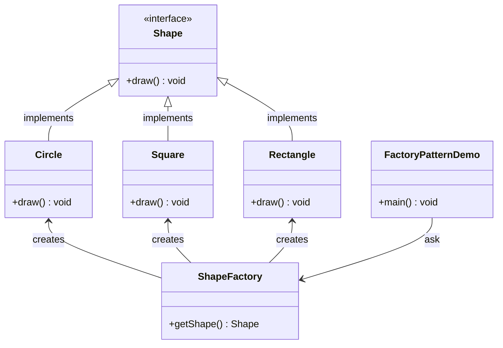
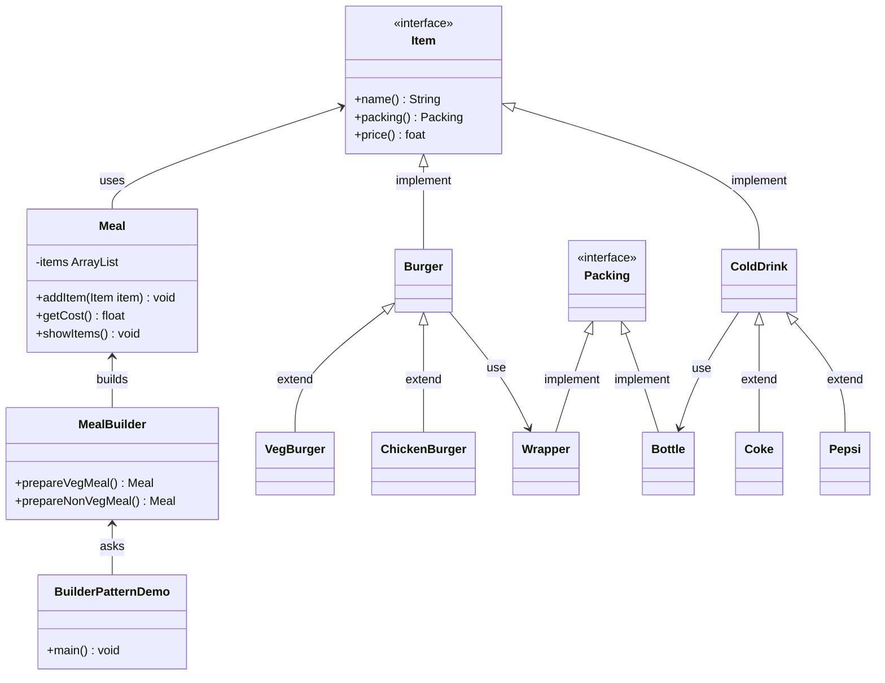
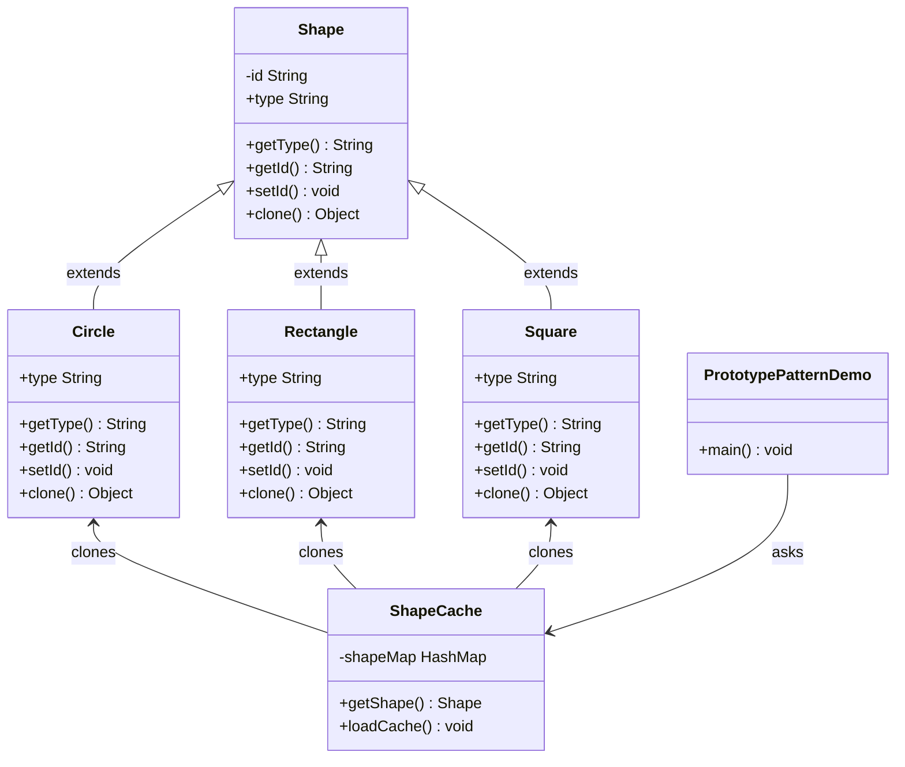
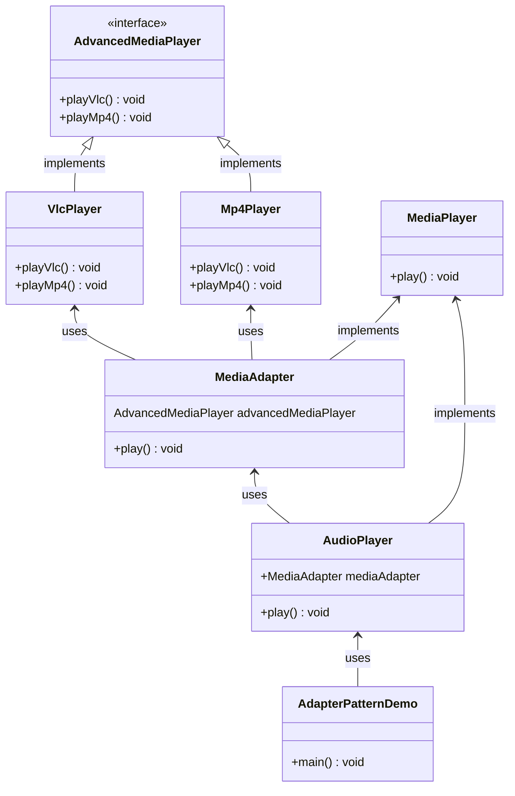
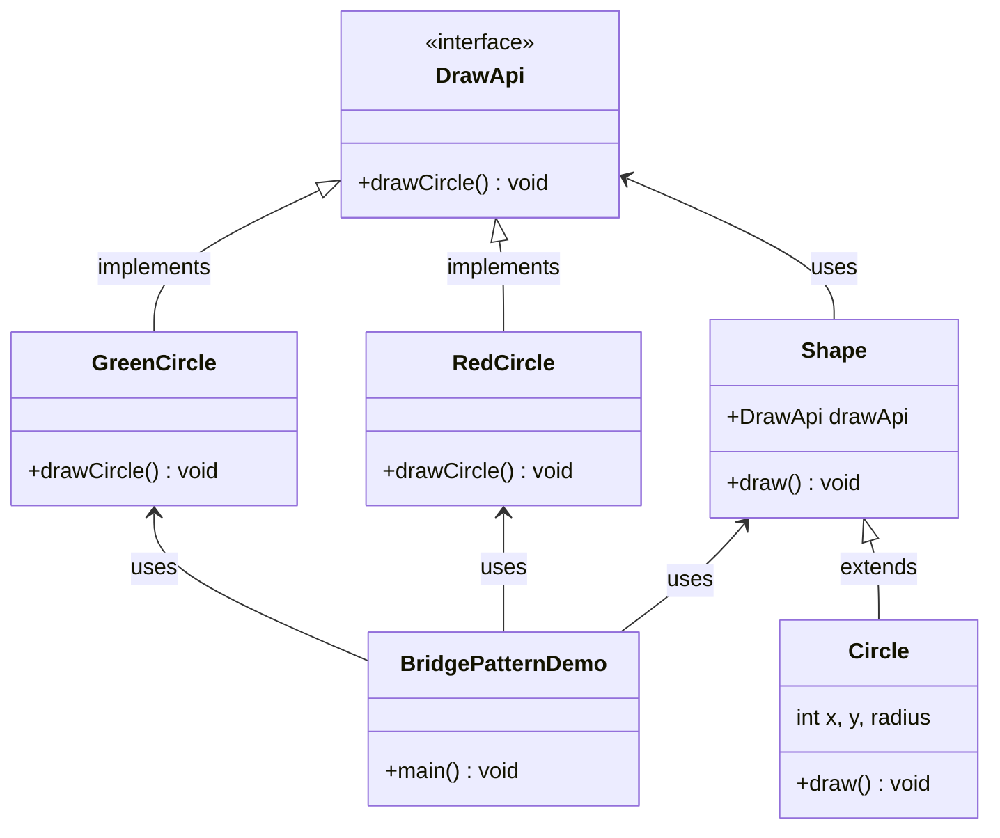
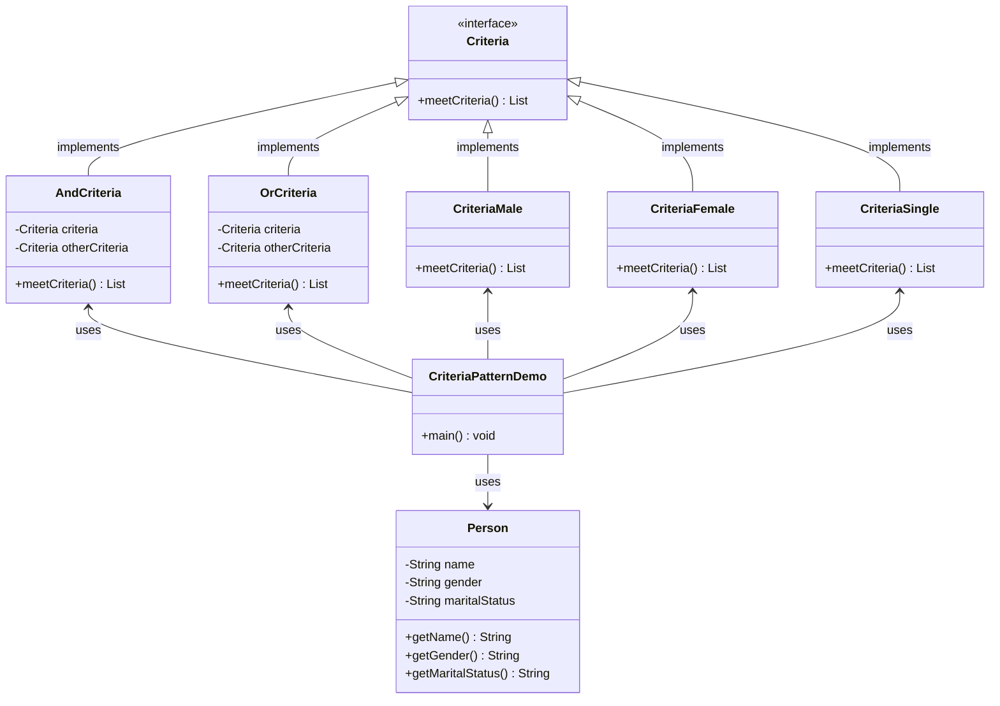
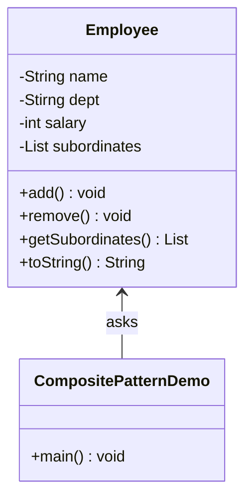
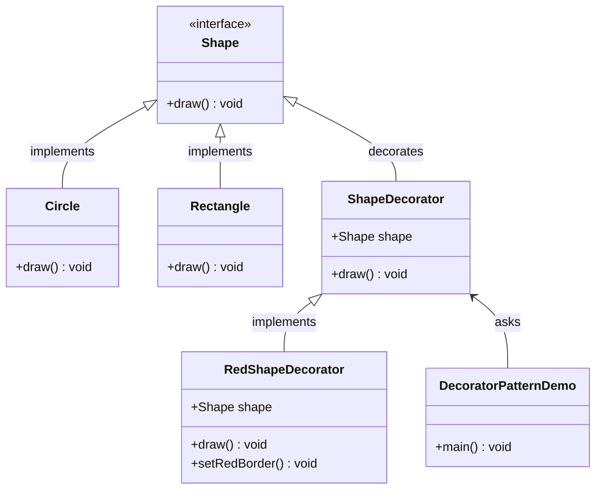
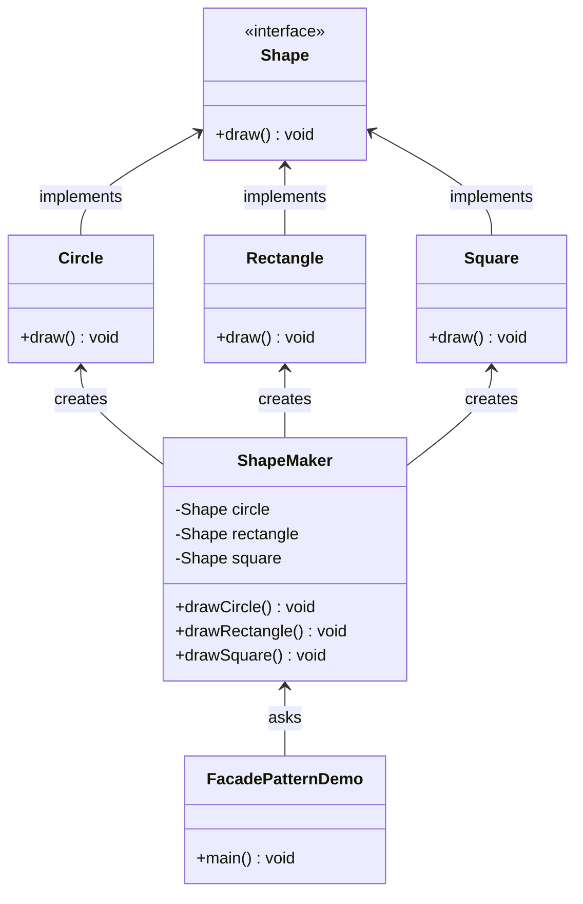
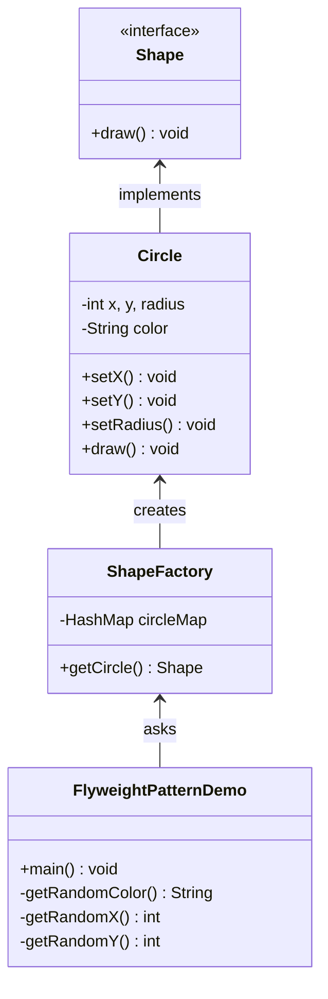

# [Design Patterns in Java Tutorial](https://www.tutorialspoint.com/design_pattern/index.htm)

- [Design Patterns in Java Tutorial](#design-patterns-in-java-tutorial)
  - [Overview](#overview)
    - [What is Gang of Four (GOF)](#what-is-gang-of-four-gof)
    - [Usage of Design Pattern](#usage-of-design-pattern)
      - [Common platform for developers](#common-platform-for-developers)
      - [Best Practices](#best-practices)
    - [Types of Design Patterns](#types-of-design-patterns)
  - [Creational Patterns](#creational-patterns)
    - [Factory Pattern](#factory-pattern)
    - [Abstract Factory Pattern](#abstract-factory-pattern)
    - [Singleton Pattern](#singleton-pattern)
    - [Builder Pattern](#builder-pattern)
    - [Prototype Pattern](#prototype-pattern)
  - [Structural pattern](#structural-pattern)
    - [Adapter Pattern](#adapter-pattern)
    - [Bridge Pattern](#bridge-pattern)
    - [Filter Pattern](#filter-pattern)
    - [Composite Pattern](#composite-pattern)
    - [Decorator Pattern](#decorator-pattern)
    - [Facade Pattern](#facade-pattern)
  - [Flyweight Pattern](#flyweight-pattern)
  - [Proxy Pattern](#proxy-pattern)

Design patterns represent the **best practices** used by experienced **object-oriented** software developers. Design patterns are solutions to general problems that software developers faced during software development. These solutions were obtained by trial and error by numerous software developers over quite a substantial period of time.

This tutorial will take you through step by step approach and examples using Java while learning Design Pattern concepts.

## Overview

### What is Gang of Four (GOF)

In 1994, four authors Erich Gamma, Richard Helm, Ralph Johnson and John Vlissides published a book titled **Design Patterns - Elements of Reusable Object-Oriented Software** which initiated the concept of Design Pattern in Software development.

These authors are collectively known as **Gang of Four (GOF)**. According to these authors design patterns are primarily based on the following principles of object orientated design.

- Program to an interface not an implementation

- Favor object composition over inheritance

### Usage of Design Pattern

Design Patterns have two main usages in software development.

#### Common platform for developers

Design patterns provide a standard terminology and are specific to particular scenario. For example, a singleton design pattern signifies use of single object so all developers familiar with single design pattern will make use of single object and they can tell each other that program is following a singleton pattern.

#### Best Practices

Design patterns have been evolved over a long period of time and they provide best solutions to certain problems faced during software development. Learning these patterns helps unexperienced developers to learn software design in an easy and faster way.

### Types of Design Patterns

As per the design pattern reference book **Design Patterns - Elements of Reusable Object-Oriented Software** , there are **23 design patterns** which can be classified in **three categories**: Creational, Structural and Behavioral patterns. We'll also discuss another category of design pattern: J2EE design patterns.

- Creational Patterns

    These design patterns provide a way to create objects while **hiding the creation logic**, rather than instantiating objects directly using new operator. This gives program more flexibility in deciding which objects need to be created for a given use case.

- Structural Patterns

    These design patterns concern class and object composition. Concept of inheritance is used to **compose interfaces** and define ways to **compose objects** to obtain new functionalities.

- Behavioral Patterns

    These design patterns are specifically concerned with **communication** between objects.

- J2EE Patterns

    These design patterns are specifically concerned with the presentation tier. These patterns are identified by Sun Java Center.

## Creational Patterns

### Factory Pattern

Factory pattern is one of the most used design patterns in Java. This type of design pattern comes under **creational pattern** as this pattern provides one of the best ways to create an object.

In Factory pattern, we create object without exposing the creation logic to the client and refer to newly created object using a **common interface**.

Implementation

We're going to create a `Shape` interface and concrete classes implementing the `Shape` interface. A factory class `ShapeFactory` is defined as a next step.

`FactoryPatternDemo`, our demo class will use `ShapeFactory` to get a `Shape` object. It will pass information (`CIRCLE` / `RECTANGLE` / `SQUARE`) to `ShapeFactory` to get the type of object it needs.



### Abstract Factory Pattern

Abstract Factory patterns work around a super-factory which **creates other factories**. This factory is also called as factory of factories. This type of design pattern comes under **creational pattern** as this pattern provides one of the best ways to create an object.

In Abstract Factory pattern an interface is responsible for **creating a factory of related objects** without explicitly specifying their classes. Each generated factory can give the objects as per the Factory pattern.

Implementation

We are going to create a `Shape` interface and a concrete class implementing it. We create an abstract factory class `AbstractFactory` as next step. Factory class `ShapeFactory` is defined, which extends `AbstractFactory`. A factory creator/generator class `FactoryProducer` is created.

`AbstractFactoryPatternDemo`, our demo class uses `FactoryProducer` to get a `AbstractFactory` object. It will pass information (`RECTANGLE` / `SQUARE` for Shape) to `AbstractFactory` to get the type of object it needs.

```mermaid
 classDiagram
    class AbstractFactory{
        <<abstract>>
        +getShape() Shape
    }
    class FactoryProducer{
        +getFactory() AbstractFactory
    }
    class AbstractFactoryPatternDemo{
        +main() void
    }
    AbstractFactory <-- FactoryProducer : uses
    FactoryProducer <-- AbstractFactoryPatternDemo : uses
    class ShapeFactory{
        +getShape() Shape
    }
    class RoundedShapeFactory{
        +getShape() Shape
    }
    AbstractFactory <|-- ShapeFactory : extends
    AbstractFactory <|-- RoundedShapeFactory : extends
    class Shape{
        <<Interface>>
        +draw() void
    }
    class Rectangle{
        +draw() void
    }
    class Square{
        +draw() void
    }
    class RoundedRectangle{
        +draw() void
    }
    class RoundedSquare{
        +draw() void
    }
    Rectangle --|> Shape : implements
    Square --|> Shape : implements
    RoundedRectangle --|> Shape : implements
    RoundedSquare --|> Shape : implements
    ShapeFactory --> Rectangle : creates
    ShapeFactory --> Square : creates
    RoundedShapeFactory --> RoundedRectangle : creates
    RoundedShapeFactory --> RoundedSquare : creates
 ```

### Singleton Pattern

Singleton pattern is one of the simplest design patterns in Java. This type of design pattern comes under **creational pattern** as this pattern provides one of the best ways to create an object.

This pattern involves a single class which is responsible to create an object while making sure that only single object gets created. This class provides a way to access its only object which can be accessed directly without need to instantiate the object of the class.

Implementation

We're going to create a `SingleObject` class. `SingleObject` class have its constructor as private and have a static instance of itself.

`SingleObject` class provides a static method to get its static instance to outside world. `SingletonPatternDemo`, our demo class will use `SingleObject` class to get a `SingleObject` object.

```mermaid
 classDiagram
    class SingletonPatternDemo{
        +main() void
    }
    class SingleObject{
        -SingleObject instance
        -SingleObject()
        +getInstance() SingleObject
        +showMessage() void
    }
    SingletonPatternDemo --> SingleObject : asks
```

### Builder Pattern

Builder pattern builds a complex object using simple objects and using a **step by step** approach. This type of design pattern comes under **creational pattern** as this pattern provides one of the best ways to create an object.

A Builder class builds the final object step by step. This builder is independent of other objects.

Implementation

We have considered a business case of fast-food restaurant where a typical meal could be a burger and a cold drink. Burger could be either a Veg Burger or Chicken Burger and will be packed by a wrapper. Cold drink could be either a coke or pepsi and will be packed in a bottle.

We are going to create an **`Item` interface** representing food `items` such as burgers and cold drinks and concrete classes implementing the `Item` interface and a **`Packing` interface** representing packaging of food items and concrete classes implementing the `Packing` interface as burger would be packed in wrapper and cold drink would be packed as bottle.

We then create a `Meal` class having `ArrayList` of `Item` and a `MealBuilder` to build different types of `Meal` objects by combining Item. `BuilderPatternDemo`, our demo class will use `MealBuilder` to build a `Meal`.



### Prototype Pattern

Prototype pattern refers to creating duplicate object while **keeping performance in mind**. This type of design pattern comes under **creational pattern** as this pattern provides one of the best ways to create an object.

This pattern involves implementing a **prototype interface** which tells to create a **clone** of the current object. This pattern is used when creation of object directly is costly. For example, an object is to be created after a costly database operation. We can cache the object, returns its clone on next request and update the database as and when needed thus reducing database calls.

Implementation

We're going to create an abstract class `Shape` and concrete classes extending the `Shape` class. A class `ShapeCache` is defined as a next step which stores shape objects in a `Hashtable` and returns their clone when requested.

`PrototypPatternDemo`, our demo class will use `ShapeCache` class to get a `Shape` object.



## Structural pattern

### Adapter Pattern

Adapter pattern works as a bridge between two incompatible interfaces. This type of design pattern comes under **structural pattern** as this pattern combines the capability of two independent interfaces.

This pattern involves a single class which is responsible to join functionalities of independent or incompatible interfaces. A real life example could be a case of card reader which acts as an adapter between memory card and a laptop. You plugin the memory card into card reader and card reader into the laptop so that memory card can be read via laptop.

We are demonstrating use of Adapter pattern via following example in which an audio player device can play mp3 files only and wants to use an advanced audio player capable of playing vlc and mp4 files.

Implementation

We have a `MediaPlayer` interface and a concrete class `AudioPlayer` implementing the `MediaPlayer` interface. `AudioPlayer` can play mp3 format audio files by default.

We are having another interface `AdvancedMediaPlayer` and concrete classes implementing the `AdvancedMediaPlayer` interface. These classes can play vlc and mp4 format files.

We want to make `AudioPlayer` to play other formats as well. To attain this, we have created an adapter class `MediaAdapter` which implements the `MediaPlayer` interface and uses `AdvancedMediaPlayer` objects to play the required format.

`AudioPlayer` uses the adapter class `MediaAdapter` passing it the desired audio type without knowing the actual class which can play the desired format. `AdapterPatternDemo`, our demo class will use `AudioPlayer` class to play various formats.



### Bridge Pattern

Bridge is used when we need to **decouple** an abstraction from its implementation so that the two can vary independently. This type of design pattern comes under **structural pattern** as this pattern decouples implementation class and abstract class by providing a bridge structure between them.

This pattern involves an interface which acts as a bridge which makes the functionality of concrete classes independent from interface implementer classes. Both types of classes can be altered structurally without affecting each other.

We are demonstrating use of Bridge pattern via following example in which a circle can be drawn in different colors using same abstract class method but different bridge implementer classes.

Implementation

We have a `DrawAPI` interface which is acting as a bridge implementer and concrete classes `RedCircle`, `GreenCircle` implementing the `DrawAPI` interface. `Shape` is an abstract class and will use object of `DrawAPI`. `BridgePatternDemo`, our demo class will use `Shape` class to draw different colored circle.



### Filter Pattern

Filter pattern or Criteria pattern is a design pattern that enables developers to filter a set of objects using different criteria and chaining them in a decoupled way through logical operations. This type of design pattern comes under **structural pattern** as this pattern combines multiple criteria to obtain single criteria.

Implementation

We're going to create a `Person` object, `Criteria` interface and concrete classes implementing this interface to filter list of `Person` objects. `CriteriaPatternDemo`, our demo class uses `Criteria` objects to filter List of `Person` objects based on various criteria and their combinations.



### Composite Pattern

Composite pattern is used where we need to treat a group of objects in similar way as a single object. Composite pattern composes objects in term of a **tree structure** to represent part as well as whole **hierarchy**. This type of design pattern comes under **structural pattern** as this pattern creates a tree structure of group of objects.

This pattern creates a class that contains group of its own objects. This class provides ways to modify its group of same objects.

We are demonstrating use of composite pattern via following example in which we will show employees hierarchy of an organization.

Implementation

We have a class `Employee` which acts as composite pattern actor class. `CompositePatternDemo`, our demo class will use `Employee` class to add department level hierarchy and print all employees.



### Decorator Pattern

Decorator pattern allows a user to add new functionality to an existing object without altering its structure. This type of design pattern comes under **structural pattern** as this pattern acts as a wrapper to existing class.

This pattern creates a decorator class which wraps the original class and provides additional functionality keeping class methods signature intact.

We are demonstrating the use of decorator pattern via following example in which we will decorate a shape with some color without alter shape class.

Implementation

We're going to create a `Shape` interface and concrete classes implementing the `Shape` interface. We will then create an abstract decorator class `ShapeDecorator` implementing the `Shape` interface and having Shape object as its instance variable.

`RedShapeDecorator` is concrete class implementing `ShapeDecorator`.

`DecoratorPatternDemo`, our demo class will use `RedShapeDecorator` to decorate `Shape` objects.



### Facade Pattern

Facade pattern hides the complexities of the system and provides an interface to the client using which the client can access the system. This type of design pattern comes under **structural pattern** as this pattern adds an interface to existing system to hide its complexities.

This pattern involves a single class which provides simplified methods required by client and delegates calls to methods of existing system classes.

Implementation

We are going to create a `Shape` interface and concrete classes implementing the `Shape` interface. A facade class `ShapeMaker` is defined as a next step.

`ShapeMaker` class uses the concrete classes to delegate user calls to these classes. `FacadePatternDemo`, our demo class, will use `ShapeMaker` class to show the results.



## Flyweight Pattern

Flyweight pattern is primarily used to reduce the number of objects created and to decrease memory footprint and increase performance. This type of design pattern comes under **structural pattern** as this pattern provides ways to decrease object count thus improving the object structure of application.

Flyweight pattern tries to reuse already existing similar kind objects by storing them and creates new object when no matching object is found. We will demonstrate this pattern by drawing 20 circles of different locations but we will create only 5 objects. Only 5 colors are available so color property is used to check already existing Circle objects.

Implementation

We are going to create a `Shape` interface and concrete class `Circle` implementing the `Shape` interface. A factory class `ShapeFactory` is defined as a next step.

`ShapeFactory` has a `HashMap` of `Circle` having key as color of the `Circle` object. Whenever a request comes to create a circle of particular color to `ShapeFactory`, it checks the circle object in its `HashMap`, if object of `Circle` found, that object is returned otherwise a new object is created, stored in hashmap for future use, and returned to client.

`FlyweightPatternDemo`, our demo class, will use `ShapeFactory` to get a `Shape` object. It will pass information (red / green / blue/ black / white) to `ShapeFactory` to get the circle of desired color it needs.




## Proxy Pattern


