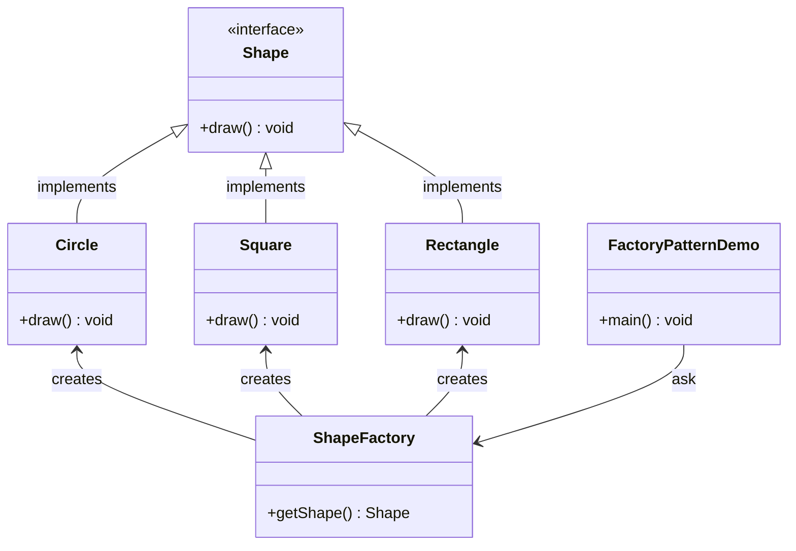

# [Design Patterns in Java Tutorial](https://www.tutorialspoint.com/design_pattern/index.htm)

- [Design Patterns in Java Tutorial](#design-patterns-in-java-tutorial)
  - [Overview](#overview)
    - [What is Gang of Four (GOF)](#what-is-gang-of-four-gof)
    - [Usage of Design Pattern](#usage-of-design-pattern)
      - [Common platform for developers](#common-platform-for-developers)
      - [Best Practices](#best-practices)
    - [Types of Design Patterns](#types-of-design-patterns)
  - [Factory Pattern](#factory-pattern)
    - [Implementation](#implementation)
  - [Abstract Factory Pattern](#abstract-factory-pattern)
    - [Implementation](#implementation-1)
  - [Singleton Pattern](#singleton-pattern)

Design patterns represent the **best practices** used by experienced **object-oriented** software developers. Design patterns are solutions to general problems that software developers faced during software development. These solutions were obtained by trial and error by numerous software developers over quite a substantial period of time.

This tutorial will take you through step by step approach and examples using Java while learning Design Pattern concepts.

## Overview

### What is Gang of Four (GOF)

In 1994, four authors Erich Gamma, Richard Helm, Ralph Johnson and John Vlissides published a book titled **Design Patterns - Elements of Reusable Object-Oriented Software** which initiated the concept of Design Pattern in Software development.

These authors are collectively known as **Gang of Four (GOF)**. According to these authors design patterns are primarily based on the following principles of object orientated design.

- Program to an interface not an implementation

- Favor object composition over inheritance

### Usage of Design Pattern

Design Patterns have two main usages in software development.

#### Common platform for developers

Design patterns provide a standard terminology and are specific to particular scenario. For example, a singleton design pattern signifies use of single object so all developers familiar with single design pattern will make use of single object and they can tell each other that program is following a singleton pattern.

#### Best Practices

Design patterns have been evolved over a long period of time and they provide best solutions to certain problems faced during software development. Learning these patterns helps unexperienced developers to learn software design in an easy and faster way.

### Types of Design Patterns

As per the design pattern reference book **Design Patterns - Elements of Reusable Object-Oriented Software** , there are **23 design patterns** which can be classified in **three categories**: Creational, Structural and Behavioral patterns. We'll also discuss another category of design pattern: J2EE design patterns.

- Creational Patterns

    These design patterns provide a way to create objects while **hiding the creation logic**, rather than instantiating objects directly using new operator. This gives program more flexibility in deciding which objects need to be created for a given use case.

- Structural Patterns

    These design patterns concern class and object composition. Concept of inheritance is used to **compose interfaces** and define ways to **compose objects** to obtain new functionalities.

- Behavioral Patterns

    These design patterns are specifically concerned with **communication** between objects.

- J2EE Patterns

    These design patterns are specifically concerned with the presentation tier. These patterns are identified by Sun Java Center.

## Factory Pattern

Factory pattern is one of the most used design patterns in Java. This type of design pattern comes under **creational pattern** as this pattern provides one of the best ways to create an object.

In Factory pattern, we create object without exposing the creation logic to the client and refer to newly created object using a **common interface**.

### Implementation

We're going to create a `Shape` interface and concrete classes implementing the `Shape` interface. A factory class `ShapeFactory` is defined as a next step.

`FactoryPatternDemo`, our demo class will use `ShapeFactory` to get a `Shape` object. It will pass information (`CIRCLE` / `RECTANGLE` / `SQUARE`) to `ShapeFactory` to get the type of object it needs.



## Abstract Factory Pattern

Abstract Factory patterns work around a super-factory which **creates other factories**. This factory is also called as factory of factories. This type of design pattern comes under **creational pattern** as this pattern provides one of the best ways to create an object.

In Abstract Factory pattern an interface is responsible for **creating a factory of related objects** without explicitly specifying their classes. Each generated factory can give the objects as per the Factory pattern.

### Implementation

We are going to create a `Shape` interface and a concrete class implementing it. We create an abstract factory class `AbstractFactory` as next step. Factory class `ShapeFactory` is defined, which extends `AbstractFactory`. A factory creator/generator class `FactoryProducer` is created.

`AbstractFactoryPatternDemo`, our demo class uses `FactoryProducer` to get a `AbstractFactory` object. It will pass information (`RECTANGLE` / `SQUARE` for Shape) to `AbstractFactory` to get the type of object it needs.

```mermaid
 classDiagram
    class AbstractFactory{
        <<abstract>>
        +getShape() Shape
    }
    class FactoryProducer{
        +getFactory() AbstractFactory
    }
    class AbstractFactoryPatternDemo{
        +main() void
    }
    AbstractFactory <-- FactoryProducer : uses
    FactoryProducer <-- AbstractFactoryPatternDemo : uses
    class ShapeFactory{
        +getShape() Shape
    }
    class RoundedShapeFactory{
        +getShape() Shape
    }
    AbstractFactory <|-- ShapeFactory : extends
    AbstractFactory <|-- RoundedShapeFactory : extends
    class Shape{
        <<Interface>>
        +draw() void
    }
    class Rectangle{
        +draw() void
    }
    class Square{
        +draw() void
    }
    class RoundedRectangle{
        +draw() void
    }
    class RoundedSquare{
        +draw() void
    }
    Rectangle --|> Shape : implements
    Square --|> Shape : implements
    RoundedRectangle --|> Shape : implements
    RoundedSquare --|> Shape : implements
    ShapeFactory --> Rectangle : creates
    ShapeFactory --> Square : creates
    RoundedShapeFactory --> RoundedRectangle : creates
    RoundedShapeFactory --> RoundedSquare : creates
 ```

## Singleton Pattern
