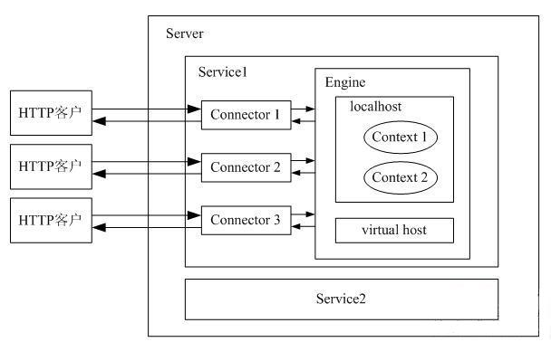

# [Servlet、Servlet容器等内容讲解](https://www.cnblogs.com/wjlwo2ni/p/10825835.html)

- [Servlet、Servlet容器等内容讲解](#servletservlet容器等内容讲解)
  - [Web技术](#web技术)
  - [servlet与servlet容器](#servlet与servlet容器)
  - [servlet容器能提供什么？](#servlet容器能提供什么)
  - [用与CGI程序相比，Servlet具有以下优点：](#用与cgi程序相比servlet具有以下优点)
  - [Servlet容器的分类](#servlet容器的分类)
  - [Tomcat](#tomcat)
  - [Tomcat的安装与配置](#tomcat的安装与配置)
  - [Tomcat的目录结构](#tomcat的目录结构)
  - [运行Tomcat](#运行tomcat)
    - [Tomcat启动分析](#tomcat启动分析)
    - [Tomcat的体系结构](#tomcat的体系结构)
  - [Tomcat的管理程序](#tomcat的管理程序)

## Web技术

随着互联网技术的发展，基于HTTP和HTML的web应用急速增长。早期的web应用主要用于浏览新闻等静态页面，用户通过HTTP协议请求服务器上的静态页面，服务器上的web服务器软件接收到请求后，读取URI标示的资源，再加上消息报头发送给客户端浏览器，浏览器负责解析HTML，将结果呈现出来。

然而随着时间发展，用户已经不满足于仅浏览静态页面。用户需要一些交互操作，获取一些动态结果。如果基于HTTP协议实现服务器端软件增强功能太过复杂，所以需要一些扩展机制来实现用户想要的功能。早期使用的Web服务器扩展机制是CGI（Common Gateway Interface，公共网关接口）。使用这种方法，用户单击某个链接或输入网址来访问CGI程序，web服务器收到请求后，运行该CGI程序，对用户请 求进行处理，紧接着将处理结果并产生一个响应，该响应被返回给web服务器，web服务器对响应进行包装，以HTTP响应的方式返回给浏览器。

CGI程序在一定程度上解决了用户需求。不过还存在一些不足之处，如CGI程序编写困难，响应时间较长，以进程方式运行导致性能受限。于是1997年，sun公司推出了Servlet技术，作为java阵营的CGI解决方案。

## servlet与servlet容器

Java Servlet（**Java服务器小程序**）是一个基于Java技术的Web组件，运行在服务器端，它**由Servlet容器所管理**，用于生成动态的内容。Servlet是平台独立的Java类，编写一个Servlet，实际上就是按照Servlet规范编写一个Java类。Servlet被编译为平台独立的字节码，**可以被动态地加载**到支持Java技术的Web服务器中运行。

**Servlet容器也叫做Servlet引擎**，是Web服务器或应用程序服务器的一部分，用于在发送的请求和响应之上提供网络服务，解码基于MIME的请求，格式化基于MIME的响应。Servlet没有main方法，不能独立运行，它必须被部署到Servlet容器中，由容器来实例化和调用Servlet的方法（如doGet()和doPost()），Servlet容器在Servlet的生命周期内包容和管理Servlet。**在JSP技术 推出后，管理和运行Servlet/JSP的容器也称为Web容器**。

（注：常用的MIME类型：text/html，application/pdf，video/quicktime，application /java，image/jpeg，application/jar，application/octet-stream，application/x-zip）

有了servlet之后，用户通过单击某个链接或者直接在浏览器的地址栏中输入URL来访问Servlet，Web服务器接收到该请求后，并不是将请求直接交给Servlet，而是交给Servlet容器。**Servlet容器实例化Servlet**，调用Servlet的一个特定方法对请求进行处理，并产生一个响应。这个**响应由Servlet容器返回给Web服务器**，**Web服务器包装这个响应**，以HTTP响应的形式发送给Web浏览器。

## servlet容器能提供什么？

我们知道需要由servlet容器来管理和运行servlet，但是为什么要这样做呢？使用servlet容器的原因有：

- 通信支持：利用容器提供的方法，你能轻松的**让servlet与web服务器对话**，而不用自己建立serversocket、监听某个端口、创建流等等。容器知道自己与web服务器之间的协议，所以你的servlet不用担心web服务器（如Apache）和你自己的web代码之间的API，只需要考虑如何在servlet中实现业务逻辑（如处理一个订单）。

- 生命周期管理：servlet容器控制着servlet的生与死，它负责加载类、实例化和初始化servlet，调用servlet方法，以及使servlet实例被垃圾回收，有了servlet容器，你不需要太多的考虑资源管理。

- 多线程支持：容器会自动**为它所接收的每个servlet请求创建一个新的java线程**。针对用户的请求，如果servlet已经运行完相应的http服务方法，这个线程就会结束。这并不是说你不需要考虑线程安全性，其实你还会遇到同步问题，不过这样能使你少做很多工作。

- 声明方式实现安全：利用servlet容器，你可以使用xml部署描述文件来配置和修改安全性，而不必将其硬编码写到servlet类代码中。

- JSP支持：servlet容器负责将jsp代码翻译为真正的java代码。

## 用与CGI程序相比，Servlet具有以下优点：

- Servlet是单实例多线程的运行方式，每个请求在一个独立的线程中运行，而**提供服务的Servlet实例只有一个**。

- Servlet具有可升级性，能响应更多的请求，因为Servlet容器使用一个线程而不是操作系统进程，而线程仅占用有限的系统资源。

- Servlet使用标准的API，被更多的Web服务器所支持。

- Servlet使用Java语言编写，因此拥有Java程序语言的所有优点，包括容易开发和平台独立性。

- Servlet可以访问Java平台丰富的类库，使得各种应用的开发更为容易。

- Servlet容器给Servlet提供额外的功能，如错误处理和安全。

## Servlet容器的分类

根据Servlet容器工作模式的不同，可以将Servlet容器分为以下三类：

1. 独立的Servlet容器

   当我们使用基于Java技术的Web服务器时，Servlet容器作为构成Web服务器的一部分而存在。然而大多数的Web服务器并非基于Java，因此，就有了下面两种Servlet容器的工作模式。

2. 进程内的Servlet容器

   Servlet容器由Web服务器插件和Java容器两部分的实现组成。Web服务器插件在某个Web服务器**内部地址空间中打开一个 JVM（Java虚拟机）**，使得Java容器可以在此JVM中加载并运行Servlet。如有客户端调用Servlet的请求到来，插件取得对此请求的控制并将它传递（使用JNI技术）给Java容器，然后由Java容器将此请求交由Servlet进行处理。进程内的Servlet容器对于单进程、多线程的服务器非常适合，提供了较高的运行速度，但伸缩性有所不足。

3. 进程外的Servlet容器

   Servlet容器运行于Web服务器之外的地址空间，它也是由Web服务器插件和Java容器两部分的实现组成的。Web服务器插件和Java容器（在外部JVM中运行）使用IPC机制（通常是TCP/IP）进行通信。当一个调用Servlet的请求到达时，插件取得对此请求的控制并将其传递（使用IPC机制）给Java容器。进程外Servlet容器对客户请求的响应速度不如进程内的Servlet容器，但进程外容器具有更好的伸缩性和稳定性。

## Tomcat

学习Servlet技术，就需要有一个Servlet运行环境，也就是需要有一个Servlet容器，本文用的是Tomcat。

**Tomcat是一个免费的开放源代码的Servlet容器**，它是Apache软件基金会（Apache Software Foundation）的一个顶级项目，由Apache、Sun和其他一些公司及个人共同开发而成。由于有了Sun的参与和支持，最新的Servlet和JSP规范总是能在Tomcat中得到体现，Tomcat 6支持最新的Servlet 2.5和JSP 2.1规范。因为Tomcat技术先进、性能稳定，而且免费，因而深受Java爱好者的喜爱，并得到了部分软件开发商的认可，成为**目前比较流行的Web服务器**。

Tomcat和IIS、Apache等Web服务器一样，具有处理HTML页面的功能，另外它还是一个Servlet和JSP容器，独立的Servlet容器是Tomcat的默认模式。不过，Tomcat处理静态HTML的能力不如Apache，我们可以将Apache和Tomcat集成在一起使用，Apache作为HTTP Web服务器，Tomcat作为Web容器。

Tomcat服务器接受客户请求并做出响应的过程如下：

1. 客户端（通常都是浏览器）访问Web服务器，发送HTTP请求。
2. Web服务器接收到请求后，传递给Servlet容器。
3. Servlet容器加载Servlet，产生Servlet实例后，向其传递表示请求和响应的对象。
4. Servlet实例使用请求对象得到客户端的请求信息，然后进行相应的处理。
5. Servlet实例将处理结果通过响应对象发送回客户端，容器负责确保响应正确送出，同时将控制返回给Web服务器。

## Tomcat的安装与配置

安装Tomcat之前要先安装JDK。JDK的下载与配置网上教程很多，可百度或谷歌。要下载Tomcat，首先访问Tomcat项目的网址：<http://tomcat.apache.org/>，选择要下载的Tomcat版本。

对于Windows操作系统，Tomcat提供了可执行的安装程序的下载，即“Windows Service Installer”链接。通过安装程序安装Tomcat，将把Tomcat安装为Windows的服务。不过建议下载zip压缩包，通过解压缩的方式来安装Tomcat，因为解压缩的方式也适用于其他的操作系统（如Linux系统），并且更容易与其他的开发环境集成。对于初学者来说，也能更好地学习Tomcat的启动过程。

下载完成后，使用WinZip或WinRAR等解压缩工具将压缩包解压缩到指定的目录中。然后在PATH环境变量中添加Tomcat的文件夹下bin文件夹的目录，如D:\apache-tomcat-版本\bin即可。本文使用的是截止本文撰写时的最新版本apache-tomcat-7.0.33。

## Tomcat的目录结构

各目录的用途如表1所示。

--
|||
|-|-|
目录|用途
/bin|存放启动和关闭Tomcat的脚本文件
/conf|存放Tomcat服务器的各种配置文件，其中包括server.xml（Tomcat的主要配置文件）、tomcat-users.xml和web.xml等配置文件
/lib|存放Tomcat服务器和所有Web应用程序需要访问的JAR文件
/logs|存放Tomcat的日志文件
/temp|存放Tomcat运行时产生的临时文件
/webapps|当发布Web应用程序时，通常把Web应用程序的目录及文件放到这个目录下
/work|Tomcat将JSP生成的Servlet源文件和字节码文件放到这个目录下
|||

表1  Tomcat的目录结构及其用途

---

从表1中可以看到，lib目录下存放的JAR文件可以被所有的Web应用程序所访问，如果多个Web应用程序需要访问相同的JAR文件，那么可以将这些JAR文件放到**Tomcat的lib目录**下。此外，对于后面将要介绍的Java Web应用程序，在它的WEB-INF目录下，也可以建立**lib子目录**，在lib子目录下可以存放各种JAR文件，这些JAR文件只能被当前Web应用程序所访问。

## 运行Tomcat

...

### Tomcat启动分析

...

### Tomcat的体系结构

Tomcat服务器是由一系列可配置的组件构成的，其中**核心组件是Catalina Servlet容器**，它是所有其他Tomcat组件的顶层容器。我们可以通过查看Tomcat安装文件夹下的conf文件夹中的server.xml文件来了解Tomcat各组件之间的层次关系。由于server.xml注释太多，特简化如下：

    <?xml version='1.0' encoding='utf-8'?>  
    <Server port="8005" shutdown="SHUTDOWN">  
        <Service name="Catalina">  
            <Connector port="8080" protocol="HTTP/1.1" connectionTimeout="20000" redirectPort="8443" URIEncoding="UTF-8"/>  
            <Engine name="Catalina" defaultHost="localhost">  
                <Host name="localhost">  
                    <Context path="" docBase="WORKDIR" reloadable="true"/>  
                </Host>  
            </Engine>  
        </Service>  
    </Server>  

其中WORKDIR为你想要导入的项目路径。我们下面简单介绍一下各组件在Tomcat服务器中的作用。

1. Server

   Server表示整个的Catalina Servlet容器。Tomcat提供了Server接口的一个默认实现，这通常不需要用户自己去实现。在Server容器中，可以包含一个或多个Service组件。

2. Service

   Service是存活在Server内部的中间组件，它**将一个或多个连接器（Connector）组件绑定到一个单独的引擎（Engine）上**。在Server中，可以**包含一个或多个Service组件**。Service也很少由用户定制，Tomcat提供了Service接口的默认实现，而这种实现既简单又能满足应用。

3. Connector

   连接器（Connector）处理与客户端的通信，它负责接收客户请求，以及向客户返回响应结果。在Tomcat中，有多个连接器可以使用。

4. Engine

   在Tomcat中，**每个Service只能包含一个Servlet引擎（Engine）**。引擎表示一个特定的Service的**请求处理流水线**。作为一个Service可以有多个连接器，引擎从连接器接收和处理所有的请求，将响应返回给适合的连接器，通过连接器传输给用户。用户允许通过实现Engine接口提供自定义的引擎，但通常不需要这么做。

5. Host

   Host表示一个虚拟主机，**一个引擎可以包含多个Host**。用户通常不需要创建自定义的Host，因为Tomcat给出的Host接口的实现（类StandardHost）提供了重要的附加功能。

6. Context

   一个Context表示了一个Web应用程序，**运行在特定的虚拟主机中**。什么是Web应用程序呢？在Sun公司发布的Java Servlet规范中，对Web应用程序做出了如下的定义：“一个Web应用程序是由一组Servlet、HTML页面、类，以及其他的资源组成的运行在Web服务器上的完整的应用程序。它可以在多个供应商提供的实现了Servlet规范的Web容器中运行”。**一个Host可以包含多个Context（代表Web应用程序）**，每一个Context都有一个**唯一的路径**。用户通常不需要创建自定义的Context，因为Tomcat给出的Context接口的实现（类StandardContext）提供了重要的附加功能。

有关server.xml各部分的具体信息会在另一篇文章中论述。Tomcat各组件的工作流程如图7所示。

---

图7 Tomcat各组件的工作流程图

---

## Tomcat的管理程序

Tomcat提供了一个管理程序：manager，用于管理部署到Tomcat服务器中的Web应用程序。manager Web应用程序包含在Tomcat的安装包中。要访问manager Web应用程序，需要添加具有管理员权限的账号，编辑%CATALINA_HOME%\conf\tomcat-users.xml文件，在`<tomcat-users>`元素中添加manager角色，以及属于该角色的用户名和密码，如下所示。

    <?xml version='1.0' encoding='utf-8'?>
    <tomcat-users>
      <role rolename="manager-gui"/>
      <user username="tomcat" password="tomcat" roles="manager-gui"/>
    </tomcat-users>

注：用户名和密码可以自己设置，但角色名只能是manager-gui，不是一些资料提及的manager。
启动Tomcat服务器，打开浏览器，在地址栏中输入：http://localhost:8080/，将出现如图14所示的页面。单击“Manager App”链接，访问manager Web应用，将看到如图8所示的登录界面。
