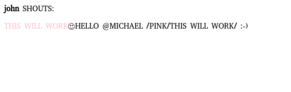
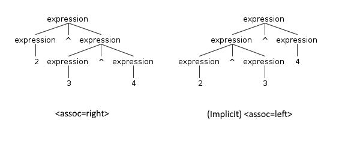

# [The ANTLR Mega Tutorial](https://tomassetti.me/antlr-mega-tutorial/)

- [The ANTLR Mega Tutorial](#the-antlr-mega-tutorial)
  - [What is ANTLR?](#what-is-antlr)
  - [Are not Regular Expressions Enough?](#are-not-regular-expressions-enough)
  - [ANTLR vs Writing Your Own Parser by Hand](#antlr-vs-writing-your-own-parser-by-hand)
  - [Table of Contents](#table-of-contents)
  - [Setup](#setup)
    - [1. Setup ANTLR](#1-setup-antlr)
      - [Instructions](#instructions)
        - [Executing the instructions on Linux/Mac OS](#executing-the-instructions-on-linuxmac-os)
        - [Executing the instructions on Windows](#executing-the-instructions-on-windows)
      - [Typical Workflow](#typical-workflow)
    - [2. Javascript Setup](#2-javascript-setup)
    - [3. Python Setup](#3-python-setup)
    - [4. Java Setup](#4-java-setup)
      - [4.1 Java Setup Using Gradle](#41-java-setup-using-gradle)
      - [4.2 Java Setup Using Maven](#42-java-setup-using-maven)
    - [5. C# Setup](#5-c-setup)
  - [Beginner](#beginner)
    - [6. Lexers and Parsers](#6-lexers-and-parsers)
    - [7. Creating a Grammar](#7-creating-a-grammar)
      - [Top-down approach](#top-down-approach)
      - [Bottom-up approach](#bottom-up-approach)
    - [8. Designing a Data Format](#8-designing-a-data-format)
    - [9. Lexer Rules](#9-lexer-rules)
    - [10. Parser Rules](#10-parser-rules)
    - [11. Mistakes and Adjustments](#11-mistakes-and-adjustments)
  - [Mid-Level](#mid-level)
    - [12. Setting Up the Chat Project with Javascript](#12-setting-up-the-chat-project-with-javascript)
    - [13. Antlr.js](#13-antlrjs)
    - [14. HtmlChatListener.js](#14-htmlchatlistenerjs)
    - [15. Working with a Listener](#15-working-with-a-listener)
    - [16. Solving Ambiguities with Semantic Predicates](#16-solving-ambiguities-with-semantic-predicates)
    - [17. Continuing the Chat in Python](#17-continuing-the-chat-in-python)
    - [18. The Python Way of Working with a Listener](#18-the-python-way-of-working-with-a-listener)
    - [19. Testing with Python](#19-testing-with-python)
    - [20. Parsing Markup](#20-parsing-markup)
    - [21. Lexical Modes](#21-lexical-modes)
    - [22. Parser Grammars](#22-parser-grammars)
  - [Advanced](#advanced)
    - [23. The Markup Project in Java](#23-the-markup-project-in-java)
    - [24. The Main App.java](#24-the-main-appjava)
    - [25. Transforming Code with ANTLR](#25-transforming-code-with-antlr)
    - [26. Joy and Pain of Transforming Code](#26-joy-and-pain-of-transforming-code)
    - [27. Advanced Testing](#27-advanced-testing)
    - [28. Dealing with Expressions](#28-dealing-with-expressions)
    - [29. Parsing Spreadsheets](#29-parsing-spreadsheets)
    - [30. The Spreadsheet Project in C\](#30-the-spreadsheet-project-in-c)
    - [31. Excel is Doomed](#31-excel-is-doomed)
    - [32. Testing Everything](#32-testing-everything)
  - [Final Remarks](#final-remarks)
    - [33. Tips and Tricks](#33-tips-and-tricks)
      - [Catchall Rule](#catchall-rule)
      - [Channels](#channels)
      - [Rule Element Labels](#rule-element-labels)
      - [Problematic Tokens](#problematic-tokens)
    - [34. Conclusions](#34-conclusions)

Parsers are powerful tools, and using ANTLR you could write all sort of parsers, usable from many different languages.

In this complete tutorial we are going to:

- explain the basics: what a parser is, what it can be used for
- see how to setup ANTLR to be used from Javascript, Python, Java and C#
- discuss how to test your parser
- present the most advanced and useful features present in ANTLR: you will learn all you need to parse all possible languages
- show tons of examples

Maybe you have read some tutorial that was too complicated or so partial that seemed to assume that you already knew how to use a parser. This is not that kind of tutorial. We just expect you to know how to code and how to use a text editor or an IDE. That’s it.

At the end of this tutorial:

- you will be able to write a parser to recognize different formats and languages
- you will be able to create all the rules you need to build a lexer and a parser
- you will know how to deal with the common problems you will encounter
- you will understand errors and you will know how to avoid them by testing your grammar.

In other words, we will start from the very beginning and when we reach the end you will have learned all you could possibly need to learn about ANTLR.

## What is ANTLR?

ANTLR is a **parser generator**, a tool that helps you to create parsers. A parser takes a piece of text and transforms it in an organized structure, such as an Abstract Syntax Tree (AST). You can think of the AST as a story describing the content of the code, or also as its logical representation, created by putting together the various pieces.

What you need to do to get an AST:

- define a lexer and parser grammar

- invoke ANTLR: it will generate a lexer and a parser in your target language (e.g., Java, Python, C#, Javascript)

- use the generated lexer and parser: you invoke them passing the code to recognize and they return to you an AST

So you need to start by defining a lexer and parser grammar for the thing that you are analyzing. Usually the “thing” is a language, but it could also be a data format, a diagram, or any kind of structure that is represented with text.

## Are not Regular Expressions Enough?

If you are the typical programmer, you may ask yourself why can’t I use a regular expression? A regular expression is quite useful, such as when you want to find a number in a string of text, but it also has many limitations.

The most obvious is the lack of recursion: you can’t find a (regular) expression inside another one, unless you code it by hand for each level. Something that quickly became unmaintainable. But the larger problem is that it’s not really scalable: if you are going to put together even just a few regular expressions, you are going to create a fragile mess that would be hard to maintain.

> It’s not that easy to use regular expressions

Have you ever tried parsing HTML with a regular expression? It’s a terrible idea, for one you risk summoning [Cthulhu](https://stackoverflow.com/questions/1732348/regex-match-open-tags-except-xhtml-self-contained-tags/), but more importantly it doesn’t really work. You don’t believe me? Let’s see, you want to find the elements of a table, so you try a regular expression like this one: `<table>(.*?)</table>`. Brilliant! You did it! Except somebody adds attributes to their table, such as style or id. It doesn’t matter, you do this `<table.*?>(.*?)</table>`, but you actually cared about the data inside the table, so you then need to parse tr and td, but they are full of tags.

So you need to eliminate that, too. And somebody dares even to use comments like <!— my comment &gtl—>. Comments can be used everywhere, and that is not easy to treat with your regular expression. Is it?

So you forbid the internet to use comments in HTML: problem solved.

Or alternatively you use ANTLR, whatever seems simpler to you.

## ANTLR vs Writing Your Own Parser by Hand

Okay, you are convinced, you need a parser, but why to use a parser generator like ANTLR instead of building your own?

> The main advantage of ANTLR is productivity

If you actually have to work with a parser all the time, because your language, or format, is evolving, you need to be able to keep the pace, something you can’t do if you have to deal with the details of implementing a parser. Since you are not parsing for parsing’s sake, you must have the chance to concentrate on accomplishing your goals. And ANTLR makes it much easier to do that, rapidly and cleanly.

As second thing, once you defined your grammars you can ask ANTLR to generate multiple parsers in different languages. For example, you can get a parser in C# and one in Javascript to parse the same language in a desktop application and in a web application.

Some people argue that writing a parser by hand you can make it faster and you can produce better error messages. There is some truth in this, but in my experience parsers generated by ANTLR are always fast enough. You can tweak them and improve both performance and error handling by working on your grammar, if you really need to. And you can do that once you are happy with your grammar.

## Table of Contents

Two small notes:

- in the [companion repository of this tutorial](https://github.com/gabriele-tomassetti/antlr-mega-tutorial) you are going to find all the code with testing, even where we don’t see it in the article

- the examples will be in different languages, but the knowledge would be generally applicable to any language

## Setup

In this section we prepare our development environment to work with ANTLR: the parser generator tool, the supporting tools and the runtimes for each language.

### 1. Setup ANTLR

ANTLR is actually made up of two main parts: the tool, used to generate the lexer and parser, and the runtime, needed to run them.

The tool will be needed just by you, the language engineer, while the runtime will be included in the final software using your language.

The tool is always the same no matter which language you are targeting: it’s a Java program that you need on your development machine. While **the runtime is different for every language** and must be available both to the developer and to the user.

The only requirement for the tool is that you have installed at least Java 1.7. To install the Java program, you need to download the latest version from the official site, which at the moment is:

    http://www.antlr.org/download/antlr-4.7.2-complete.jar

#### Instructions

1. copy the downloaded tool where you usually put third-party java libraries (ex. `/usr/local/lib` or `C:Program FilesJavalibs`)

2. add the tool to your `CLASSPATH`. Add it to your startup script (ex. `.bash_profile`)

3. (optional) add also aliases to your startup script to simplify the usage of ANTLR

##### Executing the instructions on Linux/Mac OS

    # 1.
    sudo cp antlr-4.7.2-complete.jar /usr/local/lib/
    # 2. and 3.
    # add this to your .bash_profile
    export CLASSPATH = ".:/usr/local/lib/antlr-4.7.2-complete.jar:$CLASSPATH"
    # simplify the use of the tool to generate lexer and parser
    alias antlr4='java -Xmx500M -cp "/usr/local/lib/antlr-4.7.2-complete.jar:$CLASSPATH" org.antlr.v4.Tool'
    # simplify the use of the tool to test the generated code
    alias grun='java org.antlr.v4.gui.TestRig'

##### Executing the instructions on Windows

    // 1. Copy antlr-4.7.2-complete.jar in C:Program FilesJavalibs (or wherever you prefer)
    // 2. Append the location of ANTLR to the CLASSPATH variable on your system, or create a CLASSPATH variable if you have not done so before
    // you can do to that by pressing WIN + R and typing sysdm.cpl, then selecting Advanced (tab) > Environment variables > System Variables
    // CLASSPATH -> .;C:Program FilesJavalibsantlr-4.7.2-complete.jar;%CLASSPATH%
    // 3. Add aliases
    // create antlr4.bat  
    java org.antlr.v4.Tool %* 
    // create grun.bat  
    java org.antlr.v4.gui.TestRig %*
    // put them in the system PATH or any of the directories included in your PATH

#### Typical Workflow

When you use ANTLR you start by **writing a grammar**, a file with extension `.g4` which contains the rules of the language that you are analyzing. You then use the antlr4 program to generate the files that your program will actually use, such as the lexer and the parser.

    antlr4 <options> <grammar-file-g4>

There are a couple of important options you can specify when running `antlr4`.

First, you can specify the target language, to **generate a parser** in Python or JavaScript or any other target different from Java (which is the default one). The other ones are used to **generate visitor and listener** (don’t worry if you don’t know what these are, we are going to explain it later).

By default only the listener is generated, so to create the visitor you use the `-visitor` command line option, and `-no-listener` if you don’t want to generate the listener. There are also the opposite options, `-no-visitor` and `-listener`, but they are the default values.

    antlr4 -visitor <Grammar-file>

You can optionally test your grammar using a little utility named `TestRig` (although, as we have seen, it’s usually aliased to `grun`).

    grun <grammar-name> <rule-to-test> <input-filename(s)>

The filename(s) are optional and you can instead analyze the input that you type on the console.

If you want to use the testing tool, you need to generate a Java parser, even if your program is written in another language. This can be done just by selecting a different option with `antlr4`.

`Grun` is useful when testing manually the first draft of your grammar. As it becomes more stable, you may want to relay on automated tests (we will see how to write them).

`Grun` also has a few useful options: `-tokens`, to show the tokens detected,  `-gui` to generate an image of the AST.

### 2. Javascript Setup

...

### 3. Python Setup

When you have a grammar, you put that in the same folder as your Python files. The file must have the same name of the grammar, which must be declared at the top of the file. In the following example the name is `Chat` and the file is `Chat.g4`.

We can create the corresponding Python parser simply by specifying the correct option with the ANTLR4 Java program. For Python, you also need to pay attention to the version of Python, 2 or 3.

    antlr4 -Dlanguage=Python3 Chat.g4

The runtime is available from PyPi so you just can install it using pip.

    pip install antlr4-python3-runtime

Again, you just have to remember to specify the proper python version.

### 4. Java Setup

To setup our Java project using ANTLR you can do things manually. Or you can be a civilized person and use Gradle or Maven.

Also, you can look in ANTLR plugins for your IDE.

#### 4.1 Java Setup Using Gradle

This is how I typically setup my Gradle project.

I use a Gradle plugin to invoke ANTLR. Since I use IntellJ IDEA, I also use the IDEA plugin to generate the correct configuration for that IDE.

    apply plugin: 'antlr'
    dependencies {
      antlr "org.antlr:antlr4:4.7.2"
      compile "org.antlr:antlr4-runtime:4.7.2"
      testCompile 'junit:junit:4.12'
    }
    generateGrammarSource {
        maxHeapSize = "64m"
        arguments += ['-package', 'me.tomassetti.examples.MarkupParser']
        outputDirectory = new File("generated-src/antlr/main/me/tomassetti/examples/MarkupParser".toString())
    }
    compileJava.dependsOn generateGrammarSource
    sourceSets {
        generated {
            java.srcDir 'generated-src/antlr/main/'
        }
    }
    compileJava.source sourceSets.generated.java, sourceSets.main.java
    clean{
        delete "generated-src"
    }
    idea {
        module {
            sourceDirs += file("generated-src/antlr/main")
        }
    }

I put my grammars under `src/main/antlr/`. Thanks to our configuration gradle makes sure that the lexer and parser are generated in the directory corresponding to their package. For example, if I want the parser to be in the `package me.tomassetti.mylanguage` it will be generated into `generated-src/antlr/main/me/tomassetti/mylanguage`.

At this point I can simply run:

    # Linux/Mac
    ./gradlew generateGrammarSource
    # Windows
    gradlew generateGrammarSource
    And I get my lexer and parser generated from my grammar(s).

Then I can also run:

    # Linux/Mac
    ./gradlew idea
    # Windows
    gradlew idea

And I have an IDEA Project ready to be opened.

#### 4.2 Java Setup Using Maven

First of all, we are going to specify in our POM that we need `antlr4-runtime` as a dependency. We will also use a Maven plugin to run ANTLR through Maven.

We can also specify if we ANTLR to generate visitors or listeners. To do that, we define a couple of corresponding properties.

    <project xmlns="http://maven.apache.org/POM/4.0.0" xmlns:xsi="http://www.w3.org/2001/XMLSchema-instance"
      xsi:schemaLocation="http://maven.apache.org/POM/4.0.0 http://maven.apache.org/xsd/maven-4.0.0.xsd">
      <modelVersion>4.0.0</modelVersion>
      [..]
      <properties>
        <project.build.sourceEncoding>UTF-8</project.build.sourceEncoding>
        <antlr4.visitor>true</antlr4.visitor>
        <antlr4.listener>true</antlr4.listener>
      </properties>  
      <dependencies>
        <dependency>
          <groupId>org.antlr</groupId>
          <artifactId>antlr4-runtime</artifactId>
          <version>4.7</version>
        </dependency>
       [..]
      </dependencies>
      <build>
        <plugins>
          [..]
          <!-- Plugin to compile the g4 files ahead of the java files
               See https://github.com/antlr/antlr4/blob/master/antlr4-maven-plugin/src/site/apt/examples/simple.apt.vm
               Except that the grammar does not need to contain the package declaration as stated in the documentation (I do not know why)
               To use this plugin, type:
                 mvn antlr4:antlr4
               In any case, Maven will invoke this plugin before the Java source is compiled
            -->
          <plugin>
            <groupId>org.antlr</groupId>
            <artifactId>antlr4-maven-plugin</artifactId>
            <version>4.7</version>                
            <executions>
              <execution>
                <goals>
                  <goal>antlr4</goal>
                </goals>            
              </execution>
            </executions>
          </plugin>
          [..]
        </plugins>
      </build>
    </project>

Now you have to put the `*.g4` files of your grammar under `src/main/antlr4/me/tomassetti/examples/MarkupParser`.

Once you have written your grammars you just run mvn package and all the magic happens: ANTLR is invoked, it generates the lexer and the parser and those are compiled together with the rest of your code.

    // use mwn to generate the package
    mvn package

If you have never used Maven, you can look at the official [ANTLR documentation for the Java target](https://github.com/antlr/antlr4/blob/master/doc/java-target.md) or also the [Maven website](https://maven.apache.org/) to get you started.

There is a clear advantage in using Java for developing ANTLR grammars: there are plugins for several IDEs and it’s the language that the main developer of the tool actually works on. So they are tools, like the `org.antlr.v4.gui.TestRig`, that can be easily integrated in you workflow and are useful if you want to easily visualize the AST of an input.

### 5. C# Setup

...

## Beginner

In this section we lay the foundation you need to use ANTLR: what **lexer** and **parsers** are, the syntax to define them in a grammar and the strategies you can use to create one. We also see the first examples to show how to use what you have learned.  You can come back to this section if you don’t remember how ANTLR works.

### 6. Lexers and Parsers

Before looking into parsers, we need to first look into lexers, **also known as tokenizers**. They are basically the first stepping stone toward a parser, and of course ANTLR allows you to build them too. **A lexer takes the individual characters and transforms them in tokens**, the atoms that the parser uses to create the logical structure.

Imagine this process applied to a natural language such as English. You are reading the single characters, putting them together until they make a word, and then you combine the different words to form a sentence.

Let’s look at the following example and imagine that we are trying to parse a mathematical operation.

    437 + 734

The lexer scans the text and find ‘4’, ‘3’, ‘7’ and then the space ‘ ‘. So it knows that the first characters actually represent a number. Then it finds a ‘+’ symbol, so it knows that it represents an operator, and lastly it finds another number.

How does it know that? Because we tell it to.

    /*
    * Parser Rules
    */
    operation  : NUMBER '+' NUMBER ;
    /*
    * Lexer Rules
    */
    NUMBER     : [0-9]+ ;
    WHITESPACE : ' ' -> skip ;

This is not a complete grammar, but we can already see that **lexer rules are all uppercase**, while **parser rules are all lowercase**. Technically the rule about case **applies only to the first character of their names**, but usually they are all uppercase or lowercase for clarity.

Rules are typically written in this order: **first the parser rules and then the lexer ones**, although logically they are applied in the opposite order. It’s also important to remember that **lexer rules are analyzed in the order that they appear**, and they can be ambiguous.

The typical example is the identifier: in many programming languages it can be any string of letters, but certain combinations, such as “class” or “function” are forbidden because they indicate a `class` or a `function`. So the order of the rules solves the ambiguity by using the first match and that’s why the tokens identifying keywords such as `class` or `function` are defined first, while the one for the identifier is put last.

> The **basic syntax of a rule** is easy: there is a **name**, a **colon**, the **definition** of the rule and a terminating **semicolon**

The definition of **NUMBER** contains a typical range of digits and a ‘+’ symbol to indicate that one or more matches are allowed. These are all very typical indications which I assume you are familiar with; if not, you can read more about the syntax of [regular expressions](https://en.wikipedia.org/wiki/Regular_expression#Syntax).

The most interesting part is at the end, the lexer rule that defines the **WHITESPACE** token. It’s interesting because it shows how to **indicate to ANTLR to ignore something**. Consider how ignoring whitespace simplifies parser rules: if we couldn’t say to ignore WHITESPACE we would have to include it between every single sub-rule of the parser, to let the user puts spaces where they want. Like this:

    operation  : WHITESPACE* NUMBER WHITESPACE* '+' WHITESPACE* NUMBER;

And the same typically applies to comments: they can appear everywhere and we do not want to handle them specifically in every single piece of our grammar so we just ignore them (at least while parsing) .

### 7. Creating a Grammar

Now that we have seen the basic syntax of a rule, we can take a look at the **two different approaches** to define a grammar: top-down and bottom-up.

#### Top-down approach

This approach consists in starting from the general organization of a file written in your language.

What are the main section of a file? What is their order? What is contained in each section?

For example a Java file can be divided in three sections:

- package declaration
- imports
- type definitions

This approach works best when you already know the language or format that you are designing a grammar for. It is probably the strategy preferred by people with a good theoretical background or people who prefer to start with “the big plan”.

When using this approach, you start by defining the rule representing the whole file. It will probably **include other rules**, to represent the main sections. You then define those rules and you move from the most general, abstract rules to the low-level, practical ones.

#### Bottom-up approach

The bottom-up approach consists in focusing on the small elements first: defining how the tokens are captured, how the basic expressions are defined and so on. Then we move to higher level constructs until we define the rule representing the whole file.

I personally prefer to start from the bottom, the basic items, that are analyzed with the lexer. And then you grow naturally from there to the structure, that is dealt with the parser. This approach permits to focus on a small piece of the grammar, build tests for that, ensure it works as expected and then move on to the next bit.

This approach mimics the way we learn. Furthermore, there is the advantage of starting with real code that is actually quite common among many languages. In fact, most languages have things like identifiers, comments, whitespace, etc. Obviously you might have to tweak something, for example a comment in HTML is functionally the same as a comment in C#, but it has different delimiters.

The disadvantage of a bottom-up approach rests on the fact that the parser is the thing you actually care about. You weren’t asked to build a lexer, you were asked to build a parser, that could provide a specific functionality. So by starting on the last part, the lexer, you might end up doing some refactoring, if you don’t already know how the rest of the program will work.

### 8. Designing a Data Format

Designing a grammar for a new language is difficult. You have to create a language simple and intuitive for the user, but also unambiguous to make the grammar manageable. It must be concise, clear, natural and it shouldn’t get in the way of the user.

So we are starting with something limited: a grammar for a simple chat program.

Let’s start with a better description of our objective:

- there are not going to be paragraphs, and thus we can use newlines as separators between the messages

- we want to allow emoticons, mentions and links. We are not going to support HTML tags

- since our chat is going to be for annoying teenagers, we want to allow users an easy way to SHOUT and to format the color of the text.

Finally teenagers could shout, and all in pink. What a time to be alive.

### 9. Lexer Rules

We start with defining lexer rules for our chat language. Remember that **lexer rules actually are at the end of the files**.

    /*
    * Lexer Rules
    */
    fragment A          : ('A'|'a') ;
    fragment S          : ('S'|'s') ;
    fragment Y          : ('Y'|'y') ;
    fragment H          : ('H'|'h') ;
    fragment O          : ('O'|'o') ;
    fragment U          : ('U'|'u') ;
    fragment T          : ('T'|'t') ;
    fragment LOWERCASE  : [a-z] ;
    fragment UPPERCASE  : [A-Z] ;
    SAYS                : S A Y S ;
    SHOUTS              : S H O U T S;
    WORD                : (LOWERCASE | UPPERCASE | '_')+ ;
    WHITESPACE          : (' ' | '\t') ;
    NEWLINE             : ('\r'? '\n' | '\r')+ ;
    TEXT                : ~[\])]+ ;

In this example we use rules **fragments**: they are **reusable building blocks** for lexer rules. You define them and then you refer to them in lexer rules. If you define them but do not include them in lexer rules, they simply have no effect.

We define a fragment for the letters we want to use in keywords. Why is that? Because we want to support case-insensitive keywords. Other than to avoid repetition of the case of characters, they are also used when dealing with floating numbers. To avoid repeating digits, before and after the dot/comma. Such as in the following example.

    fragment DIGIT : [0-9] ;
    NUMBER         : DIGIT+ ([.,] DIGIT+)? ;

The **TEXT** token shows how to capture everything, except for the characters that follow the tilde (‘~’). We are excluding the closing square bracket ‘]’, but since it is a character used to identify the end of a group of characters, we have to escape it by prefixing it with a backslash "\".

The newlines rule is formulated that way because there are actually different ways in which operating systems indicate a newline, some include a `carriage return ('r')` others a `newline ('n')` character, or a combination of the two.

### 10. Parser Rules

We continue with parser rules, which are the rules with which our program will interact most directly.

    /*
    * Parser Rules
    */
    chat                : line+ EOF ;
    line                : name command message NEWLINE;
    message             : (emoticon | link | color | mention | WORD | WHITESPACE)+ ;
    name                : WORD WHITESPACE;
    command             : (SAYS | SHOUTS) ':' WHITESPACE ;
                                            
    emoticon            : ':' '-'? ')'
                        | ':' '-'? '('
                        ;
    link                : '[' TEXT ']' '(' TEXT ')' ;
    color               : '/' WORD '/' message '/';
    mention             : '@' WORD ;

The first interesting part is **message**, not so much for what it contains, but the structure it represents. We are saying that a `message` could be anything of the listed rules in any order. This is a simple way to solve the problem of dealing with whitespace without repeating it every time. Since we, as users, find whitespace irrelevant we see something like `WORD WORD mention`, but the parser actually sees `WORD WHITESPACE WORD WHITESPACE mention WHITESPACE`.

Another way of dealing with whitespace, when you can’t get rid of it, is more advanced: **lexical modes**. Basically, it allows you to specify two lexer parts: one for the structured part, the other for simple text. This is useful for parsing things like XML or HTML. We are going to show it later.

The **command** rule is obvious, you just have to notice that you cannot have a space between the two options for command and the colon, but you need one WHITESPACE after. The **emoticon** rule shows another notation to indicate multiple choices, you can use the pipe character ‘|’ without the parenthesis. We support only two emoticons, happy and sad, with or without the middle line.

Something that could be considered a bug, or a poor implementation, is the **link** rule, as we already said, in fact, **TEXT** capture everything apart from certain special characters. You may want to only allows **WORD** and **WHITESPACE**, inside the parentheses, or to force a correct format for a link, inside the square brackets. On the other hand, this allows the user to make a mistake in writing the link without making the parser complain.

> You have to remember that the parser cannot check for semantics

For instance, it cannot know if the **WORD** indicating the color actually represents a valid color. That is to say, it doesn’t know that it’s wrong to use “dog” and right to use “red”. This must be checked by the logic of the program, that can access which colors are available. You have to find the right balance of dividing enforcement between the grammar and your own code.

The parser should only check the syntax. So the rule of thumb is that when in doubt you let the parser pass the content up to your program. Then, in your program, you check the semantics and make sure that the rule actually have a proper meaning.

Let’s look at the rule **color**: it can include a **message**,  and it itself can be part of **message**; this ambiguity will be solved by the context in which the rule is applied.

### 11. Mistakes and Adjustments

Before trying our new grammar, we have to add a name for it at the beginning of the file. The name must be identical to the file name, which should have the `.g4` extension.

    grammar Chat;

You can find how to install everything, for your platform in the [official documentation](http://www.antlr.org/index.html). After everything is installed, we create the grammar, compile the generated Java code and then we run the testing tool.

    // lines preceded by $ are commands
    // > are input to the tool
    // - are output from the tool
    $ antlr4 Chat.g4
    $ javac Chat*.java
    // grun is the testing tool, Chat is the name of the grammar, chat the rule that we want to parse
    $ grun Chat chat
    > john SAYS: hello @michael this will not work
    // CTRL+D on Linux, CTRL+Z on Windows
    > CTRL+D/CTRL+Z
    - line 1:0 mismatched input 'john SAYS: hello @michael this will not workn' expecting WORD

Okay, it doesn’t work. Why is it expecting **WORD**? It’s right there! Let’s try to find out, using the option `-tokens` to make it show the tokens it recognizes.

    $ grun Chat chat -tokens
    > john SAYS: hello @michael this will not work
    - [@0,0:44='john SAYS: hello @michael this will not workn',<TEXT>,1:0]
    - [@1,45:44='<EOF>',<EOF>,2:0]

So it only sees the **TEXT** token. But if we put it at the end of the grammar, what will happen? The problem is that it **always tries to match the largest possible token**. And all this text is a valid **TEXT** token. How do we solve this problem? There are many ways, the first, of course, is just getting rid of that token. But for now we are going to see the second easiest.

    [..]
    link                : TEXT TEXT ;
    [..]
    TEXT                : ('['|'(') ~[\])]+ (']'|')');

We have changed the problematic token to make it include a preceding parenthesis or square bracket. Note that this isn’t exactly the same thing, because it would allow two series of parenthesis or square brackets. But it is a first step and we are learning here, after all.

Let’s check if it works:

    $ grun Chat chat -tokens
    > john SAYS: hello @michael this will not work
    - [@0,0:3='john',<WORD>,1:0]
    - [@1,4:4=' ',<WHITESPACE>,1:4]
    - [@2,5:8='SAYS',<SAYS>,1:5]
    - [@3,9:9=':',<':'>,1:9]
    - [@4,10:10=' ',<WHITESPACE>,1:10]
    - [@5,11:15='hello',<WORD>,1:11]
    - [@6,16:16=' ',<WHITESPACE>,1:16]
    - [@7,17:17='@',<'@'>,1:17]
    - [@8,18:24='michael',<WORD>,1:18]
    - [@9,25:25=' ',<WHITESPACE>,1:25]
    - [@10,26:29='this',<WORD>,1:26]
    - [@11,30:30=' ',<WHITESPACE>,1:30]
    - [@12,31:34='will',<WORD>,1:31]
    - [@13,35:35=' ',<WHITESPACE>,1:35]
    - [@14,36:38='not',<WORD>,1:36]
    - [@15,39:39=' ',<WHITESPACE>,1:39]
    - [@16,40:43='work',<WORD>,1:40]
    - [@17,44:44='n',<NEWLINE>,1:44]
    - [@18,45:44='<EOF>',<EOF>,2:0]

Using the option `-gui` we can also have a nice, and easier to understand, graphical representation.

The dot in mid air represents whitespace.

This works, but it isn’t very smart or nice, or organized. But don’t worry, we are going to see a better way later. One positive aspect of this solution is that it allows to show another trick.

    TEXT                : ('['|'(') .*? (']'|')');

This is an equivalent formulation of the token **TEXT**: the ‘.’ matches any character, ‘*’ says that the preceding match can be repeated any time, ‘?’ indicates that the previous match is non-greedy. That is to say the previous sub-rule matches everything except what follows it, allowing to match the closing parenthesis or square bracket.

## Mid-Level

In this section we see how to use ANTLR in your programs, the libraries and functions you need to use, how to test your parsers,and the like. We see what is and how to use a listener. We also build up on our knowledge of the basics, by looking at more advanced concepts, such as semantic predicates. While our projects are mainly in Javascript and Python, the concept are generally applicable to every language. You can come back to this section when you need to remember how to get your project organized.

### 12. Setting Up the Chat Project with Javascript

In the previous sections we have seen how to build a grammar for a chat program , piece by piece. Let’s now copy that grammar we just created in the same folder of our Javascript files.

    grammar Chat;
    /*
    * Parser Rules
    */
    chat                : line+ EOF ;
    line                : name command message NEWLINE ;
    message             : (emoticon | link | color | mention | WORD | WHITESPACE)+ ;
    name                : WORD WHITESPACE;
    command             : (SAYS | SHOUTS) ':' WHITESPACE ;
                                            
    emoticon            : ':' '-'? ')'
                        | ':' '-'? '('
                        ;
    link                : TEXT TEXT ;
    color               : '/' WORD '/' message '/';
    mention             : '@' WORD ;
    /*
    * Lexer Rules
    */
    fragment A          : ('A'|'a') ;
    fragment S          : ('S'|'s') ;
    fragment Y          : ('Y'|'y') ;
    fragment H          : ('H'|'h') ;
    fragment O          : ('O'|'o') ;
    fragment U          : ('U'|'u') ;
    fragment T          : ('T'|'t') ;
    fragment LOWERCASE  : [a-z] ;
    fragment UPPERCASE  : [A-Z] ;
    SAYS                : S A Y S ;
    SHOUTS              : S H O U T S ;
    WORD                : (LOWERCASE | UPPERCASE | '_')+ ;
    WHITESPACE          : (' ' | '\t')+ ;
    NEWLINE             : ('\r'? '\n' | '\r')+ ;
    TEXT                : ('['|'(') ~[\])]+ (']'|')');

We can create the corresponding Javascript parser simply by specifying the correct option with the ANTLR4 Java program.

    antlr4 -Dlanguage=JavaScript Chat.g4

Now you will find some new files in the folder, with names such as `ChatLexer.js`, `ChatParser.js` and there are also `*.tokens` files, none of which contains anything interesting for us, unless you want to understand the inner workings of ANTLR.

The file you want to look at is `ChatListener.js`,  you are not going to modify anything in it, but it contains methods and functions that we will override with our own listener. We are not going to modify it because changes would be overwritten every time the grammar is regenerated.

Looking into it, you can see several enter/exit functions, a pair for each of our parser rules. These functions will be invoked when a piece of code matching the rule is encountered. This is the default implementation of the listener that allows you to just override the functions that you need, on your derived listener, and leave the rest as is.

    var antlr4 = require('antlr4/index');
    // This class defines a complete listener for a parse tree produced by ChatParser.
    function ChatListener() {
        antlr4.tree.ParseTreeListener.call(this);
        return this;
    }
    ChatListener.prototype = Object.create(antlr4.tree.ParseTreeListener.prototype);
    ChatListener.prototype.constructor = ChatListener;
    // Enter a parse tree produced by ChatParser#chat.
    ChatListener.prototype.enterChat = function(ctx) {
    };
    // Exit a parse tree produced by ChatParser#chat.
    ChatListener.prototype.exitChat = function(ctx) {
    };
    [..]

The alternative to creating a `Listener` is creating a `Visitor`. The main differences are that **you can neither control the flow of a listener nor return anything from its functions, while you can do both of them with a visitor**. So if you need to control how the nodes of the AST are entered, or to gather information from several of them, you probably want to use a visitor. This is useful, for example, with code generation, where some information that is needed to create new source code is spread around many parts. Both the listener and the visitor use depth-first search.

A depth-first search means that when a node is accessed, its children will be accessed, and if one of the children nodes has its own children, they will be accessed before continuing on with the other children of the first node. The following image will make the concept simpler to understand.

So in the case of a listener, an enter event will be fired at the first encounter with the node and an exit one will be fired after having exited all of its children. In the following image you can see the example of what functions will be fired when a listener would met a line node (for simplicity only the functions related to **line** are shown).

With a standard visitor, the behavior will be analogous except, of course, that only a single visit event will be fired for every single node. In the following image you can see the example of what function will be fired when a visitor meets a line node (for simplicity only the function related to line is shown).

Remember that **this is true for the default implementation of a visitor and it’s done by returning the children of each node in every function**. If you override a method of the visitor, it’s your responsibility to make it continuing the journey or stop it right there.

### 13. Antlr.js

It is finally time to see how a typical ANTLR program looks.

    const http = require('http');
    const antlr4 = require('antlr4/index');
    const ChatLexer = require('./ChatLexer');
    const ChatParser = require('./ChatParser');
    const HtmlChatListener = require('./HtmlChatListener').HtmlChatListener;
    http.createServer((req, res) => {
       
       res.writeHead(200, {
           'Content-Type': 'text/html',        
       });
       res.write('<html><head><meta charset="UTF-8"/></head><body>');
       
       var input = "john SHOUTS: hello @michael /pink/this will work/ :-) n";
       var chars = new antlr4.InputStream(input);
       var lexer = new ChatLexer.ChatLexer(chars);
       var tokens  = new antlr4.CommonTokenStream(lexer);
       var parser = new ChatParser.ChatParser(tokens);
       parser.buildParseTrees = true;   
       var tree = parser.chat();   
       var htmlChat = new HtmlChatListener(res);
       antlr4.tree.ParseTreeWalker.DEFAULT.walk(htmlChat, tree);
       
       res.write('</body></html>');
       res.end();
    }).listen(1337);

At the beginning of the main file we import (using `require`) the necessary libraries and file, `antlr4` (the runtime) and our generated parser, plus the listener that we are going to see later.

For simplicity, we get the input from a string, while in a real scenario it would come from an editor.

> Lines 16-19 shows the foundation of every ANTLR program: you **create the stream** of chars from the input, you give it to the lexer and it transforms them in tokens, that are then interpreted by the parser.

It’s useful to take a moment to reflect on this: the lexer works on the characters of the input, a copy of the input to be precise, while the parser works on the tokens generated by the lexer. **The lexer doesn’t work on the input directly, and the parser doesn’t even see the characters**.

This is important to remember in case you need to do something advanced like manipulating the input. In this case the input is a string, but, of course, it could be any stream of content.

The line 20 is redundant, since the option already defaults to true, but that could change in future versions of the runtimes, so you are better off by specifying it.

Then, on line 21, we set the root node of the tree as a **chat** rule. You want to invoke the parser specifying a rule, which typically is the first rule. However, you can actually invoke any rule directly, like **color**.

Once we get the AST from the parser, typically we want to process it using a listener or a visitor. In this case we specify a listener. Our particular listener takes a parameter: the response object. We want to use it to put some text in the response to send to the user. After setting the listener up, we finally walk the tree with our listener.

### 14. HtmlChatListener.js

We continue by looking at the listener of our Chat project.

    const antlr4 = require('antlr4/index');
    const ChatLexer = require('./ChatLexer');
    const ChatParser = require('./ChatParser');
    var ChatListener = require('./ChatListener').ChatListener;
    HtmlChatListener = function(res) {
        this.Res = res;    
        ChatListener.call(this); // inherit default listener
        return this;
    };
    // inherit default listener
    HtmlChatListener.prototype = Object.create(ChatListener.prototype);
    HtmlChatListener.prototype.constructor = HtmlChatListener;
    // override default listener behavior
    HtmlChatListener.prototype.enterName = function(ctx) {          
        this.Res.write("<strong>");    
    };
    HtmlChatListener.prototype.exitName = function(ctx) {      
        this.Res.write(ctx.WORD().getText());
        this.Res.write("</strong> ");
    }; 
    HtmlChatListener.prototype.exitEmoticon = function(ctx) {      
        var emoticon = ctx.getText();        
        
        if(emoticon == ':-)' || emoticon == ':)')
        {
            this.Res.write("🙂");        
        }
        
        if(emoticon == ':-(' || emoticon == ':(')
        {
            this.Res.write("🙁");            
        }
    }; 
    HtmlChatListener.prototype.enterCommand = function(ctx) {          
        if(ctx.SAYS() != null)
            this.Res.write(ctx.SAYS().getText() + ':' + '
');
        if(ctx.SHOUTS() != null)
            this.Res.write(ctx.SHOUTS().getText() + ':' + '
');
    };
    HtmlChatListener.prototype.exitLine = function(ctx) {              
        this.Res.write("
");
    };
    exports.HtmlChatListener = HtmlChatListener;

After the required function calls, we make our **HtmlChatListener** to extend **ChatListener**. The interesting stuff starts at line `17`.

The **ctx** argument is an instance of a specific class context for the node that we are entering/exiting. So for `enterName` is `NameContext`, for `exitEmoticon` is `EmoticonContext`, etc. This **specific context will have the proper elements for the rule**, that would make possible to easily access the respective tokens and sub-rules. For example, `NameContext` will contain fields like `WORD()` and `WHITESPACE()`; `CommandContext` will contain fields like `WHITESPACE()`, `SAYS()` and `SHOUTS()`.

> These functions, `enter*` and `exit*`, are called by the walker every time the corresponding nodes are entered or exited while it’s traversing the AST that represents the program newline. A listener allows you to execute some code, but it’s important to remember that **you can’t stop the execution of the walker and the execution of the functions**.

On line 18, we start by printing a `strong` tag because we want the name to be bold, then on `exitName` we take the text from the token `WORD` and close the tag. Note that we ignore the `WHITESPACE` token, nothing says that we have to show everything. In this case we could have done everything either on the enter or exit function.

On the function `exitEmoticon` we simply transform the emoticon text into an emoji character. We get the text of the whole rule because there are no tokens defined for this parser rule. On `enterCommand`, instead there could be any of two tokens `SAYS` or `SHOUTS`, so we check which one is defined. And then we alter the following text, by transforming in uppercase, if it’s a `SHOUT`. Note that we close the `p` tag at the exit of the `line` rule, because the command, semantically speaking, alter all the text of the message.

All we have to do now is launch node, with `nodejs` `antlr.js`, and point our browser at its address, usually at `http://localhost:1337/` and we will be greeted with the following image.

So all is good, we just have to add all the different listeners to handle the rest of the language. Let’s start with color and message.

### 15. Working with a Listener

We have seen how to start defining a listener. Now let’s get serious and see how to evolve in a complete, robust listener. Let’s start by adding support for color and checking the results of our hard work.

    HtmlChatListener.prototype.enterColor = function(ctx) {     
        var color = ctx.WORD().getText();         
        this.Res.write('');        
    };
    HtmlChatListener.prototype.exitColor = function(ctx) {          
        this.Res.write("");    
    }; 
    HtmlChatListener.prototype.exitMessage = function(ctx) {             
        this.Res.write(ctx.getText());
    };
    exports.HtmlChatListener = HtmlChatListener;

Except that it doesn’t work. Or maybe it works too much: we are writing some part of **message** twice (“this will work”): first when we check the specific nodes, children of **message**, and then at the end.

Luckily with Javascript we can dynamically alter objects, so we can take advantage of this fact to change the *Context object themselves.

    HtmlChatListener.prototype.exitColor = function(ctx) {         
        ctx.text += ctx.message().text;    
        ctx.text += '';
    };
    HtmlChatListener.prototype.exitEmoticon = function(ctx) {      
        var emoticon = ctx.getText();        
        
        if(emoticon == ':-)' || emoticon == ':)')
        {        
            ctx.text = "🙂";
        }
        
        if(emoticon == ':-(' || emoticon == ':(')
        {          
            ctx.text = "🙁";
        }
    }; 
    HtmlChatListener.prototype.exitMessage = function(ctx) {                
        var text = '';
        for (var index = 0; index <  ctx.children.length; index++ ) {
            if(ctx.children[index].text != null)
                text += ctx.children[index].text;
            else
                text += ctx.children[index].getText();
        }
        if(ctx.parentCtx instanceof ChatParser.ChatParser.LineContext == false)
        {
            ctx.text = text;        
        }
        else
        {
            this.Res.write(text);
            this.Res.write("
");
        }
    };

Only the modified parts are shown in the snippet above. We add a **text** field to every node that transforms its text, and then at the exit of every **message** we print the text if it’s the primary message, the one that is directly child of the **line** rule. If it’s a message, that is also a child of color, we add the **text** field to the node we are exiting and let **color** print it. We check this on line 30, where we look at the parent node to see if it’s an instance of the object `LineContext`. This is also further evidence of how each **ctx** argument corresponds to the proper type.

Between lines 23 and 27 we can see another field of every node of the generated tree: `children`, which obviously contains the children node. You can observe that if a field **text** exists, we add it to the proper variable, otherwise we use the usual function to get the text of the node.

### 16. Solving Ambiguities with Semantic Predicates

So far we have seen how to build a parser for a chat language in Javascript. Let’s continue working on this grammar but switch to python. Remember that all code is available in the [repository](https://github.com/gabriele-tomassetti/antlr-mega-tutorial). Before that, we have to solve an annoying problem: the **TEXT** token. The solution we have  is terrible, and furthermore, if we tried to get the text of the token, we would have to trim the edges, parentheses or square brackets. So what can we do?

We can use a particular feature of ANTLR called **semantic predicates**. As the name implies, they are **expressions that produce a boolean value**. They selectively enable or disable the following rule and thus permit to solve ambiguities. Another reason why they could be used is to support different versions of the same language, for instance a version with a new construct or an old without it.

Technically, they are part of the larger group of actions, that allows to embed arbitrary code into the grammar. **The downside is that the grammar is no more language independent**, since the code in the action must be valid for the target language. For this reason, usually it’s considered a good idea to only use semantic predicates, when they can’t be avoided, and leave most of the code to the visitor/listener.

    link                : '[' TEXT ']' '(' TEXT ')';
    TEXT                : {self._input.LA(-1) == ord('[') or self._input.LA(-1) == ord('(')}? ~[\])]+ ;

We restored **link** to its original formulation, but we added a semantic predicate to the TEXT token, written inside curly brackets and followed by a question mark. We use `self._input.LA(-1)` to check the character before the current one, if this character is a square bracket or the open parenthesis, we activate the **TEXT** token. It’s important to repeat that this must be valid code in our target language, it’s going to end up in the generated Lexer or Parser, in our case in `ChatLexer.py`.

This matters not just for the syntax itself, but also because different targets might have different fields or methods, for instance `LA` returns an `int` in python, so we have to convert the `char` to a `int`.

Let’s look at the equivalent form in other languages.

    // C#. Notice that is .La and not .LA
    TEXT : {_input.La(-1) == '[' || _input.La(-1) == '('}? ~[\])]+ ;
    // Java
    TEXT : {_input.LA(-1) == '[' || _input.LA(-1) == '('}? ~[\])]+ ;
    // Javascript
    TEXT : {this._input.LA(-1) == '[' || this._input.LA(-1) == '('}? ~[\])]+ ;

If you want to test for the preceding token, you can use the `_input.LT(-1)`, but you can **only do that for parser rules**. For example, if you want to enable the mention rule only if preceded by a **WHITESPACE** token.

    // C#
    mention: {_input.Lt(-1).Type == WHITESPACE}? '@' WORD ;
    // Java
    mention: {_input.LT(-1).getType() == WHITESPACE}? '@' WORD ;
    // Python
    mention: {self._input.LT(-1).text == ' '}? '@' WORD ;
    // Javascript
    mention: {this._input.LT(-1).text == ' '}? '@' WORD ;

### 17. Continuing the Chat in Python

Before seeing the Python example, we must modify our grammar and put the **TEXT** token before the **WORD** one. Otherwise ANTLR might assign the incorrect token, in cases where the characters between parentheses or brackets are all valid for **WORD**, for instance if it where `[this](link)`.

Using ANTLR in python is not more difficult than with any other platform, you just need to pay attention to the version of Python, 2 or 3.

    antlr4 -Dlanguage=Python3 Chat.g4

And that’s it. So when you have run the command, inside the directory of your python project, there will be a newly generated parser and a lexer. You may find interesting to look at `ChatLexer.py` and in particular the function **TEXT_sempred** (sempred stands for semantic predicate).

    def TEXT_sempred(self, localctx:RuleContext, predIndex:int):
        if predIndex == 0:
            return self._input.LA(-1) == ord('[') or self._input.LA(-1) == ord('(')

You can see our predicate right in the code. This also means that you have to check that the correct libraries, for the functions used in the predicate, are available to the lexer.

### 18. The Python Way of Working with a Listener

The main file of a Python project is very similar to a Javascript one, mutatis mutandis of course. That is to say we have to adapt libraries and functions to the proper version for a different language.

    import sys
    from antlr4 import *
    from ChatLexer import ChatLexer
    from ChatParser import ChatParser
    from HtmlChatListener import HtmlChatListener
    def main(argv):
        input = FileStream(argv[1])
        lexer = ChatLexer(input)
        stream = CommonTokenStream(lexer)
        parser = ChatParser(stream)
        tree = parser.chat()
        output = open("output.html","w")
        
        htmlChat = HtmlChatListener(output)
        walker = ParseTreeWalker()
        walker.walk(htmlChat, tree)
            
        output.close()      
    if __name__ == '__main__':
        main(sys.argv)

We have also changed the input and output to become files, this avoids the need to launch a server in Python or the problem of using characters that are not supported in the terminal.

    import sys
    from antlr4 import *
    from ChatParser import ChatParser
    from ChatListener import ChatListener
    class HtmlChatListener(ChatListener) :
        def __init__(self, output):
            self.output = output
            self.output.write('<html><head><meta charset="UTF-8"/></head><body>')
        def enterName(self, ctx:ChatParser.NameContext) :
            self.output.write("<strong>") 
        def exitName(self, ctx:ChatParser.NameContext) :
            self.output.write(ctx.WORD().getText()) 
            self.output.write("</strong> ") 
        def enterColor(self, ctx:ChatParser.ColorContext) :
            color = ctx.WORD().getText()
            ctx.text = ''        
        def exitColor(self, ctx:ChatParser.ColorContext):         
            ctx.text += ctx.message().text
            ctx.text += ''
        def exitEmoticon(self, ctx:ChatParser.EmoticonContext) : 
            emoticon = ctx.getText()
            if emoticon == ':-)' or emoticon == ':)' :
                ctx.text = "🙂"
        
            if emoticon == ':-(' or emoticon == ':(' :
                ctx.text = "🙁"
        def enterLink(self, ctx:ChatParser.LinkContext):
            ctx.text = '<a href="%s">%s</a>' % (ctx.TEXT()[1], (ctx.TEXT()[0]))
        def exitMessage(self, ctx:ChatParser.MessageContext):
            text = ''
            for child in ctx.children:
                if hasattr(child, 'text'):
                    text += child.text
                else:
                    text += child.getText()
            
            if isinstance(ctx.parentCtx, ChatParser.LineContext) is False:
                ctx.text = text
            else:    
                self.output.write(text)
                self.output.write("
") 
        def enterCommand(self, ctx:ChatParser.CommandContext):
            if ctx.SAYS() is not None :
                self.output.write(ctx.SAYS().getText() + ':' + '
')
            if ctx.SHOUTS() is not None :
                self.output.write(ctx.SHOUTS().getText() + ':' + '
')    
        def exitChat(self, ctx:ChatParser.ChatContext):
            self.output.write("</body></html>")

Apart from lines 35-36, in which we introduce support for links, there is nothing new. Though you might notice that Python syntax is cleaner and, while having dynamic typing, it is not loosely typed as Javascript. The different types of *Context objects are explicitly written out. If only Python tools were as easy to use as the language itself. But of course we cannot just fly over python like this, so we also introduce testing.

### 19. Testing with Python

While Visual Studio Code has a very nice extension for Python that also supports unit testing, we are going to use the command line for the sake of compatibility.

    python3 -m unittest discover -s . -p ChatTests.py

That’s how you run the tests, but before that, we have to write them. Actually, even before that, we have to write an `ErrorListener` to manage errors that we could find. While we could simply read the text outputted by the default error listener, there is an advantage in using our own implementation, namely that we can control more easily what happens.

    import sys
    from antlr4 import *
    from ChatParser import ChatParser
    from ChatListener import ChatListener
    from antlr4.error.ErrorListener import *
    import io
    class ChatErrorListener(ErrorListener):
        def __init__(self, output):
            self.output = output        
            self._symbol = ''
        
        def syntaxError(self, recognizer, offendingSymbol, line, column, msg, e):        
            self.output.write(msg)
            self._symbol = offendingSymbol.text
        @property        
        def symbol(self):
            return self._symbol

Our class derives from `ErrorListener` and we simply have to implement `syntaxError`. Although we also add a property **symbol** to easily check which symbol might have caused an error.

    from antlr4 import *
    from ChatLexer import ChatLexer
    from ChatParser import ChatParser
    from HtmlChatListener import HtmlChatListener
    from ChatErrorListener import ChatErrorListener
    import unittest
    import io
    class TestChatParser(unittest.TestCase):
        def setup(self, text):        
            lexer = ChatLexer(InputStream(text))        
            stream = CommonTokenStream(lexer)
            parser = ChatParser(stream)
            
            self.output = io.StringIO()
            self.error = io.StringIO()
            parser.removeErrorListeners()        
            errorListener = ChatErrorListener(self.error)
            parser.addErrorListener(errorListener)  
            self.errorListener = errorListener              
            
            return parser
            
        def test_valid_name(self):
            parser = self.setup("John ")
            tree = parser.name()               
        
            htmlChat = HtmlChatListener(self.output)
            walker = ParseTreeWalker()
            walker.walk(htmlChat, tree)              
            # let's check that there aren't any symbols in errorListener         
            self.assertEqual(len(self.errorListener.symbol), 0)
        def test_invalid_name(self):
            parser = self.setup("Joh-")
            tree = parser.name()               
        
            htmlChat = HtmlChatListener(self.output)
            walker = ParseTreeWalker()
            walker.walk(htmlChat, tree)              
            # let's check the symbol in errorListener
            self.assertEqual(self.errorListener.symbol, '-')
    if __name__ == '__main__':
        unittest.main()

The `setup` method is used to ensure that everything is properly set; on lines 19-21 we setup also our `ChatErrorListener`, but first we remove the default one, otherwise it would still output errors on the standard output. We are listening to errors in the parser, but we could also catch errors generated by the lexer. It depends on what you want to test. You may want to check both.

The two proper test methods check for a valid and an invalid name. The checks are linked to the property **symbol**, that we have previously defined, if it’s empty everything is fine, otherwise it contains the symbol that created the error. Notice that on line 28, there is a space at the end of the string, because we have defined the rule **name** to end with a **WHITESPACE** token.

### 20. Parsing Markup

ANTLR can parse many things, including binary data, in that case tokens are made up of non printable characters. But a more common problem is parsing markup languages such as XML or HTML. **Markup** is also a useful format to adopt for your own creations, because it allows to **mix unstructured text content with structured annotations**. They fundamentally represent a form of smart document, containing both text and structured data. The technical term that describe them is island languages. This type is not restricted to include only markup, and sometimes it’s a matter of perspective.

For example, you may have to build a parser that ignores preprocessor directives. In that case, you have to find a way to distinguish proper code from directives, which obeys different rules.

In any case, the problem for parsing such languages is that there is a lot of text that we don’t actually have to parse, but we cannot ignore or discard, because the text contain useful information for the user and it is a structural part of the document. The solution is **lexical modes**, a way to parse structured content inside a larger sea of free text.

### 21. Lexical Modes

We are going to see how to use lexical modes, by starting with a new grammar.

    lexer grammar MarkupLexer;
    OPEN                : '[' -> pushMode(BBCODE) ;
    TEXT                : ~('[')+ ;
    // Parsing content inside tags
    mode BBCODE;
    CLOSE               : ']' -> popMode ;
    SLASH               : '/' ;
    EQUALS              : '=' ;
    STRING              : '"' .*? '"' ;
    ID                  : LETTERS+ ;
    WS                  : [ trn] -> skip ;
    fragment LETTERS    : [a-zA-Z] ;

Looking at the first line you could notice a difference: we are defining a **lexer grammar**, instead of the usual **(combined) grammar**. **You simply can’t define a lexical mode together with a parser grammar**. You can use lexical modes only in a lexer grammar, not in a combined grammar. The rest is not surprising, as you can see, we are defining a sort of [BBCode](https://en.wikipedia.org/wiki/BBCode) markup, with tags delimited by square brackets.

On lines 3, 7 and 9 you will find basically all that you need to know about lexical modes. You define one or more tokens that can delimit the different modes and activate them.

The **default mode is already implicitly defined**, if you need to define yours you simply use **mode** followed by a name. Other than for markup languages, `lexical modes` are typically used to deal with string interpolation. That is when a string literal can contain more than simple text, for instance arbitrary expressions.

When we used combined grammar, we could define tokens implicitly: that is what happened when we used a string like '`=`' in a parser rule. Now that we are using separate lexer and parser grammars we cannot do that. That means that every single token has to be defined explicitly. So we have definitions like SLASH or EQUALS which typically could just be directly used in a parser rule. The concept is simple: **in the lexer grammar, we need to define all tokens, because they cannot be defined later in the parser grammar**.

### 22. Parser Grammars

We look at the other side of a lexer grammar, so to speak.

    parser grammar MarkupParser;
    options { tokenVocab=MarkupLexer; }
    file        : element* ;
    attribute   : ID '=' STRING ; 
    content     : TEXT ;
    element     : (content | tag) ;
    tag         : '[' ID attribute? ']' element* '[' '/' ID ']' ;

On the first line we define a `parser grammar`. Since the tokens we need are defined in the `lexer grammar`, we need to use an **option** to say to ANTLR where it can find them. This is not necessary in combined grammars, since the tokens are defined in the same file.

There are many other **options** available, in the [documentation](https://github.com/antlr/antlr4/blob/master/doc/options.md).

There is almost nothing else to add, except that we define a **content** rule so that we can manage more easily the text that we find later in the program.

I just want to say that, as you can see, **we don’t need to explicitly** use the tokens every time (e.g., SLASH), but instead we can use the corresponding text (e.g., ‘/’).[

ANTLR will **automatically transform** the text in the corresponding token, but this **can happen only if they are already defined**. In short, it is as if we had written:

    tag : OPEN ID attribute? CLOSE element* OPEN SLASH ID CLOSE ;

**But we could not have used the implicit way, if we hadn’t already explicitly defined them in the lexer grammar**. Another way to look at this is: when we define a combined grammar, ANTLR defines for us all the tokens that we have not explicitly defined ourselves. **When we need to use a separate lexer and a parser grammar, we have to define explicitly every token ourselves. Once we have done that, we can use them in every way we want**.

Before moving to actual Java code, let’s see the AST for a sample input.

You can easily notice that the **element** rule is sort of transparent: where you would expect to find it there is always going to be a **tag** or **content**. So why did we define it? There are two advantages: avoid repetition in our grammar and simplify managing the results of the parsing.

We avoid repetition because if we did not have the element rule, we should repeat (content|tag) everywhere it is used. What if one day we add a new type of element? In addition to that, it simplifies the processing of the AST, because it makes easy to act upon both tag and content, given that you can use their common ancestor (element).

## Advanced

In this section we deepen our understanding of ANTLR. We will look at more complex examples and situations we may have to handle in our parsing adventures. We will learn how to perform more advanced testing, to catch more bugs and ensure a better quality for our code. We will see what a visitor is and how to use it. Finally, we will see how to deal with expressions and the complexity they bring.

You can come back to this section when you need to deal with complex parsing problems.

### 23. The Markup Project in Java

You can follow the instructions in [Java Setup](https://tomassetti.me/antlr-mega-tutorial/#java-setup) or just copy the `antlr-java` folder of the companion repository. Once the file `pom.xml` is properly configured, this is how you build and execute the application.

    // use mvn to generate the package
    mvn package
    // every time you need to execute the application
    java -cp target/markup-example-1.0-jar-with-dependencies.jar me.tomassetti.examples.MarkupParser.App

As you can see, it isn’t any different from any typical Maven project, although it’s indeed more complicated than a typical Javascript or Python project. Of course, if you use an IDE, you don’t need to do anything different from your typical workflow.

### 24. The Main App.java

We are going to see how to write a typical ANTLR application in Java.

    package me.tomassetti.examples.MarkupParser;
    import org.antlr.v4.runtime.*;
    import org.antlr.v4.runtime.tree.*;
    public class App 
    {
        public static void main( String[] args )
        {
            ANTLRInputStream inputStream = new ANTLRInputStream(
                "I would like to [b][i]emphasize[/i][/b] this and [u]underline [b]that[/b][/u] ." +
                "Let's not forget to quote: [quote author="John"]You're wrong![/quote]");
            MarkupLexer markupLexer = new MarkupLexer(inputStream);
            CommonTokenStream commonTokenStream = new CommonTokenStream(markupLexer);
            MarkupParser markupParser = new MarkupParser(commonTokenStream);
            MarkupParser.FileContext fileContext = markupParser.file();                
            MarkupVisitor visitor = new MarkupVisitor();                
            visitor.visit(fileContext);        
        }
    }

At this point the main java file should not come as a surprise, the only new development is the visitor. Of course, there are the obvious little differences in the names of the ANTLR classes and such. This time we are building a visitor, whose main advantage is the chance to control the flow of the program. While we are still dealing with text, we don’t want to display it, we want to transform it from pseudo-BBCode to pseudo-Markdown.

### 25. Transforming Code with ANTLR

The first issue to deal with our translation from pseudo-BBCode to pseudo-Markdown is a design decision. Our two languages are different and frankly neither of the two original ones is that well designed.

BBCode was created as a safety precaution, to make possible to disallow the use of HTML but give some of its power to users. Markdown was created to be an easy to read and write format, that could be translated into HTML. So they both mimic HTML, and you can actually use HTML in a Markdown document. Let’s start looking into how messy a real conversion would be.

    package me.tomassetti.examples.MarkupParser;
    import org.antlr.v4.runtime.*;
    import org.antlr.v4.runtime.misc.*;
    import org.antlr.v4.runtime.tree.*;
    public class MarkupVisitor extends MarkupParserBaseVisitor<String>
    {
        @Override
        public String visitFile(MarkupParser.FileContext context)
        {
            visitChildren(context);
            
            System.out.println("");
            
            return null;
        }
        
        @Override
        public String visitContent(MarkupParser.ContentContext context)
        {
            System.out.print(context.TEXT().getText());
            
            return visitChildren(context);
        }
    }

The first version of our visitor prints all the text and ignore all the tags.

You can see how to control the flow, either by calling `visitChildren`, or any other `visit*` function, and deciding what to return. We just need to override the methods that we want to change. Otherwise, the default implementation would just do like `visitContent`, on line 24, it will visit the children nodes and allow the visitor to continue. Just like for a listener, the argument is the proper context type. **If you want to stop the visitor, just return null as on line 16**.

### 26. Joy and Pain of Transforming Code

Transforming code, even at a very simple level, comes with some complications. Let’s start easy with some basic visitor methods.

    @Override
    public String visitContent(MarkupParser.ContentContext context)    
    {          
        return context.getText();        
    }    
    @Override
    public String visitElement(MarkupParser.ElementContext context)
    {
        if(context.parent instanceof MarkupParser.FileContext)
        {
            if(context.content() != null)            
                System.out.print(visitContent(context.content()));            
            if(context.tag() != null)
                System.out.print(visitTag(context.tag()));
        }    
        return null;
    }

Before looking at the main method, let’s look at the supporting ones. Foremost, we have changed `visitContent` by making it return its text instead of printing it. Second, we have overridden the `visitElement` so that it prints the text of its child, but only if it’s a top element, and not inside a **tag**. In both cases, it achieve this by calling the proper `visit*` method. It knows which one to call because it checks if it actually has a **tag** or **content** node.

    @Override
    public String visitTag(MarkupParser.TagContext context)    
    {
        String text = "";
        String startDelimiter = "", endDelimiter = "";
        String id = context.ID(0).getText();
        
        switch(id)
        {
            case "b":
                startDelimiter = endDelimiter = "**";                
            break;
            case "u":
                startDelimiter = endDelimiter = "*";                
            break;
            case "quote":
                String attribute = context.attribute().STRING().getText();
                attribute = attribute.substring(1,attribute.length()-1);
                startDelimiter = System.lineSeparator() + "> ";
                endDelimiter = System.lineSeparator() + "> " + System.lineSeparator() + "> – "
                             + attribute + System.lineSeparator();
            break;
        } 
        text += startDelimiter;
        for (MarkupParser.ElementContext node: context.element())
        {                
            if(node.tag() != null)
                text += visitTag(node.tag());
            if(node.content() != null)
                text += visitContent(node.content());                
        }        
        
        text += endDelimiter;
        
        return text;        
    }

`VisitTag` contains more code than every other method, because it can also contain other elements, including other tags that have to be managed themselves, and thus they cannot be simply printed. We save the content of the ID on line 7, of course we **don’t need to check that the corresponding end tag matches**, because the parser will ensure that, as long as the input is well formed.

The first complication starts with at lines 14-15: as it often happens when transforming a language in a different one, there isn’t a perfect correspondence between the two. While BBCode tries to be a smarter and safer replacement for HTML, Markdown wants to accomplish the same objective of HTML, to create a structured document. So BBCode has an underline tag, while Markdown does not.

> So we have to make a decision

Do we want to discard the information, or directly print HTML, or something else? We choose something else and instead convert the underline to an italic. That might seem completely arbitrary, and indeed there is an element of choice in this decision. But the conversion forces us to lose some information, and both are used for emphasis, so we choose the closer thing in the new language.

The following case, on lines 18-22, forces us to make another choice. We can’t maintain the information about the author of the quote in a structured way, so we choose to print the information in a way that will make sense to a human reader.

On lines 28-34 we do our “magic”: we visit the children and gather their text, then we close with the **endDelimiter**. Finally we return the text that we have created.

> That’s how the visitor works

1. every top **element** visit each child

   - if it’s a **content** node, it directly returns the text

   - if it’s a **tag**, it setups the correct delimiters and then it checks its children. It repeats step 2 for each children and then it returns the gathered text

2. it prints the returned text

It’s obviously a simple example, but it shows how you can have great freedom in managing the visitor once you have launched it. Together with the patterns that we have seen at the beginning of this section, you can see all of the options: to return null to stop the visit, to return children to continue, to return something to perform an action ordered at an higher level of the tree.

### 27. Advanced Testing

The use of lexical modes permits handling the parsing of island languages, but it complicates testing.

We are not going to show `MarkupErrorListener.java` because we did not change it; if you need it, you can see it on the repository.

You can run the tests by using the following command.

    mvn test

Now we are going to look at the tests code. We are skipping the setup part, because that also is obvious, we just copy the process seen on the main file, but we simply add our error listener to intercept the errors.

    // private variables inside the class AppTest
    private MarkupErrorListener errorListener;
    private MarkupLexer markupLexer;
    public void testText()
    {
        MarkupParser parser = setup("anything in here");
        MarkupParser.ContentContext context = parser.content();        
        
        assertEquals("",this.errorListener.getSymbol());
    }
    public void testInvalidText()
    {
        MarkupParser parser = setup("[anything in here");
        MarkupParser.ContentContext context = parser.content();        
        
        assertEquals("[",this.errorListener.getSymbol());
    }
    public void testWrongMode()
    {
        MarkupParser parser = setup("author="john"");                
        MarkupParser.AttributeContext context = parser.attribute(); 
        TokenStream ts = parser.getTokenStream();        
        
        assertEquals(MarkupLexer.DEFAULT_MODE, markupLexer._mode);
        assertEquals(MarkupLexer.TEXT,ts.get(0).getType());        
        assertEquals("author="john"",this.errorListener.getSymbol());
    }
    public void testAttribute()
    {
        MarkupParser parser = setup("author="john"");
        // we have to manually push the correct mode
        this.markupLexer.pushMode(MarkupLexer.BBCODE);
        MarkupParser.AttributeContext context = parser.attribute(); 
        TokenStream ts = parser.getTokenStream();        
        
        assertEquals(MarkupLexer.ID,ts.get(0).getType());
        assertEquals(MarkupLexer.EQUALS,ts.get(1).getType());
        assertEquals(MarkupLexer.STRING,ts.get(2).getType()); 
        
        assertEquals("",this.errorListener.getSymbol());
    }
    public void testInvalidAttribute()
    {
        MarkupParser parser = setup("author="john"");
        // we have to manually push the correct mode
        this.markupLexer.pushMode(MarkupLexer.BBCODE);
        
        MarkupParser.AttributeContext context = parser.attribute();        
        
        assertEquals("/",this.errorListener.getSymbol());
    }

The first two methods are exactly as before, we simply check that there are no errors, or that there is the correct one because the input itself is erroneous. On lines 30-32 things start to get interesting: the issue is that by testing the rules one by one, we don’t give the chance to the parser to switch automatically to the correct mode. So it remains always on the DEFAULT_MODE, which in our case makes everything looks like TEXT. This obviously makes the correct parsing of an attribute impossible.

The same lines also show how you can check the current mode that you are in, and the exact type of the tokens that are found by the parser, which we use to confirm that indeed all is wrong in this case.

While we could use a string of text to trigger the correct mode each time, that would make testing intertwined with several pieces of code, which is a no-no. So the solution is seen on line 39: we trigger the correct mode manually. Once you have done that, you can see that our attribute is recognized correctly.

### 28. Dealing with Expressions

So far we have written simple parser rules, now we are going to see one of the most challenging parts in analyzing a real (programming) language: expressions. While rules for statements are usually larger, they are quite simple to deal with: you just need to write a rule that encapsulate the structure with all the different optional parts. For instance, a `for` statement can include all other kinds of statements, but we can simply include them with something like `statement*`. An expression, instead, can be combined in many different ways.

An expression usually contains other expressions. For example the typical binary expression is composed of an expression on the left, an operator in the middle and another expression on the right. This can lead to ambiguities. Think, for example, at the expression `5 + 3 * 2`, for ANTLR this expression is ambiguous because there are two ways to parse it. It could either parse it as `5 + (3 * 2)` or `(5 +3) * 2`.

Until this moment, we have avoided the problem simply because markup constructs surround the object on which they are applied. So there is not ambiguity in choosing which one to apply first: it’s the most external. Imagine if this expression was written as: 

    <add>
        <int>5</int>
        <mul>
            <int>3</int>
            <int>2</int>
        </mul>
    </add>

That would make obvious to ANTLR how to parse it.

These types of rules are called `left-recursive rules`. You might say: just parse whatever comes first. The problem with that is semantic: the addition comes first, but we know that multiplications have precedence over additions. Traditionally, the way to solve this problem was to create a complex cascade of specific expressions like this:

    expression     : addition;
    addition       : multiplication ('+' multiplication)* ;
    multiplication : atom ('*' atom)* ;
    atom           : NUMBER ;

This way ANTLR would have known to search first for a number, then for multiplications and finally for additions. This is cumbersome and also counterintuitive, because the last expression is the first to be actually recognized. Luckily **ANTLR4 can create a similar structure automatically, so we can use a much more natural syntax**.

    expression : expression '*' expression
               | expression '+' expression                      
               | NUMBER
               ;

In practice ANTLR consider the order in which we defined the alternatives to decide the precedence. By writing the rule in this way, we are telling to ANTLR that the multiplication takes precedence over the addition.

### 29. Parsing Spreadsheets

Now we are prepared to create our last application, in C#. We are going to build  the parser of an Excel-like application. In practice, we want to manage the expressions you write in the cells of a spreadsheet.

    grammar Spreadsheet;
    expression          : '(' expression ')'                        #parenthesisExp
                        | expression (ASTERISK|SLASH) expression    #mulDivExp
                        | expression (PLUS|MINUS) expression        #addSubExp
                        | <assoc=right>  expression '^' expression  #powerExp
                        | NAME '(' expression ')'                   #functionExp
                        | NUMBER                                    #numericAtomExp
                        | ID                                        #idAtomExp
                        ;
    fragment LETTER     : [a-zA-Z] ;
    fragment DIGIT      : [0-9] ;
    ASTERISK            : '*' ;
    SLASH               : '/' ;
    PLUS                : '+' ;
    MINUS               : '-' ;
    ID                  : LETTER DIGIT ;
    NAME                : LETTER+ ;
    NUMBER              : DIGIT+ ('.' DIGIT+)? ;
    WHITESPACE          : ' ' -> skip;

With all the knowledge you have acquired so far everything should be clear, except for possibly three things:

1. why the parentheses are there,
2. what’s the stuff on the right,
3. that thing on line 6.

The parentheses come first because their only role is to give the user a way to override the precedence of operator, if they need to do so. This graphical representation of the AST should make it clear.

The **things on the right are labels**, they are used to **make ANTLR generate specific functions for the visitor or listener**. So there will be a `VisitFunctionExp`, a `VisitPowerExp`, etc. This makes possible to avoid the use of a giant visitor for the **expression** rule.

The expression relative to exponentiation is different because there are two possible ways to act, to group them, when you meet two sequential expressions of the same type. The first one is to execute the one on the left first and then the one on the right, the second one is the inverse: this is called `associativity`. Usually the one that you want to use is `left-associativity`,  which is the default option. Nonetheless exponentiation is `right-associative`, so we have to signal this to ANTLR.

**Another way to look at this is: if there are two expressions of the same type, which one has the precedence: the left one or the right one?** Again, an image is worth a thousand words.

We also have support for functions, alphanumeric variables that represents cells and real numbers.

### 30. The Spreadsheet Project in C\#

You just need to follow the [C# Setup](https://tomassetti.me/antlr-mega-tutorial/#csharp-setup): to install a nuget package for the runtime and an ANTLR4 extension for Visual Studio. The extension will automatically generate everything whenever you build your project: parser, listener and/or visitor.

Update. Notice that there are two small differences between the code for a project using the extension and one using the Java tool. These are noted in the [README for the C# project at the repository](https://github.com/gabriele-tomassetti/antlr-mega-tutorial/blob/master/antlr-csharp/README.md).

After you have done that, you can also add grammar files just by using the usual menu Add -> New Item. Do exactly that to create a grammar called `Spreadsheet.g4` and put in it the grammar we have just created. Now let’s see the main `Program.cs`.

    using System;
    using Antlr4.Runtime;
    namespace AntlrTutorial
    {
        class Program
        {
            static void Main(string[] args)
            {
                string input = "log(10 + A1 * 35 + (5.4 - 7.4))";
                AntlrInputStream inputStream = new AntlrInputStream(input);
                SpreadsheetLexer spreadsheetLexer = new SpreadsheetLexer(inputStream);
                CommonTokenStream commonTokenStream = new CommonTokenStream(spreadsheetLexer);
                SpreadsheetParser spreadsheetParser = new SpreadsheetParser(commonTokenStream);
                SpreadsheetParser.ExpressionContext expressionContext = spreadsheetParser.expression();
                SpreadsheetVisitor visitor = new SpreadsheetVisitor();
                
                Console.WriteLine(visitor.Visit(expressionContext));
            }
        }
    }

There is nothing to say, apart from that, of course, you have to pay attention to yet another slight variation in the naming of things: pay attention to the casing. For instance, `AntlrInputStream`, in the C# program, was `ANTLRInputStream` in the Java program.

Also you can notice that, this time, we output on the screen the result of our visitor, instead of writing the result on a file.

### 31. Excel is Doomed

We are going to take a look at our visitor for the Spreadsheet project.

    public class SpreadsheetVisitor : SpreadsheetBaseVisitor<double>
    {
        private static DataRepository data = new DataRepository();
        public override double VisitNumericAtomExp(SpreadsheetParser.NumericAtomExpContext context)
        {            
            return double.Parse(context.NUMBER().GetText(), System.Globalization.CultureInfo.InvariantCulture);
        }
        public override double VisitIdAtomExp(SpreadsheetParser.IdAtomExpContext context)
        {
            String id = context.ID().GetText();
            return data[id];
        }
        public override double VisitParenthesisExp(SpreadsheetParser.ParenthesisExpContext context)
        {
            return Visit(context.expression());
        }
        public override double VisitMulDivExp(SpreadsheetParser.MulDivExpContext context)
        {
            double left = Visit(context.expression(0));
            double right = Visit(context.expression(1));
            double result = 0;
            if (context.ASTERISK() != null)
                result = left * right;
            if (context.SLASH() != null)
                result = left / right;
            return result;
        }
        [..]
        public override double VisitFunctionExp(SpreadsheetParser.FunctionExpContext context)
        {
            String name = context.NAME().GetText();
            double result = 0;
            switch(name)
            {
                case "sqrt":
                    result = Math.Sqrt(Visit(context.expression()));
                    break;
                case "log":
                    result = Math.Log10(Visit(context.expression()));
                    break;
            }
            return result;
        }
    }

`VisitNumeric` and `VisitIdAtom` return the actual numbers that are represented either by the literal number or the variable. In a real scenario `DataRepository` would contain methods to access the data in the proper cell, but in our example is just a Dictionary with some keys and numbers. The other methods actually work in the same way: they visit/call the containing expression(s). The only difference is what they do with the results.

Some perform an operation on the result, the binary operations combine two results in the proper way and finally `VisitParenthesisExp` just reports the result higher on the chain. Math is simple, when it’s done by a computer.

### 32. Testing Everything

Up until now, we have only tested the parser rules, that is to say we have tested only if we have created the correct rule to parse our input. Now we are also going to test the visitor functions. This is the ideal chance because our visitor returns values that we can check individually. In other occasions, for instance if your visitor prints something to the screen, you may want to rewrite the visitor to write on a stream. Then, at testing time, you can easily capture the output.

We are not going to show `SpreadsheetErrorListener.cs` because it’s the same as the previous one we have already seen; if you need it you can see it on the repository.

To perform unit testing on Visual Studio, you need to create a specific project inside the solution. You can choose different formats, we opt for the xUnit version. To run them there is an aptly named section “TEST” on the menu bar.

    [Fact]
    public void testExpressionPow()
    {
        setup("5^3^2");
        PowerExpContext context = parser.expression() as PowerExpContext;
        CommonTokenStream ts = (CommonTokenStream)parser.InputStream;   
        Assert.Equal(SpreadsheetLexer.NUMBER, ts.Get(0).Type);
        Assert.Equal(SpreadsheetLexer.T__2, ts.Get(1).Type);
        Assert.Equal(SpreadsheetLexer.NUMBER, ts.Get(2).Type);
        Assert.Equal(SpreadsheetLexer.T__2, ts.Get(3).Type);
        Assert.Equal(SpreadsheetLexer.NUMBER, ts.Get(4).Type); 
    }
    [Fact]
    public void testVisitPowerExp()
    {
        setup("4^3^2");
        PowerExpContext context = parser.expression() as PowerExpContext;
        SpreadsheetVisitor visitor = new SpreadsheetVisitor();
        double result = visitor.VisitPowerExp(context);
        Assert.Equal(double.Parse("262144"), result);
    }
    [..]
    [Fact]
    public void testWrongVisitFunctionExp()
    {
        setup("logga(100)");
        FunctionExpContext context = parser.expression() as FunctionExpContext;
        
        SpreadsheetVisitor visitor = new SpreadsheetVisitor();
        double result = visitor.VisitFunctionExp(context);
        CommonTokenStream ts = (CommonTokenStream)parser.InputStream;
        Assert.Equal(SpreadsheetLexer.NAME, ts.Get(0).Type);
        Assert.Equal(null, errorListener.Symbol);
        Assert.Equal(0, result);
    }
    [Fact]
    public void testCompleteExp()
    {
        setup("log(5+6*7/8)");
        ExpressionContext context = parser.expression();
        SpreadsheetVisitor visitor = new SpreadsheetVisitor();
        double result = visitor.Visit(context);
        Assert.Equal("1.01072386539177", result.ToString(System.Globalization.CultureInfo.GetCultureInfo("en-US").NumberFormat));            
    }

The first test function is similar to the ones we have already seen; it checks that the correct tokens are selected. On line 11 and 13 you may be surprised to see that weird token type, this happens because we didn’t explicitly create one for the ‘^’ symbol so one got automatically created for us. If you need you can see all the tokens by looking at the *.tokens file generated by ANTLR.

On line 25 we visit our test node and get the results, that we check on line 27. It’s all very simple because our visitor is simple, while unit testing should always be easy and made up of small parts it really can’t be easier than this.

The only thing to pay attention to is related to the format of the number; it’s not a problem here, but look at line 59, where we test the result of a whole expression. There we need to make sure that the correct format is selected, because different countries use different symbols as the decimal mark.

> There are some things that depend on the cultural context

If your computer was already set to the American English Culture this wouldn’t be necessary, but to guarantee the correct testing results for everybody, we have to specify it. Keep that in mind if you are testing things that are culture-dependent: such as grouping of digits, temperatures, etc.

On line 44-46 you see than when we check for the wrong function the parser actually works. That’s because indeed “logga” is syntactically valid as a function name, but it’s not semantically correct. The function “logga” doesn’t exist, so our program doesn’t know what to do with it. So when we visit it we get 0 as a result. As you recall this was our choice: since we initialize the result to 0 and we don’t have a `default` case in `VisitFunctionExp`. So if there is no function the result remains 0. A possible alternative could be to throw an exception.

## Final Remarks

In this section we see tips and tricks that never came up in our example, but can be useful in your programs. We suggest more resources you may find useful if you want to know more about ANTLR, both the practice and the theory, or you need to deal with the most complex problems.

### 33. Tips and Tricks

Let’s see a few tricks that could be useful from time to time. These were never needed in our examples, but they have been quite useful in other scenarios.

#### Catchall Rule

The first one is the **ANY** lexer rule. This is simply a rule in the following format.

    ANY : . ;

This is a catchall rule that should be put at the end of your grammar. It matches any character that didn’t find its place during the parsing. So creating this rule can help you during development, when your grammar has still many holes that could cause distracting error messages. It’s even useful during production, when it acts as a canary in the mines. If it shows up in your program you know that something is wrong.

#### Channels

There is also something that we haven’t talked about: `channels`. Their use case is usually handling comments. You don’t really want to check for comments inside every of your statements or expressions, so you usually throw them away with `-> skip`. But there are some cases where you may want to preserve them, for instance if you are translating a program in another language. When this happens you use channels. There is already one called HIDDEN that you can use, but you can declare more of them at the top of your lexer grammar.

    channels { UNIQUENAME }
    // and you use them this way
    COMMENTS : '//' ~[rn]+ -> channel(UNIQUENAME) ;

#### Rule Element Labels

There is another use of labels other than to distinguish among different cases of the same rule. They can be used to give a specific name, usually but not always of semantic value, to a common rule or parts of a rule. The format is label=rule, to be used inside another rule.

    expression : left=expression (ASTERISK|SLASH) right=expression ;

This way **left** and **right** would become fields in the `ExpressionContext` nodes. And instead of using `context.expression(0)`, you could refer to the same entity using `context.left`.

#### Problematic Tokens

In many real languages some symbols are reused in different ways, some of which may lead to ambiguities. A common problematic example are the angle brackets, used both for bitshift expression and to delimit parameterized types.

    // bitshift expression, it assigns to x the value of y shifted by three bits
    x = y >> 3;
    // parameterized types, it define x as a list of dictionaries
    List<Dictionary<string, int>> x;

The natural way of defining the bitshift operator token is as a single double angle brackets, ‘>>’. But this might lead to confusing a nested parameterized definition with the bitshift operator, for instance in the second example shown up here. While a simple way of solving the problem would be using semantic predicates, an excessive number of them would slow down the parsing phase. The solution is to avoid defining the bitshift operator token and instead using the angle brackets twice in the parser rule, so that the parser itself can choose the best candidate for every occasion.

    // from this
    RIGHT_SHIFT : '>>';
    expression : ID RIGHT_SHIFT NUMBER;
    // to this
    expression : ID SHIFT SHIFT NUMBER;

### 34. Conclusions

We have learned a lot today:

- what a lexer and a parser are
- how to create lexer and parser rules
- how to use ANTLR to generate parsers in Java, C#, Python and JavaScript
- the fundamental kinds of problems you will encounter parsing and how to solve them
- how to understand errors
- how to test your parsers

That’s all you need to know to use ANTLR on your own. And I mean literally, you may want to know more, but now you have solid basis to explore on your own.

Where to look if you need more information about ANTLR:

- On this very website there is [whole category dedicated to ANTLR](https://tomassetti.me/category/language-engineering/antlr/).

- The [official ANTLR website](http://www.antlr.org/) is a good starting point to know the general status of the project, the specialized development tools and related project, like StringTemplate

- The [ANTLR documentation on GitHub](https://github.com/antlr/antlr4/tree/master/doc); especially useful are the information on [targets and how to setup it on different languages](https://github.com/antlr/antlr4/blob/master/doc/targets.md).

- The [ANTLR API](http://www.antlr.org/api/Java/index.html); it’s related to the Java version, so there might be some differences in other languages, but it’s the best place where to settle your doubts about the inner workings of this tool.

- For the very interested in the science behind ANTLR4, there is an academic paper: [Adaptive LL(*) Parsing: The Power of Dynamic Analysis](http://www.antlr.org/papers/allstar-techreport.pdf)

- [The Definitive ANTLR 4 Reference](https://pragprog.com/book/tpantlr2/the-definitive-antlr-4-reference), by the man itself, Terence Parr, the creator of ANTLR. The resource you need if you want to know everything about ANTLR and a good deal about parsing languages in general.

Also the book is only place where you can find and answer to question like these:

> ANTLR v4 is the result of a minor detour (twenty-five years) I took in graduate school. I guess I’m going to have to change my motto slightly.
>
> Why program by hand in five days what you can spend twenty-five years of your life automating?

If instead you decide you could use some help with your projects involving ANTLR, you can also use our [ANTLR Consulting Services](https://strumenta.com/antlr-consulting).
