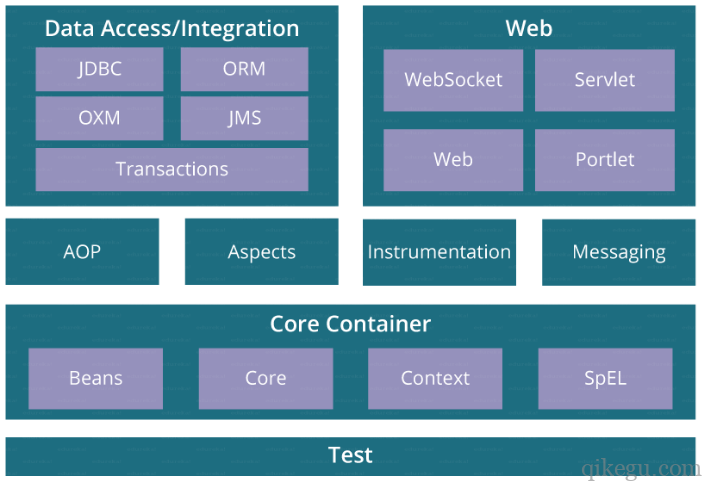
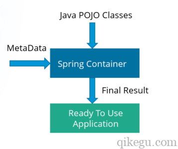

# [Spring 教程](https://www.qikegu.com/docs/1460)

- [Spring 教程](#spring-教程)
  - [Spring 框架介绍](#spring-框架介绍)
    - [Spring框架优点](#spring框架优点)
    - [依赖注入/DI（控制反转/IOC）](#依赖注入di控制反转ioc)
    - [面向切面编程/AOP](#面向切面编程aop)
    - [Spring 框架模块](#spring-框架模块)
    - [核心容器](#核心容器)
    - [Spring数据访问/集成](#spring数据访问集成)
    - [Spring Web](#spring-web)
    - [其他模块](#其他模块)
    - [Spring开发环境搭建（Eclipse）](#spring开发环境搭建eclipse)
    - [创建一个简单的Spring应用](#创建一个简单的spring应用)
    - [Spring 控制反转容器（Inversion of Control – IOC）](#spring-控制反转容器inversion-of-control--ioc)
      - [什么是控制反转？](#什么是控制反转)
      - [什么是Bean？](#什么是bean)
    - [Bean的配置方式](#bean的配置方式)
  - [理解依赖注入（DI – Dependency Injection）](#理解依赖注入di--dependency-injection)
    - [耦合太紧的问题](#耦合太紧的问题)
    - [依赖注入](#依赖注入)
  - [Bean XML 配置（1）- 通过XML配置加载Bean](#bean-xml-配置1--通过xml配置加载bean)
    - [1. 定义Bean](#1-定义bean)
    - [2. 创建Spring容器](#2-创建spring容器)
      - [BeanFactory 容器](#beanfactory-容器)
      - [ApplicationContext 容器](#applicationcontext-容器)
    - [3. 通过Spring容器获取bean](#3-通过spring容器获取bean)
    - [4. 关闭容器](#4-关闭容器)
  - [Bean XML 配置（2）- Bean作用域与生命周期回调方法配置](#bean-xml-配置2--bean作用域与生命周期回调方法配置)
    - [作用域配置](#作用域配置)
      - [XML中配置Bean的作用域](#xml中配置bean的作用域)
    - [生命周期回调方法](#生命周期回调方法)
      - [1. 创建初始化方法和销毁方法](#1-创建初始化方法和销毁方法)
      - [2. 在XML配置中指定方法](#2-在xml配置中指定方法)
  - [Bean XML 配置（3）- 依赖注入配置](#bean-xml-配置3--依赖注入配置)
    - [构造函数注入](#构造函数注入)
    - [Setter方法注入](#setter方法注入)
    - [注入值的配置](#注入值的配置)
  - [Bean XML 配置（4）- 自动装配](#bean-xml-配置4--自动装配)
    - [自动装配的局限性](#自动装配的局限性)
  - [Bean 注解(Annotation)配置（1）- 通过注解加载Bean](#bean-注解annotation配置1--通过注解加载bean)
    - [1. 启用注解配置](#1-启用注解配置)
    - [2. 给Bean Java类添加@Component注解](#2-给bean-java类添加component注解)
    - [3. 通过Spring容器获取bean](#3-通过spring容器获取bean-1)
  - [Bean 注解(Annotation)配置（2）- Bean作用域与生命周期回调方法配置](#bean-注解annotation配置2--bean作用域与生命周期回调方法配置)
    - [Bean作用域](#bean作用域)
    - [使用注解指定初始化回调方法与销毁回调方法](#使用注解指定初始化回调方法与销毁回调方法)
  - [Bean 注解(Annotation)配置（3）- 依赖注入配置](#bean-注解annotation配置3--依赖注入配置)
    - [1. 构造方法注入](#1-构造方法注入)
    - [2. Setter方法注入](#2-setter方法注入)
    - [3. 字段注入](#3-字段注入)
    - [通过注解注入值](#通过注解注入值)

Spring框架是Java EE开发中最流行的框架，已经成为JEE事实上的标准，全世界的开发人员都在使用Spring框架开发各种应用。随着Spring boot，Spring cloud新版本的不断推出，以及微服务的流行，Spring已经成为JEE开发“必修”项目。

本教程介绍spring框架的核心概念：DI、AOP等。本教程遵循二八原则（80%的场景只会用到20%的技术，也就是说大多数场景只会用少最常用的技术），我们只讲最重要最常用的部分，让你不走弯路，花最少时间学到最多。

## [Spring 框架介绍](https://www.qikegu.com/docs/1466)

Spring是一个JEE开发框架，开源，轻量级，功能强大。

JEE – Java Enterprise Edition / Java企业版

主要用于开发企业软件的Java版本。企业软件例子：会计软件、帐单管理、业务流程管理、CMS、CRM、ERP等。

Spring框架的核心特性是依赖注入(DI)与面向切面编程(AOP)，Spring框架可以看作是一个控制反转的容器。尽管Spring主要用于JEE应用开发，但实际上这2个核心特性可用于任何Java项目。

Spring框架是Java EE开发中最流行的框架，已经成为JEE事实上的标准，全世界的开发人员都在使用Spring框架开发各种应用。

Spring框架是澳大利亚计算机专家Roderick B. Johnson于2002年发布，诞生以来发布了很多版本，目前最新版是5.0

### Spring框架优点

- 松耦合，组件（Bean）之间依赖很松，模块可以轻松替换

- 简单，非侵入式，组件（Bean）本身只是简单的Java对象，无需任何特殊处理，非常简单

### 依赖注入/DI（控制反转/IOC）

Spring框架2个核心技术之一是依赖注入（Dependency Injection / DI）。

Java程序中，Java类是基本的代码组织单位。当某个类要使用另一个类时，自然的做法是创建另一个类的对象，然后调用该对象的方法。这样做在程序规模较小时没什么问题，但当程序规模很大时这些类之间过于紧密的耦合会导致后续开发维护困难。例如要替换其中某个类，就不得不修改所有涉及这个类的代码。

控制反转(Inversion of Control / IoC)与依赖注入（Dependency Injection / DI）就是为解决这个问题。上面提到类里面创建另外一个类对象会造成耦合太紧，Spring框架就把创建类的行为从类中拿出来放到Spring框架里去做，类与类之间创建关系就没有了。

本来由类控制其所依赖的类对象的创建，现在把创建动作放到Spring框架里了，由框架控制所有类对象的创建，这就是“控制反转”。

框架创建了类所依赖的对象，然后把这些对象传给（注入）依赖它们的类，这就是“依赖注入”。

所以可以看到，Spring框架中控制反转(Inversion of Control / IoC)与依赖注入（Dependency Injection / DI）实际上讲的是同一个事情，只是角度不同。

关于依赖注入，后续会有详细介绍。

### 面向切面编程/AOP

Spring框架另外一个核心技术是面向切面编程(Aspect Oriented Programming/AOP)。

面向切面编程的主要作用是，在不修改源代码的情况下，可以给目标类打补丁，让其执行补丁中的代码。

例如，用户类中有个登录方法，现在需要加用户登录日志。使用AOP就不需要修改用户登录方法，只需把日志代码注入到用户登录方法前后，让其执行。日志代码就是“切面”，插入代码的地方（用户类的登录方法）就是“连接点”。

关于AOP后续会有详细介绍。

注意：依赖注入/DI（控制反转/IOC）与 面向切面编程/AOP都是基于Java的**反射**机制。

### [Spring 框架模块](https://www.qikegu.com/docs/1468)

Spring框架大概由20来个模块组成。这些模块可以分成几个大的层次：核心容器、数据访问/集成、Web、AOP(面向切面编程)、工具和测试等，如下图所示。开发者可以根据需要选择其中的模块使用，由于是模块化的结构，所以很容易与其他框架一起集成使用。

### 核心容器

核心容器层是spring框架的基础，其他层都依赖于这一层，核心容器这一层包含以下4个模块:

- Spring Core：这个模块是Spring框架的核心，提供控制反转/依赖注入功能

- Spring Bean：这个模块实现Bean的工厂模式，Bean可以理解为组件，是JEE中基本的代码组织单位，Spring中Bean形式是普通Java类

- Spring Context：此模块表示Spring应用的环境，通过此模块可访问任意Bean，ApplicationContext接口是模块的关键组成

- Spring表达式语言(SpEL)：这个模块提供对表达式语言(SpEL)支持

### Spring数据访问/集成

数据访问相关，由以下5个模块组成:

- JDBC：对Java JDBC接口再次包装，让Spring应用中使用JDBC更简单
- ORM: ORM代表对象关系映射，该模块提供对ORM的支持
- OXM: OXM代表对象XML映射器，该模块提供对OXM的支持
- JMS: JMS代表Java消息传递服务，该模块提供对JMS的支持
- 事务: 该模块提供数据库事务的支持

### Spring Web

Web层包括以下模块:

- Web：提供基本的Web功能，如文件下载、rest接口支持等
- web-servlet：实现MVC（Model-View-Controller）功能
- web socket：提供对web socket的支持
- web portlet：提供对web portlet的支持

### 其他模块

- AOP 提供对面向切面编程的支持
- Aspects 提供与AspectJ集成，AspectJ是另一个面向切面编程的框架
- Instrumentation 提供在某些应用服务器中使用的类加载实现
- Messaging 提供对STOMP(Simple (or Streaming) Text Oriented Message Protocol )的支持
- Test 支持JUnit或TestNG框架测试Spring组件

### [Spring开发环境搭建（Eclipse）](https://www.qikegu.com/docs/1479)

...

### [创建一个简单的Spring应用](https://www.qikegu.com/docs/1492)

...

### [Spring 控制反转容器（Inversion of Control – IOC）](https://www.qikegu.com/docs/1500)

IoC（Inversion of Control ）代表控制反转，Spring框架本质上是一个IoC容器。

#### 什么是控制反转？

Java程序中，Java类是基本的代码组织单位。当某个类要使用另一个类时，自然的做法是创建另一个类的对象，然后调用该对象的方法。这样做在程序规模较小时没什么问题，但当程序规模很大时这些类之间过于紧密的耦合会导致后续开发维护困难。例如要替换其中某个类，就不得不修改所有涉及这个类的代码。

控制反转(Inversion of Control / IoC)与依赖注入（Dependency Injection / DI）就是为解决这个问题。上面提到类里面创建另外一个类实例会造成耦合太紧，Spring框架就把创建类实例的行为从类中拿出来放到Spring框架里去做，类与类之间创建关系就没有了。

本来由类控制其所依赖的另一个类的实例创建，现在把创建动作放到Spring框架里了，由框架控制所有类的实例创建，这就是“控制反转”。

框架创建了类所依赖的对象，然后把这些对象传给（注入）类，这就是“依赖注入”。

所以可以看到，Spring框架中控制反转(Inversion of Control / IoC)与依赖注入（Dependency Injection / DI）实际上讲的是同一个事情，只是角度不同。

IoC容器执行的主要任务:

- 创建bean实例
- 根据配置文件装配bean
- 为bean设置初始化参数
- 管理bean的生命周期

#### 什么是Bean？

Bean是Java中基本的代码重用单位，是遵守一定约定的Java类。

在Spring中，Bean就是普通的Java类，由Spring IoC容器实例化、组装、管理。

IoC容器根据XML文件、Java注释或Java config文件中的配置信息创建、装配、管理bean（普通Java类），spring应用只需声明一下所需的类（往往是父类，以便达到松耦合的目的）就可直接使用这些bean的功能。如图所示：

IoC容器有两种类型:

- `BeanFactory`
- `ApplicationContext`

`ApplicationContext`接口基于`BeanFactory`接口，比`BeanFactory`接口更强大，推荐使用`ApplicationContext`。后面会有详细介绍。

### Bean的配置方式

Bean的配置信息里包含了：

- 如何创建bean
- bean的生命周期回调方法配置
- bean的依赖关系

Spring容器利用这些信息装配Bean。

bean配置方式有3种：

- XML配置 – 使用XML文件来配置bean
- 注解配置 – 使用`@Service`或`@Component`注解配置bean
- Java配置 – 从Spring 3.0开始，可以使用java程序配置bean，java配置用到的主要注解是：`@Configuration`、`@ComponentScan`和`@Bean`

后续将会详细介绍。

## [理解依赖注入（DI – Dependency Injection）](https://www.qikegu.com/docs/1541)

依赖注入(Dependency Injection, DI)是一种设计模式，也是Spring框架的核心概念之一。其作用是去除Java类之间的依赖关系，实现松耦合，以便于开发测试。为了更好地理解DI，先了解DI要解决的问题。

### 耦合太紧的问题

如果使用一个类，自然的做法是创建一个类的实例：

    class Player{  
        Weapon weapon;  

        Player(){  
            // 与 Sword类紧密耦合
            this.weapon = new Sword();  

        }  

        public void attack() {
            weapon.attack();
        }
    }   

这个方法存在耦合太紧的问题，例如，玩家的武器只能是剑`Sword`，而不能把`Sword`替换成枪`Gun`。要把`Sword`改为`Gun`，所有涉及到的代码都要修改，当然在代码规模小的时候这根本就不是什么问题，但代码规模很大时，就会费时费力了。

### 依赖注入

依赖注入是一种消除类之间依赖关系的设计模式。例如，A类要依赖B类，A类不再直接创建B类，而是把这种依赖关系配置在外部xml文件（或java config文件）中，然后由Spring容器根据配置信息创建、管理bean类。

示例：

    class Player{  
        Weapon weapon;  

        // weapon 被注入进来
        Player(Weapon weapon){  
            this.weapon = weapon;  

        }  

        public void attack() {
            weapon.attack();
        }

        public void setWeapon(Weapon weapon){  
            this.weapon = weapon;  
        }  
    }   

如上所示，`Weapon`类的实例并不在代码中创建，而是外部通过构造函数传入，传入类型是父类`Weapon`，所以传入的对象类型可以是任何`Weapon`子类。

传入哪个子类，可以在外部xml文件（或者java config文件）中配置，Spring容器根据配置信息创建所需子类实例，并注入Player类中，如下所示：

    <bean id="player" class="com.qikegu.demo.Player"> 
        <constructor-arg ref="weapon"/>
    </bean>

    <bean id="weapon" class="com.qikegu.demo.Gun"> 
    </bean>

上面代码中`<construct-arg ref="weapon"/> ref`指向`id="weapon"`的`bean`，传入的武器类型是`Gun`，如果想改为`Sword`，可以作如下修改：

    <bean id="weapon" class="com.qikegu.demo.Sword"> 
    </bean>

只需修改这一处配置就可以。

松耦合，并不是不要耦合。A类依赖B类，A类和B类之间存在紧密耦合，如果把依赖关系变为A类依赖B的父类B0类，在A类与B0类的依赖关系下，A类可使用B0类的任意子类，A类与B0类的子类之间的依赖关系是松耦合的。

可以看到依赖注入的技术基础是**多态**机制与**反射**机制。

## [Bean XML 配置（1）- 通过XML配置加载Bean](https://www.qikegu.com/docs/1553)

### 1. 定义Bean

在xml配置文件中(如”beans.xml”)，添加Bean定义：

    <!-- 定义一个Bean -->
    <bean id="..." class="...">
    <!-- bean 配置 -->
    </bean>

    <!-- App bean -->
    <bean id="app" class="App" lazy-init="true"></bean>

可以给Bean设置一些属性，此处用到的属性说明：

- id: bean的唯一标识符
- class: 指定bean的Java类名称
- lazy-init: 懒加载，让Spring容器在Bean首次用到时创建Bean实例，而不是在应用一启动就创建

### 2. 创建Spring容器

Spring容器负责加载bean配置文件、创建bean。

前面教程提到过有2种容器：

- ApplicationContext
- BeanFactory

`ApplicationContext`基于`BeanFactory`，比`BeanFactory`功能更强，更常用。

#### BeanFactory 容器

`BeanFactory`容器是简单的IOC容器，只提供基本的依赖注入支持。`BeanFactory`本身是一个Java接口，最常见的实现是`XmlBeanFactory`类。通常不直接使用`BeanFactory`容器，而是用`ApplicationContext` 容器。

#### ApplicationContext 容器

`ApplicationContext`容器是更高级更常用的容器，继承并扩展了`BeanFactory`的功能。同样`ApplicationContext`本身是一个Java接口，常用的实现类是：

`FileSystemXmlApplicationContext`: 通过文件路径加载`bean`的xml配置文件
`ClassPathXmlApplicationContext`: 通过类路径加载`bean`的xml配置文件
`WebXmlApplicationContext`: 通过web网址加载bean的xml配置文件
代码示例：

    import org.springframework.context.ApplicationContext;
    import org.springframework.context.support.ClassPathXmlApplicationContext;

    public class Test {
        public static void main(String[] args) {
            // ApplicationContext容器加载beans.xml
            ApplicationContext context = new ClassPathXmlApplicationContext("beans.xml");
        }
    }

### 3. 通过Spring容器获取bean

通过Spring容器可以访问它所管理的任意Bean，可使用`getBean()`方法返回Bean实例。

示例：

    import org.springframework.context.ApplicationContext;
    import org.springframework.context.support.ClassPathXmlApplicationContext;

    public class Test {
        public static void main(String[] args) {

            ApplicationContext context = new ClassPathXmlApplicationContext("beans.xml");

            // 获取Bean实例
            App app = context.getBean("app", App.class);
            // App app = (App) context.getBean("app");
        }
    }

### 4. 关闭容器

最后应用结束时需要关闭容器，释放资源，容器中的**所有`bean`也将被销毁**。

    context.close();

    // 如果当前context类没有close方法，需类型转换为有close方法的类，如下所示
    // ((ClassPathXmlApplicationContext) context).close();
    // ((ConfigurableApplicationContext) context).close();

## [Bean XML 配置（2）- Bean作用域与生命周期回调方法配置](https://www.qikegu.com/docs/1558)

### 作用域配置

spring中创建bean时，可以指定作用域。作用域有以下5种类型：

- 单例(singleton)

  默认作用域，一个spring容器中只有Bean的一个实例。

- 原型(prototype)

  每次获取Bean时生成一个新的实例。

- 请求(request)

  作用域是单个http请求，单个http请求只有Bean的一个实例。一旦请求完成，bean实例将被销毁。

- 会话(session)

  作用域是单个会话，单个会话只有Bean的一个实例。一旦会话结束，bean实例将被销毁。

- 全局会话(global-session)

  在Portlet应用程序中使用，每个全局会话只有Bean的一个实例。普通Servlet应用中与会话作用域无区别。

#### XML中配置Bean的作用域

示例：

    <bean id="app" class="App" scope="prototype"></bean>

设置作用域：`scope="prototype"`，“原型”作用域表明**每次获取Bean时生成一个新的实例**。

### 生命周期回调方法

Spring容器负责管理Bean的生命周期，如下所示：

- 创建bean实例
- 设置bean的属性值
- 调用初始化回调方法
- 使用Bean
- 调用销毁回调方法
- 销毁Bean

Bean在创建时，需要执行一些资源（数据库、套接字、文件）申请等初始化工作，可以在Bean的初始化回调方法中处理，此方法**由Spring容器调用**。

同样Bean在销毁时，需要执行一些资源（数据库、套接字、文件）申请等销毁工作，可以在Bean的销毁回调方法中处理，此方法**由Spring容器调用**。

#### 1. 创建初始化方法和销毁方法

    public class App {

        // ...

        public void init() {
            System.out.println("初始化...");
        }

        public void close() {
            System.out.println("销毁...");
        }

        // ...
    }

#### 2. 在XML配置中指定方法

指定Bean的初始化方法和销毁方法，Spring容器会为该Bean调用这些方法。

    <bean id="app" class="App" init-method="init" destroy-method="close"></bean>

## [Bean XML 配置（3）- 依赖注入配置](https://www.qikegu.com/docs/1567)

本文介绍使用xml中配置Bean之间的依赖关系。

xml配置文件中，在bean的定义中可配置该bean的依赖项，通常使用的配置方式有2种：

- 构造函数注入
- Setter方法注入

### 构造函数注入

根据XML中的配置，Spring容器首先创建所依赖Bean实例，然后传递给类的构造函数。

示例：

    public class App {

        private Service mainService;
        private Service[] services;

        // 注入Service实例
        public App(Service main){
            this.mainService = main;
        }

        // 注入Service实例数组
        public App(Service[] services){
            this.services = services;
        }
    }

在bean.xml中，定义App类依赖项：

    <!-- App Bean定义 -->
    <bean id="app" class="App">
    
     <!-- 构造函数注入单个依赖项实例 -->
     <constructor-arg ref="logger"/>
    
     <!-- 构造函数注入依赖项实例数组 -->
     <!-- <constructor-arg>
      <list>
        <ref bean="database"/>
        <ref bean="mail"/>
        <ref bean="logger"/>
      </list>
     </constructor-arg> --> 
    </bean>
    
    <!-- Service bean （依赖项）定义 -->
    <bean id="database" class="Database"/>
    <bean id="logger" class="Logger"/>
    <bean id="mail" class="Mail"/>

`Database`、`Logger`、`Mail`都继承自基类`Service`。

`<constructor-arg>`用于构造函数方式注入Bean，`ref`属性指明要注入的Bean（**引用**方式），属性值是所依赖bean的ID。

XML的bean定义中**只能有1个`<constructor-arg>`**，所以在上面的示例中要么注入单个服务实例，要么注入服务实例数组。

确保在XML文件中为所有依赖项配置bean，否则Spring容器无法注入这些依赖项。

### Setter方法注入

根据XML中的配置，Spring容器调用类的Setter方法注入依赖项。

示例：

    public class App {

        // ...

        public Service getMainService() {
            return mainService;
        }

        // 通过setter方法注入服务实例
        public void setMainService(Service mainService) {
            this.mainService = mainService;
        }

        public Service[] getServices() {
            return services;
        }

        // 通过setter方法注入服务实例数组
        public void setServices(Service[] services) {
            this.services = services;
        }
    }

在bean.xml中，定义类的依赖项。Spring容器根据`<property>`配置，调用类的相应`setter`方法，设置属性，实现依赖项的注入。

    <bean id="app" class="App">
    
     <!-- Setter 方法配置 -->
     <property name="mainService" ref="logger"/>
     <property name="services">
      <list>
       <ref bean="database"/>
       <ref bean="mail"/>
       <ref bean="logger"/>
      </list>
     </property>
    
    </bean>

Spring容器怎么知道调用哪个`setter`方法? Spring容器根据`name`调用`setter`方法：name对应“`set`”关键字后面的属性名，`name="mainService"`对应于`setMainService`。

### 注入值的配置

前面介绍了使用`<constructor-arg>`和`<property>`注入依赖的Bean实例，另外还可以使用它们来注入值。

示例：

    <bean id="app" class="App">
    
     <!-- 构造函数注入值 -->
     <constructor-arg type="int" value="12345"/>
     <constructor-arg type="java.lang.String" value="myApp"/>
    
     <!-- 也可通过构造函数的参数序号注入值 -->
     <!-- <constructor-arg index="0" value="12345"/> -->
     <!-- <constructor-arg index="1" value="myApp"/> -->
    
     <!-- Setter方法注入值 -->
     <!-- <property name="id" value="1234"/> -->
     <!-- <property name="name" value="myApp"/> -->
    
    </bean>

XML中`value`属性的值会赋给类中的属性，如果引用一个bean，则使用`ref`属性。

如果需要传递空字符串或`null`作为值，可以按如下设置:

    <bean id="app" class="App">
      <property name="name" value=""/>
    </bean>
    <bean id="app" class="App">
      <property name="name"><null/></property>
    </bean>

## [Bean XML 配置（4）- 自动装配](https://www.qikegu.com/docs/1568)

前面介绍了使用`<constructor-arg>`和`<property>`注入依赖项，我们还可以使用自动装配的方式实现依赖注入，大大减少配置编写。

自动装配通过以下方式查找依赖项：

- **byName**: 通过属性名。匹配类中的属性名和xml中依赖bean id。
- **byType**: 通过属性数据类型。匹配类中的属性数据类型和依赖bean类型，如果可以匹配多个bean，则抛出致命异常。
- **constructor**: 通过构造函数参数的数据类型。匹配构造函数参数的数据类型和依赖bean类型，如果容器中没找到类型匹配的Bean，抛出致命异常。

自动装配示例：

    public class App {

        private Service mainService;
        private Service[] services;

        // 注入Service实例
        public App(Service main){
            this.mainService = main;
        }

        // 注入Service实例数组
        public App(Service[] services){
            this.services = services;
        }

        public Service getMainService() {
            return mainService;
        }

        // 通过setter方法注入服务实例
        public void setMainService(Service mainService) {
            this.mainService = mainService;
        }

        public Service[] getServices() {
            return services;
        }

        // 通过setter方法注入服务实例数组
        public void setServices(Service[] services) {
            this.services = services;
        }
    }

xml配置：

    <bean id="app" class="App" autowire="byType"></bean>

依赖项数组可通过`byType/constructor`自动装配。使用`byType/byName`，Java类必须实现`setter`方法。

使用`byType/constructor`，可能有多个Bean匹配，可通过设置`autowire-candidate="false"`去除匹配。

示例：

    <bean id="app" class="App" autowire="byType"></bean>
    <bean id="database" class="Database" autowire-candidate="false"></bean>
    <bean id="mail" class="Mail" autowire-candidate="false"></bean>
    <bean id="logger" class="Logger" autowire-candidate="true"></bean>

使用`byName`，如下所示会自动装配`mainService`，`App`类中的属性`mainService`与`<bean id="mainService"`匹配：

    <bean id="app" class="App" autowire="byName"></bean>
    <bean id="database" class="Database"></bean>
    <bean id="mail" class="Mail"></bean>
    <bean id="mainService" class="Logger"></bean>

### 自动装配的局限性

- 被覆盖的可能性: 仍可通过`<constructor-arg>`和`<property>`配置覆盖自动装配的配置。
- 不支持原始数据类型: 原始数据类型的值不能通过自动装配的方式注入。
- 不够精准: 自动装配不如手动装配精准，尽量使用手动装配。

## [Bean 注解(Annotation)配置（1）- 通过注解加载Bean](https://www.qikegu.com/docs/1569)

Bean也可以通过Java注解的方式配置。

Java注解直接加在需要装配的Bean Java类上。

注解是类、方法或字段声明上的特殊标记。例如，常见的`@Override`就是一个注解，作用是告诉编译器这是一个被重写的方法。

注解配置对比XML配置

- 注解配置比XML配置更简洁，尤其是当有很多Bean时，可以省很多事。

- XML注入会在注解注入之后执行，所以**XML配置将覆盖注解配置**。

### 1. 启用注解配置

默认情况下，Spring容器没有启用注解配置。需要在Bean的XML配置文件里打开组件扫描功能，启用注解配置。

    <?xml version="1.0" encoding="UTF-8"?>
    <beans xmlns="http://www.springframework.org/schema/beans" xmlns:xsi="http://www.w3.org/2001/XMLSchema-instance" xmlns:context="http://www.springframework.org/schema/context" xsi:schemaLocation=" http://www.springframework.org/schema/beans http://www.springframework.org/schema/beans/spring-beans-3.0.xsd http://www.springframework.org/schema/context http://www.springframework.org/schema/context/spring-context-3.0.xsd">

        <!-- 打开组件扫描，启用注解配置 -->
        <context:component-scan base-package="com.qikegu.demo"></context:component-scan>

        <!-- ... -->

    </beans>

`base-package="com.qikegu.demo"`指定需要扫描的包路径。

### 2. 给Bean Java类添加@Component注解

Spring容器**扫描指定包路径下的所有类**，每当找到1个`@Component`注解，就会注册Bean，同时设置Bean ID。

**默认Bean ID**就是类名，但首字母小写。如果类名以连续几个大写字母开头，首字母不小写。（即`QIKEGUService -> QIKEGUService`）

    package com.qikegu.demo;

    import org.springframework.stereotype.Component;
    import org.springframework.context.annotation.Lazy;

    @Component
    @Lazy
    public class App {
    }

### 3. 通过Spring容器获取bean

与XML配置方式类似，使用`getBean()`方法返回Bean实例。

示例：

    import org.springframework.context.ApplicationContext;
    import org.springframework.context.support.ClassPathXmlApplicationContext;

    public class Test {
        public static void main(String[] args) {

            ApplicationContext context = new ClassPathXmlApplicationContext("beans.xml");

            // 获取Bean实例
            App app = context.getBean("app", App.class);
            // App app = (App) context.getBean("app");
        }
    }

## [Bean 注解(Annotation)配置（2）- Bean作用域与生命周期回调方法配置](https://www.qikegu.com/docs/1585)

在[Bean XML 配置（2）- Bean作用域与生命周期回调方法配置](https://www.qikegu.com/docs/1558)中，介绍了使用XML配置Bean作用域与生命周期回调方法。本文介绍使用注解方式配置 Bean作用域与生命周期回调方法。

### Bean作用域

spring中创建bean时，可以指定作用域。作用域有以下5种类型：

- 单例(singleton)

  默认作用域，**一个spring容器中**只有Bean的一个实例。

- 原型(prototype)

  每次获取Bean时生成一个新的实例。

- 请求(request)

  作用域是单个http请求，单个http请求只有Bean的一个实例。一旦请求完成，bean实例将被销毁。

- 会话(session)

  作用域是单个会话，单个会话只有Bean的一个实例。一旦会话结束，bean实例将被销毁。

- 全局会话(global-session)

  在Portlet应用程序中使用，每个全局会话只有Bean的一个实例。普通Servlet应用中与会话作用域无区别。

Bean的作用域用注解方式设置，可以用`@Scope`注解。

示例：

    import org.springframework.beans.factory.annotation.Autowired;
    import org.springframework.beans.factory.annotation.Qualifier;
    import org.springframework.context.annotation.Scope;
    import org.springframework.stereotype.Component;

    @Component
    @Scope("prototype") // 设置作用域
    public class App {

        // ...
    }

### 使用注解指定初始化回调方法与销毁回调方法

Spring容器负责管理Bean的生命周期，如下所示：

- 创建bean实例
- 设置bean的属性值
- 调用**初始化回调**方法
- 使用Bean
- 调用**销毁回调**方法
- 销毁Bean

Bean在创建时，需要执行一些资源（数据库、套接字、文件）申请等初始化工作，可以在Bean的初始化回调方法中处理，此方法由Spring容器调用。

同样Bean在销毁时，需要执行一些资源（数据库、套接字、文件）申请等销毁工作，可以在Bean的销毁回调方法中处理，此方法由Spring容器调用。

初始化回调方法与销毁回调方法可通过下面的注解指定：

- `@PostConstruct` – 此注解指定初始化回调方法
- `@PreDestroy` – 此注解指定销毁回调方法

示例：

    package com.qikegu.demo;

    import javax.annotation.PostConstruct;
    import javax.annotation.PreDestroy;

    public class App {

        // ...

        @PostConstruct
        public void init() {
            System.out.println("初始化...");
        }

        @PreDestroy
        public void close() {
            System.out.println("销毁...");
        }

        // ...
    }

## [Bean 注解(Annotation)配置（3）- 依赖注入配置](https://www.qikegu.com/docs/1815)

注解方式配置Bean之间的依赖关系，可通过注解：`@Autowired`。

Spring扫描所有带有`@Component`注解的类，将其注册为bean，然后Spring找到带有`@Autowired`注解的变量，把所依赖的Bean注入。

使用`@Autowired`注解注入依赖项有3种方法:

- 构造函数注入
- Setter注入
- 字段注入

确保所依赖的类已经配置成Bean，否则不能注入。

我们有下面几个类：

`Database.java`

    package com.qikegu.demo;

    import org.springframework.stereotype.Component;

    @Component
    public class Database implements Service {

        @Override
        public String name() {
            return "数据库名称：MySQL";
        }

        @Override
        public void run() {
            System.out.println("数据库正在运行");
        }

        @Override
        public void stop() {
            System.out.println("数据库已经停止");
        }
    }

`Logger.java`

    package com.qikegu.demo;

    import org.springframework.stereotype.Component;

    @Component
    public class Logger implements Service {
        @Override
        public String name() {
            return "Logger X";
        }

        @Override
        public void run() {
            System.out.println("Loggery已经准备好");
        }

        @Override
        public void stop() {
            System.out.println("Logger已经停止");
        }
    }

`Mail.java`

    package com.qikegu.demo;

    import org.springframework.stereotype.Component;

    @Component
    public class Mail implements Service {
        @Override
        public String name() {
            return "邮件收发";
        }

        @Override
        public void run() {
            System.out.println("邮件收发正在运行");
        }

        @Override
        public void stop() {
            System.out.println("邮件收发已经停止");
        }
    }

### 1. 构造方法注入

使用`@Autowired`注解将依赖项注入类的构造方法。

`App.java`

    package com.qikegu.demo;

    import org.springframework.beans.factory.annotation.Autowired;
    import org.springframework.beans.factory.annotation.Qualifier;
    import org.springframework.stereotype.Component;

    @Component
    public class App {

        private Service mainService;
        private Service[] services;

        public App(){
        }

        /* 
        // 构造方法注入
        @Autowired
        public App(@Qualifier("logger") Service main){
            this.setMainService(main);
        } 
        */

        // 构造方法注入
        @Autowired
        public App(Service[] services){
            this.setServices(services);
        }

        public Service getMainService() {
            return mainService;
        }

        public void setMainService(Service mainService) {
            this.mainService = mainService;
        }

        public Service[] getServices() {
            return services;
        }

        public void setServices(Service[] services) {
            this.services = services;
        }
    }

注意：只能有一个构造方法用于自动装配。

- 问题1: 可以看到构造方法的参数类型Service是一个接口，它有几个实现类，那么这里将注入哪个实现类的实例呢?

  如果只有一个实现类，默认情况下将注入这个类。

  如果有多个实现类，需要使用`@Qualifier("bean_id")`注解显式指定。如果没有指定，Spring容器将根据变量名匹配一个实现类，如果找不到匹配，抛出异常。

  对于`public App(Service[] services) Service`**数组**：Spring将**注入所有**实现类的实例。

- 问题2: Spring容器以何种方式匹配Bean?

  默认情况下是通过数据类型(`byType`)，当使用`@Qualifier`注解时，是通过名称(`byName`)。

### 2. Setter方法注入

`App.java`

        package com.qikegu.demo;

    import org.springframework.beans.factory.annotation.Autowired;
    import org.springframework.beans.factory.annotation.Qualifier;
    import org.springframework.stereotype.Component;

    @Component
    public class App {

        private Service mainService;
        private Service[] services;

        public App(){
        }

        public Service getMainService() {
            return mainService;
        }

        // Setter方法注入
        @Autowired
        @Qualifier("logger")
        public void setMainService(Service mainService) {
            this.mainService = mainService;
        }

        public Service[] getServices() {
            return services;
        }

        @Autowired 
        public void setServices(Service[] services) {
            this.services = services;
        }
    }

其实任何带有`@Autowired`注解的方法，都可以注入依赖项，而**不仅限于`Setter`方法**。

    // Setter方法注入
    @Autowired
    @Qualifier("logger")
    public void anyMethod(Service mainService) {
        this.mainService = mainService;
    }

### 3. 字段注入

通过在对象字段上使用@Autowired注解注入依赖项。

`App.java`

    package com.qikegu.demo;

    import org.springframework.beans.factory.annotation.Autowired;
    import org.springframework.beans.factory.annotation.Qualifier;
    import org.springframework.stereotype.Component;

    @Component
    public class App {

        // 字段注入 
        @Autowired
        @Qualifier("logger") 
        private Service mainService;

        // 字段注入 
        @Autowired
        private Service[] services;

        public App(){
        }

        public Service getMainService() {
            return mainService;
        }

        public Service[] getServices() {
            return services;
        }
    }

- 问题：前面提到这几种依赖注入类型，哪种比较好?

  各有优点，看自己偏好，选择一个在整个项目中保持一致

### 通过注解注入值

使用构造方法、setter方法和字段除了可以注入依赖项，还可以注入值。

`App.java`

    package com.qikegu.demo;

    import org.springframework.beans.factory.annotation.Value;
    import org.springframework.stereotype.Component;

    @Component
    public class App {

        // 使用@Value注解注入值
        @Value("1024")
        private int id;

        public App(){
        }

        // 使用@Value注解注入值
        public App(@Value("1024") int id){
            this.id = id;
        }

        public int getId() {
            return id;
        }

        // 使用@Value注解注入值
        @Value("1024")
        public void setId(int id) {
            this.id = id;
        }
    }

TODO Spring 教程 xxxxxxxxxxxxxxxxx
