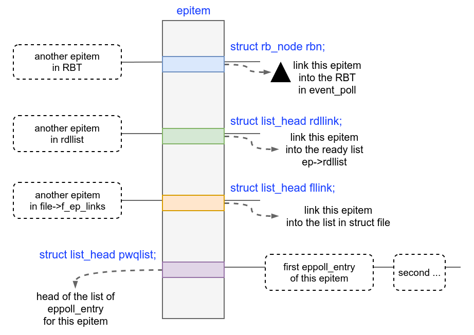
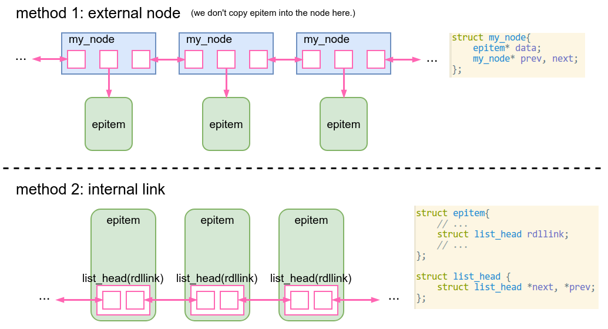
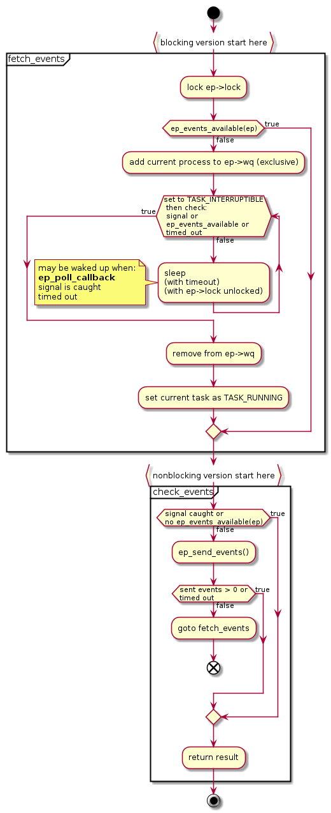

# [Implementation of Epoll](https://fd3kyt.github.io/posts/implementation-of-epoll/)

- [Implementation of Epoll](#implementation-of-epoll)
  - [note](#note)
  - [prerequisite](#prerequisite)
    - [`poll()` operation of file](#poll-operation-of-file)
      - [`poll_table_struct`](#poll_table_struct)
      - [implementing the `poll` operation](#implementing-the-poll-operation)
      - [about the event mask](#about-the-event-mask)
        - [useful example: socket poll](#useful-example-socket-poll)
      - [Summary](#summary)
    - [list and queue in the Kernel](#list-and-queue-in-the-kernel)
      - [embedded anchor](#embedded-anchor)
        - [add, add_tail, delete, contains, all in O(1)](#add-add_tail-delete-contains-all-in-o1)
        - [pros and cons of embedded anchor](#pros-and-cons-of-embedded-anchor)
      - [embedded original struct into another struct to pass more data](#embedded-original-struct-into-another-struct-to-pass-more-data)
    - [wait queue in the Kernel](#wait-queue-in-the-kernel)
  - [implementation](#implementation)
    - [epoll_create](#epoll_create)
      - [the red-black tree in eventpoll](#the-red-black-tree-in-eventpoll)
    - [epoll_ctl(EPOLL_CTL_ADD)](#epoll_ctlepoll_ctl_add)
      - [ep_item_poll](#ep_item_poll)
      - [ep_ptable_queue_proc](#ep_ptable_queue_proc)
        - [epitem.pwqlist](#epitempwqlist)
      - [eppoll_entry](#eppoll_entry)
      - [summary of EPOLL_CTL_ADD](#summary-of-epoll_ctl_add)
    - [a few words about the event mask](#a-few-words-about-the-event-mask)
    - [when are the queues activated?](#when-are-the-queues-activated)
      - [drilling into the code](#drilling-into-the-code)
      - [why does it matter?](#why-does-it-matter)
    - [collecting ready events](#collecting-ready-events)
    - [ep_poll_callback](#ep_poll_callback)
      - [arguments of ep_poll_callback](#arguments-of-ep_poll_callback)
      - [ep_poll_callback,step by step](#ep_poll_callbackstep-by-step)
      - [summary of ep_poll_callback](#summary-of-ep_poll_callback)
    - [epoll_wait](#epoll_wait)
      - [main functions used in epoll_wait](#main-functions-used-in-epoll_wait)
      - [ep_poll](#ep_poll)
        - [summary of ep_poll](#summary-of-ep_poll)
      - [ep_scan_ready_list](#ep_scan_ready_list)
        - [behavior of ovflist](#behavior-of-ovflist)
        - [summary of ep_scan_ready_list](#summary-of-ep_scan_ready_list)
      - [ep_send_events_proc](#ep_send_events_proc)
        - [LT over ET](#lt-over-et)
      - [summary of epoll_wait](#summary-of-epoll_wait)
  - [more](#more)
    - [lock in epoll](#lock-in-epoll)
      - [epmutex](#epmutex)
      - [ep->mtx](#ep-mtx)
      - [ep->lock](#ep-lock)
        - [ep->ovflist](#ep-ovflist)
          - [WHY ovflist IS NECESSARY?](#why-ovflist-is-necessary)
    - [EPOLL_CTL_MOD, ep_modify](#epoll_ctl_mod-ep_modify)
## note

- based on the source code of Linux Kernel v4.16

- suppose that readers know about the usage of epoll.

## prerequisite

### `poll()` operation of file

A file operation, `poll()`, is needed for the implementation of `select`/`poll`/`epoll`.

    // linux/fs.h
    struct file_operations {
        // ... omitted
        __poll_t (*poll) (struct file *, struct poll_table_struct *);
        // ... omitted
    };

What does this operation do? In general, this operation is for monitoring the "readiness" of the operations like `read` and `write` on this file.

It is supposed to do two things:

1. **Expose the queue(s) related to "readiness"** inside this file: call the callback wrapped inside `poll_table_struct` with each queue

2. Return a bitmask indicating current "readiness", similar to the `(struct epoll_event).events`.

#### `poll_table_struct`

Let's take a look at `poll_table_struct` first. It is a function pointer + a bitmask indicating the events we are interested in.

    /*
     * structures and helpers for f_op->poll implementations
     */
    typedef void (*poll_queue_proc)(struct file *, wait_queue_head_t *, struct poll_table_struct *);
    
    /*
     * Do not touch the structure directly, use the access functions
     * poll_does_not_wait() and poll_requested_events() instead.
     */
    typedef struct poll_table_struct {
            poll_queue_proc _qproc;
            __poll_t _key;
    } poll_table;
    
    typedef unsigned __bitwise __poll_t;    // types.h

#### implementing the `poll` operation

Each device need to implement this operation on their own, because its logic depends on the device. But usually, it is quite simple.

1. for every related queue, call a function `poll_wait` provided by the kernel, passing the queue and the argument `poll_table_struct` to it.

2. set the bitmask and return it.

Here is an example from LDD3: the implementation of `poll` for a device named `scullpipe`:

    static unsigned int scull_p_poll(struct file *filp, poll_table *wait)
    {
        struct scull_pipe *dev = filp->private_data;
        unsigned int mask = 0;
    
        down(&dev->sem);
        // call poll_wait on every related queue
        poll_wait(filp, &dev->inq, wait);
        poll_wait(filp, &dev->outq, wait);
        // set the mask
        if (dev->rp != dev->wp)
            mask |= POLLIN | POLLRDNORM;
        if (spacefree(dev))
            mask |= POLLOUT | POLLWRNORM;
        up(&dev->sem);
        return mask;
    }

`poll_wait` is a very simple function. It just call the callback in `poll_table` if feasible.

    static inline void poll_wait(struct file * filp, wait_queue_head_t * wait_address, poll_table *p)
    {
        if (p && p->_qproc && wait_address)
            p->_qproc(filp, wait_address, p);
    }

#### about the event mask

`poll_table._key` is the mask of the poll operation, similar to the event mask in epoll.

In the previous example `scull_p_poll`, this mask is not used. Here is an example how it is used.

The poll operation for socket:

    static __poll_t sock_poll(struct file *file, poll_table *wait)
    {
        __poll_t busy_flag = 0;
        struct socket *sock;

        /*
         *      We can't return errors to poll, so it's either yes or no.
         */
        sock = file->private_data;

        if (sk_can_busy_loop(sock->sk)) {
            /* this socket can poll_ll so tell the system call */
            busy_flag = POLL_BUSY_LOOP;

            /* once, only if requested by syscall */
            if (wait && (wait->_key & POLL_BUSY_LOOP))
                sk_busy_loop(sock->sk, 1);
        }

        return busy_flag | sock->ops->poll(file, sock, wait);
    }

Here, we use the `_key` on the `poll_table`, checking for `POLL_BUSY_LOOP`. If feasible, do a busy loop.

##### useful example: socket poll

net/socket.c

    static __poll_t sock_poll(struct file *file, poll_table *wait)
    {
        __poll_t busy_flag = 0;
        struct socket *sock;
    
        /*
         *      We can't return errors to poll, so it's either yes or no.
         */
        sock = file->private_data;
    
        if (sk_can_busy_loop(sock->sk)) {
            /* this socket can poll_ll so tell the system call */
            busy_flag = POLL_BUSY_LOOP;
    
            /* once, only if requested by syscall */
            if (wait && (wait->_key & POLL_BUSY_LOOP))
                sk_busy_loop(sock->sk, 1);
        }
    
        return busy_flag | sock->ops->poll(file, sock, wait);
    }

This seems to be the top level socket interface. Will dispatch to `sock->ops->poll`.

Here, we use the `_key` on the `poll_table`, for flag `POLL_BUSY_LOOP`.

So, the mask in `poll_table` is used.

#### Summary

The `poll` operation of file is supposed to do two things:

1. call the callback wrapped inside `poll_table` with each related queue

2. return a bitmask indicating current readiness.

### list and queue in the Kernel

The idea of epoll is actually quite simple. Most of the complexity in the code is to do it in a somehow object-oriented style, in the efficient way of kernel.

To understand it, you need to understand how pointer-based data structure in the kernel work, e.g. linked list and red-black tree.

For this is a post for epoll, I will use the code of epoll as examples.

#### embedded anchor

`struct epitem` is one of the most important data structure in the implementation of epoll, representing a file descriptor registered in the epoll fd. It contains the `epoll_event` that we pass in during `epoll_ctl(EPOLL_CTL_ADD)`, a `epoll_filefd` containing the pointer to corresponding `file` struct, and some other data.

    struct epitem{
        struct epoll_filefd ffd;
        struct epoll_event event;
        // here I just want to show how the linked list in the kernel
        // work. Many fields omitted.
    }

`struct epollpoll` is the data structure representing the epoll instance.

`struct file` represents an opened file.

In current implementation, an `epitem` may be add into several containers, including:

- `eventpoll.rbr`, a red-black tree of all registered `epitem`

- `eventpoll.rdllist`, a list of `epitem` of ready file descriptors

- `file.f_ep_links`, a list of all the `epitem` referencing this `file`

Beside, each `epitem` also has a list on its own: a list of `eppoll_entry`.

Figure 1: links on an epitem

In the world outside of the kernel, if we want to maintain a list of ready `epitem` on `eventpoll`, we simply add a list on `eventpoll`:

    #include <list>

    struct eventpoll{
        // ... omitted
        std::list<epitem*> rdllist;
        // ... omitted
    };

    void add_new_epitem(eventpoll* ep, epitem* epi){
        ep->rdllist.push_back(epi);
    }

Inside the list, there must be nodes similar to this:

    struct my_node{
        epitem* data;
        my_node* prev, next;                   // doubly linked
    };

And when we add an element to the list, we create a new `my_node`, where `data` is the new pointer to `epitem`.

But here, in the kernel, we do it differently:

    // add a new member "rdllink" in epitem
    struct epitem{
        struct epoll_filefd ffd;
        struct epoll_event event;

        /* List header used to link this item to the "struct file" items list */
        struct list_head rdllink;
    };

    // need to add a list in struct eventpoll, of course
    struct eventpoll{
        // ... omitted
        struct list_head	rdllist;
        // ... omitted
    };

Definition of `list_head`:

    /**
     * The linkage struct for list nodes. This struct must be part of your
     * to-be-linked struct. struct list_head is required for both the head of the
     * list and for each list node.
     *
     * Position and name of the struct list_head field is irrelevant.
     * There are no requirements that elements of a list are of the same type.
     * There are no requirements for a list head, any struct list_head can be a list
     * head.
     */
    struct list_head {
        struct list_head *next, *prev;
    };

Figure 2: two ways to link epitem into a list

We don't need any new memory when adding an `epitem` into the list. We just need to set `epitem.rdllink.next` and `.prev`.

This `rdllink` can only link its `epitem` into the `rdllist` of one `eventpoll`. For example, if an `epitem` may occur in the `rdllist` of multiple `eventpoll`, one `rdllink` per epitem won't do it. Fortunately, here `epitem` and `eventpoll` have many-to-one relationship.

##### add, add_tail, delete, contains, all in O(1)

Given the head of the list (`eventpoll.rdllist`) and an `epitem`, we can do both `add` (to the front) and `add_tail in` O(1) easily, because this is a doubly-linked circular list.

We can also:

1. tell if the `epitem` is in the ready list

2. remove it from the ready list

both in O(1), and don't even need the head of the ready list. Here is a code snippet in `ep_remove`, which is called during `epoll_ctl(EPOLL_CTL_DEL)`:

    static int ep_remove(struct eventpoll *ep, struct epitem *epi){
        // omitted

        // if epi is in the ready list now, delete it from the list
        if (ep_is_linked(&epi->rdllink))
            list_del_init(&epi->rdllink);

        // omitted
    }

We can do this because, `epitem` belongs to one `eventpoll`. This `epitem` is either linked by `rdllink` into the `rdllist` of this `eventpoll` or not.

- In the former case, the pointers in `epi->rdllink` pointers to adjacent entries in the `rdllist`.

  - If we want to delete it, we just need to link the two adjacent entries together and reset this entry.

- In the latter case, the pointers in `epi->rdllink` point to itself, indicating that this `epitem` is not in the `rdllist`.

    // this initializes a list_head
    static inline void
    INIT_LIST_HEAD(struct list_head *list)
    {
        list->next = list->prev = list;
    }

    static inline bool
    list_empty(struct list_head *head)
    {
        return head->next == head;
    }

    static inline int ep_is_linked(struct list_head *p)
    {
            return !list_empty(p);
    }

    static inline void
    __list_del(struct list_head *prev, struct list_head *next)
    {
        next->prev = prev;
        prev->next = next;
    }

    static inline void
    list_del_init(struct list_head *entry)
    {
        __list_del(entry->prev, entry->next);
        INIT_LIST_HEAD(entry);
    }

##### pros and cons of embedded anchor

pros

1. don't need to allocate/deallocate memory for the node when inserting/deleting

2. with a pointer to `epitem`, we can

   - tell if it is currently linked inside a `rdllist`

   - remove it from `rdllist`

3. don't need a list type for every type of element

4. elements of a list can be of different types

cons

1. need to know which containers the strcut will be added into in advance.

   this is ok because

   - we (the programmers of the kernel) have control of the code in whole kernel

   - still possible to fall back to the usual way if necessary

2. similar to using void* to pass different types of data, programmers must keep in mind the actual type of underlying data.

In summary, by making use of the knowledge of how the struct will be used, we use this design pattern to improve performance and convenience, at the cost of giving extra care at programming.

#### embedded original struct into another struct to pass more data

In addition to using embedded `list_head` to implement linked list, the kernel code also use the trick of embedded struct to pass more data.

To understand what I mean, let's see an example in the epoll implementation.

Remind the section about the `poll()` operation of a file.

We call the `poll()` operation of the file with `file*` and `poll_table*`. Internally, for each queue related to operation readiness in the file, we will call te callback wrapped inside `poll_table` with it:

    static inline void poll_wait(struct file * filp, wait_queue_head_t * wait_address, poll_table *p)
    {
        if (p && p->_qproc && wait_address)
            p->_qproc(filp, wait_address, p);
    }

The callback is called with

- the `file*` indicating the file

- a `wait_queue_head_t`, which is the queue

- `poll_table*`, which we pass to the poll operation.

What if we need more data in this callback? More specifically, in the implementation of epoll, this callback will be `ep_ptable_queue_proc`, and inside this function, we need to get the pointer to the corresponding `epitem`. How can we do this?

    static void ep_ptable_queue_proc(struct file *file, wait_queue_head_t *whead,
                                     poll_table *pt)
    {
        // need to get a pointer to the corresponding epitem of this file
    }

Here, `file` is a preexist kernel structure, indicating the opened file. `whead` is the queue provided by the device. `poll_table` is the argument of this `poll()` call.

    typedef void (*poll_queue_proc)(struct file *, wait_queue_head_t *, struct poll_table_struct *);

    typedef struct poll_table_struct {
        poll_queue_proc _qproc;
        __poll_t _key;                      // a bitmask indicating interested events
    } poll_table;

As we can see, there is no place in `poll_table_struct` for extra data.

In a language that supports lambda function and closure, we may consider to store the wanted `epitem*` in a temporary lambda function. Somehow similar to this:

    def ep_ptable_queue_proc(file, whead, pt, epitem):
        # omitted
        pass

    def call_poll_operation(file, event_mask, epitem):
        def temp_fun(file, whead, pt):
            # save epitem in the closure
            ep_ptable_queue_proc(file, whead, pt, epitem)

        poll_table = (temp_fun, event_mask)
        poll(file, poll_table)

But we can't do this in C, especially not in the kernel.

The solution is, wrap the `poll_table` that we pass to the poll operation in another struct, and store the needed info in this outer struct.

    /* Wrapper struct used by poll queueing */
    struct ep_pqueue {
        poll_table pt;
        struct epitem *epi;
    };

    static int ep_insert(struct eventpoll *ep, const struct epoll_event *event,
                        struct file *tfile, int fd, int full_check)
    {
        // many code omited
        struct epitem *epi;
        struct ep_pqueue epq;

        /* Initialize the poll table using the queue callback */
        epq.epi = epi;
        init_poll_funcptr(&epq.pt, ep_ptable_queue_proc);

        // will call the poll operation of the file of this epitem with
        // epq.pt
        revents = ep_item_poll(epi, &epq.pt, 1);
    }

    // mainly call the poll operation of the file
    static __poll_t ep_item_poll(const struct epitem *epi, poll_table *pt, int depth)
    {
        // simplified
        pt->_key = epi->event.events;
        if (!is_file_epoll(epi->ffd.file))
            return epi->ffd.file->f_op->poll(epi->ffd.file, pt) &
                epi->event.events;
    }

Inside `ep_ptable_queue_proc`, we get the `epitem*` like this:

    static void ep_ptable_queue_proc(struct file *file, wait_queue_head_t *whead,
                                     poll_table *pt)
    {
        struct epitem *epi = ep_item_from_epqueue(pt);
        // code omitted
    }

    /* Get the "struct epitem" from an epoll queue wrapper */
    static inline struct epitem *ep_item_from_epqueue(poll_table *p)
    {
        return container_of(p, struct ep_pqueue, pt)->epi;
    }

    #ifndef container_of
    #define container_of(ptr, type, member) \
        (type *)((char *)(ptr) - (char *) &((type *)0)->member)
    #endif

How does it work?

1. a `poll_table` is embedded into `ep_pqueue`

   and the callback wrapped in this `poll_table` is `ep_ptable_queue_proc`.

2. we pass a pointer to this embedded `poll_table` to the `poll()`

3. internally, the callback will be called with queue(s) in the file and the `poll_table*` we passed in.

4. Here, the callback is `ep_ptable_queue_proc`

5. inside `ep_ptable_queue_proc`, we know that this `poll_table` must be wrapped inside a `ep_pqueue` (because `ep_ptable_queue_proc` is only used here, and here the `poll_table` is wrapped inside a `ep_pqueue`).

6. according to the memory layout of struct `ep_pqueue` (which is fixed at compilation time), we can get the starting address of this `ep_pqueue` from `poll_table*`.

7. then, we just need to access the `epi` field on this `ep_pqueue`.

### wait queue in the Kernel

In the implementation of epoll, wait queue is used a lot.

Here I will do a brief introduction about the usage of wait queue in the kernel.

A wait queue is like a hook in elisp. When something interesting occurs, you call every callback in the wait queue.

    struct wait_queue_entry {
        unsigned int		flags;
        void			*private;
        wait_queue_func_t	func;
        struct list_head	entry;
    };

    struct wait_queue_head {
        spinlock_t		lock;
        struct list_head	head;
    };
    typedef struct wait_queue_head wait_queue_head_t;

The key here is the `wait_queue_entry.func`, which is the callback.

When we want to activate this queue, we call `__wake_up_common` on it:

    // greatly simplified
    static int __wake_up_common(struct wait_queue_head *wq_head, unsigned int mode,
                                int nr_exclusive, int wake_flags, void *key,
                                wait_queue_entry_t *bookmark)
    {
        wait_queue_entry_t *curr, *next;
        // loop over the queue
        list_for_each_entry_safe_from(curr, next, &wq_head->head, entry) {
            unsigned flags = curr->flags;
            int ret;
            // call the callback on this entry. notice that a pointer to
            // this entry is passed to this callback as the first argument
            ret = curr->func(curr, mode, wake_flags, key);
            if (ret < 0)
                break;
        }
    }

By default, we will have a callback that wake up the process at that time.

    void init_wait_entry(struct wait_queue_entry *wq_entry, int flags)
    {
        wq_entry->flags = flags;
        // set private to current task
        wq_entry->private = current;
        // autoremove_wake_function will wake up the task stored in
        // "private" and remove this entry from the queue
        wq_entry->func = autoremove_wake_function;
        INIT_LIST_HEAD(&wq_entry->entry);
    }

However, epoll will use a customized callback, and doesn’t have to wake up any task.

## implementation

### epoll_create

1. alloc and initialize an `eventpoll`

2. alloc a `fd`

3. alloc a `file`

   - set its private data to a pointer to this eventpoll

4. install this file with this fd into current process

We use a fd to refer to the epoll instance. We want to do this fast. `fd->file->file.priv` is fast.

#### the red-black tree in eventpoll

In the `eventpoll`, there is a red-black tree containing all the `epitem` in this epoll instance.

`epitem.rbn` is the embedded anchor for this RBT.

The key for the RBT is `epitem.ffd`, of type `epoll_filefd`

    struct epoll_filefd {
        struct file *file;
        int fd;
    } __packed;
    
    
    /* Compare RB tree keys */
    static inline int ep_cmp_ffd(struct epoll_filefd *p1,
                                 struct epoll_filefd *p2)
    {
        return (p1->file > p2->file ? +1:
                (p1->file < p2->file ? -1 : p1->fd - p2->fd));
    }

Since this is a red-black tree, we can find, insert, delete in O(log(n)).

This RBT is mainly used by `epoll_ctl` and other management functions. Getting the ready events and `epoll_wait` use other data structures instead of this RBT.

### epoll_ctl(EPOLL_CTL_ADD)

`epoll_ctl(EPOLL_CTL_ADD)`:

1. some simple check

2. make sure that the key (`file*`, `fd`) doesn't exist yet

3. call `ep_insert()`

`ep_insert` do most of the job:

1. construct a new `epitem`

2. call the file's poll operation: register callback into the queue(s) and get current events

   - `ep_item_poll`, see below

     - `poll()` operation of file

3. add this `epitem` to `file.f_ep_links` of the file (record all the `epitem` of a file)

4. insert into the RBT

5. if it is already ready, add it into `ep->rdllist` and wake up the two wait queues on `ep`

#### ep_item_poll

What we do here is actually quite simple: call the file's `poll` operation, in order to

- call the callback provided by ourselves with each related queue in the file

- get current events of this file

Here, the callback is `ep_ptable_queue_proc`.

#### ep_ptable_queue_proc

So, what does this callback do?

It add an entry into to wait queue.

1. construct a new `eppoll_entry` (see below)

2. add it into the wait queue (anchor: wait)

3. link it into `epitem.pwqlist`

##### epitem.pwqlist

This list contains all the wait queue entry `eppoll_entry` of this `epitem`.

You may wonder that **why do we need a list for this**. A `epitem` is for only one file, and we only create new `eppoll_entry` at insertion.

However, the **file may provides multiple queues** in the `poll()` operation.

For example, in the `scull_p_poll()` example in implementing the `poll` operation, the device provide 2 queues instead of one. In this case, we will call the callback in `poll_table`, i.e. `ep_ptable_queue_proc`, twice, and create 2 `eppoll_entry`, one for each queue. Both of them are added into `epitem.pwqlist`.

In summary, `epitem.pwqlist` contains all the wait queue entries `eppoll_entry` for this `epitem`. One for each queue provided by the device in its `poll` operation.

#### eppoll_entry

So, after a long way, we are here. Most of the work before is for adding the `eppoll_entry` to the wait queue(s) of the file.

    /* Wait structure used by the poll hooks */
    struct eppoll_entry {
        /* List header used to link this structure to the "struct epitem" */
        struct list_head llink;

        /* The "base" pointer is set to the container "struct epitem" */
        struct epitem *base;

        /*
         * Wait queue item that will be linked to the target file wait
         * queue head.
         */
        wait_queue_entry_t wait;

        /* The wait queue head that linked the "wait" wait queue item */
        wait_queue_head_t *whead;
    };

Let's see in detail how `ep_ptable_queue_proc` do this:

    static void ep_ptable_queue_proc(struct file *file, wait_queue_head_t *whead,
                                     poll_table *pt)
    {
        struct epitem *epi = ep_item_from_epqueue(pt);
        struct eppoll_entry *pwq;
    
        // omitted ...
        init_waitqueue_func_entry(&pwq->wait, ep_poll_callback);
        pwq->whead = whead;
        pwq->base = epi;
        if (epi->event.events & EPOLLEXCLUSIVE)
            add_wait_queue_exclusive(whead, &pwq->wait);
        else
            add_wait_queue(whead, &pwq->wait);
        list_add_tail(&pwq->llink, &epi->pwqlist);
        // omitted ...
    }

The code is quite straightforward. We just set the field on `eppoll_entry`, and add it into the queue and `epi->pwqlist`.

We will talk about `EPOLLEXCLUSIVE` later.

Here, just notice that there is a callback on the `wait_queue_entry_t`, i.e. `eppoll_entry.wait` (the anchor for the wait queue).

    struct wait_queue_entry {
        unsigned int		flags;
        void			*private;
        wait_queue_func_t	func;
        struct list_head	entry;
    };

`func` here is set to be `ep_poll_callback`.

We want to attach more data to this `wait_queue_entry` (mainly `epitem*`). It is possible to make use of `wait_queue_entry.private`, like the default behavior which store current task to this field. However, we also want to link this entry into `epitem.pwqlist`. So, instead of using the `private` field, here we use the ["embedded original struct into another struct to pass more data"](https://fd3kyt.github.io/posts/implementation-of-epoll/#embed-struct-to-store-more-data) trick here again

> MY-NOTE
>
> `eppoll_entry` is the container of `wait_queue_entry`, and maintain the `list_head` which link `wait_queue_entry` into `epitem.pwqlist`
>
>     /* Get the "struct epitem" from a wait queue pointer */
>     static inline struct epitem *ep_item_from_wait(wait_queue_entry_t *p)
>     {
>         return container_of(p, struct eppoll_entry, wait)->base;
>     }

#### summary of EPOLL_CTL_ADD

We are done with `epoll_ctl(EPOLL_CTL_ADD)` now. We will see what the callback registered in the queue(s), i.e. `ep_poll_callback`, do later. Here, let's have a summary for `EPOLL_CTL_ADD`.

Personally, I think that this is the most tricky part in the implementation of epoll. However, this is not because of the difficulty of the thing it do, but because of the design pattern which is unusual outside of the kernel.

So, after all, what have it done after a successful `EPOLL_CTL_ADD`?

(`ep` shorts for `eventpoll`)

|what | extra | where|
|-|-|-|
check: key shuold not in the `ep.rbr` now | | `epoll_ctl`
construct a new `epitem` | | `ep_insert`
for each wait queue provided by `poll` operation of this file | | poll operation
--- construct a new `eppoll_entry` | callback: `ep_poll_callback` | `ep_ptable_queue_proc`
--- link this `eppoll_entry` into the queue | | `ep_ptable_queue_proc`
--- link this `eppoll_entry` into `epitem.pwqlist` | | `ep_ptable_queue_proc`
get current events of this file | | poll operation
add `epitem` to `file.f_ep_links` | | `ep_insert`
insert this `epitem` into `ep.rbr` | | `ep_insert`
if already ready, add to `ep.rdllist` and wait up queues on ep | discuss later | `ep_insert`
|

related fun and struct:

- `epitem`: one of the core data structure, represent a fd in the epoll set.

  - lifetime:

    - created and linked to the RBT on `eventpoll` during insertion

    - unlinked from the RBT and deleted when this fd is removed from the epoll set

- `ep_item_poll()`: used by `ep_insert`, call the `poll` operation of the file

- `ep_insert()`: do most of the job in `epoll_ctl(EPOLL_CTL_ADD)`

- `ep_ptable_queue_proc()`

  - the callback for poll operation during insertion

  - will construct a new `eppoll_entry` and add it to the queue

  - used only in insertion

- `ep_pqueue`

  - `poll_table` + `epitem*`

  - used to pass `epitem*` to `ep_ptable_queue_proc`

  - used only in insertion

- `eppoll_entry`

  - the entry for this `epitem` in the poll queue of the file

  - lifetime:

    - created and added to the queue at `epoll_ctl(EPOLL_CTL_ADD)`,

    - removed only when this fd is removed from the epoll set

      - (`EPOLL_CTL_DEL` or closing the whole epoll instance)

      - (see where `ep_unregister_pollwait` is called)

- `ep_poll_callback()`

  - the callback on the wait queue entry. Will be called when the queue are activated.

In the insertion, the main mission of `ep_insert()`, `ep_pqueue`, `ep_ptable_queue_proc()` is to access the queue(s) in the file and add `eppoll_entry` to each of them.

After inserting the fd, what we need to do is to monitor the "readiness" of the fd in the epoll set. Here, the callback `ep_poll_callback` on the wait queue entry and `epoll_wait` will play the main roles. We will talk about them next.

### a few words about the event mask

In the poll operation, there is an event mask in `poll_table`.

    typedef struct poll_table_struct {
        poll_queue_proc _qproc;
        __poll_t _key;                  // the event mask
    } poll_table;

On the `epoll_event`, which is the argument of `epoll_ctl` and stored on `epitem`, there is also an event mask.

    struct epitem {
        // omitted ...
        struct epoll_event event;
    };

    struct epoll_event {
        __poll_t events;
        __u64 data;
    } EPOLL_PACKED;

We will use the mask in `epoll_event` as the mask in poll operation.

    // in ep_item_poll
    pt->_key = epi->event.events;
    // then use pt to call the poll operation of the file

In `ep_poll_callback`, we will match the mask with the occured event. If don't match, discard this event.

    // ep_poll_callback

    // pollflags is the mask of the event
    if (pollflags && !(pollflags & epi->event.events))
        goto out_unlock;

We can modify this mask (`epi->event.events`) with `epoll_ctl(EPOLL_CTL_MOD)`.

### when are the queues activated?

OK, now we have an `eppoll_entry` with callback `ep_poll_callback` sitting in each of the files. When are the queue(s) activated?

#### drilling into the code

When is the queue(s) in the poll operation of the file activated?

Take socket as an example: `linux/sock.c`.

    *	@sk_data_ready: callback to indicate there is data to be processed
    *	@sk_write_space: callback to indicate there is bf sending space available

`sk->sk_data_ready` is called when data arrive. Its value is `sock_def_readable`. This function will activate the wait queue (where the `eppoll_entry` is added during `epoll_ctl(EPOLL_CTL_ADD)`) on the socket if feasible.

    static void sock_def_readable(struct sock *sk)
    {
        struct socket_wq *wq;

        rcu_read_lock();
        wq = rcu_dereference(sk->sk_wq);
        if (skwq_has_sleeper(wq))
            wake_up_interruptible_sync_poll(&wq->wait, EPOLLIN | EPOLLPRI |
                                                EPOLLRDNORM | EPOLLRDBAND);
        sk_wake_async(sk, SOCK_WAKE_WAITD, POLL_IN);
        rcu_read_unlock();
    }

It seems that this function is called every time data arrive at the socket. Start from `dccp/ipv4.c` `dccp_v4_rcv`:

    /* this is called when real data arrives */
    static int dccp_v4_rcv(struct sk_buff *skb)

And go all the way down to `sock_def_readable`.

Similarly, `sock_def_write_space` is called when it is writable. It wakes up the queue when available space is not less than half of the buffer. More accurately, I think that `sock_def_write_space` is called every time data is sent and some space get available. (not verified)

    static void sock_def_write_space(struct sock *sk)
    {
        struct socket_wq *wq;

        rcu_read_lock();

        /* Do not wake up a writer until he can make "significant"
         * progress.  --DaveM
         */
        if ((refcount_read(&sk->sk_wmem_alloc) << 1) <= sk->sk_sndbuf) {
            wq = rcu_dereference(sk->sk_wq);
            if (skwq_has_sleeper(wq))
                wake_up_interruptible_sync_poll(&wq->wait, EPOLLOUT |
                                            EPOLLWRNORM | EPOLLWRBAND);

            /* Should agree with poll, otherwise some programs break */
            if (sock_writeable(sk))
                sk_wake_async(sk, SOCK_WAKE_SPACE, POLL_OUT);
        }

        rcu_read_unlock();
    }

#### why does it matter?

From the code, it seems that, in socket, the queue which `eppoll_entry` is in is activated when:

- every time data arrive and

- every time data is sent and it is writable now (a reasonable amount of space is available in the write buffer).

You can see that this behavior is quite similar to the epoll **edge-triggered** mode.

Actually, from the code, we will see that registering a callback (`ep_poll_callback`) to the queue of the fd leads to a edge-triggered behavior naturally. On top of this, we support a level-triggered behavior with some extra code (It is quite simple. Discussed later.)

Knowing this, we can get better understanding of the behavior of the edge-triggered mode.

When a big chunk of data arrive, the queue is activated once. If we read only a part of it and leave some unread in the socket read buffer, we won't get another notification until the arrival of new data.

Here is an example (one socket, ET)

1. 100B data arrive
 
   - queue activated, `ep_poll_callback` is called

2. `epoll_wait`, get the event

3. read 50B

4. `epoll_wait`, get nothing

However, if data arrive multiple times, we can get multiple events with multiple `epoll_wait`, even if we never read from it.

1. 10B data arrive

   queue activated, `ep_poll_callback` is called

2. `epoll_wait`, get the event

3. 10B data arrive

   - ditto

4. `epoll_wait`, get the event

5. 10B data arrive

   - ditto

6. `epoll_wait`, get the event

7. ...

Hence the words in the manual of `epoll`:

    Since even with edge-triggered epoll, multiple events can be generated upon receipt of multiple chunks of data, the caller has the option to specify the `EPOLLONESHOT` flag, ...

### collecting ready events

Remind that, the purpose of `epoll` is to get the fd in the epoll set that are ready for read and/or write. We get the `epoll_event` describing ready fd in an array provided by ourselves, by calling `epoll_wait()`. So, the problem here is, how are these events collected?

In brief:

1. there is a list of ready `epitem` on `eventpoll`, the data structure representing the epoll instance.

2. when data arrive/is sent, the queue of the fd is activated, and `ep_poll_callback` is called

   - `ep_poll_callback` will put the corresponding `epitem` into the ready list of `eventpoll`

3. when `epoll_wait` is called, we simply take current ready list, iterate over it and write to the output array.

Some problems remain:

- what if the ready list is empty when we call `epoll_wait`?

- what if new events come (`ep_poll_callback` is called) when we are transferring data in `epoll_wait`?

### ep_poll_callback

Let's see ep_poll_callback in detail.

#### arguments of ep_poll_callback

Signature of `ep_poll_callback`:

    static int ep_poll_callback(wait_queue_entry_t *wait, unsigned mode, int sync, void *key)

Meaning of arguments:

- `mode` and `sync` are not used

- `wait` points to the wait queue entry that causes this callback to be called.

  - here, it points to a `wait_queue_entry_t` embedded in an `eppoll_entry`

- `key` is the mask indicating the event occured.

  - e.g. in `sock_def_readable`, when we wake up the queue, `key` is set to be `EPOLLIN | EPOLLPRI | EPOLLRDNORM | EPOLLRDBAND`.

#### ep_poll_callback,step by step

Below is what `ep_poll_callback` do, step by step. Before that, I want to mention that there is actually **two ready list** on an `eventpoll` instance: `rdllist` and `ovflist`. Most of the time, `ep_poll_callback` add ready `epitem` to `rdllist`. However, when there is a task calling `epoll_wait` and transfering current ready list to userspace, new ready `epitem` are linked into `ovflist`. (More detail later)

(You may want to have the code in hand: <https://github.com/torvalds/linux/blob/v4.16/fs/eventpoll.c#L1117>)

1. get epitem* from wait, the wait queue entry

   - [embedded original struct into another struct to pass more data](https://fd3kyt.github.io/posts/implementation-of-epoll/#embed-struct-to-store-more-data)

2. get `eventpoll*` from `epitem` (`epitem.ep`)

3. lock `eventpoll` (`ep->lock`)(will discuss locking and multithread in detail later)

4. Check if there are events that we are interested in. If not, clean up and done (`goto out_unlock`).

   - interested events is stored in `epi->event.events`

   - occured events is in `key`

5. if is transferring events to userspace now, add `epitem` into the `ep.ovflist`

   - in this case, don't wake up `wq` and `poll_wait` because there is already a process calling `epoll_wait`

6. link `epitem` into `ep.rdllist` unless already linked

   - If multiple events occur on one fd before calling `epoll_wait`, we can see here that after the first occurrence, the `epitem` is linked inside `rdllist`. Following call of `ep_poll_callback` just skip this step.

     - In effect, multiple events on one fd before any `epoll_wait` are "merged" into one.

   - we can tell if it is in the list in O(1) ([see add, add_tail, delete, contains, all in O(1)](https://fd3kyt.github.io/posts/implementation-of-epoll/#add-add_tail-delete-contains-all-in-O-1-))

     - use `epitem.rdllink` to link it into the ready list

     - one `epitem` is only used by one `epoll` instance

     - only need to check `epitem.rdllink`

7. activate wait queues in the epoll instance: `wq` and `poll_wait`

   - `wq`: processes calling `epoll_wait()` and blocked

   - `poll_wait`: queue for the `pull()` operation of the epoll fd itself

     - epoll can be used in a nested manner, i.e. adding an epfd into another epoll. This need special treatment in the epoll implementation to avoid problems, for example, closed loops. Not discussed here.

8. out_unlock

   - unlock `eventpoll`

(Other) things that I have omitted:

- `RCU`, `wakeup_source`: don't know yet.

- `EPOLLEXCLUSIVE`: new feature in Linux 4.5. Will be discussed separately.

#### summary of ep_poll_callback

What does it do?

1. check the mask of occured event. if nothing interested, do nothing.

2. add the corresponding `epitem` into the ready list of the epoll instance. (`rdllist` or `ovflist`)

3. activate the queues on the epoll instance

   - `wq`: processes that are blocked in `epoll_wait`

   - `poll_wait`: queue for the `poll` operation of `epoll` itself

### epoll_wait

As mention before, what `epoll_wait` do is mainly making use of the current ready list on `eventpoll`, and write data to the user-provided array.

This sounds simple, but there are some interesting things to take care of:

- `epoll_wait` may block if there is no `epitem` in the ready list now.

  - and there may be multiple processes blocking on one epfd.

- need to handle the two ready lists correctly

- different behaviors for some different flags in epoll, like `ET/LT` and `EPOLLONESHOT` are mainly implemented here.

#### main functions used in epoll_wait

- `epoll_wait`

  - the entry point. do some simple check and call `ep_poll`

- `ep_poll`

  - do the "polling", aka. the loop checking, until the ready list is not empty (if not nonblocking). If empty now, sleep until waked up by `ep_poll_callback`, signal or timeout.

  - when the ready list is not empty, call `ep_send_events`

- `ep_send_events`

  - simply call `ep_scan_ready_list` with `ep_send_events_proc` as callback.

- `ep_scan_ready_list`

  - mainly handle the "main **ready list** and **temp ready list**" thing, and call the passed-in callback (here is `ep_send_events_proc`) to do the real job.

- `ep_send_events_proc`

  - loop over the ready list and do the copy to user array

  - when working on each `epitem`, will call the `poll` operation of the file to check its current readiness. If there is currently no interested events on this file, will simply drop it without reporting to `epoll_wait`.

  - handle `ET/LT` and `EPOLLONESHOT` here

- (I think that it is totally ok to write `ep_scan_ready_list` and `ep_send_events_proc` in one function. Here we split them and pass one to another as callback, mainly for reuse and code tidiness.)

#### ep_poll

(Again, you may want the code in hand: <https://github.com/torvalds/linux/blob/v4.16/fs/eventpoll.c#L1739>)

`ep_poll` has the same arguments as `epoll_wait`, except that the `epfd` in `epoll_wait` is replaced with `eventpoll*` here.

    int epoll_wait(int epfd, struct epoll_event *events,
                   int maxevents, int timeout)

    static int ep_poll(struct eventpoll *ep, struct epoll_event __user *events,
                       int maxevents, long timeout);

We can get the `eventpoll*` from `epfd` like this: (done in the `epoll_wait` function)

    eventpoll* ep = fdget(epfd).file->private_data;

There are two parts in `ep_poll`:

- fetch_events

- check_events

`ep_events_available` is a very simple function:

    /**
     * ep_events_available - Checks if ready events might be available.
     *
     * @ep: Pointer to the eventpoll context.
     *
     * Returns: Returns a value different than zero if ready events are available,
     *          or zero otherwise.
     */
    static inline int ep_events_available(struct eventpoll *ep)
    {
        return !list_empty(&ep->rdllist) || ep->ovflist != EP_UNACTIVE_PTR;
    }

Some extra notes:

- `ep_busy_loop` in the code is for busy polling, a new feature added in v4.12. As I see it, it doesn’t poll the file. Instead, it polls the network device. This won’t affect the semantic of ET because the data in the device are considered “not arrived” yet. (Maybe more in another post.)

  - see this commit: <https://github.com/torvalds/linux/commit/bf3b9f6372c45b0fbf24d86b8794910d20170017>

- `epoll_wait` add current process to `ep->wq`, which is waked up in `ep_poll_callback`

  - This wait queue entry is marked as "exclusive".

    - When a queue is activated, the callbacks of **all non-exclusive** entries and the callback of **one exclusive** entry, if there is one, are called.

  - Suppose that there are multiple processes blocking on one epoll instance in `epoll_wait` (the ready list should be empty now). When a `epitem` get into the ready list, only one of the `epoll_wait` should be waked up (thus the exclusive flag here). It will take the ready list and copy to the user's array (discuss below). After this, it will wake up `ep->wq` again if there are still available `epitem` in the ready list.

- the lock hold here is `ep->lock`, and it is unlocked when

  - sleeping

  - calling `ep_send_events`

- according to the comment, the time that we set task state to `TASK_INTERRUPTIBLE` is important. But I don’t quite understand it.

##### summary of ep_poll

Well, I think that this is a typical kernel function that

1. check specific condition

2. if not met, sleep until waked up or timed out

Here,

- wanted condition is that the ready list is not empty

- add itself to `ep->wq` and expect to be waked up by `ep_poll_callback`

- timeout is an argument of `epoll_wait`

- when we find that the ready list is not empty, call `ep_send_events()`. If no event is actually sent, we go back to the waiting loop.

This function (blocking) returns when one of these conditions happen:

- a signal is caught

- time out

- at least 1 events is sent to the userspace.

#### ep_scan_ready_list

`ep_poll` call `ep_send_events` when there are `epitem` in the ready list. `ep_send_events` simply call `ep_scan_ready_list` with `ep_send_events_proc` as callback.

`ep_scan_ready_list`

1. initialize a new list `txlist`

2. lock `ep->mtx`

3. lock `ep->lock`

4. move current content of `rdllink` into `txlist`

   - `rdllink` reinitialized to empty list

   - these `epitem` are still linked together with `rdllink`. Just change the head of linked list from `ep->rdllist` to a temporary `txlist`.

5. change `ep->ovflist` from `EP_UNACTIVE_PTR` to `NULL`

   - so, `ep_poll_callback` will add new `epitem` into `ovflist` directly without touching `rdllist`

6. with ep->lock temporarily unlocked:

   - call the callback, here it is `ep_send_events_proc`.

7. move all `epitem`s on `ovflist` to `rdllink`

   - if not already linked

8. set `ep->ovflist` back to `EP_UNACTIVE_PTR`

   - so further `ep_poll_callback` will add `epitem` to `rdllist`, just like usual.

9. concat `txlist` (remaining `epitem`s not uesd by the callback) back to `rdllist`

   - in `ep_send_events_proc`, this only happens when an error occurs when writing data to the array provided by the user

10. if the `rdllist` is not empty now

    - activate the two queues

      1. activate `ep->wq` (with `ep->mtx` and `ep->lock` locked)

      2. activate `ep->poll_wait` (with `ep->mtx` and `ep->lock` unlocked)

    - remind that in `ep_poll_callback`, we add current process to `ep->wq` with the exclusive flag, so only one `epoll_wait` is waked up when new event occurs. Here, after current process have done with the ready list, we activate `ep->wq` again so that another blocked `epoll_wait`, if there is one, will be waked up if the ready list is not empty now.

11. unlock `ep->lock` and `ep->mtx`

##### behavior of ovflist

In `ep_poll_callback`, we add to `ovflist` directly without checking `rdllink` if `ovflist` is active.

    /*
     * If we are transferring events to userspace, we can hold no locks
     * (because we're accessing user memory, and because of linux f_op->poll()
     * semantics). All the events that happen during that period of time are
     * chained in ep->ovflist and requeued later on.
     */
    if (unlikely(ep->ovflist != EP_UNACTIVE_PTR)) {
        if (epi->next == EP_UNACTIVE_PTR) {
            epi->next = ep->ovflist;
            ep->ovflist = epi;
            if (epi->ws) {
                /*
                 * Activate ep->ws since epi->ws may get
                 * deactivated at any time.
                 */
                __pm_stay_awake(ep->ws);
            }

        }
        goto out_unlock;
    }
    
    /* If this file is already in the ready list we exit soon */
    if (!ep_is_linked(&epi->rdllink)) {
        list_add_tail(&epi->rdllink, &ep->rdllist);
        ep_pm_stay_awake_rcu(epi);
    }

1. Suppose an `epitem`, `E`, is currently in the ready list.

2. `epoll_wait`, in `ep_scan_ready_list`, current ready list is spliced to `txlist`.

   `E.rdllink` is linked, but now in the `txlist`, not the `rdllist`

3. at this time, events occur again on `epitem` `E`. `ep_poll_callback` is called.

   - if we check `rdllink` here, we may think that it is already in the ready list and do nothing. In effect, if there comes new event on a currently transfering `epitem`, it is ignored.

   - However, this is not what we want. We want to preserve events occur during `epoll_wait`.

   - So, instead, we add this `epitem` to `ovflist` temporarily and add it back to `rdllist` when the copying is done.

.

1. if an `epitem` is currently in the `txlist` in `ep_scan_ready_list` (linked with `rdllink`)

2. new event come and `ep_poll_callback` is called.

   - should add this `epitem` to the ready list

     - don't want to "merge" the new event and the event that is currently transferring to the userspace in `epoll_wait`

3. can't link it into `rdllist`, because we need `rdllink` for this, and it is already used

4. solution: add to `ovflist` instead

##### summary of ep_scan_ready_list

- call the callback (will be `ep_send_events_proc`)

  - `ep->mtx` locked and `ep->lock` not locked (discuss later)

- three lists here: `rdllist`, `ovflist`, `txlist`

  - `ovflist` is a simple singly linked list, linked with `epitem.next`.

    - new `epitem` go to `ovflist` during the execution of the callback

  - `rdllist` and `txlist` both use `epitem.rdllink`

    - in this case, you can't tell if a `epitem` is linked inside `rdllist` or `txlist` by checking `epitem.rdllink`

#### ep_send_events_proc

`ep_send_events_proc` works on `txlist`, the ready list taken from `rdllist`. It does the copy to the userspace and handles flags like `EPOLLONESHOT` and `ET/LT`. Note that the poll operation of each fd is called here (again) to verify that the fd do have some events that we are interested in at this time.

1. for each `epitem` on `txlist` (stop when number of sent events reach `maxevents`, the argument of `epoll_wait`.)

   1. wake up ep->ws ???

   2. remove it from the list (linked with `epitem.rdllink`)

   3. call the `poll` operation of the file (again) to get its current event mask

      - the callback on poll_table is none

        - remind that in `epoll_ctl(EPOLL_CTL_ADD)`, we use the file's `poll` operation to get its current mask and register `eppoll_entry` to its queue(s). At that time, the callback is `ep_ptable_queue_proc`. Here, we don't need to do anything with the queue, thus the **null callback**.

   4. **if no monitored event now, discard this one**

   5. use `__put_user` to write to the `epoll_event` in the provided array in userspace.

      - if error occur, add this `epitem` back to `txlist` and set the return value to indicate error.

      - otherwise: number of sent events +1 (`esed->res++`)

   6. if `EPOLLONESHOT`, deactivate this `epitem` by setting its event mask.

   7. otherwise, **if `EPOLLLT`, add this `epitem` back to `rdllist`**

   8. return value is the number of events written to userspace, or a negative number indicating error.

##### LT over ET

`ET` is the "natural" behavior of epoll, because of the usage of wait queues of the files and the timing that `ep_poll_callback` is called. We are notified every time a chunk of data arrive. However, after the arrival, we can’t get notification for the data unread and lying in the read buffer.

If we want to know if there is currently data readable in the fd, instead of only getting notified when data arrive, what should we do?

A naive solution is to keep a list of `epitem` that are marked `EPOLLLT` in the epoll instance. Every time we call `epoll_wait`, we check the event mask of each `epitem` in this list (`poll` operation).

However, we can do better than that, because of the following observation: a fd is only possible to be readable ...

- after an arrival of data (which is monitored by `ET`) (A)

- before the first time after this arrival that we find that this fd is not readable. (B)

Hence the implementation of `LT`

1. add the `epitem` to the ready list at data arrival (already done in `ET`) (A)

2. in epoll `ep_send_events_proc`:

   - Check the current event (readiness) of the fd of `epitem`. If no monitored events, discard this `epitem` from the ready list. (B)

   - If it is not discarded, add it back to the `rdllist` after writing the corresponding `epoll_event` to the userspace.

We can get interesting behavior from this. Consider the following case:

1. initialize an epoll instance to monitor one fd (`EPOLLIN`, `EPOLLLT`)

2. data arrive at this fd

   - `ep_poll_callback` is called, `epitem` of this fd is added to the ready list.

3. `epoll_wait`, get an `epoll_event` of this fd

   - in `ep_send_events_proc`, we take this `epitem` off the list `txlist`, write to the user's `epoll_event`, and because of `EPOLLLT`, we add this `epitem` back to the ready list.

4. read all data currently available on this fd. Further read will block.

   - note that, this will not trigger any operation in the epoll

5. do nothing for, let's say, a whole day.

   - for a whole day, this epitem sit in the ready list, although there is no data currently readable on it.

6. call `epoll_wait`

   - in `ep_send_events_proc`, we `poll` this fd and find that it is not ready for read. We simply discard this `epitem`.

   - `epoll_wait` gets no event.

#### summary of epoll_wait

`epoll_wait` send events in current ready list to the userspace.

- ep_poll: mainly implement the "check-and-sleep" loop for the blocking version of `epoll_wait`

- when an `epoll_wait` is called, `ep_poll_callback` should add `epitem` to `eventpoll.ovflist` temporarily and when `epoll_wait` is done, content of `ovflist` should be moved into `rdllist`, the main ready list. `ep_scan_ready_list` handle this.

- `ep_send_events_proc`: write the `epoll_event` of an `epitem` to the output array if feasible. Handle `EPOLLONESHOT`, `LT` here.

## more

### lock in epoll

Let's see the comment in `fs/eventpoll.c`:

    /*
     * LOCKING:
     * There are three level of locking required by epoll :
     *
     * 1) epmutex (mutex)
     * 2) ep->mtx (mutex)
     * 3) ep->lock (spinlock)
     *

Here is a summary of the usage of these locks:

("W" means the lock is held in (almost) the whole function.)

|function name | `epmutex` | `ep->mtx` | `ep->lock`|
-|-|-|-
`epoll_ctl` | handle nested epoll |W |
`ep_scan_ready_list`| | W | W, except calling `ep_send_events_proc`
`ep_send_events_proc` | | (held by caller)
`ep_poll_callback` | | | W
`ep_remove` | | (held by caller) | when unlinking from `rdllist`
`ep_modify` (`EPOLL_CTL_MOD`) | | (held by epoll_ctl) | when(if) adding `epitem` to= `rdllist`
`ep_insert` | | (held by `epoll_ctl`) | when(if) adding `epitem` to= `rdllist`
`ep_free` (free epoll instance) | W | `ep_remove()` over RBT |
`eventpoll_release_file` (auto remove) | W | `ep_remove()` |
|

#### epmutex

epmutex is a global mutex. Its comment is clear:

    /*
     * This mutex is used to serialize ep_free() and eventpoll_release_file().
     */
    static DEFINE_MUTEX(epmutex);

- `ep_free` destory the whole epoll instance.

- `eventpoll_release_file` is called when a file is closed without unregistering from epoll.

  - `file.f_ep_links` is a list of `epitem` of this file.

Comment in `ep_free`:

    /*
     * We need to lock this because we could be hit by
     * eventpoll_release_file() while we're freeing the "struct eventpoll".
     * We do not need to hold "ep->mtx" here because the epoll file
     * is on the way to be removed and no one has references to it
     * anymore. The only hit might come from eventpoll_release_file() but
     * holding "epmutex" is sufficient here.
     */
    mutex_lock(&epmutex);

#### ep->mtx

This lock is held when doing/avoiding modification on the epitem in the `epoll` (especially removal).

`ep_scan_ready_list` hold `ep->mtx` so that epitem won't vanish from the ready list because of unregistration.

#### ep->lock

`ep->lock` protects the ready list rdllist.

##### ep->ovflist

We don't want to hold `ep->lock` when copying data to the userspace in `ep_send_events_proc`, because it is relatively slow and will hang up `ep_poll_callback`.

**As a solution, we add `ep->ovflist`**. When `ep_scan_ready_list` is called, we change `ovflist` from unactive to active so that `ep_poll_callback` will add new epitem to `ovflist` temporarily, without touching `ep->rdllist` and `epi->rdllink`. When `ep_send_events_proc` is done, we move current `epitem` in `ovflist` into `rdllist` and deactivate `ovflist`.

###### WHY ovflist IS NECESSARY?

Since we splice `rdllist` to a temporary list `txlist` in `ep_scan_ready_list`, it seems that it is possible for new `epitem` to be added into `rdllist` directly. However, we don't do this because:

1. both `txlist` and `rdllist` make use of `epitem->rdllink`.

   - If we try to link an `epitem` that is currently in `txlist` into the `rdllist`, we will find that `rdllink` is already linked and do nothing. As a result, this new event is "merged" with the one in `txlist` now

   - It seems that this is not what the author(s) want. We don't want to merge new events with those that are currently transferring to the userspace. (However, multiple events on one fd before any `epoll_wait` are merged.)

     - (I don't know if such a behavior is necessary or just a preference.)

2. `ep_send_events_proc` may modify `rdllist`. If the `epitem` is `LT`, we will link it into `rdllist` after writing to the corresponding `epoll_event` in userspace.

   - add this time, only this `ep_send_events_proc` will modify the `rdllist`

     - `epoll_ctl` and other calls of `epoll_wait` (`ep_send_events_proc`) and are locked out by `ep->mtx`.

     - ep_poll_callback will queue new epitem in ep->ovflist.

### EPOLL_CTL_MOD, ep_modify

When we call `epoll_ctl(EPOLL_CTL_MOD)`, it does some simple check and call `ep_modify` with `ep->mtx` held:

    /*
     * Modify the interest event mask by dropping an event if the new mask
     * has a match in the current file status. Must be called with "mtx" held.
     */
    static int ep_modify(struct eventpoll *ep, struct epitem *epi,
                         const struct epoll_event *event)

1. modify `epitem->event.events` and `epitem->event.data`

2. if have interesting event now (`ep_item_poll`)

   - link into the ready list (with `ep->lock` locked)

   - wake up the two queues

     - `ep->wq` (`ep->lock` locked)

     - `ep->poll_wait` (`ep->lock` unlocked)

The most interesting thing here is that we check its current readiness after updating the event mask. If it has some interesting events now, we add it into the ready list. However, we don't remove it from the ready list (if it is there) when we find that it has no events currently monitored. This is ok because we will check its current events in `ep_send_events_proc` again before sending it to the output array.
