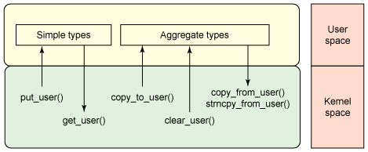

# [User space memory access from the Linux kernel](https://developer.ibm.com/articles/l-kernel-memory-access/)

- [User space memory access from the Linux kernel](#user-space-memory-access-from-the-linux-kernel)
  - [Linux memory](#linux-memory)
  - [Kernel APIs](#kernel-apis)
    - [The `access_ok` function](#the-access_ok-function)
    - [The `get_user` function](#the-get_user-function)
    - [The `put_user` function](#the-put_user-function)
    - [The `clear_user` function](#the-clear_user-function)
    - [The `copy_to_user` function](#the-copy_to_user-function)
    - [The `copy_from_user` function](#the-copy_from_user-function)
    - [The `strnlen_user` function](#the-strnlen_user-function)
    - [The `strncpy_from_user` function](#the-strncpy_from_user-function)
  - [Other schemes for memory mapping](#other-schemes-for-memory-mapping)
  - [Going further](#going-further)

Although the byte may be the lowest addressable unit of memory within Linux, it's the page that serves as the managed abstraction of memory. This article begins with a discussion of memory management within Linux, and then explores the methods for manipulation of user address space from the kernel.

## Linux memory

In Linux, **user memory** and **kernel memory** are independent and implemented in **separate address spaces**. The address spaces are virtualized, meaning that the addresses are abstracted from physical memory (through a process detailed shortly). Because the address spaces are virtualized, many can exist. In fact, the **kernel itself resides in one address space**, and **each process resides in its own address space**. These address spaces consist of virtual memory addresses, permitting many processes with independent address spaces to refer to a considerably smaller physical address space (the physical memory in the machine). Not only is this convenient, but it's also secure, because each address space is independent and isolated and therefore secure.

But there's a cost associated with this security. Because each process (and the kernel) can have identical addresses that refer to different regions of physical memory, it's not immediately possible to share memory. Luckily, a few solutions exist. User processes can share memory through the Portable Operating System Interface for UNIX (POSIX) shared memory mechanism (shmem), with the caveat that each process may have a different virtual address that refers to the same region of physical memory.

The mapping of virtual memory to physical memory occurs through page tables, which are implemented in the underlying hardware (see Figure 1). The hardware itself provides the mapping, but the kernel manages the tables and their configuration. Note that as shown here, a process may have a large address space, but it is sparse, meaning that small regions (pages) of the address space refer to physical memory through the page tables. This permits a process to have a massive address space that is defined only for the pages that are needed at any given time.

Figure 1. Page tables provide the mapping from virtual addresses to physical addresses

Having the ability to sparsely define memory for processes means that the underlying physical memory can be **overcommitted**. Through a process called paging (though in Linux, it's typically called swap), less-used pages are dynamically moved to a slower storage device (such as a disk) to accommodate other pages that need to be accessed (see Figure 2). This behavior allows the physical memory within the computer to serve pages that an application more readily needs while migrating less-needed pages to disk for improved utilization of the physical memory. Note that some pages can refer to files, in which case, the data can be flushed if dirty (through the page cache) or, if the page is clean, simply discarded.

Figure 2. Swap permits better use of the physical memory space by migrating less-used pages to slower and less expensive storage

The process by which a page is selected to swap to storage is called a **page-replacement algorithm** and can be implemented using a number of algorithms (such as least recently used). This process can occur when a memory location is requested whose page is not in memory (no mapping is present in the memory management unit [**MMU**]). This event is called a **page fault** and is detected by hardware (the MMU), and then managed by firmware after a page fault interrupt occurs. See Figure 3 for a illustration of this stack.

---

MMU-less architectures

Not all processors have MMUs. Therefore, the uClinux distribution (microcontroller Linux) supports a single address space of operation. This architecture lacks the protection offered by an MMU but permits Linux to run on another class of processor. See the resources section for information on uClinux.

---

Linux provides an interesting implementation of swap that offers some useful characteristics. The Linux swap system permits the creation and use of **multiple swap partitions and priorities**, which permits a hierarchy of swap over storage devices that provide different performance characteristics (for example, a **first-level swap** on a solid-state disk [SSD] and a larger, **second-level swap** space on a slower storage device). Attaching a higher priority to the SSD swap allows it to be used until exhausted; only then would pages be written to the lower-priority (slower) swap partition.

Figure 3. Address spaces and elements of virtual-to-physical address mapping

**Not all pages are candidates for swapping**. Consider **kernel code that responds to interrupts** or **code that manages the page tables and swap logic**. These are obvious pages that should never be swapped out and are therefore **pinned, or permanently resident in memory**. Although kernel pages are not candidates for swapping, user space pages are, but they can be pinned through the `mlock` (or `mlockall`) function to lock the page down. This is the purpose behind the user space memory access functions. If the kernel assumed that an address that a user passed was valid and accessible, a kernel panic would eventually occur (for example, because the user page was swapped out, resulting in a page fault in the kernel). This application programming interface (API) ensures that those corner cases are handled properly.

## Kernel APIs

Now, let's explore the kernel APIs for manipulating user memory. Note that this covers the kernel and the user space interface, but the next section explores some of the other memory APIs. The user space memory access functions to be explored are listed in Table 1.

Table 1. The User Space Memory Access API

|Function|Description|
|-|-|
access_ok|Checks the validity of the user space memory pointer
get_user|Gets a simple variable from user space
put_user|Puts a simple variable to user space
clear_user|Clears, or zeros, a block in user space
copy_to_user|Copies a block of data from the kernel to user space
copy_from_user|Copies a block of data from user space to the kernel
strnlen_user|Gets the size of a string buffer in user space
strncpy_from_user|Copies a string from user space into the kernel
|

As you would expect, the implementation of these functions can be architecture dependent. For x86 architectures, you can find these functions and symbols defined in `./linux/arch/x86/include/asm/uaccess.h`, with source in `./linux/arch/x86/lib/usercopy_32.c and usercopy_64.c`.

The role of the data-movement functions is shown in Figure 4 as it relates to the types involved for copy (simple vs. aggregate).

Figure 4. Data movement using the User Space Memory Access API

### The `access_ok` function

You use the `access_ok` function to check the validity of the pointer in user space that you intend to access. The caller provides the pointer, which refers to the start of the data block, the size of the block, and the type of access (whether the area is intended to be read or written). The function prototype is defined as:

    access_ok( type, addr, size );

The `type` argument can be specified as `VERIFY_READ` or `VERIFY_WRITE`. The `VERIFY_WRITE` symbolic also identifies whether the memory region is readable as well as writable. The function returns non-zero if the region is likely accessible (though access may still result in `-EFAULT`). This function simply checks that the address is likely in user space, not in the kernel.

### The `get_user` function

To read a simple variable from user space, you use the `get_user` function. This function is used for simple types such as char and int, but larger data types like structures must use the `copy_from_user` function, instead. The prototype accepts a variable (to store the data) and an address in user space for the Read operation:

    get_user( x, ptr );

The `get_user` function maps to one of two internal functions. Internally, this function determines the size of the variable being accessed (based on the variable provided to store the result) and forms an internal call through `__get_user_x`. This function returns zero on success. In general, the `get_user` and `put_user` functions are faster than their block copy counterparts and should be used if small types are moved.

### The `put_user` function

You use the `put_user` function to write a simple variable from the kernel into user space. Like `get_user`, it accepts a variable (which contains the value to write) and a user space address as the write target:

    put_user( x, ptr );

Like `get_user`, the `put_user` function is internally mapped over the `put_user_x` function and returns 0 on success or `-EFAULT` on error.

### The `clear_user` function

The `clear_user` function is used to zero a block of memory in user space. This function takes a pointer in user space and a size to zero, which is defined in bytes:

    clear_user( ptr, n );

Internally, the `clear_user` function first checks to see whether the user space pointer is writable (via `access_ok`), and then invokes an internal function (coded in inline assembly) to perform the Clear operation. This function is optimized as a very tight loop using string instructions with the repeat prefix. It returns the number of bytes that were not clearable or zero if the operation was successful.

### The `copy_to_user` function

The `copy_to_user` function copies a block of data from the kernel into user space. This function accepts a **pointer to a user space buffer**, a **pointer to a kernel buffer**, and a length defined in bytes. The function returns zero on success or non-zero to indicate the number of bytes that **weren't** transferred.

    copy_to_user( to, from, n );

After checking the ability to write to the user buffer (through `access_ok`), the internal function `__copy_to_user` is invoked, which in turn calls `__copy_from_user_inatomic` (in `./linux/arch/x86/include/asm/uaccessXX.h`, where `_XX` is 32 or 64 depending on architecture). This function (after determining whether to perform 1, 2 or 4 byte copies) finally calls `copy_to_user_ll`, which is where the real work is done. In broken hardware (prior to the i486, where the WP bit was not honored from supervisory mode), the page tables could change at any time, requiring a the desired pages to be pinned into memory so that they could not be swapped out while being addressed. Post i486, the process is nothing more than an optimized copy.

### The `copy_from_user` function

The `copy_from_user` function copies a block of data from user space into a kernel buffer. it accepts a destination buffer (in kernel space), a source buffer (from user space), and a length defined in bytes. As with `copy_to_user`, the function returns zero on success and non-zero to indicate a failure to copy some number of bytes.

    copy_from_user( to, from, n );

The function begins by checking the ability to read from the source buffer in user space (via `access_ok`), and then calls `__copy_from_user` and eventually `__copy_from_user_ll`. From here, depending on architecture, a call is made to copy from the user buffer to a kernel buffer with zeroing (of unavailable bytes). The optimized assembly functions include the ability to manage.

### The `strnlen_user` function

The `strnlen_user` function is used just like strnlen but assumes that the buffer is available in user space. The `strnlen_user function` takes two arguments: the user space buffer address and the maximum length to check.

    strnlen_user( src, n );

The `strnlen_user` function first checks to see that the user buffer is readable through a call to `access_ok`. If accessible, the strlen function is called, and the max length argument is ignored.

### The `strncpy_from_user` function

The `strncpy_from_user` function copies a string from user space into a kernel buffer, given a user space source address and max length.

    strncpy_from_user( dest, src, n );

As a copy from user space, this function first checks that the buffer is readable via `access_ok`. Similar to `copy_from_user`, this function is implemented as an optimized assembly function (within `./linux/arch/x86/lib/usercopy__XX._c`).

## Other schemes for memory mapping

The previous section explored methods for moving data between the kernel and user space (with the kernel initiating the operation). Linux provides a number of other methods that you can use for data movement, both in the kernel and in user space. Although these methods may not necessarily provide identical functionality as described by the user space memory access functions, they are similar in their ability to map memory between address spaces.

In user space, note that because user processes appear in separate address spaces, moving data between them must occur through some form of inter-process communication mechanism. Linux provides a variety of schemes (such as message queues), but most notable is POSIX shared memory (shmem). This mechanism allows a process to create an area of memory, and then share that region with one or more processes. Note that each process can map the shared memory region to different addresses in their respective address spaces. Therefore, relative offset addressing is required.

The `mmap` function allows a user space application to create a mapping in the virtual address space. This functionality is common in certain classes of device drivers (for performance), **allowing physical device memory to be mapped into the virtual address space of the process**. Within a driver, the `mmap` function is implemented through the `remap_pfn_range` kernel function, which provides a linear mapping of device memory into a user's address space.

## Going further

This article explored the topic of memory management within Linux (to arrive at the point behind paging), and then explored the user space memory access functions that use those concepts. Moving data between the user space and kernel is not as simple as it seems, but Linux includes a simple set of APIs that manage the intricacies of this task across platforms for you.
