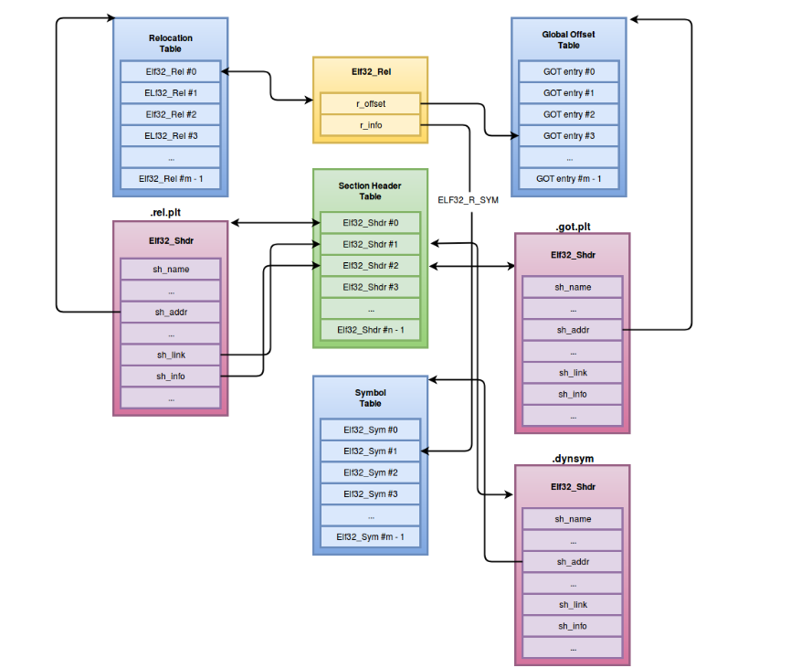

# [Executable and Linkable Format 101 Part 3: Relocations](https://www.intezer.com/blog/elf/executable-and-linkable-format-101-part-3-relocations/)

- [Executable and Linkable Format 101 Part 3: Relocations](#executable-and-linkable-format-101-part-3-relocations)
  - [1. Defining Relocations](#1-defining-relocations)
  - [2. Relocation entries](#2-relocation-entries)
  - [3. Relocation types:](#3-relocation-types)

## 1. Defining Relocations

In our previous post we covered what it means for a file to have symbolic information – when a file contains symbolic information it means that it contains source code exported **metadata**, in order to better interpret the generated machine code.

However, symbolic information by itself is useless. Symbolic references and symbolic definitions have to be connected with one another. The mechanism of connecting **symbolic references** with their correspondent **symbolic definitions** is what is know as **Relocations**.

Let's say we have a program that adds the value of two **global variables** together. In order for those variables to be successfully referenced in our program, their addresses within the process **virtual address** space have to be resolved. As an additional example, If our program is calling a **function from an external dependency**, the address of that function will also have to be computed prior to transferring control of execution to it. These two scenarios are examples of where relocations have to be applied.

During the compilation process of a program there is a specific stage were **relocatable objects** are generated. These relocatable objects contain all the information required to map symbolic references to its corresponding definitions. Populating symbolic references on symbolic definitions takes place during the linking phase of the compilation process.

There are different types of relocatable files:

- Generic object files (`*.o`).
- Kernel object files (`*.ko`).
- Shared object files (`*.so`).

Generic object files are the ones that are used for static linking, they are only relevant in the compilation process and essentially, any given symbolic definition will become part of the main executable being generated.

Obviously, this linking type has its benefits and flaws. On the benefits side, we should note that there is no need to rely on external dependencies to make the main executable work across different hosts. On the other hand, statically linked executables can become particularly large, since all needed dependencies of a given program will become part of the generated binary itself as previously mentioned.

Furthermore, another type of relocatable object are Kernel objects. These type of objects support being loaded to the kernel as a module (commonly known as LKM), without the need to restart the system. We will talk about Loadable Kernel Modules more thoroughly in future posts.

There are also shared objects. These type of relocatable files support being linked on runtime, and they may be shared across different processes.
Consequently, relocations of dynamic dependencies have to be done at runtime. This process is known as Dynamic Linking.

The reason these relocations take place at runtime, is that as opposed to static linking, the symbolic definitions do not exist within the main binary's context, but within external shared objects. These dynamic references will not be populated until the correspondent external dependencies are loaded into memory.

Image bases of dynamically linked dependencies are not deterministic, since they will differ even between different process instances of the same executable.
Furthermore, as an interesting fact, dynamic dependencies in Linux systems do not have preferred based image bases, as is the case with Windows systems – Process A `libc.so` will not be mapped at the same address as process B `libc.so`.

## 2. Relocation entries

Relocation information is held in relocatable entries, located in specific relocation sections within an ELF object. These entries are implemented in the form of structures. There are two different Relocation entry structures: `Elfxx_Rel` and `Elfxx_Rela`:

    typedef struct {
        Elf32_Addr r_offset;
        Elf32_Word r_info;
    } Elf32_Rel;

    typedef struct {
        Elf32_Addr r_offset;
        Elf32_Word r_info;
        Elf32_Sword r_addend;
    } Elf32_Rela;

As seen in the figure above, the only difference between both structures is that `Elfxx_Rela` contains one additional field dedicated as a relocation addend.

It is important to note that these relocation entry types are **mutually exclusive** within the context of a given ELF object. This means that if one type of entry is used, the other one will not be used consequently.

The reason for using one type of entry over the other, is usually architecture dependant. For example, in x86 only `Elf32_Rel` is used, while on x86_64 only `Elf64_Rela` is used. However this is not always valid for every architecture, for instance, SPARC always uses some instance of `Elfxx_Rela`.

The different fields in these structures are the following:

- `r_offset`: This field holds the location where a particular relocation has to take place, however it may have different interpretations depending on ELF object type.

  - For `ET_REL` type binaries, this value denotes an **offset** within a section header. in which the relocations have to take place
  - For `ET_EXEC` type binaries, this value denotes a **virtual address** affected by a relocation

- `r_info`: This field denotes both the **symbol index** within a symbol table of the correspondent symbol that has to be relocated, as well as the **relocation type** for that specific symbol. Both of these pieces of information can be retrieved from this field using the following macros:
  - `ELF32_R_SYM(info) ((info)>>8)`
  - `ELF32_R_TYPE(info) ((unsigned char)(info))`
  - `ELF64_R_SYM(info) ((info)>>32)`
  - `ELF64_R_TYPE(info) ((Elf64_Word)(info))`

- `r_addend`: This field specifies a constant addend to be added to compute the value to be stored in a given relocation reference.

These relocation entries are always found in some relocation section. Every relocation section may reference two additional sections.

A relocation section will always be linked to its correspondent symbol table. This symbol table can be located as a section in the Section Header Table, and its index can be retrieved by the `sh_link` field of the relocation section's `Elfxx_Shdr` instance.

As previously mentioned, if a file is of type `ET_REL`, a given relocation entry's `r_offset` will be an offset to a particular ELF section where a relocation has to take place. The section index where to apply that offset can be retrieved by the relocation section's `Elfxx_Shdr` `sh_info` field.

The following diagram illustrates the previous relationships of the relocation section.

The diagram above is a generic representation of the relationship between the different data structures involved in relocations. As mentioned before, the relocation section is linked to two other sections. One of them is the **symbol table**, where the symbols that will be relocated are held. In this case, the section is the `.dynsym` section, the symbol table that holds symbols for Dynamic Linking.

The additional section linked to the relocation section is **where the relocations are going to take place**. In this case, the section is the `.got.plt` section, which is a specific section dedicated to hold a table of pointers, as an interface for the application to **access relocated dynamically linked procedures addresses**. This table of pointers is also known as the **Global Offset Table (GOT)**. We will discuss the exact usage and mechanisms involved with this section in the next post.

## 3. Relocation types:

As mentioned before, the `r_info` field of `Elfxx_Rel` and `Elfxx_Rela` contains two encoded values, which are the **symbol index** where the relocation is being applied to and the **relocation type** to apply accordingly. There are various relocations types and usually, these relocation types are architecture dependant. In this post, we cover relocation types of x86 and x86_64, but it is advised to rely on the ELF documentation of a given architecture to know its specific relocation types.

The difference between relocation types **resides in the way the relocated value is calculated**. There are different variables that can potentially be involved in the calculation process.
