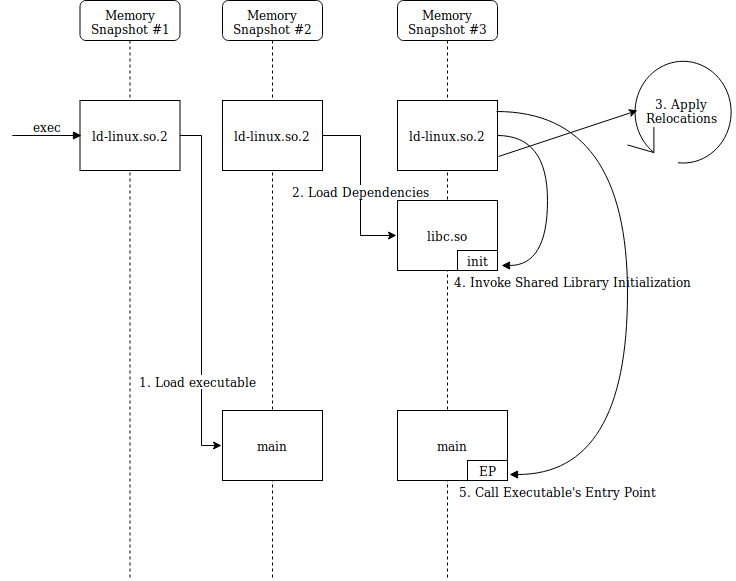
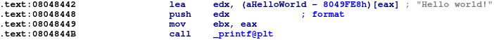
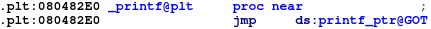
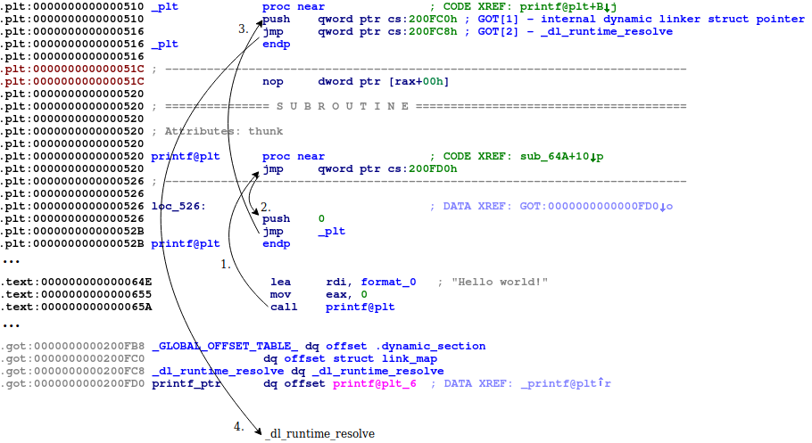

# [Executable and Linkable Format 101 Part 4: Dynamic Linking](https://www.intezer.com/blog/elf/executable-linkable-format-101-part-4-dynamic-linking/)

- [Executable and Linkable Format 101 Part 4: Dynamic Linking](#executable-and-linkable-format-101-part-4-dynamic-linking)
  - [Linking Overview](#linking-overview)
  - [The Dynamic Linking Process](#the-dynamic-linking-process)
  - [Lazy Linking](#lazy-linking)

## Linking Overview

In order to understand dynamic linking, we must first define linking. Linking is the process of joining together multiple object files, to create a shared library or an executable.

When one object file references functions or variables—which do not exist within the file’s context—but rather in other object files (dependencies), they must be linked. Linkers allow the use of separate, independent sources of code by providing a way to merge the code together into a single file, so the developer will be spared of this low-level detail.

There are two linking types:

- Static linking: Completed at the end of the compilation process

- Dynamic linking: Completed at load time by the system

Static linking is fairly simple:

The compile-time linker (`ld`) collects all relevant object files - `main.o` and the `libc.a` static library (a bundle of object-files) - applies relocations and combines the files into a single binary. As such, when many object files are linked, the resulting binary file size can become very large.

Dynamic linking, on the other hand, is a more complex process. Unlike in static linking, `ld` requires shared libraries to create a dynamically linked executable. The output file will contain the executable's code and **the names of the shared libraries required**, embedded within the binary:

When the binary is executed, the dynamic linker will find the required dependencies to load and link them together. Thereby, deferring the linking stage from compile-time to run-time. We will detail how this process works shortly.

There are pros and cons to these two approaches:

- Static linking allows containing all dependencies in a single binary, making it **more portable** and **simple to execute**, at the expense of the file size.

- Dynamic linking allows the binary to be **smaller**, at the expense of having to ensure that the **required dependencies exist** in the target system that the binary will be executed in.

## The Dynamic Linking Process

The dynamic linking process begins immediately after execution.

For statically linked programs, execution is straight forward. The system creates the memory layout from the file's segments and passes control to the file's entry point.

With dynamically linked programs, the system executes the file's "**interpreter**", which is an intermediate program that should **set up the environment** and **only then execute the main binary**. The interpreter lies in the **`PT_INTERP` segment** created by the compile-time linker (ld). In this case, the interpreter is the dynamic linker program `ld-linux.so.2`.

The dynamic linker will set up the environment using dynamic entries from the `.dynamic` section.

These entries are crucial to the dynamic linker, which include:

- `DT_NEEDED` – the name of a required dependency to load.
- `DT_SYMTAB` – the address of the dynamic symbol table (covered in our [previous blog post](https://www.intezer.com//executable-linkable-format-101-part-2-symbols/) about symbols).
- `DT_FLAGS` – such as the `BIND_NOW` flag that instructs the dynamic linker to perform all linking before handing over control to the program.

When the binary is executed, the system **loads the dynamic linker** into memory and **execution will be passed to the dynamic linker's entry point**. The dynamic linker begins preparing the environment as follows:

1. Load the original file's `PT_LOAD` segments in memory.

2. Use the `.dynamic` section/segment to read dependencies, search for them on disk and load them in memory as well. This is done recursively for dependent libraries - they can be dynamically linked as well. The dependency searching algorithm is outlined in the [`ld.so` man page](http://man7.org/linux/man-pages/man8/ld.so.8.html).

3. Perform relocations – shared libraries are loaded into non-deterministic addresses and must have absolute addresses patched, as well as resolving references to other object files.

4. Invoke shared library initialization functions (registered in the `.preinit_array`, `.init`, `.init_array` sections).

5. Finally, pass control back to the original binary's entry point, making it seem to the binary that control was passed directly from `exec`.

It is important to mention the `LD_PRELOAD` feature, which enables defined libraries to precede the loading of other dependencies. This is useful for overriding functions in other linked modules. This feature can be configured via the `LD_PRELOAD` environment variable, or via the `/etc/ld.so.preload` file.

Another interesting feature is `LD_LIBRARY_PATH`. This environment variable holds the path to the first directory where dependencies will be searched for, and is therefore abused by some malware developers as well.

Additional environment variables and configuration files that can alter the dynamic linker's behavior do exist, and will be covered in the future dedicatedly.

## Lazy Linking

We mentioned earlier that the dynamic linker performs all relocations before handing over control to the main binary, however, this is not always the case.

Lazy linking instructs the dynamic linker to resolve function references when they are called (lazily) instead of at load-time (eagerly).

This is enabled by the **Procedure Linkage Table (PLT)** and the **Global Offset Table (GOT)**.

The GOT holds entries of addresses of global variables and external functions.

The PLT consists of short entries of instructions (often called "**trampolines**" or "**thunks**"), used to **reach external functions by redirecting control flow of execution to its corresponding GOT entry**.

Generally speaking, in dynamically linked executables, external functions are reached by **calling their respective PLT entry**:

The PLT entry will retrieve the function's address from the function’s GOT entry, and call it:

With early binding, GOT entries are relocated by the dynamic linker at load-time.

With lazy linking, the GOT entries will be relocated on-demand by a function call. At a function's first invocation, the PLT will be used to call the dynamic linker to link the missing function.

We will compile the last example with lazy linking this time.

    gcc main.c -zlazy -o main

Now, we can see what happens when a function is called for the first time:

1. The `printf` PLT entry is called, the GOT entry is retrieved and jumped to.

2. At load-time, the dynamic linker fills every **GOT entry** with the address **pointing to the second instruction of the respective PLT entry**. Therefore, `printf`'s GOT entry will point back to `printf@plt+0x6`. The dynamic linker needs to know which function needs to be relocated, so we push a number to the stack (I.E. `0`): An index, which serves as the **index of the relocation** in the `.rel.plt` section, is used to calculate the requested entry in the GOT (`GOT[index+3]` - the first three indexes are reserved to addresses related to the dynamic linker as seen in the illustration).

3. The first PLT entry (`PLT[0]`) is called, whose purpose is to call the dynamic linker's `_dl_runtime_resolve` to resolve the designated relocation.

4. Consequently, control will be passed to the dynamic linker. The dynamic linker will relocate the `printf` GOT entry to point to the correct address within `libc.so`, and finally pass control to printf.

Future calls to `printf@plt` will retrieve printf's resolved address residing in the GOT and jump there immediately.

TODO elf eeeeeeeeeeeeeeeeeeeeeeeeeeeeeeeeeeeeeeeeeeeeeeeeeeeeeeeeeeeeeeeeeeeeeeeeeeeeeeeeeeeeeeeeeeeeeeeeeeeeeeeeeeeeeeeeeeeeeeeeeeee