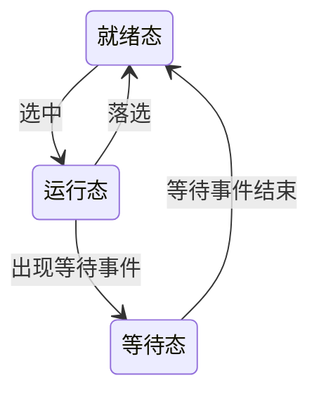
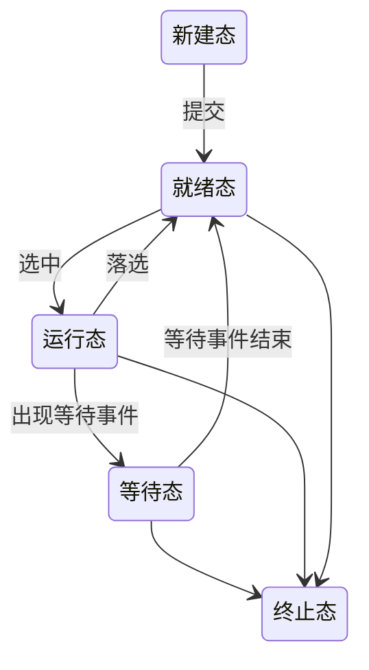
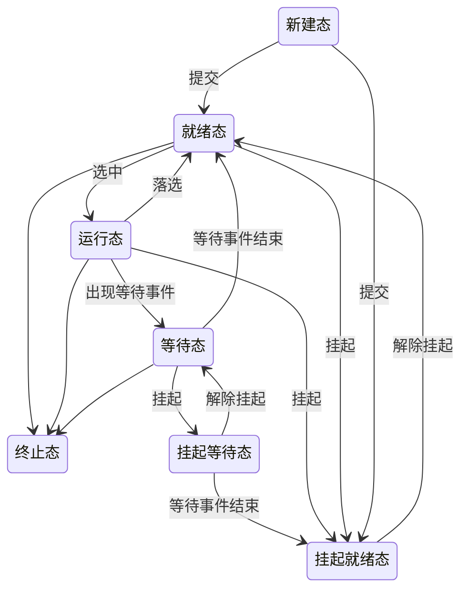
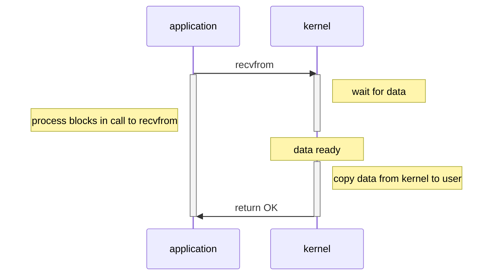
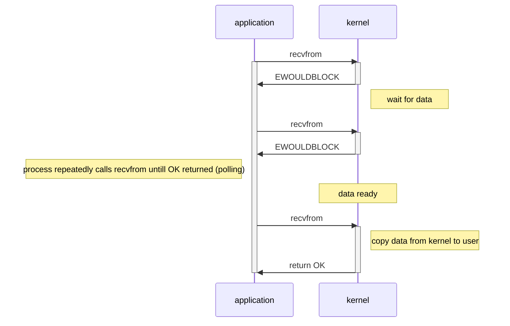
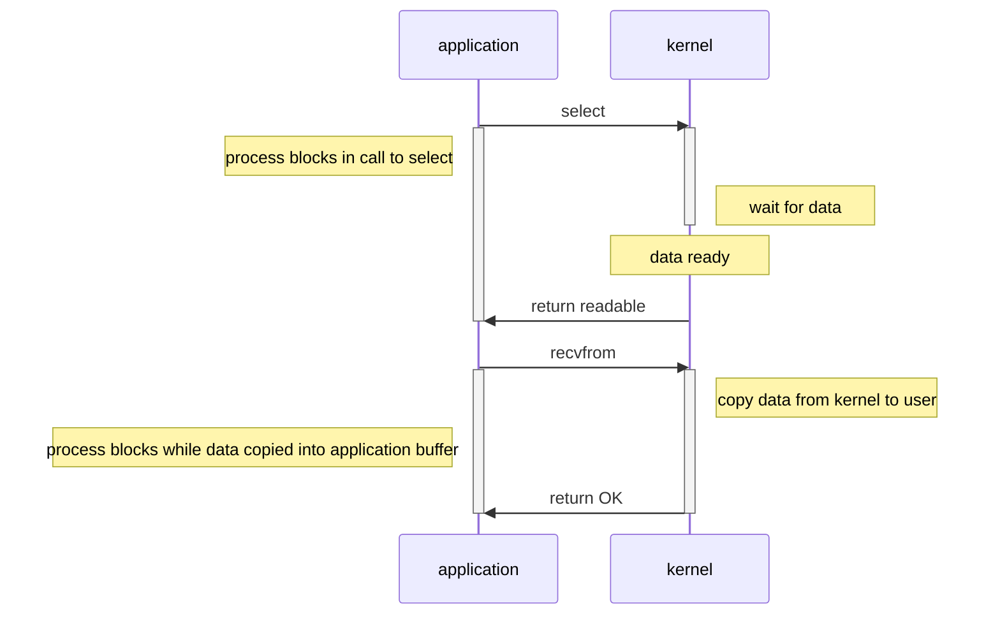
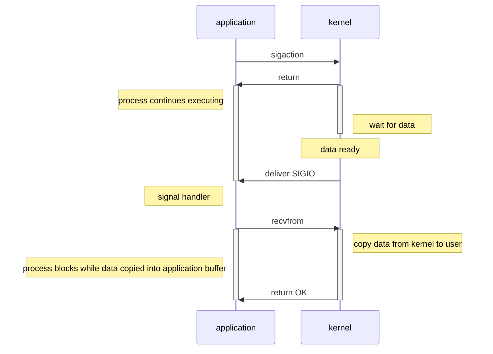
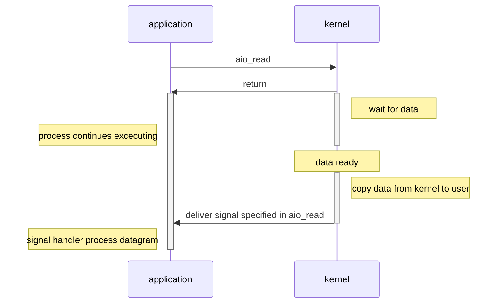

# 整理

- [整理](#%e6%95%b4%e7%90%86)
  - [线程/进程](#%e7%ba%bf%e7%a8%8b%e8%bf%9b%e7%a8%8b)
    - [进程状态切换](#%e8%bf%9b%e7%a8%8b%e7%8a%b6%e6%80%81%e5%88%87%e6%8d%a2)
      - [三态模型](#%e4%b8%89%e6%80%81%e6%a8%a1%e5%9e%8b)
      - [五态模型](#%e4%ba%94%e6%80%81%e6%a8%a1%e5%9e%8b)
      - [七态模型](#%e4%b8%83%e6%80%81%e6%a8%a1%e5%9e%8b)
    - [进程间通信方式](#%e8%bf%9b%e7%a8%8b%e9%97%b4%e9%80%9a%e4%bf%a1%e6%96%b9%e5%bc%8f)
  - [网络编程](#%e7%bd%91%e7%bb%9c%e7%bc%96%e7%a8%8b)
    - [5种IO模型](#5%e7%a7%8dio%e6%a8%a1%e5%9e%8b)
      - [阻塞IO(blocking I/O)](#%e9%98%bb%e5%a1%9eioblocking-io)
      - [非阻塞IO(noblocking I/O)](#%e9%9d%9e%e9%98%bb%e5%a1%9eionoblocking-io)
      - [IO多路复用(I/O multiplexing)](#io%e5%a4%9a%e8%b7%af%e5%a4%8d%e7%94%a8io-multiplexing)
      - [信号驱动IO(signal blocking I/O)](#%e4%bf%a1%e5%8f%b7%e9%a9%b1%e5%8a%a8iosignal-blocking-io)
      - [异步IO(asynchronous I/O)](#%e5%bc%82%e6%ad%a5ioasynchronous-io)

## 线程/进程

### 进程状态切换

#### 三态模型

- 运行态(running): 占有处理器正在运行
- 就绪态(ready): 具备运行条件，等待系统分配处理器以便运行
- 等待态(blocked): 不具备运行条件，正在等待某个事件的完成

- 运行态 $\rightarrow$ 等待态: 等待使用资源, 如等待外设传输/等待人工干预
- 等待态 $\rightarrow$ 就绪态: 资源得到满足, 如外设传输结束/人工干预完成
- 运行态 $\rightarrow$ 就绪态: 运行时间片到, 出现有更高优先权进程
- 就绪态 $\rightarrow$ 运行态: CPU 空闲时选择一个就绪进程

#### 五态模型

- 新建态(new): 进程没有被提交执行, 等待操作系统完成创建进程的必要操作. 操作系统有时将根据系统性能或主存容量的限制推迟新建态进程的提交
- 终止态(exit): 进程不再执行, 保留在操作系统中等待善后. 一旦其他进程完成了对终止态进程的信息抽取之后, 操作系统将删除该进程

- NULL $\rightarrow$ 新建态: 执行一个程序, 创建一个子进程
- 新建态 $\rightarrow$ 就绪态: 当操作系统完成了进程创建的必要操作, 并且当前系统的性能和虚拟内存的容量均允许
- 运行态 $\rightarrow$ 终止态: 当一个进程到达了自然结束点, 或是出现了无法克服的错误, 或是被操作系统所终结, 或是被其他有终止权的进程所终结
- 终止态 $\rightarrow$ NULL: 完成善后操作
- 就绪态 $\rightarrow$ 终止态: 某些操作系统允许父进程终结子进程
- 等待态 $\rightarrow$ 终止态：某些操作系统允许父进程终结子进程

#### 七态模型

- 挂起就绪态(ready, suspend): 挂起就绪态表明了进程具备运行条件但目前在二级存储器中, 只有当它被对换到主存才能被调度执行
- 挂起等待态(blocked, suspend): 挂起等待态则表明了进程正在等待某一个事件且在二级存储器中

挂起的进程被对换到磁盘镜像区中, 暂时不参与进程调度，起到平滑系统操作负荷的目的.

挂起进程的特征:

1. 该进程不能立即被执行
2. 挂起进程可能会等待一个事件, 但所等待的事件是独立于挂起条件的, 事件结束并不能导致进程具备执行条件
3. 进程进入挂起状态是由于操作系统、父进程或进程本身阻止它的运行
4. 结束进程挂起状态的命令只能通过操作系统或父进程发出

引起进程挂起的原因主要有:

1. 系统中的进程均处于等待状态, 处理器空闲, 此时需要把一些阻塞进程对换出去, 以腾出足够的内存装入就绪进程运行
2. 进程竞争资源, 导致系统资源不足, 负荷过重, 此时需要挂起部分进程以调整系统负荷, 保证系统的实时性或让系统正常运行
3. 把一些定期执行的进程(如审计程序/监控程序/记账程序)对换出去, 以减轻系统负荷
4. 用户要求挂起自己的进程, 以便根据中间执行情况和中间结果进行某些调试/检查和改正
5. 父进程要求挂起自己的后代进程, 以进行某些检查和改正
6. 操作系统需要挂起某些进程, 检查运行中资源使用情况, 以改善系统性能; 或当系统出现故障或某些功能受到破坏时, 需要挂起某些进程以排除故障

- 等待态 $\rightarrow$ 挂起等待态: 如果当前不存在就绪进程, 那么至少有一个等待态进程将被对换出去成为挂起等待态；操作系统根据当前资源状况和性能要求, 可以决定把等待态进程对换出去成为挂起等待态
- 挂起等待态 $\rightarrow$ 挂起就绪态: 引起进程等待的事件发生之后, 相应的挂起等待态进程将转换为挂起就绪态
- 挂起就绪态 $\rightarrow$ 就绪态: 当内存中没有就绪态进程, 或者挂起就绪态进程具有比就绪态进程更高的优先级, 系统将把挂起就绪态进程转换成就绪态
- 就绪态 $\rightarrow$ 挂起就绪态: 操作系统根据当前资源状况和性能要求, 也可以决定把就绪态进程对换出去成为挂起就绪态
- 挂起等待态 $\rightarrow$ 等待态：当一个进程等待一个事件时，原则上不需要把它调入内存. 但是在下面一种情况下, 这一状态变化是可能的. 当一个进程退出后, 主存已经有了一大块自由空间, 而某个挂起等待态进程具有较高的优先级并且操作系统已经得知导致它阻塞的事件即将结束, 此时便发生了这一状态变化
- 运行态 $\rightarrow$ 挂起就绪态: 当一个具有较高优先级的挂起等待态进程的等待事件结束后, 它需要抢占CPU, 而此时主存空间不够, 从而可能导致正在运行的进程转化为挂起就绪态. 另外处于运行态的进程也可以自己挂起自己
- 新建态 $\rightarrow$ 挂起就绪态: 考虑到系统当前资源状况和性能要求, 可以决定新建的进程将被对换出去成为挂起就绪态

### 进程间通信方式

- 管道(pipe)及有名管道(named pipe): 管道可用于具有亲缘关系的父子进程间的通信, 有名管道除了具有管道所具有的功能外, 它还允许无亲缘关系进程间的通信。

- 信号(signal): 信号是在软件层次上对中断机制的一种模拟, 它是比较复杂的通信方式, 用于通知进程有某事件发生, 一个进程收到一个信号与处理器收到一个中断请求效果上可以说是一致的

- 消息队列(message queue): 消息队列是消息的链接表, 它克服了上两种通信方式中信号量有限的缺点, 具有写权限得进程可以按照一定得规则向消息队列中添加新信息; 对消息队列有读权限得进程则可以从消息队列中读取信息

- 共享内存(shared memory): 可以说这是最有用的进程间通信方式. 它使得多个进程可以访问同一块内存空间, 不同进程可以及时看到对方进程中对共享内存中数据得更新. 这种方式需要依靠某种同步操作, 如互斥锁和信号量等

- 信号量(semaphore): 主要作为进程之间及同一种进程的不同线程之间得同步和互斥手段

- 套接字(socket): 这是一种更为一般得进程间通信机制, 它可用于网络中不同机器之间的进程间通信, 应用非常广泛

## 网络编程

### 5种IO模型

输入操作可分为两个阶段:

1. 等待数据就绪
2. 将数据从内核空间拷贝至用户空间

根据第2个阶段是否阻塞, 可将I/O分为同步I/O和异步I/O.  
阻塞IO/非阻塞IO/信号驱动IO/IO多路复用属于同步I/O, 其仅在第1个阶段由区别.

#### 阻塞IO(blocking I/O)

#### 非阻塞IO(noblocking I/O)

#### IO多路复用(I/O multiplexing)

#### 信号驱动IO(signal blocking I/O)

#### 异步IO(asynchronous I/O)

异步I/O与信号驱动I/O的主要区别是, 异步I/O由内核通知I/O操作已结束, 信号驱动I/O由内核通知I/O操作可执行.

