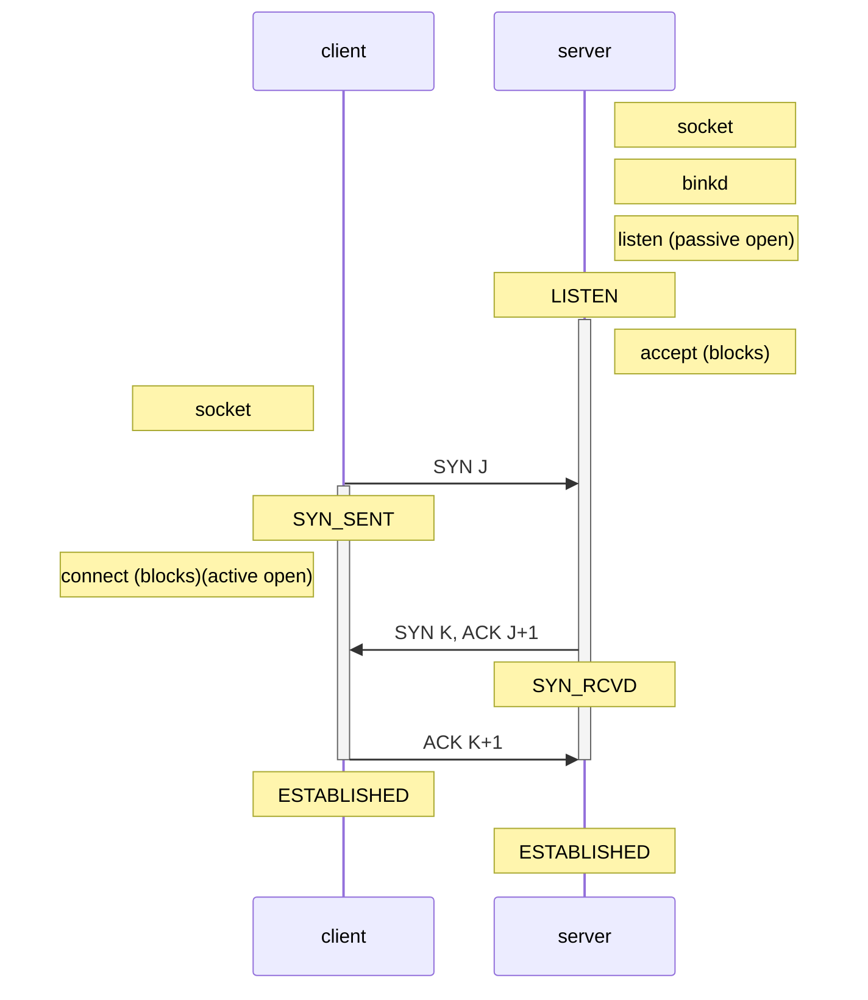
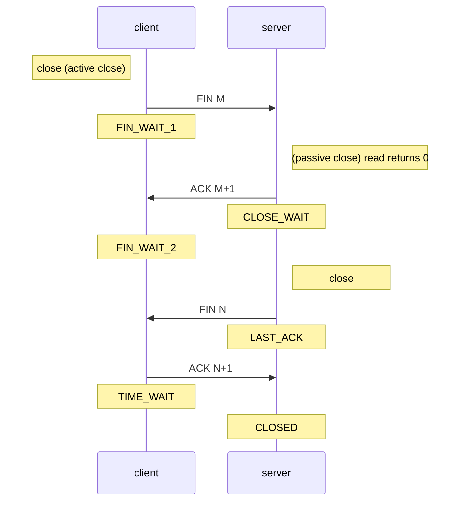

# 整理

- [整理](#%e6%95%b4%e7%90%86)
  - [并发编程](#%e5%b9%b6%e5%8f%91%e7%bc%96%e7%a8%8b)
    - [进程](#%e8%bf%9b%e7%a8%8b)
      - [进程状态切换](#%e8%bf%9b%e7%a8%8b%e7%8a%b6%e6%80%81%e5%88%87%e6%8d%a2)
        - [三态模型](#%e4%b8%89%e6%80%81%e6%a8%a1%e5%9e%8b)
        - [五态模型](#%e4%ba%94%e6%80%81%e6%a8%a1%e5%9e%8b)
        - [七态模型](#%e4%b8%83%e6%80%81%e6%a8%a1%e5%9e%8b)
      - [进程间通信方式](#%e8%bf%9b%e7%a8%8b%e9%97%b4%e9%80%9a%e4%bf%a1%e6%96%b9%e5%bc%8f)
      - [进程上下文](#%e8%bf%9b%e7%a8%8b%e4%b8%8a%e4%b8%8b%e6%96%87)
        - [PCB](#pcb)
      - [CPU利用率](#cpu%e5%88%a9%e7%94%a8%e7%8e%87)
    - [线程](#%e7%ba%bf%e7%a8%8b)
      - [内存模型](#%e5%86%85%e5%ad%98%e6%a8%a1%e5%9e%8b)
      - [线程间同步方式](#%e7%ba%bf%e7%a8%8b%e9%97%b4%e5%90%8c%e6%ad%a5%e6%96%b9%e5%bc%8f)
      - [死锁问题](#%e6%ad%bb%e9%94%81%e9%97%ae%e9%a2%98)
      - [线程池](#%e7%ba%bf%e7%a8%8b%e6%b1%a0)
        - [线程数](#%e7%ba%bf%e7%a8%8b%e6%95%b0)
    - [生产者/消费者模式](#%e7%94%9f%e4%ba%a7%e8%80%85%e6%b6%88%e8%b4%b9%e8%80%85%e6%a8%a1%e5%bc%8f)
    - [Reactor](#reactor)
    - [Proactor](#proactor)
  - [网络编程](#%e7%bd%91%e7%bb%9c%e7%bc%96%e7%a8%8b)
    - [TCP](#tcp)
      - [TCP连接](#tcp%e8%bf%9e%e6%8e%a5)
        - [三次握手](#%e4%b8%89%e6%ac%a1%e6%8f%a1%e6%89%8b)
          - [SYN](#syn)
          - [ACK](#ack)
          - [TCP选项](#tcp%e9%80%89%e9%a1%b9)
        - [TCP连接断开](#tcp%e8%bf%9e%e6%8e%a5%e6%96%ad%e5%bc%80)
      - [TCP状态](#tcp%e7%8a%b6%e6%80%81)
        - [2MSL TIME_WAIT](#2msl-timewait)
      - [TCP粘包](#tcp%e7%b2%98%e5%8c%85)
      - [可靠性](#%e5%8f%af%e9%9d%a0%e6%80%a7)
      - [流量控制](#%e6%b5%81%e9%87%8f%e6%8e%a7%e5%88%b6)
      - [滑动窗口](#%e6%bb%91%e5%8a%a8%e7%aa%97%e5%8f%a3)
    - [IO模型](#io%e6%a8%a1%e5%9e%8b)
      - [5种IO模型](#5%e7%a7%8dio%e6%a8%a1%e5%9e%8b)
        - [阻塞IO(blocking I/O)](#%e9%98%bb%e5%a1%9eioblocking-io)
        - [非阻塞IO(noblocking I/O)](#%e9%9d%9e%e9%98%bb%e5%a1%9eionoblocking-io)
        - [IO多路复用(I/O multiplexing)](#io%e5%a4%9a%e8%b7%af%e5%a4%8d%e7%94%a8io-multiplexing)
        - [信号驱动IO(signal blocking I/O)](#%e4%bf%a1%e5%8f%b7%e9%a9%b1%e5%8a%a8iosignal-blocking-io)
        - [异步IO(asynchronous I/O)](#%e5%bc%82%e6%ad%a5ioasynchronous-io)
      - [IO多路复用](#io%e5%a4%9a%e8%b7%af%e5%a4%8d%e7%94%a8)
        - [select/poll/epoll](#selectpollepoll)
  - [网络协议](#%e7%bd%91%e7%bb%9c%e5%8d%8f%e8%ae%ae)
    - [ARP协议](#arp%e5%8d%8f%e8%ae%ae)
    - [IP协议](#ip%e5%8d%8f%e8%ae%ae)
      - [分片](#%e5%88%86%e7%89%87)
        - [MTU](#mtu)
    - [ICMP协议](#icmp%e5%8d%8f%e8%ae%ae)
    - [IGMP协议](#igmp%e5%8d%8f%e8%ae%ae)
    - [TCP协议](#tcp%e5%8d%8f%e8%ae%ae)
      - [MSS](#mss)
  - [分布式](#%e5%88%86%e5%b8%83%e5%bc%8f)
    - [负载均衡](#%e8%b4%9f%e8%bd%bd%e5%9d%87%e8%a1%a1)
    - [zookeeper](#zookeeper)
    - [分布式缓存](#%e5%88%86%e5%b8%83%e5%bc%8f%e7%bc%93%e5%ad%98)
    - [分布式存储](#%e5%88%86%e5%b8%83%e5%bc%8f%e5%ad%98%e5%82%a8)
    - [消息队列](#%e6%b6%88%e6%81%af%e9%98%9f%e5%88%97)
  - [C++](#c)
    - [RAII](#raii)
    - [多态](#%e5%a4%9a%e6%80%81)
      - [虚函数](#%e8%99%9a%e5%87%bd%e6%95%b0)
      - [析构函数](#%e6%9e%90%e6%9e%84%e5%87%bd%e6%95%b0)
    - [类型转换](#%e7%b1%bb%e5%9e%8b%e8%bd%ac%e6%8d%a2)
    - [异常](#%e5%bc%82%e5%b8%b8)
    - [内存泄漏](#%e5%86%85%e5%ad%98%e6%b3%84%e6%bc%8f)
    - [多线程](#%e5%a4%9a%e7%ba%bf%e7%a8%8b)
    - [静态库/共享库](#%e9%9d%99%e6%80%81%e5%ba%93%e5%85%b1%e4%ba%ab%e5%ba%93)
  - [面向对象](#%e9%9d%a2%e5%90%91%e5%af%b9%e8%b1%a1)
    - [面向对象设计七大原则](#%e9%9d%a2%e5%90%91%e5%af%b9%e8%b1%a1%e8%ae%be%e8%ae%a1%e4%b8%83%e5%a4%a7%e5%8e%9f%e5%88%99)
    - [设计模式](#%e8%ae%be%e8%ae%a1%e6%a8%a1%e5%bc%8f)
      - [设计模式的分类](#%e8%ae%be%e8%ae%a1%e6%a8%a1%e5%bc%8f%e7%9a%84%e5%88%86%e7%b1%bb)
        - [根据目的分类](#%e6%a0%b9%e6%8d%ae%e7%9b%ae%e7%9a%84%e5%88%86%e7%b1%bb)
        - [根据范围分类](#%e6%a0%b9%e6%8d%ae%e8%8c%83%e5%9b%b4%e5%88%86%e7%b1%bb)
      - [创建型模式](#%e5%88%9b%e5%bb%ba%e5%9e%8b%e6%a8%a1%e5%bc%8f)
      - [结构型模式](#%e7%bb%93%e6%9e%84%e5%9e%8b%e6%a8%a1%e5%bc%8f)
      - [行为型模式](#%e8%a1%8c%e4%b8%ba%e5%9e%8b%e6%a8%a1%e5%bc%8f)
  - [数据库](#%e6%95%b0%e6%8d%ae%e5%ba%93)
    - [连接池](#%e8%bf%9e%e6%8e%a5%e6%b1%a0)

## 并发编程

### 进程

#### 进程状态切换

##### 三态模型

- 运行态(running): 占有处理器正在运行
- 就绪态(ready): 具备运行条件，等待系统分配处理器以便运行
- 等待态(blocked): 不具备运行条件，正在等待某个事件的完成

- 运行态 $\rightarrow$ 等待态: 等待使用资源, 如等待外设传输/等待人工干预
- 等待态 $\rightarrow$ 就绪态: 资源得到满足, 如外设传输结束/人工干预完成
- 运行态 $\rightarrow$ 就绪态: 运行时间片到, 出现有更高优先权进程
- 就绪态 $\rightarrow$ 运行态: CPU 空闲时选择一个就绪进程

##### 五态模型

- 新建态(new): 进程没有被提交执行, 等待操作系统完成创建进程的必要操作. 操作系统有时将根据系统性能或主存容量的限制推迟新建态进程的提交
- 终止态(exit): 进程不再执行, 保留在操作系统中等待善后. 一旦其他进程完成了对终止态进程的信息抽取之后, 操作系统将删除该进程

- NULL $\rightarrow$ 新建态: 执行一个程序, 创建一个子进程
- 新建态 $\rightarrow$ 就绪态: 当操作系统完成了进程创建的必要操作, 并且当前系统的性能和虚拟内存的容量均允许
- 运行态 $\rightarrow$ 终止态: 当一个进程到达了自然结束点, 或是出现了无法克服的错误, 或是被操作系统所终结, 或是被其他有终止权的进程所终结
- 终止态 $\rightarrow$ NULL: 完成善后操作
- 就绪态 $\rightarrow$ 终止态: 某些操作系统允许父进程终结子进程
- 等待态 $\rightarrow$ 终止态：某些操作系统允许父进程终结子进程

##### 七态模型

- 挂起就绪态(ready, suspend): 挂起就绪态表明了进程具备运行条件但目前在二级存储器中, 只有当它被对换到主存才能被调度执行
- 挂起等待态(blocked, suspend): 挂起等待态则表明了进程正在等待某一个事件且在二级存储器中

挂起的进程被对换到磁盘镜像区中, 暂时不参与进程调度，起到平滑系统操作负荷的目的.

挂起进程的特征:

1. 该进程不能立即被执行
2. 挂起进程可能会等待一个事件, 但所等待的事件是独立于挂起条件的, 事件结束并不能导致进程具备执行条件
3. 进程进入挂起状态是由于操作系统、父进程或进程本身阻止它的运行
4. 结束进程挂起状态的命令只能通过操作系统或父进程发出

引起进程挂起的原因主要有:

1. 系统中的进程均处于等待状态, 处理器空闲, 此时需要把一些阻塞进程对换出去, 以腾出足够的内存装入就绪进程运行
2. 进程竞争资源, 导致系统资源不足, 负荷过重, 此时需要挂起部分进程以调整系统负荷, 保证系统的实时性或让系统正常运行
3. 把一些定期执行的进程(如审计程序/监控程序/记账程序)对换出去, 以减轻系统负荷
4. 用户要求挂起自己的进程, 以便根据中间执行情况和中间结果进行某些调试/检查和改正
5. 父进程要求挂起自己的后代进程, 以进行某些检查和改正
6. 操作系统需要挂起某些进程, 检查运行中资源使用情况, 以改善系统性能; 或当系统出现故障或某些功能受到破坏时, 需要挂起某些进程以排除故障

- 等待态 $\rightarrow$ 挂起等待态: 如果当前不存在就绪进程, 那么至少有一个等待态进程将被对换出去成为挂起等待态；操作系统根据当前资源状况和性能要求, 可以决定把等待态进程对换出去成为挂起等待态
- 挂起等待态 $\rightarrow$ 挂起就绪态: 引起进程等待的事件发生之后, 相应的挂起等待态进程将转换为挂起就绪态
- 挂起就绪态 $\rightarrow$ 就绪态: 当内存中没有就绪态进程, 或者挂起就绪态进程具有比就绪态进程更高的优先级, 系统将把挂起就绪态进程转换成就绪态
- 就绪态 $\rightarrow$ 挂起就绪态: 操作系统根据当前资源状况和性能要求, 也可以决定把就绪态进程对换出去成为挂起就绪态
- 挂起等待态 $\rightarrow$ 等待态：当一个进程等待一个事件时，原则上不需要把它调入内存. 但是在下面一种情况下, 这一状态变化是可能的. 当一个进程退出后, 主存已经有了一大块自由空间, 而某个挂起等待态进程具有较高的优先级并且操作系统已经得知导致它阻塞的事件即将结束, 此时便发生了这一状态变化
- 运行态 $\rightarrow$ 挂起就绪态: 当一个具有较高优先级的挂起等待态进程的等待事件结束后, 它需要抢占CPU, 而此时主存空间不够, 从而可能导致正在运行的进程转化为挂起就绪态. 另外处于运行态的进程也可以自己挂起自己
- 新建态 $\rightarrow$ 挂起就绪态: 考虑到系统当前资源状况和性能要求, 可以决定新建的进程将被对换出去成为挂起就绪态

#### 进程间通信方式

- 管道(pipe)及有名管道(named pipe): 管道可用于具有亲缘关系的父子进程间的通信, 有名管道除了具有管道所具有的功能外, 它还允许无亲缘关系进程间的通信。

- 信号(signal): 信号是在软件层次上对中断机制的一种模拟, 它是比较复杂的通信方式, 用于通知进程有某事件发生, 一个进程收到一个信号与处理器收到一个中断请求效果上可以说是一致的

- 消息队列(message queue): 消息队列是消息的链接表, 它克服了上两种通信方式中信号量有限的缺点, 具有写权限得进程可以按照一定得规则向消息队列中添加新信息; 对消息队列有读权限得进程则可以从消息队列中读取信息

- 共享内存(shared memory): 可以说这是最有用的进程间通信方式. 它使得多个进程可以访问同一块内存空间, 不同进程可以及时看到对方进程中对共享内存中数据得更新. 这种方式需要依靠某种同步操作, 如互斥锁和信号量等

- 信号量(semaphore): 主要作为进程之间及同一种进程的不同线程之间得同步和互斥手段

- 套接字(socket): 这是一种更为一般得进程间通信机制, 它可用于网络中不同机器之间的进程间通信, 应用非常广泛

#### 进程上下文

##### PCB

#### CPU利用率

### 线程

#### 内存模型

#### 线程间同步方式

#### 死锁问题

#### 线程池

##### 线程数

### 生产者/消费者模式

### Reactor

### Proactor

## 网络编程

### TCP

#### TCP连接

##### 三次握手

###### SYN

SYN(Synchronize Sequence Numbers, 同步序列编号)

通常SYN包中仅包含IP头、TCP头及可能包含的TCP选项

###### ACK

ACK包中的确认号表示发送ACK端期望对端下次发送的序列号, SYN包占据序列号空间中的一个位置, 因此与SYN包对应的ACK包的确认号为初始序列号(Initial Sequence Number)加1. 同样, FIN包对应的ACK包的确认号为FIN包的序列号加1.

服务端维护未连接队列, 收到客户端SYN包后, 服务端向客户端发出确认包, 并在未连接队列中创建相应条目, 以标识该连接在服务端处于SYN_RECV状态. 服务端收到客户端确认包后, 未连接队列中的相应条目被删除, 连接在服务端处于ESTABLISHED状态.

###### TCP选项

- MSS选项  
  用于SYN包发送方声明本端MSS(maximum segment size), 即本端能接受的TCP报文的最大数据段长度(MSS不包括TCP头). TCP报文发送方根据对端MSS决定本端发送分段的最大长度.

##### TCP连接断开

客户端与服务端均可进行主动关闭, 进行主动关闭的一方将会进入TIME_WAIT状态.

#### TCP状态

- CLOSED: 表示初始状态

- LISTEN: 该状态表示服务器端的某个SOCKET处于监听状态, 可以接受连接

- SYN_SENT: 客户端发送SYN报文后进入SYN_SENT状态

- SYN_RCVD: 该状态表示接收到SYN报文

- ESTABLISHED: 表示连接已经建立

- FIN_WAIT_1: 主动关闭方发送FIN报文后进FIN_WAIT_1状态

- FIN_WAIT_2: 主动关闭方发送FIN报文后, 收到对端ACK回应后进入到FIN_WAIT_2状态. 此时主动关闭方处于半关闭状态, 该状态下只能接受数据, 不能发送数据. 正常情况下, 对方应马上回应ACK报文, 所以FIN_WAIT_1状态一般较难见到, 而FIN_WAIT_2状态可用netstat看到 

- TIME_WAIT: 表示收到了对方的FIN报文, 并发送出了ACK报文, 等2MSL后即可回到CLOSED可用状态. 如果FIN_WAIT_1状态下, 收到对方同时带FIN标志和ACK标志的报文, 可以直接进入到TIME_WAIT状态，而无须经过FIN_WAIT_2状态

- CLOSING: 这种状态较特殊, 属于一种较罕见的状态. 双方几乎同时关闭时会进入该状态

- CLOSE_WAIT: 被动关闭方收到FIN报文并发送ACK报文后进入该状态

- LAST_ACK: 该状态是被动关闭一方在发送FIN报文后进入该状态. 当收到ACK报文后，即可以进入到CLOSED可用状态

##### 2MSL TIME_WAIT

MSL(Maximum Segment Lifetime)

2MSL TIME_WAIT状态的存在的理由:

1. 让4次挥手关闭流程更加可靠  
   4次挥手的最后一个ACK是由主动关闭方发送的. 若这个ACK丢失, 被动关闭方会再次发一个FIN. 若主动关闭方能够保持一个2MSL的TIME_WAIT状态, 则有更大的机会让丢失的ACK被再次发送出去

2. 防止lost duplicate对后续新建正常链接的传输造成破坏.  
   lost uplicate在实际的网络中非常常见, 经常是由于路由器产生故障, 路径无法收敛, 导致一个packet在路由器A、B、C之间做类似死循环的跳转. IP头部的TTL限制了一个包在网络中的最大跳数，因此这个包有两种命运, 要么最后TTL变为0, 在网络中消失; 要么TTL在变为0之前路由器路径收敛, 它凭借剩余的TTL跳数终于到达目的地. 但非常可惜的是TCP通过超时重传机制在早些时候发送了一个跟它一模一样的包, 并先于它达到了目的地, 因此它的命运也就注定被TCP协议栈抛弃.  
   另外一个概念叫做incarnation connection, 指跟上次的socket pair一摸一样的新连接, 叫做incarnation of previous connection.  
   lost uplicate加上incarnation connection会对传输造成致命的错误.  
   TCP是流式的, 所有包到达的顺序是不一致的, 依靠序列号由TCP协议栈做顺序的拼接. 假设一个incarnation connection这时收到的seq=1000, 来了一个lost duplicate为seq=1000, len=1000, 则TCP认为这个lost duplicate合法, 并存放入了receive buffer，导致传输出现错误. 通过一个2MSL TIME_WAIT状态, 确保所有的lost duplicate都会消失掉, 避免对新连接造成错误

为什么设计在主动关闭一方:

1. 发最后ACK的是主动关闭一方

2. 只要有一方保持TIME_WAIT状态, 就能起到避免incarnation connection在2MSL内的重新建立, 不需要两方都有

RFC要求socket pair在处于TIME_WAIT时, 不能再起一个incarnation connection. 但绝大部分TCP实现进行了更为严格的限制, 在2MSL等待期间, socket中使用的本地端口在默认情况下不能再被使用

#### TCP粘包

#### 可靠性

#### 流量控制

#### 滑动窗口

### IO模型

#### 5种IO模型

输入操作可分为两个阶段:

1. 等待数据就绪
2. 将数据从内核空间拷贝至用户空间

根据第2个阶段是否阻塞, 可将I/O分为同步I/O和异步I/O.  
阻塞IO/非阻塞IO/信号驱动IO/IO多路复用属于同步I/O, 其仅在第1个阶段由区别.

##### 阻塞IO(blocking I/O)

##### 非阻塞IO(noblocking I/O)

##### IO多路复用(I/O multiplexing)

通过I/O多路复用, 可以监视多个描述符, 一旦某个描述符就绪(一般是读就绪或者写就绪), 能够通知程序进行相应的读写操作

##### 信号驱动IO(signal blocking I/O)

##### 异步IO(asynchronous I/O)

异步I/O与信号驱动I/O的主要区别是, 异步I/O由内核通知I/O操作已结束, 信号驱动I/O由内核通知I/O操作可执行.

#### IO多路复用

##### select/poll/epoll

## 网络协议

### ARP协议

### IP协议

#### 分片

##### MTU

### ICMP协议

### IGMP协议

### TCP协议

#### MSS

## 分布式

### 负载均衡

### zookeeper

### 分布式缓存

### 分布式存储

### 消息队列

## C++

### RAII

### 多态

#### 虚函数

#### 析构函数

### 类型转换

### 异常

### 内存泄漏

### 多线程

### 静态库/共享库

## 面向对象

### 面向对象设计七大原则

https://blog.csdn.net/qq_34760445/article/details/82931002

https://juejin.im/post/5b9526c1e51d450e69731dc2

https://blog.csdn.net/qq_34760445/article/details/82931002

https://www.cnblogs.com/qifengshi/p/5709594.html

https://www.cnblogs.com/sunflower627/p/4718702.html

https://juejin.im/post/5b9526c1e51d450e69731dc2#heading-52

### 设计模式

#### [设计模式的分类](https://www.cnblogs.com/WindSun/p/10223126.html)

##### 根据目的分类

- 创建型(Creational)

    主要用于创建对象

- 结构型(Structural)

    主要用于处理类或对象的组合
  
- 行为型(Behavioral)

    主要用于描述对类或对象怎样交互和怎样分配职责

##### 根据范围分类

- 类模式

    处理类和子类之间的关系，这些关系通过继承建立，在编译时刻就被确定下来，是属于静态的

- 对象模式

    处理对象间的关系，这些关系在运行时刻变化，更具动态性

#### 创建型模式

- 抽象工厂模式(Abstract Factory)

- 建造者模式(Builder)

- 工厂方法模式(Factory Method)

- 原型模式(Prototype)

- 单例模式(Singleton)

#### 结构型模式

- 适配器模式(Adapter)

- 桥接模式(Bridge)

- 组合模式(Composite)

- 装饰模式(Decorator)

    不改变类的结构与接口的情况下增加类的功能

- 外观模式(Facade)

    口封装复杂接口

- 享元模式(Flyweight)

    复用对象

- 代理模式(Proxy)

    使用代理类封装原类型的接口，可以用来实现诸如延迟构造的效果

#### 行为型模式

- 职责链模式(Chain of Responsibility)
  
  对于一次请求，使用若干对象进行处理。使用链表存储对象集合。每一对象被依次访问，根据请求类型决定对象的处理行为。

- 命令模式(Command)

- 解释器模式(Interpreter)

- 迭代器模式(Iterator)

- 中介者模式(Mediator)

- 备忘录模式(Memento)

- 观察者模式(Observer)

- 状态模式(State)

- 策略模式(Strategy)

- 模板方法模式(Template Method)

- 访问者模式(Visitor)

## 数据库

### 连接池
